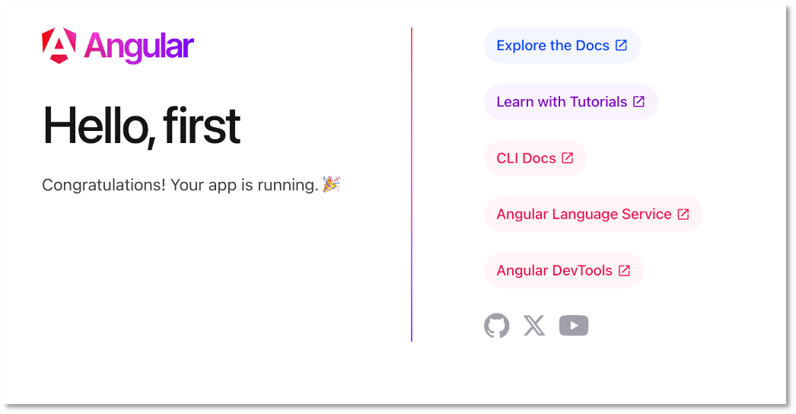
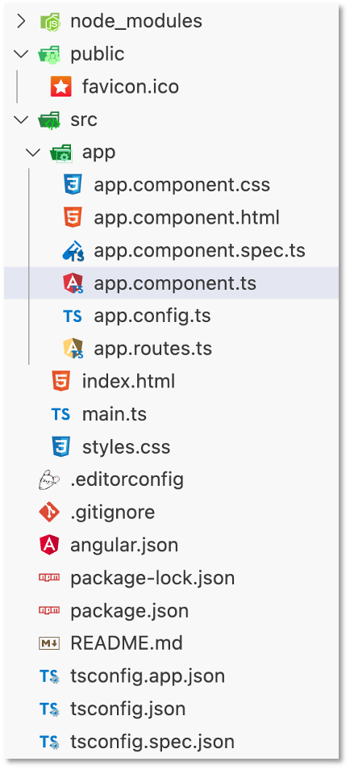
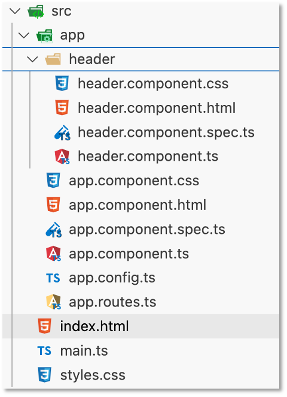
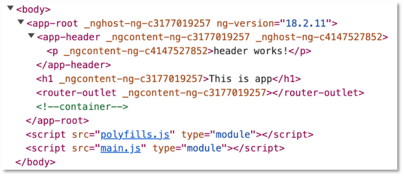
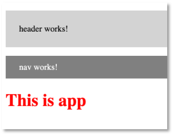
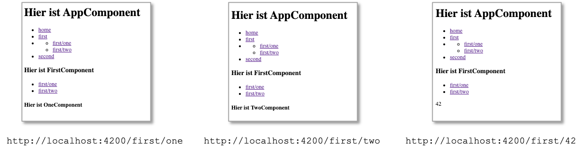

# Angular

[Angular](https://angular.dev/) gehört neben [React.js](https://reactjs.org/) und [Vue.js](https://vuejs.org/) zu den meisteverwendeten Frameworks für die Entwicklung sogenannter *Single-Page-Applikationen*. In einer Single-Page-Applikation wird eine Seite vom Webserver geladen und diese Seite durch unterschiedliche Inhalte befüllt, je nach Nutzerinteraktion. Diese Inhalte werden in Angular durch sogenannte *Komponenten* bereitgestellt. Komponenten sind die Grundbausteine einer Angular-Anwendung. 

Das erste Release von Angular erschien 2010 (damals noch unter dem Namen AngularJS, ab Version 2 nur noch Angular). React und Vue kamen 2013 bzw. 2014 erstmalig heraus. Angular wird hauptsächlich von Google, React hauptsächlich von Facebook und Vue als Community-Version entwickelt. Alle drei Frameworks stehen unter [MIT-Lizent](https://opensource.org/licenses/MIT).

Neben HTML und CSS verwendet Angular [TypeScript](https://www.typescriptlang.org/). TypeScript ist eine Obermenge von JavaScript. Das bedeutet, dass jeder JavaScript-Code auch TypeScript ist, aber nicht umgekehrt. TypeScript-Code wird compiliert und erzeugt JavaScript-Code, der vom Browser ausgeführt werden kann. Im Gegensatz zu JavaScript ist TypeScript typsicher und klar objektorientiert.  

## Angular installieren

Folgen Sie den Anweisungen der [Setup-local](https://angular.dev/tools/cli/setup-local)-Seite von Angular. Aber die wichtigsten Schritte sind auch hier nochmal aufgeführt. 

1. Laden Sie sich [Node.js](https://nodejs.org/en/download/package-manager) herunter, wenn noch nicht geschehen, und installieren es. Es beinhaltet den Paketmanager [npm](https://www.npmjs.com/). Achten Sie darauf, dass Sie eine **gerade** Version von `Node.js` installieren (also z.B. `v22`, nicht jedoch `v23`)! Sie können testen, ob die Installation von `Node.js` (und somit auch `npm`) erfolgreich war, indem Sie `node -v` bzw. `npm -v` im terminal eingeben. In beiden Fällen sollte die jeweilige Versionsnummer angezeigt werden. 
2. Installieren Sie die [Angular CLI](https://angular.dev/cli), indem Sie im Terminal 
  ```bash
  npm install -g @angular/cli
  ```
  eingeben. Hinweis für Windwos- (und PowerShell)-Nutzerinnen: Sollte obiger Befehl fehlschlagen, dann müssen Sie Ihre [execution policy](https://learn.microsoft.com/de-de/powershell/module/microsoft.powershell.core/about/about_execution_policies?view=powershell-7.4) ändern. geben Sie dazu in Ihre Powershell
  ```bash
  Set-ExecutionPolicy -Scope CurrentUser -ExecutionPolicy RemoteSigned
  ```
  ein. Sollten Sie bei der Installation der Angular-CLI `EACCES errors` erhalten (`permission denied`), dann arbeiten Sie an einem Mac ;-). Geben Sie dann im Terminal ein (Sie finden im Netz auch die Anweisung `sudo npm install -g @angular/cli` - das sollten Sie aber besser nicht machen) : 
  ```bash
  sudo chown -R `whoami` ~/.npm
  sudo chown -R `whoami` /usr/local/lib/node_modules
  ```
  Nun sollte `npm install -g @angular/cli` jeweils funktionieren. 

## Erstes Projekt erstellen

Eine Angularanwendung besteht hauptsächlich aus Komponenten und
Services. Um die Anwendung selbst sowie Komponenten und Services
zu erstellen, wird am besten das [Command Line Interface for
Angular (Angular CLI)](https://angular.dev/cli) verwendet.
Öffnen Sie ein Terminal (Windows-Nutzerinnen sollten die
[Git-Bash](https://gitforwindows.org/) verwenden, die Sie
bereits mit Git installiert haben). Wechseln Sie im Terminal
in das Verzeichnis, das Ihre Projekte enthalten soll. Für das
Wechseln in andere Verzeichnisse nutzen Sie den
``cd`` Befehl (change directory). Um die Anwendung
**"first"** zu erzeugen, geben Sie folgenden Befehl in das
Terminal ein:

```
ng new first
```

``ng`` steht für Angular. Mit dem Attribut ``new`` geben Sie an,
dass Sie ein neues Projekt erzeugen wollen. ``first`` ist der
Name des Projektes. Wenn Sie nach dem **stylesheet
format** gefragt werden, können Sie `CSS` einfach mit `Enter` bestätigen. Sie können alle Anfragen mit `Enter` bestätigen, smit teilen Sie auch nicht Ihre Daten mit Google.

```bash
? Would you like to share pseudonymous usage data about this project with the Angular Team
at Google under Google's Privacy Policy at https://policies.google.com/privacy. For more
details and how to change this setting, see https://angular.dev/cli/analytics.

   no
Global setting: disabled
Local setting: No local workspace configuration file.
Effective status: disabled
? Which stylesheet format would you like to use? CSS             [ https://developer.mozilla.org/docs/Web/CSS                     ]
? Do you want to enable Server-Side Rendering (SSR) and Static Site Generation (SSG/Prerendering)? no
```

Wenn alles geklappt hat, erhalten Sie im Terminal eine Ausgabe in der Form:

```bash
✔ Packages installed successfully.
    Successfully initialized git.
```

Es entsteht ein Ordner `first` in Ihrem Projekte-Verzeichnis. Wechseln Sie
in dieses Verzeichnis:

```
cd first
```

Führen Sie darin den Befehl:

```
npm install
```

aus. Damit werden alle Abhängigkeiten, die in der Datei **package.json**
definiert sind, geladen und das **node_modules**-Verzeichnis erstellt.
Siehe z.B. [hier](https://www.stackchief.com/tutorials/npm%20install%20%7C%20how%20it%20works).

Wenn Sie Ihr Projekt mit `git` verwalten, dann ist es ratsam, das `node_modules`-Verzeichnis von der `git`-Verwaltung auszuschließen. Es wird ja immer durch `npm install` erstellt. In der automatisch erstellten `.gitignore` ist dafür auch bereits die Zeile `/node_modules` enthalten. Dadurch wird das `node_modules`-Verzeichnis in Ihrem Repository ignoriert. 

Die Angular CLI stellt Ihr neues Projekt automatisch unter Git-Verwaltung. Wenn Ihr Ordner bereits Teil eines Git-Repositories ist, können Sie einfach `rm -rf .git` ausführen. Damit löschen Sie das `.git`-Verzeichnis im Angular-Projekt-Ordner und das Projekt selbst ist nicht mehr unter Git-Verwaltung (nur durch das übergeordnete Repositoty).

Danach geben Sie

```
ng serve
```

ein. Es werden die entsprechenden TypeScript-Dateien compiliert und es
erscheint am Ende eine Ausgabe, wie z.B.

```bash
Initial chunk files | Names         |  Raw size
polyfills.js        | polyfills     |  90.20 kB | 
main.js             | main          |  22.64 kB | 
styles.css          | styles        |  95 bytes | 

                    | Initial total | 112.94 kB

Application bundle generation complete. [1.339 seconds]

Watch mode enabled. Watching for file changes...
NOTE: Raw file sizes do not reflect development server per-request transformations.
  ➜  Local:   http://localhost:4200/
  ➜  press h + enter to show help
```

Sie **müssen** jetzt immer compileren! Wenn Sie aber einmal `ng serve` ausgeführt haben, wird im Browser automatisch auf die Änderungen reagiert. Sie müssen also nicht jedes Mal neu `ng serve` eingeben, bzw. nicht jedes Mal neu auf das grüne Dreieck in Ihrer IDE klicken: 

Öffnen Sie Ihren Browser und geben Sie als URL

```
http://localhost:4200
```

ein. Folgende Seite sollte erscheinen:



!!! success
    Fertig! Sie haben Ihr erstes Angular-Projekt erstellt.


## Angular-Projektstruktur

Öffnen Sie die IDE Ihrer Wahl. Wählen Sie unter
`Open Project` den Projektordner `first`. Klappen Sie das Projekt
`first` auf, klappen Sie den Ordner `src` und dann den Ordner
`app` auf. Der Projektexplorer zeigt folgendes Bild:

{: style="height:300px"}

- Die meiste Arbeit wird im `src`-Ordner erledigt. Darin befindet sich (wird sich befinden) der Code unserer Anwendung.
- Darin der wichtigste Ordner ist der `app`-Ordner.
Hier werden wir unsere Module, Komponenten und Services hinzufügen.  
- Der `node_modules`-Ordner enthält alle benötigten
3rd-party-libraries. Welche das sind, wird in der Datei
`package.json` als *dependencies* definiert.
Mithilfe des Befehls `npm install `werden alle benötigten
Module dem Ordner `node_modules` hinzugefügt.
- `public/favicon.ico`ist das Favicon - ein kleines Icon, das im
Reiter erscheint. Wählen Sie am besten ein eigenes.
- `index.html` ist die Hauptseite. Mithilfe von Angular
entwickeln wir eine *Single Page Application*, d.h. es wird
eine einzige HTML-Seite geladen (`index.html`) und jeder weitere Inhalt
wird asynchron hinzugefügt.
- `styles.css` enthält die globalen Stylesheets, d.h.
die CSS-Eigenschaften, die für das gesamte Projekt gelten sollen.
- Die `app.component.*`-Dateien beschreiben die
app-Komponente. Eine Komponente besteht aus einer *HTML*-, einer
*CSS*- und einer *TypeScript*-Datei (auch noch
eine `*.spec.ts`, aber die interessiert zunächst nicht).


Öffnen Sie in Ihrer IDE die Datei `app.component.html`. Löschen
Sie den kompletten Inhalt und lassen nur noch
`<router-outlet />`.
Fügen Sie oberhalb von `<router-outlet />`
die Zeile `<h1>This is app</h1>` ein. Gehen Sie wieder zum
Browser und schauen sich den geöffneten Tab mit der URL `localhost:4200` an.
Es erscheint der folgende Inhalt:

{: style="width:150px"}

Öffnen Sie die `app.component.css`-Datei und geben Sie dort

```CSS
h1 {
  color: red;
}
```

Nach den Änderungen in `app.component.css` erscheint der Text der Überschrift in rot:

{: style="width:150px"}

!!! success "Zusammenfassung"
    Wir haben die die `app.component.html` geändert, um den
    Inhalt der dargestellten Seite anzupassen und die
    `app.component.css`, um Änderungen an der Darstellung
    (dem Stil) des Inhalts durchzuführen.

### Single Page Application

Wenn wir eine Anwendung mit Angular erstellen, dann handelt es sich dabei um eine sogenannte *Single Page Application (SPA)*, d.h. es wird genau eine Seite vom Webserver geladen und alle Inhalte werden in diese Seite (nach-)geladen, je nach Nutzerinteraktion. Die hier geladene Seite ist die `index.html`, die in unserem Projekte-Ordner `frontend` (oder `first` oder wie auch immer Ihr Angular-Projekt heißt) liegt. Sie sieht so aus:

=== "index.html"
  ```html
  <!doctype html>
  <html lang="en">
    <head>
      <meta charset="utf-8">
      <title>Frontend</title>
      <base href="/">
      <meta name="viewport" content="width=device-width, initial-scale=1">
      <link rel="icon" type="image/x-icon" href="favicon.ico">
    </head>
    <body>
      <app-root></app-root>
    </body>
  </html>
  ```

Das Element `<app-root>` ist dabei ein sogenannter *Tag-Selektor* (auch *Element-Selektor* oder *Komponenten-Selektor*). 


### Komponenten-Selektoren

Nochmal zurück zu unserer `index.html` - der single page, die vom Webserver geladen wird und in die alle weiteren Komponenten eingebunden werden. Wir haben dort nun also den Komponenten-Selektor `<htw-root></htw-root>`. In diesen Selektor wird nun dir `root`-Komponente (`app.component`) geladen. Dieser Selektor wird durch die `root`-Komponente ersetzt. Das ist unsere `app/app.component.*`. Eine solche Komponente besteht immer aus einer `css`-, einer `html`- und einer `ts`-Datei. Es wird also in diesen Komponenten-Selektor der HTML-Code der `app.component.html` eingebunden. Das sehen Sie auch, wenn Sie die Developer-Tools an Ihrem Browser öffnen und sich den Quellcode der aktuellen Anwendung anschauen:   

## Komponenten

Eine Angular-Anwendung besteht hauptsächlich aus *Komponenten*. Jede Anwendung hat eine Hauptkomponente - die sogenannte Root Component. Diese Hauptkomponente ist meistens die **AppComponent**. Eine Komponente hat eine in sich geschlossene Bedeutung, z.B. ein Formular für Dateneingabe, eine Liste aller Daten oder auch nur ein bestimmtes Element.

Eine Komponente besteht aus einer *View* (*Template*) und einer TypeScript-Klasse. Die AppComponent besteht z.B. aus der **app.component.html** (der View) und der **app.component.ts** (der TypeScript-Klasse). Die TypeScript-Klasse kümmert sich um die Verwaltung der Daten, die in der View dargestellt und/oder durch Eingaben erzeugt werden. Die TypeScript-Klasse beschreibt die *Logik* der Komponente. Die View ist der dargestellte Bereich der Komponente, also das, was man im Browser von der Komponente sieht.

Neben der <strong>\*.html</strong>- und der <strong>\*.ts</strong>-Datei einer Komponente gibt es auch noch die <strong>\*.css</strong>-Datei (also z.B. **app.component.css**). Diese enthält CSS-Eigenschaften, die speziell für die Komponente gelten sollen.

Um eine Komponente der gesamten Anwendung als Komponente bekannt zu machen, wird der *Decorator* `@Component`verwendet. Decoratoren erkennt man am führenden `@`-Zeichen. Sie werden verwendet, um Metadaten der Anwendung zu verwalten. Der typische Aufbau einer Komponente (hier `AppComponent` - `app.component.ts`):

```javascript
import { Component } from '@angular/core';
import { RouterOutlet } from '@angular/router';

@Component({
  selector: 'app-root',
  standalone: true,
  imports: [RouterOutlet],
  templateUrl: './app.component.html',
  styleUrl: './app.component.css'
})
export class AppComponent {
  title = 'first';
}
```

Der Selektor gibt an, dass überall dort, wo `app-root` als Elementselektor `<app-root> </app-root>` verwendet wird, das in `app.component.html` definerte Template eingesetzt wird. Angenommen, in `app.component.html` ist der HTML-Code:

```html
<h1>This is app</h1>
```

definiert. Dann wird dieser Code als Inhalt in das HTML-Element `<app-root> </app-root>` eingesetzt:

```html
<app-root>
  <h1>This is app</h1>
</app-root>
```

Wir schauen uns ein ausführlicheres Beispiel im Folgenden an, in dem wir eine neue Komponente erzeugen.


### Eine neue Komponente erzeugen 

Mithilfe von [Angular-CLI](https://angular.dev/cli) erzeugen wir in unserer App `first` eine neue Komponente `header`. Wir wechseln dazu im Terminal in den Ordner von `first` und geben dann

```
ng generate component header
```

ein. Später kürzen wir solche Eingaben ab. Anstelle von `generate` brauchen wir auch nur `g` zu schreiben. Und anstelle von `component` genügt `c`. Das heißt, wir hätten stattdessen auch 

```
ng g c header
```

schreiben können. In unserer `first` App gibt es nun die Komponente `header`:

{: style="height:250px"}

Jede Angular-Komponente besteht aus vier Teilen:

- der TypeScript-Klasse (die `*.component.ts`-Datei)
- dem Template  (die `*.component.html`-Datei)
- den Styles (die `*.component.css`-Datei)
- einer Testspezifikation (die `*.component.spec.ts`-Datei)

Klicken Sie im Projektexplorer Ihrer IDE auf die Datei `header.component.ts`, um sie zu öffnen. Sie enthält den folgenden Quelltext:

```javascript
import { Component } from '@angular/core';

@Component({
  selector: 'app-header',
  standalone: true,
  imports: [],
  templateUrl: './header.component.html',
  styleUrl: './header.component.css'
})
export class HeaderComponent {

}
```

Wir ändern diese Datei zunächst nicht und öffnen auch noch die `header.component.html`. Diese enthält nur ein HTML-Element, einen Absatz:

```html
<p>header works!</p>
```

Wir ändern auch diese Datei zunächst nicht und öffnen die `app.component.html` - die HTML-Datei unserer Root-Komponente. Diese sieht derzeit so aus:

```html
<h1>This is app</h1>
<router-outlet></router-outlet>
```

Wir fügen in die Datei den Selektor `htw-header` unserer neuen `header`-Komponente als HTML-Element ein:

```html
<app-header></app-header>
<h1>This is app</h1>
<router-outlet />
```

Dieses Element dient als "Platzhalter" für das Template unserer neuen Komponente. Das bedeutet, dass in dieses Element der HTML-Code aus `header.component.html` eingefügt wird. Jedoch kennt die `AppComponent` unsere `HeaderComponent` noch nicht. Deshalb erhalten wir im Browser noch eine entsprechende Fehlermeldung.

#### Importieren der neuen Komponente

Um eine Komponente über ihren Selektor einzubinden, müssen wir diese neue Komponente in die Komponente importieren, die diese neue Komponente einbindet. In unserem Fall binden wir die `HeaderComponent` in die `AppComponent` ein (siehe oben `app.component.html`). Um die `headerComponent` in die `AppComponent` zu importieren, öffnen wir die `app.component.ts` und fügen folgende Änderungen ein:

```javascript linenums="1" hl_lines="3 8"
import { Component } from '@angular/core';
import { RouterOutlet } from '@angular/router';
import { HeaderComponent } from './header/header.component';

@Component({
  selector: 'app-root',
  standalone: true,
  imports: [RouterOutlet, HeaderComponent],
  templateUrl: './app.component.html',
  styleUrl: './app.component.css'
})
export class AppComponent {
  title = 'first';
}
```

Geben Sie am besten zuerst `HeaderComponent` in das `imports`-Array ein (zeile `8`) und wählen dann `QuickFix` aus. Dadurch entsteht Zeile `3` mit der korrekten `import`-Anweisung.


Wechseln Sie in den Browser auf den Tab mit Ihrer Anwendung (http://localhost:4200/). Sie sehen folgendes Bild:


Oberhalb der Überschrift (`<h1>This is app</h1>`) wurde also der Absatz `<p>header works!</p>` eingefügt. Wenn Sie sich den Quelltext Ihrer Seite anschauen, z.B. über die Entwicklertools Ihres Browsers ([z.B. für Chrome](https://blog.kulturbanause.de/2018/03/die-chrome-entwicklertools-devtools-fuer-designer-und-einsteiger/)), dann wird folgender Code sichtbar:



Wir können hier die Attribute der HTML-Elemente vernachlässigen (also z.B. `_nghost-ng-c31...` oder `ng-version="18.2.11"`). Aber es wird folgende HTML-Struktur sichtbar:

```html
<app-root>
  <app-header>
    <p>header works!</p>
  </app-header>
  <h1>This is app</h1>
  <router-outlet></router-outlet>
</app-root>
```

Das Element `<htw-root>` fungiert als Platzhalter für die gesamte App. In dieses Element wird der gesamte Inhalt der Anwendung eingebunden (siehe `app.component.html`). Dies ist hier zunächst eine Überschrift `<h1>`, die von dem Element für die `header`-Komponente gefolgt wird. Das bedeutet, dass in das Element `<htw-header>` der Inhalt der Komponente `header` eingebunden wird. Das ist hier nur ein Absatz `<p>` (siehe dazu `header.component.html`). Das Element `<router-outlet>` soll uns an dieser Stelle noch nicht interessieren. Das wird erst interessant, wenn wir über das *Routing* in einer Angular-Anwendung sprechen.  

Zur weiteren Übung erzeugen wir uns noch weitere Komponenten. Zunächst eine Komponenten zur Navigation `nav`:

```
ng g c nav
```

Um deutlich zu machen, dass sich die CSS-Definitionen für eine Komponente stets nur auf die Komponente beziehen, ändern wir die `nav.component.css` (und - leicht anders- auch die `header.component.css`):

=== "nav.component.css"
    ```css
    p {
      background-color: grey;
      color: white;
      padding: 1%;
      padding-left: 2%;
    }
    ```

=== "header.component.css"
    ```css
    p {
      background-color: lightgrey;
      color: black;
      padding: 2%;
      padding-left: 2%;
    }
    ```


Wir binden die `nav`-Komponente in die `app.component.html`:


=== "app.component.html"
    ```html
    <app-header></app-header>
    <app-nav></app-nav>
    <h1>This is app</h1>
    <router-outlet />
    ```

und in die `app.component.ts` ein: 


=== "app.component.ts"
    ```js linenums="1" hl_lines="4 9"
    import { Component } from '@angular/core';
    import { RouterOutlet } from '@angular/router';
    import { HeaderComponent } from './header/header.component';
    import { NavComponent } from './nav/nav.component';

    @Component({
      selector: 'app-root',
      standalone: true,
      imports: [RouterOutlet, HeaderComponent, NavComponent],
      templateUrl: './app.component.html',
      styleUrl: './app.component.css'
    })
    export class AppComponent {
      title = 'first';
    }
    ```

und erhalten folgende Seite: 



Durch das Einbinden von Komponenten in andere Komponenten ensteht eine Hierarchie der Komponenten, z.B. ist die `app`-Komponent in unserem bisherigen Beispiel die *Elternkomponente* der `header`- und `nav`-Komponenten. Das heißt, `header` und `nav` sind *Kindkomponenten* von `app`.  Um dies zu verdeutlichen, erstellen wir noch eine weitere Komponente `main` und dafür explizit zwei Kindkomponenten `left` und `right`:

```
ng g c main
ng g c main/left
ng g c main/right
```

Beachten Sie, dass die `left`- und die `right`-Komponente hier explizit als Kindkomponenten von `main` erstellt werden. 


Wir binden die `main`-Komponente in die `app`-Komponente ein und die Komponenten `left` und `right` in die `main`-Komponente:

=== "app.component.html"
    ```html
    <app-header></app-header>
    <app-nav></app-nav>
    <h1>This is app</h1>
    <app-main></app-main>
    <router-outlet />
    ```

=== "app.component.ts"
    ```js linenums="1" hl_lines="5 10"
    import { Component } from '@angular/core';
    import { RouterOutlet } from '@angular/router';
    import { HeaderComponent } from './header/header.component';
    import { NavComponent } from './nav/nav.component';
    import { MainComponent } from './main/main.component';

    @Component({
      selector: 'app-root',
      standalone: true,
      imports: [RouterOutlet, HeaderComponent, NavComponent, MainComponent],
      templateUrl: './app.component.html',
      styleUrl: './app.component.css'
    })
    export class AppComponent {
      title = 'first';
    }
    ```

=== "main.component.html"
    ```html
    <div id="main">
        <h3>
            main works!
        </h3>
        <div id="row">
            <div id="left">
                <app-left>
                </app-left>
            </div>
            <div id="right">
                <app-right>
                </app-right>
            </div>
        </div>
    </div>
    ```

=== "main.component.ts"
    ```js linenums="1" hl_lines="2 3 8"
    import { Component } from '@angular/core';
    import { LeftComponent } from './left/left.component';
    import { RightComponent } from './right/right.component';

    @Component({
      selector: 'app-main',
      standalone: true,
      imports: [LeftComponent, RightComponent],
      templateUrl: './main.component.html',
      styleUrl: './main.component.css'
    })
    export class MainComponent {

    }
    ```

=== "main.component.css"
    ```css
    #main {
      background-color: rgb(226, 243, 188);
      height: 200px;
      padding: 1%;
    }

    #row {
      display: grid;
      grid-gap: 1%;
      grid-template-columns: 1fr 1fr;
    }

    #left {
      background-color: rgb(235, 235, 240);
    }

    #right {
      background-color: rgb(191, 191, 243);
    }
    ```


## Deployment des Projektes

Wir werden uns im weiteren Verlauf immer wieder anschauen, was zu beachten ist, damit ein Angular-Projekt *deployed*, d.h. ausgeliefert werden kann. Derzeit müssen wir ein Projekt stets mit `ng serve` starten und schauen uns dabei jeweils den gegenwärtigen Entwicklungsstatus des Projektes an. Irgendwann ist das Projekt aber "fertig" und soll ausgeliefert werden. Das prinzipielle Vorgehen dafür besteht aus zwei Schritten. Der erste Schritt wird als Vorbereitung des Deployments ausgeführt. Er besteht darin, das Projekt zu *deployen*, dabei auf eventuelle Fehler zu achten und gleichzeitig das *deployed* Projekt auszuführen und zu "beobachten". Dazu geben Sie im Projektordner (hier `first`)

```
ng build --watch
```

ein. Damit wird das Projekt deployed, wird aber gleichzeitig überwacht, d.h. alle Aktionen auf der Webanwendung werden angezeigt und auch eventuell auftretende Fehler. Dieses Terminal muss während der Anwendung der Webanwendung also gut überwacht werden. Es entsteht ein `dist`-Ordner in Ihrer Anwendung. Darin ein Ordner, der so heißt, wie Ihr Projekt (also z.B. `first`) und darin ein ordner `browser`. Öffnen Sie darin die `index.html` mit z.B. localhost:3000` (beachten Sie den korrekten Pfad zur `index.html` in der URL (am besten, mit `Preview` oder ähnlichem öffnen). Sollte ein Fehler auftreten, könnte es sein, dass in der `index.html` im `<head>` die Basis-URL nicht richtig gestzt ist: 

```html
...
<base href="">
...
```


Sie können die Webanwendung ausprobieren. Eventuelle Fehler werden im Terminal angezeigt. 

Grundsätzlich ist es so, dass die Webanwendung durch das Deployment in einen `dist`-Ordner ausgeliefert wird. Der `dist`-Ordner des `first`-Projektes sieht nach dem Deployment ungefähr so aus:


Die Nummern in den Dateinamen werden bei Ihnen anders sein. Dieser Ordner kann auf Ihren Webserver kopiert werden und dann ist die Webanwendung dort ausführbar. Wenn Sie alle Fehler behoben haben und sich die Webanwendung korrekt verhält, dann können Sie den zweiten Schritt ausführen:

```
ng build
```

Diese Anwendung erzeugt (genau wie `ng build --watch`) den `dist`-Ordner. Den darin befindlichen Ordner (hier: `first`) können Sie z.B. auf den Webserver kopieren und von dort die `first/index.html` aufrufen (bzw. Sie benennen den `first`-Ordner dort um). Beachten Sie, dass Sie in der `index.html` die Basis-Refereferenz-URL anpassen müssen, also den Eintrag `<base href="">` anpassen. 

In meinem Fall ist es z.B. so, dass in meinem *DocumentRoot* folgende Ordnerstruktur existiert: `/WT24/Angular/first/dist/browser/`. Das heißt, mein Eintrag in der `index.html` muss dann lauten:

```html linenums="1" hl_lines="6"
<!DOCTYPE html>
<html lang="en">
  <head>
    <meta charset="utf-8">
    <title>First</title>
    <base href="/WT24/Angular/first/dist/browser/">
    <meta name="viewport" content="width=device-width, initial-scale=1">
    <link rel="icon" type="image/x-icon" href="favicon.ico">
    <link rel="stylesheet" href="styles.ef46db3751d8e999.css">
  </head>

  <body>
    <app-root></app-root>
    <script src="runtime.efa9df03510e8bc1.js" type="module"></script>
    <script src="polyfills.e477a8328a76bdd4.js" type="module"></script>
    <script src="main.22d2c12b99bb6467.js" type="module"></script>
  </body>
</html>
```

Um die Basis-Refereferenz-URL nicht nachträglich anpassen zu müssen, können Sie auch gleich

```
ng build --base-href=/WT24/Angular/first/dist/browser/
```

angeben. 

## Lifecycle-Hooks

Komponenten durchlaufen einen festen Lebenszyklus (*lifecycle*). Die verschiedenen Status rufen dabei jeweils eine Methode auf, die wir jeweils implementieren können, um in den jeweiligen Status des Lebenszyklus eingreifen zu können. Man spricht dabei von sogenannten *Lifecycle-Hooks*. 

Der wohl bekannteste Lifecycle-Hook ist `ngOnInit()`. Damit greift man in die Initialisierung der Komponente ein. Typischerweise werden z.B. Eingabewerte initialisiert, die im Template dargestellt werden.

Noch vor `ngOnInit` wird jedoch `ngOnChange()` aufgerufen. Nämlich genau dann, wenn die Eingabewerte gesetzt bzw. geändert werden. 


Für weiterführende Informationen sei [https://angular.dev/guide/components/lifecycle](https://angular.dev/guide/components/lifecycle) empfohlen.

## Services

Ein *Service* ist eine Klasse für einen konkreten Zweck. Services unterscheiden sich von Komponenten dahingehend, dass

- eine Komponente für die Nutzerinteraktion zuständig ist, 
- eine Komponente Eigenschaften (Daten) präsentiert, 
- eine Komponente Methoden zur Datenbindung (*data binding*) zur Verfügung stellt, um
- zwischen *View* und Anwendungslogik zu vermitteln.

Ein Service

- erfüllt eine konkrete Aufgabe, typischerweise mit Daten, 
- ohne sich um die Darstellung der Daten zu kümmern.
- Typische Aufgaben eines Services sind: Daten vom Server holen oder auf den Server laden, Nutzereingaben zu validieren. 
- Ein Service steht typischerweise allen Komponenten zur Verfügung (aber nicht jede Komponente muss einen Service nutzen).

Ein Service ist eine Klasse mit dem Decorator `@Injectable()`. Services enthalten Anwendungslogik, die aus Komponenten ausgelagert werden kann. Ein Service `my` kann mittels CLI so erzeugt werden:

```
ng generate service shared/my
```

Es entsteht im `src/app/shared`-Ordner eine Datei `my.service.ts`. Services sollten am besten in dem `shared`-Ordner erstellt werden, da ein Service von allen Komponenten genutzt werden kann (eine andere Möglichkeit wäre, einen eigenen Ordner `services` zu erstellen).

In dem Decorator `@Injectable()` wird mittels `providedIn: root` angegeben, dass der Service von allen Komponenten innerhalb des Root-Moduls genutzt werden kann. Ist der Service von anderen Services oder Komponenten abhängig, können diese Services oder Komponenten mittels *dependency injection* als Parameter des Service-Konstruktor eingebunden werden. Hier ein allgemeines Beispiel eines Services `MyService`:

=== "my.service.ts"
    ```javascript linenums="1"
    import { Injectable } from '@angular/core';

    @Injectable({
      providedIn: 'root'
    })
    export class MyService {

      constructor() {
      }
    }
    ```

Der Service kann dann mittels *dependency injection* von einer Komponente verwendet werden. Beispiel:

=== "example.component.ts"
    ```javascript
    import {Component, OnInit} from '@angular/core';

    import {MyService} from './shared/my.service';

    @Component({
      selector: 'app-example',
      templateUrl: './example.component.html',
      styleUrls: ['./example.component.css']
    })
    export class ExampleComponent implements OnInit {

      constructor(private myService: MyService) { }

      ngOnInit(): void {
        this.myService.methodOfMyService();
      }

    }
    ```

Für weiterführende Informationen zu Services siehe [https://angular.dev/guide/di/creating-injectable-service](https://angular.dev/guide/di/creating-injectable-service). Wir werden Services ausgiebig nutzen. Für ein erstes kleines einführendes Beispiel nehmen wir an, dass folgende Datei [members.json](./files/members.json) im `public`-Ordner unseres Projektes liegt. Diese Datei laden wir mithilfe von `fetch()` innerhalb unserer `shared/my.service.ts`:

=== "shared/my.service.ts"
    ```javascript linenums="1"
    import { Injectable } from '@angular/core';

    @Injectable({
      providedIn: 'root'
    })
    export class MyService {
      members: any;

      constructor() {}

      getMembers() {
        fetch('members.json')
        .then( res => res.json() )
        .then( jsonData => {
          this.members = jsonData;
          console.log('getQuestions', this.members);

        })
        return this.members;
      }

    }
    ```

Der Service stellt somit eine Funktion `getMembers()` für alle Komponenten zur Verfügung und stellt über diese Funktion das `members`-Array bereit. Wir könnten dieses Array z.B. in der `main.component.ts` einlesen. (Sollte Ihre `MainComponent` nicht die Komponenten `Left` und `Right` einbinden, können Sie diese auch erstmal ignorieren - ist noch aus dem Beispiel von oben).

Öffnen Sie dazu zunächst die `main.component.ts` und geben hinter `export class MainComponent` noch `implements OnInit` ein (wir implementieren das Interface `OnInit`). Dann ist die Klasse `MainComponent` zunächst nicht ausführbar. Klicken Sie mit Rechtsklick auf die Klasse und wählen `Quick Fix...`. Es erscheint die Implementierung der `ngOnInit()`-Funktion (dabei wird auch das Interface `OnInit` importiert):


=== "main.component.ts"
    ```javascript linenums="1" hl_lines="1 12 14-16"
    import { Component, OnInit } from '@angular/core';
    import { LeftComponent } from './left/left.component';
    import { RightComponent } from './right/right.component';

    @Component({
      selector: 'app-main',
      standalone: true,
      imports: [LeftComponent, RightComponent],
      templateUrl: './main.component.html',
      styleUrl: './main.component.css'
    })
    export class MainComponent implements OnInit{
      
      ngOnInit(): void {
        throw new Error('Method not implemented.');
      }

    }
    ```

Nun binden wir den Service ein und rufen die `getMembers()`-Funktion auf. Damit wird die Variable `members` befüllt:

=== "main.component.ts"
    ```javascript linenums="1" hl_lines="14 15 18 21 22"
    import { Component, inject, OnInit } from '@angular/core';
    import { LeftComponent } from './left/left.component';
    import { RightComponent } from './right/right.component';
    import { MyService } from '../shared/my.service';

    @Component({
      selector: 'app-main',
      standalone: true,
      imports: [LeftComponent, RightComponent],
      templateUrl: './main.component.html',
      styleUrl: './main.component.css'
    })
    export class MainComponent implements OnInit{
      myservice: MyService;
      members: any;

      constructor() {
        this.myservice = inject(MyService);
      }

      ngOnInit(): void {
        this.members = this.myservice.getMembers();
        console.log(this.members)
      }

    }

    ```

Wir geben dieses Array zunächst einfach nur auf der Konsole aus. Wir sehen aber bereits die Einbindung des Services und die Verwendung der `getMembers()`-Funktion des Services.


## Routing

*Routing* ist ein wesentliches Konzept für die Entwicklung von *Single-Page-Applikationen* (SPA). Bei Single-Page-Applikationen wird genau eine Seite vom Webserver geladen (typischerweise die `index.html` und alle weiteren, sich ändernden, Inhalte und Sichten werden in diese Seite nachgeladen). Das führt zunächst auch dazu, dass es für die Seite genau eine URL gibt, um auf sie zuzugreifen (z.B. `http://www.mydomain.de` bzw. `http://www.mydomain.de/index.html`). Möchte man aber Komponenten direkt in der URL ansprechen, z.B. `http://www.mydomain.de/login` für die Login-Komponente, so benötigen wir das *Routing* von Angular.

Wir betrachten hier ein Beispiel, das [https://angular.dev/guide/routing/common-router-tasks](https://angular.dev/guide/routing/common-router-tasks) entnommen ist und nur leicht abgewandelt wurde. Wir erstellen dazu zunächst ein neues Projekt `routing-lesson`: 

```
ng new routing-lesson
```

und beantworten einfach alle Fragen mit `Enter`.

Zur Demonstration des Routings werden wir zunächst 2 weitere Komponenten erstellen: `first` und `second`. 

```
cd routing-lesson
ng g c first
ng g c second
```

Für das *Routing* in Angular existiert die Datei `app.routes.ts` im `src/app/`-Ordner. Diese Datei sieht ursprünglich so aus:

=== "app.routes.ts"
    ``` javascript linenums="1"
    import { Routes } from '@angular/router';

    export const routes: Routes = [];
    ```

Das Array `routes` aus der Datei `app.routes.ts` enthält später die Pfadangaben zu den Komponenten - sogenannte **Routen**. Routen sind Objekte und wie folgt notiert:

```javascript
{ path: 'mypath', component: MyComponent }
```

Diese Angabe bewirkt, dass unter der URL `http://www.mydomain.de/mypath` die Komponente `MyComponent` aufgerufen wird. Angenommen, wir wollen, dass unsere Komponente `FirstComponent` unter dem Pfad `/first` aufgerufen wird und `SecondComponent` unter dem Pfad `/second`, dann sieht unsere Datei `app.routes.ts` wie folgt aus:

=== "app.routes.ts"
    ``` javascript linenums="1" hl_lines="2 3 6 7"
    import { Routes } from '@angular/router';
    import { FirstComponent } from './first/first.component';
    import { SecondComponent } from './second/second.component';

    export const routes: Routes = [
        { path: 'first', component: FirstComponent},
        { path: 'second', component: SecondComponent }
    ];
    ```

In den Zeilen 6 und 7 sind die beiden Routen definiert. Beachten Sie, dass die Pfadangaben ohne vorangestelltes Slash `/` erfolgen! Unter Verwendung der Selektoren `<app-first>` bzw. `<app-second>` könnten wir unsere Komponenten nun (statisch) in unsere Anwendung einbinden. Wollen wir das jedoch dem *Routing* überlassen, die Komponenten also dynamisch - abhängig von dem jeweils gewählten Pfad - einbinden lassen, verwenden wir stattdessen den Selektor `<router-outlet>`. Auch dieser ist bei gewähltem *Routing* bereits Teil des `AppComponent`-Templates:

=== "app.component.html"
    ``` html
    <!-- hier wurde viel vom ursprünglichen -->
    <!-- Template gelöscht                  -->
  
    <h1>Hier ist AppComponent</h1>
    <router-outlet />
    ```

Obiges Listing zeigt, dass das Template von `AppComponent` zunächst eine `<h1>`-Überschrift vorsieht und dann folgt das `<router-outlet>`, welches als Platzhalter für die durch das Routing ausgewählten Komponenten agiert. Angenommen, wir definieren die Templates f+r `FirstComponent` und `SecondComponent` wie folgt:

=== "first.component.html"
    ``` html
    <h3>Hier ist FirstComponent</h3>
    ```
=== "second.component.html"
    ``` html
    <h3>Hier ist SecondComponent</h3>
    ```

Starten wir nun unsere Anwendung, dann sehen wir zunächst (URL: `http://localhost:4200/`) nur die View der `AppComponent`, nämlich die `<h1>`-Überschrift. Der Platzhalter `<router-outlet>` bleibt leer, da keine der angegebenen Pfade aus der `app.routes.ts` angegeben wurde. Geben wir jedoch als URL `http://localhost:4200/first` ein, so wird das Template der `FirstComponent` in diesen Platzhalter geladen, nämlich die `<h3`-Überschrift `Hier ist FirstComponent`. Geben wir als URL stattdessen `http://localhost:4200/second` ein, so wird das Template der `SecondComponent` in den Platzhalter `<router-outlet>` geladen, nämlich die `<h3`-Überschrift `Hier ist SecondComponent`. Die folgende Abbildung zeigt die Views der drei Fälle:


Wir haben nun Pfade erzeugt, mit denen man Komponenten direkt ansprechen kann. Im folgenden Abschnitt wird gezeigt, wie man diese Pfade in Hyperlinks nutzt.

### Routen verlinken

Wir kennen nun die möglichen Pfade unserer Anwendung `http://localhost:4200/`, `http://localhost:4200/first` und `http://localhost:4200/second` und würden diese Adressen z.B. gerne in Hyperlinks verwenden, um direkt zu den Views der jeweiligen Komponente zu springen, z.B. so:

=== "app.component.html"
    ``` html
    <h1>Hier ist AppComponent</h1>
    <ul>
      <li>
        <a href="/">home</a>
      </li>
      <li>
        <a href="/first">first</a>
      </li>
      <li>
        <a href="/second">second</a>
      </li>
    </ul>
    <router-outlet></router-outlet>
    ```

Das funktioniert auch, hat aber einen von uns nicht gewollten Effekt: Die Seite wird durch jeden Klick auf einen Hyperlink neu geladen. Das ist ja auch das gewünschte Verhalten eines Hyperlinks. Die Idee einer *Single-Page-Applikation* ist aber jedoch die, dass die Seite nur genau einmal geladen wird und dann dynamisch alle weiteren Inhalte. 

Das Nachladen wird vermieden, wenn wir als Attribut für unsere Pfade nicht `href` verwenden, sondern die Angular-Direktive `routerLink`. Dies gilt nur für interne Links! Aber es verhindert bei internen Links ein Neuladen der Seite.

=== "app.component.html"
    ``` html
    <h1>Hier ist AppComponent</h1>
    <ul>
      <li>
        <a routerLink="/">home</a>
      </li>
      <li>
        <a routerLink="/first">first</a>
      </li>
      <li>
        <a routerLink="/second">second</a>
      </li>
    </ul>
    <router-outlet></router-outlet>
    ```

Nun funktioniert jedoch das Aufrufen der Komponenten zunächst nicht mehr. **Wichtig!** Sie müssen `RouterLink` in die `app.component.ts` einbinden:

=== "app.component.ts"
    ``` ts
    import { Component } from '@angular/core';
    import { RouterLink, RouterOutlet } from '@angular/router';

    @Component({
      selector: 'app-root',
      standalone: true,
      imports: [RouterOutlet, RouterLink],
      templateUrl: './app.component.html',
      styleUrl: './app.component.css'
    })
    export class AppComponent {
      title = 'routing-lesson';
    }
    ```

Ohne diese Einbindung bekommen Sie leider auch keinen Fehler, es funktioniert nur einfach nicht :cry:. Damit Sie eine einfachere Möglichkeit haben, CSS-Eigenschaften für die Links zu konfigurieren, ist es ratsam, außerdem auch noch `routerLinkActive` zu verwenden. Damit steht Ihnen ein CSS-Selektor für aktive `routerLink`s zur Verfügung:


=== "app.component.html"
    ``` html
    <h1>Hier ist AppComponent</h1>
    <ul>
      <li>
        <a routerLink="/">home</a>
      </li>
      <li>
        <a routerLink="/first">first</a>
      </li>
      <li>
        <a routerLink="/second">second</a>
      </li>
    </ul>
    <router-outlet></router-outlet>
    ```

Aber **Achtung!** Auch hier ist es wieder notwendig, `RouterLinkActive` in die `app.component.ts` einzubinden. 

Die obige Attributschreibweise kann auch durch *property binding* ersetzt werden. Dann übergeben Sie als Wert aber keinen String sondern ein 1-elementiges Array:

=== "app.component.html"
    ``` html
    <h1>Hier ist AppComponent</h1>
    <ul>
      <li>
        <a [routerLink]="['/']">home</a>
      </li>
      <li>
        <a [routerLink]="['/first']">first</a>
      </li>
      <li>
        <a [routerLink]="['/second']">second</a>
      </li>
    </ul>
    <router-outlet></router-outlet>
    ```

Die zweite Variante wird meistens dann verwendet, wenn an den Pfad noch dynamisch Werte übergeben werden, sogenannte [*Parameter* an den Routen](#parameter-an-routen).

### Parameter an Routen

Häufig sind die Pfadangaben nicht nur so statisch wie bisher, also `/first` bzw. `/second`, sondern es werden auch noch Werte, z.B. Session-IDs, Nutzer-IDs, Bücher-ISBN usw. übergeben. Dazu werden die Routen durch *Parameter* erweitert. Diese Parameter werden dann mit einem konkreten Wert bei Aufruf ersetzt. 

Die allgemeine Syntax für einen parametrisierten Pfad ist:

```javascript
{ path: 'mypath/:id', component: MyComponent }
```

Der Doppelpunkt `:` ist zwingend, der Name des Parameters `id` ist frei wählbar. 

Die Werte für den Routenparameter können als `routerLink` wieder entweder als String übergeben werden (Zeile 1 im folgenden Listing) oder per *property binding* als weiteres Array-Element (Zeile 2 im folgenden Listing).

```html linenums="1"
<a routerLink="/mypath/4711">statischer Wert für id</a>
<a [routerLink]="['/mypath', myData.id]">dynamischer Wert für id (aus JSON myData)</a>
```

Wir haben jetzt eine parametrisierten Pfad konfiguriert und wir haben auch betrachtet, wie der Aufruf einer solch parametrisierten Route erfolgen kann. Nun betrachten wir, wie der Wert eines Parameters in einer Komponentenklasse ausgelesen und verarbeitet werden kann. 

Wir führen dazu zunächst kleinere Änderungen an unserem obigen Beispiel der `routing-lesson`-App durch: 

=== "app.routes.ts"
    ``` javascript linenums="1"
    import { NgModule } from '@angular/core';
    import { Routes, RouterModule } from '@angular/router';
    import {FirstComponent} from './first/first.component';
    import {SecondComponent} from './second/second.component';

    const routes: Routes = [
      { path: 'first', component: FirstComponent},
      { path: 'first/:id', component: FirstComponent},
      { path: 'second', component: SecondComponent }
    ];

    @NgModule({
      imports: [RouterModule.forRoot(routes)],
      exports: [RouterModule]
    })
    export class AppRoutingModule { }
    ```
=== "first.component.html"
    ``` html linenums="1"
    <h3>Hier ist FirstComponent</h3>
    <p *ngIf="id">{{ id }}</p>
    ```

In `app.routes.ts` haben wir einen weiteren Pfad hinzugefügt (Zeilennummer 8). Beachten Sie, dass ohne die Pfadkonfiguration in Zeilennummer 7 die Route `http://localhost:4200/first` (also ohne Parameterwert) nicht mehr existieren würde. Wenn ein Parameter erforderlich ist, dann muss er auch angegeben werden. Nur in Kombination der beiden Pfadkonfigurationen aus Zeilennummern 7 und 8 ist der Pfad sowohl mit als auch ohne Parameterwert möglich. 

Im Template der `FirstComponent` haben wir einen Absatz eingefügt, der als Inhalt den Wert der Eigenschaft `id` mittels Interpolation anzeigt. Der Absatz erscheint nur, wenn `id` auch einen Wert hat. Die Eigenschaft `id` muss allerdings noch in der `first.component.ts` angelegt werden:

=== "first.component.ts"
    ``` javascript linenums="1"
    import { Component, OnInit } from '@angular/core';
    import { ActivatedRoute } from '@angular/router';

    @Component({
      selector: 'app-first',
      templateUrl: './first.component.html',
      styleUrls: ['./first.component.css']
    })
    export class FirstComponent implements OnInit {
      id: string;

      constructor(private route: ActivatedRoute) { }

      ngOnInit(): void {
        this.id = this.route.snapshot.paramMap.get('id');
      }
    }
    ```
In der `first.component.ts` kommen verschiedene Sachen hinzu:

1. es wird die Eigenschaft `id` deklariert (als `string`)
2. es wird der Service `ActivatedRoute` per *dependency injection* der Klasse `FirstComponent` injiziert --> die Eigenschaft `route` ist vom Typ `ActivatedRoute`
3. `ActivatedRoute` stellt uns Informationen über den aktuellen Router (die aktuelle URL) zur Verfügung --> die Eigenschaft `this.route.snapshot.paramMap` enthält alle Parameter der aktuellen Route --> mithilfe der Methode `get()` kann nach einem konkreten Parameter gefragt werden --> wir fragen nach dem Parameter `id`, da wir so unseren Pfad konfiguriert haben (siehe oben `app.routes.ts`)

Wenn wir nun z.B. die URL `http://localhost:4200/first/42` eingeben, dann erscheint im Browser der Wert des Parameters (als Inhalt des `<p>`-Elementes; siehe oben `first.component.html`).

Die aktuelle Implementierung von `first.component.ts` liest also während der Initialisierung der Komponente die Routenparameter aus. Finden jedoch am Parameterwert Änderungen statt, ohne dass die Komponente neu initialisiert wird, bekommt die Komponente von den Änderungen nichts mit. Die oben gezeigte Form der Implementierung ist deshalb nicht für alle Fälle geeignet. Vielmehr ist es besser auszunutzen, dass es sich bei `this.route.paramMap` (ohne `snapshot`) um ein [*Observable*](https://angular.dev/guide/signals/rxjs-interop) handelt.  

Ein *Observable* kann so verstanden werden, dass er permanent eine bestimmte Sache beobachtet (z.B. ist der `EventEmitter` ein *Observable* und beobachtet permanent, ob das Ereignis ausgelöst wird; wenn ja, dann ruft `EventEmitter` die Funktion `emit()` auf --> siehe [Eigene Ereignisse](angular2.md#eigene-ereignisse)). Wenn sich etwas an dem beobachteten Objekt geändert hat, dann reagiert *Observable* sofort und ruft eine bestimmte Funktion auf. Das *Observable* `paramMap` beobachtet permanent die aktuelle Route und sobald sich etwas an dieser Route ändert, wird eine Funktion aufgerufen.

Damit das *Observable* aber überhaupt den aktuellen Router permanent beobachtet, muss er an den Router angemeldet werden --> das *Observable* "abboniert" den Router. Dies geschieht mithilfe der Funktion `subscribe()`. Dieser Funktion kann als Parameter eine Funktion übergeben werden. Diese Funktion wird aufgerufen, sobald sich am aktuellen Router etwas ändert. Wir ändern die Implementierung von `ngOnInit()` in der Klasse `first.component.ts` deshalb wie folgt:

=== "first.component.ts"
    ``` javascript linenums="1"
    import { Component, OnInit } from '@angular/core';
    import { ActivatedRoute } from '@angular/router';

    @Component({
      selector: 'app-first',
      templateUrl: './first.component.html',
      styleUrls: ['./first.component.css']
    })
    export class FirstComponent implements OnInit {
      id: string;

      constructor(private route: ActivatedRoute) { }

      ngOnInit(): void {
        this.route.paramMap.subscribe(
          paramMap => this.id = paramMap.get('id')
        );
      }
    }
    ```

Nun erhält die Eigenschaft `id` immer den aktuellsten Wert (und dieser wird aufgrund der Interpolation auch stets aktuell in der View dargestellt).


### 404 oder `redirectTo`

Für den Fall, dass eine "falsche" Route eingegeben wird, also z.B. `localhost:4200/wrong`, gibt es 2 Möglichkeiten darauf zu reagieren. Angenommen, es gibt eine `HomeComponent` und die `app.routes.ts` sieht wie folgt aus: 

=== "app.routes.ts - nur routes-Array" 
    ```js
    export const routes: Routes = [
        { path: '', component: HomeComponent},
        { path: 'first', component: FirstComponent},
        { path: 'second', component: SecondComponent }
    ];
    ```

Es gibt also auch noch eine `HomeComponent` in diesem Beispiel. Sie haben für "falsche" Routen generell die Möglichkeit der Verwendung von Wildcards `**`, die alle anderen Routen abbildet. Sie können sich nun entweder eine `PageNotFoundComponent` einrichten, die eine 404-Seite beschreibt:


=== "app.routes.ts - nur routes-Array" 
    ```js
    export const routes: Routes = [
        { path: '', component: HomeComponent},
        { path: 'first', component: FirstComponent},
        { path: 'second', component: SecondComponent },
        { path: '**', component: PageNotFoundComponent, pathMatch: 'full' }
    ];
    ```

oder Sie leiten alle "falschen" Routen zu einer anderen Route um, z.B. zur Route auf die `HomeComponent`:

=== "app.routes.ts - nur routes-Array" 
    ```js
    export const routes: Routes = [
        { path: '', component: HomeComponent},
        { path: 'first', component: FirstComponent},
        { path: 'second', component: SecondComponent },
        { path: '**', redirectTo: '', pathMatch: 'full' }
    ];
    ```


### Verschachtelte Routen

Angenommen, wir haben zwei weitere Komponenten `OneComponent` und `TwoComponent` und beide Komponenten sind Kindkomponenten von der Elternkomponente `FirstComponent`. Das Verhältnis Eltern- Kindkomponente entsteht ja eigentlich dadurch, dass das Template der Elternkomponente den Selektor der Kindkomponente enthält. Das heißt in `first.component.html` gibt es sowohl ein `<app-one></app-one>` als auch ein `<app-two></app-two>` --> dann sind `One` und `Two` Kindkomponenten von `First`. 

Wir wollen nun aber folgendes:

- die Route `/first` verweist auf die `FirstComponent`
- die Route `/first/one` verweist auf die `FirstComponent` und deren Kindkomponente `OneComponent`
- die Route `/first/two` verweist auf die `FirstComponent` und deren Kindkomponente `TwoComponent`

Wir wollen also, dass auch die beiden Kindkomponenten mittels Routing in die Elternkomponente eingefügt werden. Das erreichen wir mit 2 Anpassungen:

- in `app.routes.ts` kann im `routes`-Array auch noch die Eigenschaft `children` hinzugefügt werden, welche Pfadkonfigurationen zu den Kindkomponenten enthält
- in der `*.component.html` der Elternkomponente wird ein weiteres `<router-outlet></router-outlet>` hinzugefügt

=== "app.routes.ts"
    ``` javascript linenums="1"
    import { Routes, RouterModule } from '@angular/router';
    import {FirstComponent} from './first/first.component';
    import {SecondComponent} from './second/second.component';
    import {OneComponent} from './first/one/one.component';
    import {TwoComponent} from './first/two/two.component';

    const routes: Routes = [
      { path: 'first', component: FirstComponent, children: [
          { path: 'one', component: OneComponent },
          { path: 'two', component: TwoComponent },
        ]},
      { path: 'first/:id', component: FirstComponent},
      { path: 'second', component: SecondComponent }
    ];

    @NgModule({
      imports: [RouterModule.forRoot(routes)],
      exports: [RouterModule]
    })
    export class AppRoutingModule { }
    ```
=== "first.component.html"
    ``` html linenums="1"
    <h3>Hier ist FirstComponent</h3>
    <ul>
      <li><a [routerLink]="['/first/one']">first/one</a></li>
      <li><a [routerLink]="['/first/two']">first/two</a></li>
    </ul>
    <p *ngIf="id">{{ id }}</p>
    <router-outlet></router-outlet>
    ```
=== "app.component.html"
    ``` html linenums="1"
    <h1>Hier ist AppComponent</h1>
    <ul>
      <li>
        <a [routerLink]="['/']">home</a>
      </li>
      <li>
        <a [routerLink]="['/first']">first</a>
      </li>
      <li>
        <ul>
          <li><a [routerLink]="['/first/one']">first/one</a></li>
          <li><a [routerLink]="['/first/two']">first/two</a></li>
        </ul>
      </li>
      <li>
        <a [routerLink]="['/second']">second</a>
      </li>
    </ul>
    <router-outlet></router-outlet>
    ```

Das bedeutet, dass wir nun zwei `<router-outlet></router-outlet>`-Elemente haben. Eines in der `app.component.html` für die Routen `first`, `first/:id` und `second` und eines in der `first.component.html` für die Routen `first/one` und `first/two`. 



### Styles für aktive Routen

Sie können angeben, welche CSS-Klassen wirken sollen, falls eine Route *aktiv* ist. Eine Route ist aktiv, wenn Sie ausgewählt/angewendet werden kann. Dazu wurde in Angular das Attribut `routerLinkActive`eingeführt. Angenommen, die CSS-Klasse `myactiveclass`soll Anwendung für eine aktuelle (aktive) Route `/first` Anwendung finden, dann definieren Sie:

```html
<a routerLink="/first" routerLinkActive="myactiveclass">first</a>
```

Sie können auch mehrere CSS-Klassen definieren. Dafür gibt es zwei verschiedene Möglichkeiten:

```html
<a routerLink="/first" routerLinkActive="myactiveclass1 myactiveclass1">first</a>
<a routerLink="/first" [routerLinkActive]="['myactiveclass1', 'myactiveclass1']">first</a>
```

Das Styling aktiver Routen ist insbesondere für Navigationsleisten (Menüs) hilfreich. Vergessen Sie aber nicht, `RouterLinkActive` in der entsprechenden `*.ts`-Datei zu importieren.

### Routen im Programm wechseln

Der Service `Router` stellt zwei Methoden zur Verfügung, mit denen eine Route im Programm gewechselt werden kann, z.B. nach einer Nutzereingabe oder einer Nutzerinteraktion:

- `navigate()`
- `navigateByUrl()`

Angenommen, wir erweitern unsere Komponente `SecondComponent` um einen Button. Durch den Klick auf den Button soll von der `SecondComponent` auf die `OneComponent` über die Route `/first/one` gewechselt werden:

=== "second.component.html"
    ``` html linenums="1"
    <h3>Hier ist SecondComponent</h3>
    <button (click)="changeRoute()">/first/one</button>
    ```
=== "second.component.ts"
    ``` javascript linenums="1"
    import { Component, OnInit } from '@angular/core';
    import {Router} from '@angular/router';

    @Component({
      selector: 'app-second',
      templateUrl: './second.component.html',
      styleUrls: ['./second.component.css']
    })
    export class SecondComponent implements OnInit {

      constructor(private router: Router) { }

      ngOnInit(): void {
      }

      changeRoute() {
        this.router.navigate(['/first', 'one']);
        // oder
        // this.router.navigateByUrl('/first/one');
      }
    }
    ```

In der `second.component.ts` sehen wir in Zeile 11, dass der Service `Router` per dependency injection eingebunden wird. Der Eigenschaft `router` stehen die Methoden `navigate()` bzw. `navigateByUrl()` zur Verfügung. Wir sehen in den Zeilen 16-20 die Behandlung des `Click`-Ereignisses des Buttons. In Zeile 17 wird darin programmatisch die Route `/first/one` aufgerufen. 


### Prefix ändern - optional

`app`ist dabei ein Prefix, der für die gesamte Anwendung gilt. Diesen Prefix können Sie ändern. Im folgenden ist beschrieben, wie Sie ihn von `app` auf `htw` ändern. Öffnen Sie dazu die Datei `angular.json`, die sich im Projekt-Ordner `frontend` befindet. Diese Datei enthält die zentrale Konfiguration Ihres Projektes. Sie sieht wie folgt aus (Ausschnitt):

=== "angular.json" 
  ```json linenums="1" hl_lines="11"
  {
    "$schema": "./node_modules/@angular/cli/lib/config/schema.json",
    "version": 1, 
    "newProjectRoot": "projects",
    "projects": {
      "frontend": {
        "projectType": "application",
        "schematics": {},
        "root": "",
        "sourceRoot": "src",
        "prefix": "app",
        "architect": {
          "build": {
            "builder": "@angular-devkit/build-angular:browser",
            "options": {
              "outputPath": "dist/frontend",
              "index": "src/index.html",
  ```

Ändern Sie den Prefix in der hell markierten Zeile auf z.B. "htw" (oder Ihre Initialen vielleicht). In der `index.html` und in der `app.component.ts` auch noch ändern. Ab dann ist die Verwendung von "htw" als Prefix einegrichtet. Sie können es aber auch bei "app" belassen. Es soll an dieser Stelle einem besseren Verständnis des Prinzips dienen.

=== "index.html" 
  ```html linenums="1" hl_lines="11"
    <!doctype html>
    <html lang="en">
      <head>
        <meta charset="utf-8">
        <title>Frontend</title>
        <base href="/">
        <meta name="viewport" content="width=device-width, initial-scale=1">
        <link rel="icon" type="image/x-icon" href="favicon.ico">
      </head>
      <body>
        <htw-root></htw-root>
      </body>
    </html>
  ```

=== "app/app.component.ts" 
  ```javascript linenums="1" hl_lines="3"
  import { Component } from '@angular/core';
  @Component({
    selector: 'htw-root',
    templateUrl: './app.component.html',
    styleUrls: ['./app.component.css']
  })
  export class AppComponent {
    title = 'frontend';
  }
  ```
 


## `HTTPClient`

Wir wissen bereits, dass Angular eine TypeScript-Framework ist, mit dem sich Single-Page-Anwendungen implementieren lassen. Es wird einmalig eine Seite (häufig `index.html`) vom Server geladen und alle weiteren Inhalte werden sukzessive bzw. durch Nutzerinteraktionen gesteuert in diese eine Seite nachgeladen. Die Steuering wird dabei durch den Browser vorgenommen, der das aus TypeScript übersetzte JavaScript interpretiert und entsprechend die Templates der Komponenten in die Anwendung einbindet. Das bedeutet, dass im Prinzip die gesamte Logik im *Client*, d.h. im Browser ausgeführt wird. 

Dem gegenüber steht jedoch die in der Anwendung verarbeitete Menge von Daten, die typischerweise in einer Datenbank auf einem Server bereitgestellt werden. Während der Client sich darum kümmert, dass Daten angezeigt oder eingegeben werden, muss sich der Server darum kümmern, dass Daten in die Datenquelle (die Datenbank) neu eingefügt, ausgelesen, aktualisiert und gelöscht werden können. Diese vier Operationen werden mit **CRUD** abgekürzt für:

- <b>C</b>reate - neue Daten einfügen 
- <b>R</b>ead - Daten auslesen
- <b>U</b>pdate - Daten aktualisieren
- <b>D</b>elete - Daten löschen

Der Client und der Server müssen dazu nun irgendwie verbunden werden. Diese Verbindung erfolgt mithilfe des *Hypertext Transfer Protocols (HTTP)*. 


