# REST-API

Ehe wir uns weiter mit dem Frontend beschäftigen, erstellen wir einen Server, der uns die Daten liefert, das sogenannte *Backend*. Derzeit haben wir unsere Mockup-Daten noch clientseitig von einem Service verwalten lassen. Das wollen wir nun ändern. Die Daten speichern wir in einer Datenbank und stellen sie über eine *REST-API* bereit. 
Als Datenbank verwenden wir PostgreSQL. 

## REST

Für diese Datenbank stellen wir die Implementierung einer Schnittstelle bereit, so dass wir die wesentlichen Datenbankanfragen darüber ausführen können. Diese wesentlichen Datenbankfragen werden mit [CRUD](https://en.wikipedia.org/wiki/Create,_read,_update_and_delete) abgekürzt, für <strong>C</strong>reate, <strong>R</strong>ead, <strong>U</strong>pdate und <strong>D</strong>elete. Das bedeutet, wir implementieren Funktionalitäten, mit denen wir einen neuen Datensatz in die Datenbank einfügen (*create*), aus der Datenbank auslesen (*read*), in der Datenbank aktualisieren (*update*) und aus der Datenbank löschen (*delete*) können. 

Die Schnittstelle, die wir implementieren, ist eine sogenannte [REST-API](https://www.redhat.com/de/topics/api/what-is-a-rest-api). *REST* steht für [*Representational State Transfer*](https://de.wikipedia.org/wiki/Representational_State_Transfer) und basiert auf einigen wenigen Prinzipien:

1. Alles wird als eine *Ressource* betrachtet, z.B. `book`.
2. Jede Ressource ist durch *URIs* (*Uniform Resource Identifiers*) eindeutig identifizierbar, z.B. `http://localhost/books`.
3. Es werden die [Standard-HTTP-Methoden](https://de.wikipedia.org/wiki/Hypertext_Transfer_Protocol#HTTP-Anfragemethoden) verwendet, also `GET`, `POST`, `PUT`, `UPDATE`.  
4. Ressourcen können in verschiedenen Formaten vorliegen, z.B. in [HTML](https://html.spec.whatwg.org/multipage/), [XML](https://www.w3.org/TR/xml/), [JSON](https://jsonapi.org/format/), 
5. Die Kommunikation ist *zustandslos*. Jede einzelne HTTP-Anfrage wird komplett isoliert bearbeitet. Es gibt keinerlei Anfragehistorie. 

Das bedeutet, wir erstellen ein Backend (einen REST-Server), an den HTTP-Anfragen mit der eindeutig identifizierbaren Ressource gestellt werden. Das Backend erstellt daraus die entsprechende SQL-Query. Das Resultat der Datenbankanfrage wird im `JSON`- Format bereitsgestellt (kann aber auch `HTML`, `XML` oder ein anderes Format sein) bereitsgestellt.


Prinzipiell gibt es also ein *Mapping*  von HTTP-Anfragen auf SQL-Anfragen:

|CRUD |SQL |MongoDB |HTTP |
|-----|----|--------|-----|
|create |INSERT |insertOne(), insertMany() |POST |
|read |SELECT |findOne(), find() |GET |
|update |UPDATE |updateOne(), updateMany() |PUT (oder PATCH)|
|delete |DELETE |deleteOne(), deleteMany() |DELETE |

Zur Unterscheidung zwischen `PUT` und `PATCH` siehe z.B. [hier](https://www.geeksforgeeks.org/difference-between-put-and-patch-request/) oder [hier](https://stackoverflow.com/questions/21660791/what-is-the-main-difference-between-patch-and-put-request).
Wir wollen uns ein Backend erstellen, über das wir unsere Daten verwalten. Dazu überlegen wir uns zunächst ein paar sogenannte *Endpunkte* (siehe Prinzipien von REST oben) und die Zugriffsmethoden, mit denen wir auf unsere Daten zugreifen wollen.

| Methode | URL | Bedeutung |
|---------|-----|-----------|
| GET     | /members | hole alle Datensätze |
| GET     | /members/11 | hole den Datensatz mit der id=11 |
| POST    | /members | füge einen neuen Datensatz hinzu |
| PUT     | /members/11 | ändere den Datensatz mit der id=11 |
| DELETE  | /members/11 | lösche den Datensatz mit der id=11 |
| DELETE  | /members | lösche alle Datensätze |

Der Wert der `id` ist natürlich nur ein Beispiel. Es soll für alle `id`-Werte funktionieren, die in unserem Datensatz enthalten sind. 

## Ein Node.js-Projekt mit Express

Wir starten damit, uns ein `node.js`-Projekt zu erstellen. Dazu erstellen wir uns zunächst einen Ordner `backend`, wechseln in diesen Ordner und führen dann `npm init` aus:

```bash
mkdir backend
cd backend
npm init
```

Sie werden ein paar Sachen gefragt. Im Prinzip können Sie immer `Enter` drücken:

```bash
This utility will walk you through creating a package.json file.
It only covers the most common items, and tries to guess sensible defaults.

See `npm help init` for definitive documentation on these fields
and exactly what they do.

Use `npm install <pkg>` afterwards to install a package and
save it as a dependency in the package.json file.

Press ^C at any time to quit.
package name: (backend) 
version: (1.0.0) 
description: Backend REST-API
entry point: (index.js) 
test command: 
git repository: 
keywords: restapi, backend
author: J. Freiheit
license: (ISC) 
About to write to /Users/jornfreiheit/WebTech/backend/package.json:

{
  "name": "backend",
  "version": "1.0.0",
  "description": "Backend REST-API",
  "main": "index.js",
  "scripts": {
    "test": "echo \"Error: no test specified\" && exit 1"
  },
  "keywords": [
    "restapi",
    "backend"
  ],
  "author": "J. Freiheit",
  "license": "ISC"
}


Is this OK? (yes) 
```

Die `package.json` wurde erstellt. Nun benötigen wir noch das Modul [Express](https://expressjs.com/de/). Express bietet uns eine unkomplizierte *Middleware* für die Weiterverwaltung von `http`-Anfragen an die Datenbank und zurück. 

```bash
npm install express --save
```

Sie erhalten eine Meldung in der Form:

```bash
% npm install express --save

added 50 packages, and audited 51 packages in 844ms

found 0 vulnerabilities
```

In der `package.json` wurde die entsprechende Abhängigkeit eingetragen: 

=== "package.json"
	```json linenums="1" hl_lines="15-17"
	{
	  "name": "backend",
	  "version": "1.0.0",
	  "description": "Backend REST-API",
	  "main": "index.js",
	  "scripts": {
	    "test": "echo \"Error: no test specified\" && exit 1"
	  },
	  "keywords": [
	    "restapi",
	    "backend"
	  ],
	  "author": "J. Freiheit",
	  "license": "ISC",
	  "dependencies": {
	    "express": "^4.18.2"
	  }
	}
	``` 


Öffnen Sie nun das `backend`-Projekt in Ihrer IDE und erstellen Sie sich dort eine Datei `server.js` mit folgendem Inhalt:

=== "server.js"
	```javascript linenums="1"
	const express = require('express');
	const routes = require('./routes');

	const app = express();
	const PORT = 3000;

	app.use(express.json());
	app.use('/', routes);

	app.listen(PORT, (error) => {
	    if (error) {
	        console.log(error);
	    } else {
	        console.log(`Server started and listening on port ${PORT} ... `);
	    }
	});
	``` 

Das bedeutet, wir importieren `express` (Zeile `1`), erzeugen uns davon ein Objekt und speichern dieses in der Variablen `app` (Zeile `4`). Wir legen in einer Konstanten `PORT` die Portnummer `3000` fest (Zeile `5` - die Portnummer können Sie wählen). Das `backend` ist somit unter `http://localhost:3000` verfügbar. Das eigentliche Starten des Webservers erfolgt in den Zeilen `10-16` durch Aufruf der `listen()`-Funktion von `express`. Die Syntax der `listen()`-Funktion ist generell wie folgt:

```bash
app.listen([port[, host[, backlog]]][, callback])
```

Wir übergeben als ersten Parameter die `PORT`-Nummer (`3000`) und als zweiten Parameter eine (anonyme) Funktion als sogenannten *callback*. *Callbacks* sind [hier](promises.md#callbacks) näher erläutert. Die anonyme Funktion wird durch die `listen()`-Funktion aufgerufen. Sollte ein Fehler aufgetreten sein (z.B. wenn der Port bereits belegt ist), wird der anonymen Funktion ein `error`-Objekt übergeben. Ist das der Fall, wird der Fehler auf der Konsole ausgegeben. Wird der anonymen Funktion kein Objekt übergeben, wurde der Webserver korrekt gestartet und die entsprechende Meldung erscheint auf der Konsole. 

Die Definitionsfunktion in *Arrow-Notation* 

```js
(error) => {
    if (error) {
        console.log(error);
    } else {
        console.log(`Server started and listening on port ${PORT} ... `);
    }
}
```

ist äquivalent zu 

```js
function(error) {
    if (error) {
        console.log(error);
    } else {
        console.log(`Server started and listening on port ${PORT} ... `);
    }
}
```

`error` ist der Name des hier gewählten Parameters. Beachten Sie auch die verwendete Syntax `${PORT}` im sogenannte [template literal](https://developer.mozilla.org/en-US/docs/Web/JavaScript/Reference/Template_literals). Beachten Sie, dass *template literals* nicht in einfachen (`'`) oder doppelten (`"`) Anführungsstrichen stehen, sondern in <code>&#96;</code> (*backticks*). 

### Router

Noch lässt sich unser Programm aber nicht ausführen. Wir benötigen im Projektordner noch eine Datei `routes.js`. Diese wird nämlich in der `server.js` bereits in Zeile `2` eingebunden und in Zeile `8` verwendet. 

=== "routes.js"
	```javascript linenums="1"
	const express = require('express');
	const router = express.Router();

	// eine GET-Anfrage
	router.get('/', async(req, res) => {

	    res.send({ message: "Hello FIW!" });
	});

	module.exports = router;
	``` 


Beim `Router` handelt es sich um eine *Middleware* (siehe [hier](https://expressjs.com/de/guide/using-middleware.html)), die die Routen verwaltet und `request`-Objekte an die entsprechende Routen weiterleitet und `response`-Objekte empfängt. In unserer `routes.js` haben wir zunächst eine `GET`-Anfrage implementiert (Zeile `5`). Das `request`-Objekt heißt hier `req`. Das verwenden wir aber gar nicht. Das `respones`-Objekt heißt hier `res` und wird durch die Anfrage erzeugt. Wir senden in der `response` ein JavaScript-Objekt zurück, das einen Schlüssel `message` enthält. 

In der `server.js` haben wir mit `app.use(express.json())` (Zeile `7`) angegeben, dass alle JavaScript-Objekte in der `response` nach JSON umgewandelt werden sollen. Wenn nun die URL `localhost:3000` aufgerufen wird, dann wird ein `request` ausgelöst, den wir hier mit `Hello FIW!` als `response` beantworten (Zeilen `5-8`). 

Wichtig ist, dass wir `router` mit `module.exports` exportieren, damit es von anderen Modulen importiert und genutzt werden kann. Siehe dazu z.B. [hier](https://www.sitepoint.com/understanding-module-exports-exports-node-js/). 

Noch "läuft" unser Backend aber noch nicht. Wir müssen es erst starten. 

### Starten des Projektes

Das Projekt lässt sich nun starten. Wir geben dazu im Terminal im `backend`-Ordner

```bash
node server.js
```

ein. Im Terminal erscheint 

```bash
Server started and listening on port 3000 
```

und wenn Sie im Browser die URL `http://localhost:3000/` eingeben, wird dort


angezeigt. Sie können auch Postman öffnen und `http://localhost:3000` eintragen (`GET`-Methode):


Wann immer wir jetzt jedoch etwas an der Implementierung ändern, müssten wir im Terminal zunächst den Webserver mit 

```bash
Strg-C		// bzw. Control-C
```

stoppen, um ihn dann wieder mit `node server.js` zu starten. Um das zu umgehen, gibt es für `node` nun die Option `--watch` (siehe [hier](https://nodejs.org/docs/latest/api/cli.html#--watch)). Wenn wir unser Projekt also mit 

```bash
node --watch server.js
```

starten, dann compiliert es stets automatisch neu sobald wir etwas am Code ändern. 

### Routen

Hier nur zum Verständnis. Angenommen, wir ändern bspw. in der `server.js` die Zeile `8` zu 

```js
app.use('/api', routes);
```

, dann würden alle Routen, die wir in `routes.js` definieren, unter `localhost:3000/api` verfügbar sein. Wenn wir dann also z.B. in der `routes.js` die Zeile `5` zu 

```js
router.get('/fiw', async(req, res) => {
```

ändern, dann ist der GET-Endpunkt `localhost:3000/api/fiw`. 


### `dotenv` und `cors`

Wir installieren zwei weitere Pakete: [`dotenv`](https://www.npmjs.com/package/dotenv) und [`cors`](https://www.npmjs.com/package/cors)

```bash
npm install dotenv
npm install cors 
```

Das `dotenv`-Paket wird verwendet, um Zugangs- und Konfigurationsdaten in eine `.env`-Datei auszulagern und diese Daten dann mittels `process.env` in den Quellcode einzubinden. Dies führt zu einer vollständigen Entkopplung von Zugangs- und Konfigurationsdaten vom Code.

In der `.env`-Datei werden Schlüssel-Werte-Paare abgelegt, z.B. 

=== "Beispiel aus .env-Datei"
	```bash
	PGUSER=postgres
	```

In einem Skript, in dem nun die in `.env` hinterlegten Werte verwendet werden sollen, muss `dotenv` importiert und dafür die `config()`-Funktion aufgerufen werden:

=== "Einbinden von dotenv pro Skript"
	```js
	require('dotenv').config();
	```

Auf den Wert kann dann mittels `process.env` und den Schlüssel zugegriffen werden:

=== "Verwenden des hinterlegten Wertes"
	```js
    user: process.env.PGUSER,
	```

Beachten Sie, dass die Schlüssel-Werte-Paare nicht zwingend in einer `.env`-Datei definiert werden müssen. Es können z.B. auch die Umgebungsvariablen verwendet werden, die Sie z.B. in Ihrer `.zshrc`, `.bashrc`, `.profile` usw. definiert haben. 

!!! warning
	Beachten Sie außerdem, `.env` unbedingt in die `.gitignore` hinzuzufügen! Sie wollen (und sollen!) diese Informationen keinesfalls in ein Remote-Repository laden!

Das `cors`-Paket ermöglicht *cross origin resouce sharing (CORS)*. *CORS* ermöglicht, die *same origin policy (SOP)* zu umgehen. Die *SOP* ist ein Sciherheitsmechanismus, der dafür sorgt, dass potenziell schädliche Webseiten und Skripte isoliert werden. Nach der *SOP* darf kein Skript aus einer Webseite einer bestimmten Herkunft (*origin*) auf eine Webseite anderer Herkunft zugreifen. Das heißt, es soll nicht möglich sein, dass ein fremdes Skript eine Webmailerseite oder ein Intranet, in das ein Nutzerin eingelogged ist, ausliest. Gegenseitige Datenzugriffe soll nur durch Webseiten und Skripte gleicher Herkunft möglich sein. Zur Unterscheidung der Herkunft wird das Protokoll, der Host und der Port miteinander verglichen. Z.B. Vergleich mit `http://www.example.de/index.html`:

| URI | Herkunft | Begründung |
|----------|----------|-----------------|
| `https://www.example.de/index.html` | unterschiedlich | unterschiedliches Protokoll |
| `http://www.example.de/index.html:3000` | unterschiedlich | unterschiedlicher Port  |
| `http://webmail.example.de/index.html` | unterschiedlich | unterschiedlicher Host  |
| `http://www.example.de/seite1.html` | gleich | gleiches Protokoll, Host und Port  |

*CORS* ermöglicht den Zugriff von verschiedenen Herkünften, wenn diese explizit als Ausnahmen der *SOP* definiert werden. Dies ist über den Header von HTTP-Anfragen möglich. Nähere Einzelheiten dazu z.B. [hier](https://developer.mozilla.org/de/docs/Web/HTTP/CORS). 

Um das `cors`-Paket zu verwenden, wird es (nach der Installation mit `npm i cors`) in das Hauptskript (meistens `server.js`) eingebunden:

=== "Einbinden von cors in server.js"
	```js
	const cors = require('cors');
	```

und wird dann als *Middleware* zwischen **alle** Routen-Aufrufe erstellt:

=== "Allen Anfragen cors erlauben"
	```js
	app.use(cors());
	```

Der Zugriff könnte auch eingeschränkt werden. Wenn z.B. nur bei allen `/api`-Routen *cross-origin resource sharing*möglich sein soll, kann wie folgt definiert werden:


=== "nur /api-Routen cors erlauben"
	```js
	app.use('/api', cors(), routes);
	```

Nach der Installation von `dotenv` und `cors` sollte unsere `server.js` wie folgt aussehen:


=== "server.js"
	```js linenums="1"
	const express = require('express');
	const cors = require('cors');
	require('dotenv').config();
	const routes = require('./routes');

	const app = express();
	const PORT = 3000;

	app.use(express.json());
	app.use(cors());
	app.use('/', routes);

	app.listen(PORT, (error) => {
	    if (error) {
	        console.log(error);
	    } else {
	        console.log(`Server started and listening on port ${PORT} ...`);
	    }
	})
	```


### Postman

Gegenwärtig enthält unsere `routes.js` genau einen Endpunkt für eine `GET`-Anfrage:


=== "routes.js"
	```javascript linenums="1"
	const express = require('express');
	const router = express.Router();

	// eine GET-Anfrage
	router.get('/', async(req, res) => {

	    res.send({ message: "Hello FIW!" });
	});

	module.exports = router;
	``` 

Das werden wir gleich ändern und es werden andere Anfragemethoden verwendet, z.B. `POST`, `PUT` und `DELETE`. Wenn wir eine URL in einen Browser eingeben, wird stets ein `GET` auf die angegebene Resource ausgeführt. Das heißt, mit dem Browser können wir nur `GET`-Anfragen testen:

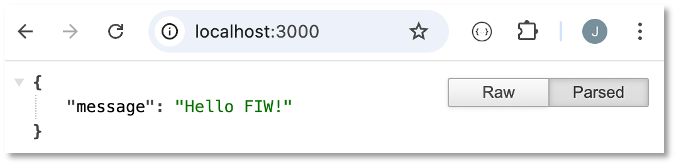

Um auch andere Anfragemethoden zu testen, benötigen wir ein Programm, das auch andere Anfragemethoden verarbeiten kann. Es gibt viele solche Programme, z.B. [SoapUI](https://www.soapui.org/), [RapidAPI](https://paw.cloud/), [Insomnia](https://insomnia.rest/) usw. Wir verwenden hier [Postman](https://www.postman.com/downloads/):


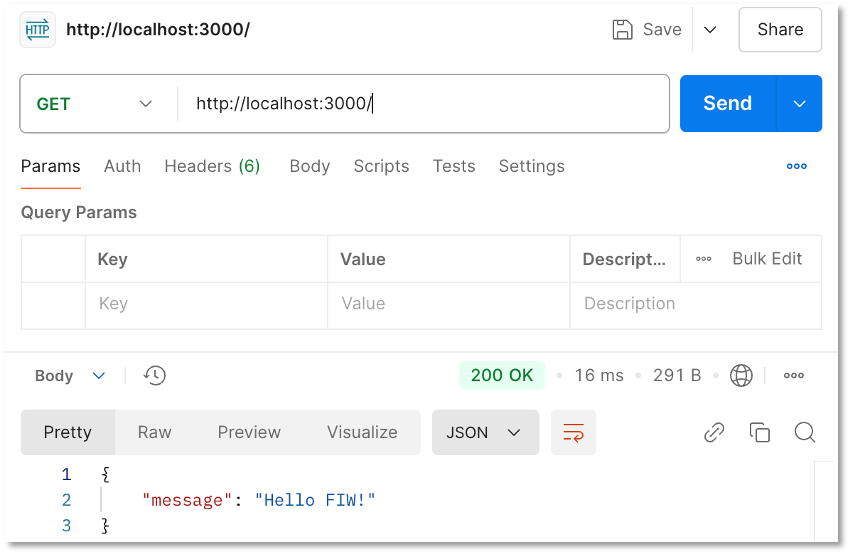

Wir werden gleich die Anwendung von Postman für die verschiedenen Anfragemethoden sehen. 


## PostgreSQL

PostgreSQL können Sie sich selbst lokal [installieren](https://www.postgresql.org/download/) oder Sie nutzen den PostgreSQL-Server auf `ocean.f4.htw-berlin.de`. Das folgende Beispiel zeigt die Verwendung des Servers `ocean.f4.htw-berlin.de`. 

Jetzt erstellen wir die Datenbank und binden sie an.

1. `ocean.f4.htw-berlin.de` aufrufen, als Name der Datenbank `members` eingeben und auf die `PostgreSQL`-Karte klicken

	

2. Modul `pg` installieren (siehe [hier](https://www.npmjs.com/package/pg)) sowie `.env` und `db.js` im Projektordner `backend` erstellen:

	```bash
	npm i pg 
	```

	=== ".env"
		```js linenums="1"
		PGUSER=ihr_account_name
		PGHOST=psql.f4.htw-berlin.de
		PGPASSWORD=ihr_passwort
		PGDATABASE=members
		PGPORT=5432
		```
	=== "db.js"
		```js linenums="1"
		const pg = require('pg');

		const client = new pg.Client({
		    user: process.env.PGUSER,
		    host: process.env.PGHOST,
		    database: process.env.PGDATABASE,
		    password: process.env.PGPASSWORD,
		    port: process.env.PGPORT,
		});

		client.connect(err => {
		    if (err) {
		        console.log(err);
		    } else {
		        console.log('Connection to DB ...');
		    }
		});

		module.exports = client;
		```

3. Wir erstellen uns ein Extra-Skript, um die die Datenbank mit Einträgen per Skript zu befüllen: Dazu erstellen wir eine Datei `initdb.js`, in der für die Datenbank eine Tabelle `members` erstellt und diese mit Einträgen befüllt wird. Da es recht aufwendig ist, sehr viele Einträge in die Datenbank mit dem `pg`-Modul zu schreiben, installieren wir noch ein zusätzliches Paket `pg-format`, mit dessen Hilfe es möglich ist, die vielen Werte als ein verschachteltes Array anzugeben. Informationen zu `pg-format` finden Sie [hier](https://www.npmjs.com/package/pg-format).

	```bash
	npm i pg-format 
	```

	=== "initdb.js"
		```js linenums="1"
		const express = require('express');
		const client = require('./db');
		const initdb = express.Router();
		const format = require('pg-format');


		initdb.get('/', async(req, res) => {

			// Anlegen der Tabelle members
		    let query = `
		            DROP TABLE IF EXISTS members;
		            CREATE TABLE members(id serial PRIMARY KEY, firstname VARCHAR(50), lastname VARCHAR(50), email VARCHAR(50));
		            `;

		    try {
		        await client.query(query)
		        console.log("Table created successfully ...")
		    } catch (err) {
		        console.log(err)
		    }

			// Befüllen der Tabelle members mit 50 Einträgen
		    const values = [
		        ["Catherine", "Williams", "cwilliamsl@360.cn"],
		        ["Adam", "Anderson", "aanderson8@google.fr"],
		        ["Susan", "Andrews", "sandrewsn@google.co.jp"],
		        ["Catherine", "Andrews", "candrewsp@noaa.gov"],
		        ["Alan", "Bradley", "abradley1c@globo.com"],
		        ["Anne", "Brooks", "abrooks16@bravesites.com"],
		        ["Russell", "Brown", "rbrownq@nifty.com"],
		        ["Ryan", "Burton", "rburton18@foxnews.com"],
		        ["Roy", "Campbell", "rcampbell1@geocities.com"],
		        ["Russell", "Campbell", "rcampbell17@eventbrite.com"],
		        ["Bonnie", "Coleman", "bcoleman11@fc2.com"],
		        ["Ernest", "Coleman", "ecoleman15@businessweek.com"],
		        ["Richard", "Cruz", "rcruz7@unc.edu"],
		        ["Sean", "Cruz", "scruz10@answers.com"],
		        ["Rebecca", "Cunningham", "rcunninghamd@mac.com"],
		        ["Margaret", "Evans", "mevansh@pcworld.com"],
		        ["Jeffrey", "Ford", "jford14@cnet.com"],
		        ["Andrea", "Gardner", "agardnerv@woothemes.com"],
		        ["Deborah", "George", "dgeorge6@furl.net"],
		        ["Sean", "Gibson", "sgibsony@alexa.com"],
		        ["Virginia", "Graham", "vgrahamk@aol.com"],
		        ["Steven", "Hamilton", "shamiltonu@state.tx.us"],
		        ["Virginia", "Hawkins", "vhawkinsf@ehow.com"],
		        ["Edward", "Hicks", "ehicksc@pcworld.com"],
		        ["Mark", "Johnson", "mjohnsonj@hostgator.com"],
		        ["Ruth", "Jordan", "rjordan1a@smugmug.com"],
		        ["Antonio", "Kim", "akim4@odnoklassniki.ru"],
		        ["Jennifer", "Marshall", "jmarshallt@gnu.org"],
		        ["Eric", "Matthews", "ematthews5@independent.co.uk"],
		        ["Raymond", "Mcdonald", "rmcdonald2@ihg.com"],
		        ["Eric", "Miller", "emillere@creativecommons.org"],
		        ["Jonathan", "Morales", "jmoralesa@ovh.net"],
		        ["Marie", "Morgan", "mmorganb@cloudflare.com"],
		        ["Amanda", "Nelson", "anelson13@indiatimes.com"],
		        ["Lisa", "Olson", "lolsonr@telegraph.co.uk"],
		        ["Alice", "Ortiz", "aortizw@histats.com"],
		        ["Peter", "Phillips", "pphillipss@1688.com"],
		        ["Matthew", "Porter", "mporter9@europa.eu"],
		        ["Tammy", "Ray", "trayx@weather.com"],
		        ["Mark", "Richardson", "mrichardson1d@ihg.com"],
		        ["Joan", "Roberts", "jroberts12@alibaba.com"],
		        ["Kathleen", "Rose", "kroseg@pinterest.com"],
		        ["Steve", "Sanders", "ssanders1b@wikispaces.com"],
		        ["Shirley", "Scott", "sscottm@macromedia.com"],
		        ["Lillian", "Stephens", "lstephens19@hugedomains.com"],
		        ["Nicole", "Thompson", "nthompson3@admin.ch"],
		        ["Marie", "Thompson", "mthompsonz@yelp.com"],
		        ["Alan", "Vasquez", "avasquezo@miibeian.gov.cn"],
		        ["Mildred", "Watkins", "mwatkins0@miibeian.gov.cn"],
		        ["Eugene", "Williams", "ewilliamsi@deliciousdays.com"]
		    ];
		    // hierfuer muss pg-format installiert werden (wegen %L):
		    const paramquery = format('INSERT INTO members(firstname, lastname, email) VALUES %L RETURNING *', values);


		    try {
		        const result = await client.query(paramquery)
		        console.log("50 members inserted ...")
		        res.status(200)
		        res.send(result.rows)
		    } catch (err) {
		        console.log(err)
		    }

		});


		module.exports = initdb;
		```

	Das Skript enthält zwei Anfragen an die Datenbank. Zunächst wird die Tabelle `members` gelöscht, falls sie existiert und dann erstellt. Das Ausführen dieser Anfrage erfolgt in Zeile `16`. Danach werden in einer zweiten Anfrage 50 Einträge in diese Tabelle eingefügt. Die Anfrage wird in Zeile `75` mithilfe des `pg-format`-Paketes formatiert (`format()`-Methode). Dadurch ist in dem Anfragestring der Platzhalter `%L` möglich, in den dann das verschachtelte Array `values` eingesetzt werden kann. Dadurch wird das Einfügen vieler Datensätze erleichtert.

	Das Skript `initdb.js` wird in der `server.js` verwendet. Unter der Route `/init` wird es ausgeführt und alle Datensätze in die Datenbank eingetragen. 

	=== "server.js"
		```js linenums="1" hl_lines="5 12"
		const express = require('express');
		const cors = require('cors');
		require('dotenv').config();
		const routes = require('./routes');
		const init = require('./initdb');

		const app = express();
		const PORT = 3000;

		app.use(express.json());
		app.use(cors());
		app.use('/init', init);
		app.use('/', routes);


		app.listen(PORT, (error) => {
		    if (error) {
		        console.log(error);
		    } else {
		        console.log(`Server started and listening on port ${PORT} ...`);
		    }
		})
		```

	Wenn wir nun `http://localhost:3000/init` aufrufen, wird die Datenbank automatisch befüllt. 

## CRUD-Funktionen

Nun fügen wir in die `routes.js` die einzelnen Routen ein, um die CRUD-Funktionen zu implementieren. Wir beginnen mit dem Erzeugen eines neuen Datensatzes: 

### C - create

Wir implementieren den Endpunkt `POST localhost:3000/members`. Es wird also die HTTP-`POST`-Anfragemethoden verwendet.

=== "routes.js"
	```js linenums="18"

	// post one member
	router.post('/members', async(req, res) => {
	    let firstname = (req.body.firstname) ? req.body.firstname : null;
	    let lastname = (req.body.lastname) ? req.body.lastname : null;
	    let email = (req.body.email) ? req.body.email : null;

	    const query = `INSERT INTO members(firstname, lastname, email) VALUES ($1, $2, $3) RETURNING *`;

	    try {
	        const result = await client.query(query, [firstname, lastname, email])
	        console.log(result)
	        res.send(result.rows[0]);
	    } catch (err) {
	        console.log(err.stack)
	    }
	});

	module.exports = router;
	```

Erläuterungen: 

- Aufruf der `POST`-Anfragemethode mittels `router.post()`. Der erste Parameter der Funktion ist die Route `/members`. Der zweite Parameter ist eine Callback-Funktion. 
- Die Parameter dieser Callback-Funktion sind ein `Request`- und ein `Response`-Objekt. Wir haben sie hier mit `req` und `res` benannt. Siehe dazu auch [Request](https://expressjs.com/en/4x/api.html#req) und [Response](https://expressjs.com/en/4x/api.html#res). 

- Das `Request`-Objekt besitzt Eigenschaften für die Parameter, den Body, HTTP-Header, Cookies usw. Wir greifen mithilfe von `req.body` auf den Body des `Request`-Objektes zu. In diesem Body schicken wir den neuen Datensatz mit, der in die Datenbank eingefügt werden soll. 
- Die Daten aus dem Body werden ausgelesen und entsprechend in den Variablen `firstname`, `lastname` und `email` gespeichert. 
- Die SQL-Anfrage `query` ist `INSERT INTO ...` Darin gibt die Parameter `$1, $2, $3` 
- Die Ausführung der `query` erfolgt mittels `client.query()`. Dieser Funktion werden 2 Parameter übergeben: die `query` und ein Array mit den Werten, die in die Parameter (in der Reihenfolge) eingesetzt werden. 
- Die Ausführung der `query` in der Datenbank gibt ein `result` zurück. Beim Einfügen mithilfe von `INSERT INTO ...` Dabei handelt es sich um ein Objekt, das verschiedene Eigenschaften enthält, z.B. (gekürzt):

	```json
	Result {
	  command: 'INSERT',
	  rowCount: 1,
	  oid: 0,
	  rows: [
	    {
	      id: 51,
	      firstname: 'Maria',
	      lastname: 'Musterfrau',
	      email: 'maria@musterfrau.fr'
	    }
	  ],
	  fields: [
	    Field {
	      name: 'id',
	      tableID: 16392,
	      columnID: 1,
	      dataTypeID: 23,
	      dataTypeSize: 4,
	      dataTypeModifier: -1,
	      format: 'text'
	    },
	```
	Es beinhaltet z.B. die betroffenen Tabellenzeilen (`rowCount: 1` und `rows: [...]`), wobei `rows` ein Array aller Datensätze enthält, die hinzugefügt wurden.
- Den ersten (einzigen) Eintrag des Arrays `result.rows` geben wir mithilfe von `res.send(result.rows[0])` als `Response` zurück. 
- Sollte bei der Anfrage an die Datenbank ein Fehler auftreten, wird dieser mittels `catch(err)` aufgefanden und das Fehler-Objekt auf die Konsole ausgegeben. 

Mithilfe von Postman können wir die Funktionalität des `POST /members`-Endpunktes ausprobieren. Dazu wählen wir den korrekten Endpunkt `http://localhost:3000/members` und die Anfragemethode `POST`. 

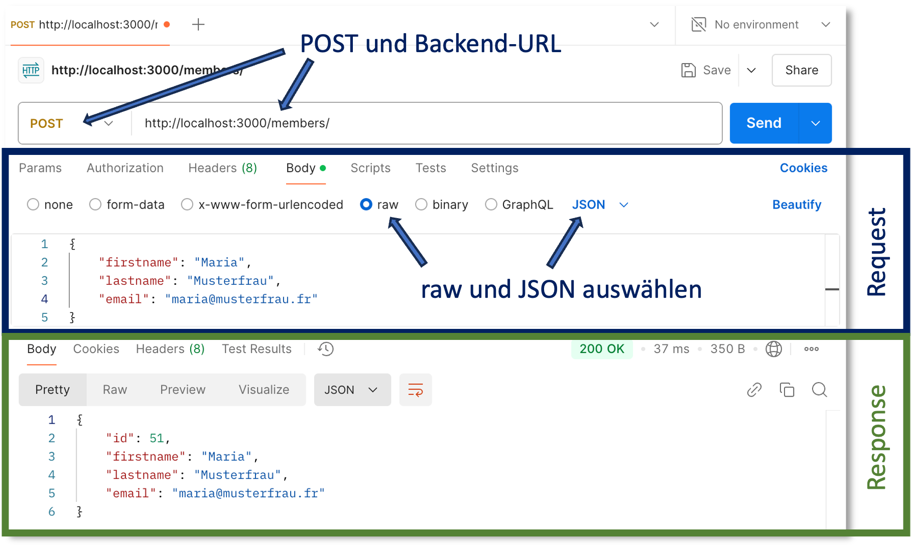

Außerdem fügen wir in den `Body` des `Request`-Objektes das einzufügende Objekt im JSON-Format, z.B.:


```json
{
    "firstname": "Maria",
    "lastname": "Musterfrau",
    "email": "maria@musterfrau.fr"
}
```

Beachten Sie, dass Sie im `Request`-Teil, dort wo Sie auch im Body das obige JSON einfügen, den Radiobutton `raw` auswählen und als Format `JSON`. Mit dem `Send`-Button schicken Sie die Anfrage ab und im `Response`-teil erscheint der eingefügte Datensatz. Diesem wurde durch die Datenbank eine `id` hinzugefügt:

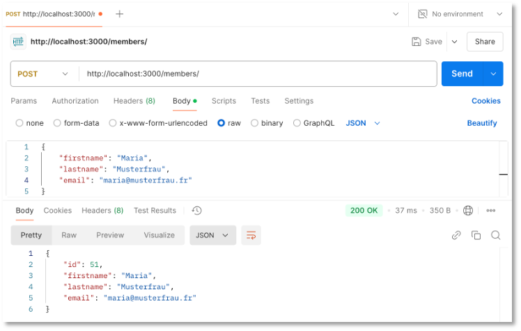

Das generelle Prinzip der parametrisierten SQL-Anfragen wird für `POST /members` deutlich. Wir definieren uns eine *parametrisierte SQL-Anfrage* mit den Parametern `$1`, `$2`, `$3`: 

```js
const query = `INSERT INTO members(firstname, lastname, email) VALUES ($1, $2, $3) RETURNING *`;
```

In die Parameter `$1`, `$2` und `$3` werden dann die entsprechenden Werte eingetragen:

```js
const result = await client.query(query, [firstname, lastname, email]);
```

Wichtig ist, dass die Werte als Array übergeben werden. Der Funktion `client.query()` wird also die parametrisierte Anfrage übergeben und als zweiter Parameter folgt das Array mit den Werten (in korrekter Reihenfolge), die in die Parameter eingesetzt werden. 

Wir haben nun den ersten Endpunkt unserer REST-API implementiert. Weiter geht es mit dem Lesen eines oder mehrerer Datensätze.

### R - read all

Das Auslesen aller Datensätze aus der Datenbank erfolgt über den Endpunkt `GET / members`. In der `routes.js` implementieren wir dazu folgende Funktion:


=== "routes.js"
	```js linenums="5"
	// get all members
	router.get('/members', async(req, res) => {
	    const query = `SELECT * FROM members `;

	    try {
	        const result = await client.query(query)
	        console.log(result)
	        res.send(result.rows);
	    } catch (err) {
	        console.log(err.stack)
	    }
	});
	```

Es wird also die `get()`-Funktion von Express gewählt. Die Anfrage an die Datenbank ist dieses Mal parameterlos ein einfaches `SELECT * FROM members`. Als Resultat der Anfrage enthält `rows` alle Datenbankeinträge. Diese werden als `Response` zurückgesendet. 

In Postman wählen wir `GET` und geben `http:localhost:3000/members` ein. Der Body des `Request`-Objektes bleibt bei `GET` leer. 

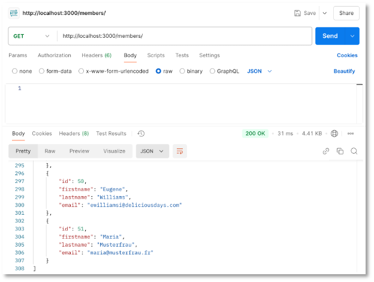


### R - read one

Durch das Einfügen der Datensätze in die Datenbank erhalten diese vom Datenbankmanagementsystem eine eindeutige `id`. Wir erstellen uns einen Endpunkt, der uns für eine gegebene `id` den entsprechenden Datensatz zurückgibt:


=== "routes.js"
	```js linenums="35"
	// get one member via id
	router.get('/members/:id', async(req, res) => {
	    const query = `SELECT * FROM members WHERE id=$1`;

	    try {
	        const id = req.params.id;
	        const result = await client.query(query, [id])
	        console.log(result)
	        if (result.rowCount == 1)
	            res.send(result.rows[0]);
	        else
	            res.send({ message: "No member found with id=" + id });
	    } catch (err) {
	        console.log("error", err.stack)
	    }
	});
	```

Erläuterungen: 

- Die `id` wird mittels `/members/:id` als Parameter an die Route anghängt. 
- Dieses Parameter kann mittels `req.params.id` aus dem `Request`-Objekt ausgelesen werden. 
- Die Anfrage `query` ist erneut parametrisiert `$1`. bei Aufruf von `client.query()` wird als erster Parameter diese parametrisierte `query` und als zweiter Parameter ein Array übergeben, welches den Wert für `id` enthält. 
- Das `result`-Objekt, das die `client.query()`-Funktion zurückgibt, enthält nun entweder den Datensatz mit der gesuchten `id`: 

	```json
	Result {
	  command: 'SELECT',
	  rowCount: 1,
	  oid: null,
	  rows: [
	    {
	      id: 51,
	      firstname: 'Maria',
	      lastname: 'Musterfrau',
	      email: 'maria@musterfrau.fr'
	    }
	  ],
	```

	  oder, falls die `id` nicht existiert, ein leeres `rows`-Array:

	  ```json
	  Result {
		  command: 'SELECT',
		  rowCount: 0,
		  oid: null,
		  rows: [],
	  ```

- Für diese Fallunterscheidung fragen wir den Wert von `rowCount` im `results`-Objekt ab. Ist dieser Wert `1` senden wir mittels `res.send(result.rows[0]);` den Datensatz. ist der Wert `0` senden wir ein Objekt mit einer `message`. 

In Postman sehen diese beiden Fälle so aus:


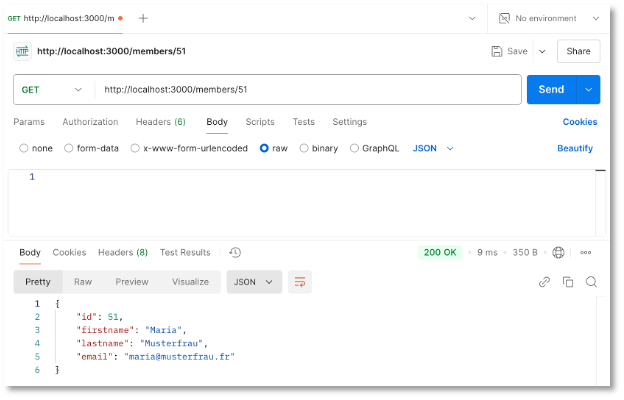

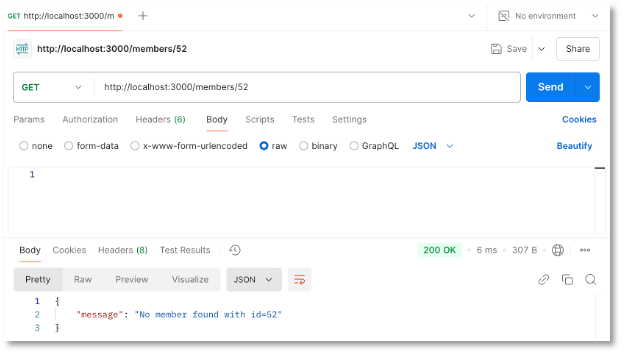


### U - update

Das Ändern eines bereits existierenden Datensatzes ist der komplizierteste Fall. Wir verwenden die `PUT`-Anfragemethode. Anstelle von `PUT` kann auch `PATCH` verwendet werden. Zur Unterscheidung zwischen `PUT` und `PATCH` siehe z.B. [hier](https://www.geeksforgeeks.org/difference-between-put-and-patch-request/) oder [hier](https://stackoverflow.com/questions/21660791/what-is-the-main-difference-between-patch-and-put-request).


=== "routes.js"
	```js linenums="59"
	// update one member
	router.put('/members/:id', async(req, res) => {
	    const query = `SELECT * FROM members WHERE id=$1`;

	    let id = req.params.id;
	    const result = await client.query(query, [id])
	    if(result.rowCount > 0)
	    {
	        let member = result.rows[0];
	        let firstname = (req.body.firstname) ? req.body.firstname : member.firstname;
	        let lastname = (req.body.lastname) ? req.body.lastname : member.lastname;
	        let email = (req.body.email) ? req.body.email : member.email;

	        const updatequery = `UPDATE members SET 
	            firstname = $1, 
	            lastname = $2,
	            email = $3
	            WHERE id=$4;`;
	        const updateresult = await client.query(updatequery, [firstname, lastname, email, id]);
	        console.log(updateresult)
	        res.send({ id, firstname, lastname, email });
	    } else {
	        res.status(404)
	        res.send({
	            error: "Member with id=" + id + " does not exist!"
	        })
	    }
	});
	```

Erläuterungen: 

- Das `Update` ist eine Kombination aus `Read (one)` und `Create`. Soll ein existierender Datensatz geändert werden, benötigen wir die `id` dieses Datensatzes als Parameter sowie die zu ändernden Daten im Body des `Request`-Objektes. 
- Zunächst prüfen wir mithilfe von `SELECT * ... WHERE id=$1`, ob es in der Datenbank einen Datensatz mit der entsprechenden `id` gibt. Die `id` wird als Parameter ausgelesen (`req.params.id`) und als Parameterwert der `query` übergeben. 
- Das `result` der `client.query()`-Funktion enthält entweder den Datensatz mit der `id` oder es enthält keinen Datensatz (falls die `id` nicht existiert).
- Falls die `id` nicht in der Datenbank existiert, wird der HTTP-Statuscode `404` sowie ein Objekt mit einer `error`-Nachricht als `Response` gesendet:

	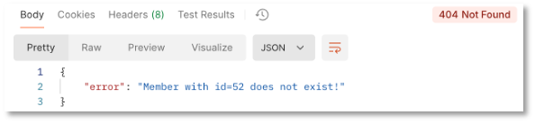

- Falls der Datensatz existiert, werden die Einträge aus der Datenbank gespeichert (in `member`). Sodann wird der `body` des `Request`-Objektes ausgelesen. Die Variablen `firstname`, `lastname` und `email` enthalten nun entweder die Werte aus dem `Request-Body` (geänderte Werte) oder aus `member` (alte Werte). Das bedeutet, dass das im `body` gesendete Objekt kein vollständiges `Member`-Objekt sein muss (es genügt `firstname` und/oder `lastname` und/oder `email`). 
- Mit einer `UPDATE ...`-Anfrage wird der Datensatz in der Datenbank geändert. Als `updateresult` wird der gänderte Datensatz als `Response` gesendet.

	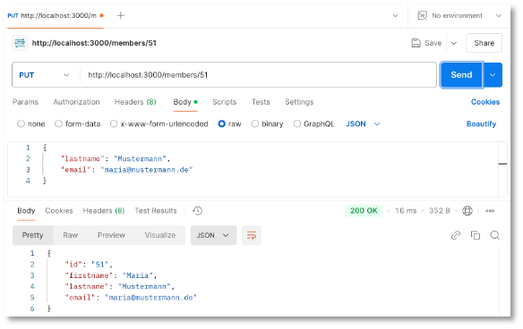


### D - delete

Zuletzt erzeugen wir noch einen Endpunkt, mit dem das Löschen eines Datensatzes möglich wird. Dazu verwenden wir die Anfragemethode `DELETE`. Die Route ist mit einer `id` parametrisiert. Über diese `id` wird der Datensatz gelöscht, falls die `id` in der Datenbank existiert: 


=== "routes.js"
	```js linenums="89"
	// delete one member via id
	router.delete('/members/:id', async(req, res) => {
	    const query = `DELETE FROM members WHERE id=$1`;

	    try {
	        const id = req.params.id;
	        const result = await client.query(query, [id])
	        console.log(result)
	        if (result.rowCount == 1)
	            res.send({ message: "Member with id=" + id + " deleted" });
	        else {
	        	res.status(404)
	            res.send({ message: "No member found with id=" + id });
	        }
	    } catch (err) {
	        console.log(err.stack)
	    }
	});
	```

Zurückgesendet wird in beiden Fällen ein Objekt mit einer `message`-Eigenschaft. Für den Fall, dass die `id` nicht in der Datenbank existiert, wird außerdem der HTTP-Statuscode `404` gesendet:

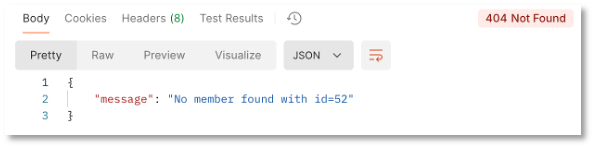

Wurde der entsprechende Eintrag gelöscht, erscheint:

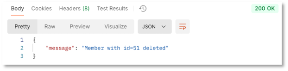


Hier nochmal die vollständige `routes.js`:


??? "routes.js"
	```js linenums="1"
	const express = require('express');
	const client = require('./db');
	const router = express.Router();

	// get all members
	router.get('/members', async(req, res) => {
	    const query = `SELECT * FROM members `;

	    try {
	        const result = await client.query(query)
	        console.log(result)
	        res.send(result.rows);
	    } catch (err) {
	        console.log(err.stack)
	    }
	});

	// post one member
	router.post('/members', async(req, res) => {
	    let firstname = (req.body.firstname) ? req.body.firstname : null;
	    let lastname = (req.body.lastname) ? req.body.lastname : null;
	    let email = (req.body.email) ? req.body.email : null;

	    const query = `INSERT INTO members(firstname, lastname, email) VALUES ($1, $2, $3) RETURNING *`;

	    try {
	        const result = await client.query(query, [firstname, lastname, email])
	        console.log(result)
	        res.send(result.rows[0]);
	    } catch (err) {
	        console.log(err.stack)
	    }
	});

	// get one member via id
	router.get('/members/:id', async(req, res) => {
	    const query = `SELECT * FROM members WHERE id=$1`;

	    try {
	        const id = req.params.id;
	        const result = await client.query(query, [id])
	        console.log(result)
	        if (result.rowCount == 1)
	            res.send(result.rows[0]);
	        else
	            res.send({ message: "No member found with id=" + id });
	    } catch (err) {
	        console.log("error", err.stack)
	    }
	});

	// update one member
	router.put('/members/:id', async(req, res) => {
	    const query = `SELECT * FROM members WHERE id=$1`;

	    let id = req.params.id;
	    const result = await client.query(query, [id])
	    if(result.rowCount > 0)
	    {
	        let member = result.rows[0];
	        let firstname = (req.body.firstname) ? req.body.firstname : member.firstname;
	        let lastname = (req.body.lastname) ? req.body.lastname : member.lastname;
	        let email = (req.body.email) ? req.body.email : member.email;

	        const updatequery = `UPDATE members SET 
	            firstname = $1, 
	            lastname = $2,
	            email = $3
	            WHERE id=$4;`;
	        const updateresult = await client.query(updatequery, [firstname, lastname, email, id]);
	        console.log(updateresult)
	        res.send({ id, firstname, lastname, email });
	    } else {
	        res.status(404)
	        res.send({
	            error: "Member with id=" + id + " does not exist!"
	        })
	    }
	});
	

	// delete one member via id
	router.delete('/members/:id', async(req, res) => {
	    const query = `DELETE FROM members WHERE id=$1`;

	    try {
	        const id = req.params.id;
	        const result = await client.query(query, [id])
	        console.log(result)
	        if (result.rowCount == 1)
	            res.send({ message: "Member with id=" + id + " deleted" });
	        else {
	        	res.status(404)
	            res.send({ message: "No member found with id=" + id });
	        }
	    } catch (err) {
	        console.log(err.stack)
	    }
	});


	module.exports = router;
	```


!!! success
	Wir haben nun auch ein Backend, das auf die PostgreSQL zugreift, die Sie auch in der Datenbankvorlesung verwenden. Sie benötigen also keine eigene Installation der PostgreSQL. Die Befüllung der Datenbank erfolgt per Skript. Wir haben eine erste eigene REST-API implementiert.  
