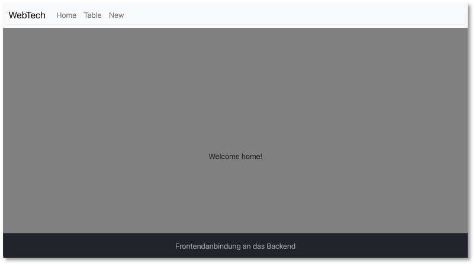

# Frontend-Backend-Anbindung

Wir haben jetzt ein Backend, das als REST-Server funngiert. Über die Endpunkte der REST-API können wir auf die einzelnen Funktionen des Backends zugreifen, um die Daten in der [MongoDB](backend.md#rest) (oder der [PostgreSQL](backend_pg.md#rest-api)) zu manipulieren (erzeugen, lesen, ändern und löschen - CRUD). Unser [Frontend](routing.md#routing-und-services) stellt zur Zeit nur einen [Daten-Service](routing.md#services) zur Verfügung, der die Daten client-seitig verwaltet. Dies wollen wir jetzt ändern. Das Frontend soll mit dem Backend kommunizieren, um die Daten zu nutzen, die das Backend zur Verfügung stellt. 

Wir werden uns ein **neues** Frontend erstellen und dabei die einzelnen Schritte genauer untersuchen (bzw. wiederholen). Das hat folgende Vorteile:

- wir werden sicherer bei der Erstellung von Frontends mithilfe von Angular,
- wir müssen nicht auf bestehende Frontends aufsetzen, die evtl. bei einigen von Ihnen nicht richtig funktionieren,
- wir haben die Möglichkeit, tiefer in die Prinzipien von Angular einzutauchen und wesentliche Prinzipien ausführlicher zu diskutieren. 

Ich werde das Frontend, das ich hier erstelle, `frontend` nennen. Der Name bleibt natürlich Ihnen überlassen. Wir erstellen uns also neben unserem alten Frontend, neben dem Backend usw. in unserem Repository mithilfe von 

```bash
ng new frontend
```

ein neues Angular-Projekt und wählen CSS. Wir wechseln in den `frontend`-Ordner und erzeugen uns dort 6 neue Komponenten:

```bash
cd frontend 
ng g c nav
ng g c footer
ng g c home
ng g c table
ng g c create
ng g c detail
```

Außerdem fügen wir [Bootstrap](https://www.npmjs.com/package/bootstrap) hinzu (siehe z.B. [hier](https://medium.com/@interviewpro/adding-bootstrap-to-your-angular-project-2e543ef52bef)): 

```bash
npm i bootstrap
```

und zur `angular.json` hinzufügen:

=== "angular.json"
    ```json linenums="12" hl_lines="20 24"
    ...
      "architect": {
        "build": {
          "builder": "@angular-devkit/build-angular:application",
          "options": {
            "outputPath": "dist/frontendskript",
            "index": "src/index.html",
            "browser": "src/main.ts",
            "polyfills": [
              "zone.js"
            ],
            "tsConfig": "tsconfig.app.json",
            "assets": [
              {
                "glob": "**/*",
                "input": "public"
              }
            ],
            "styles": [
              "node_modules/bootstrap/dist/css/bootstrap.min.css",
              "src/styles.css"
            ],
            "scripts": [
              "node_modules/bootstrap/dist/js/bootstrap.min.js"
            ]
          },
    ...
    ```


### Navigation und Routing

Wir passen unsere `nav`-Komponente an und können dabei gleich mal überprüfen, ob Bootstrap funktioniert. Den Code habe ich von [hier](https://getbootstrap.com/docs/5.3/components/navbar/#nav) entnommen. 

=== "nav.component.html"
    ```html 
    <nav class="navbar navbar-expand-lg bg-body-tertiary">
        <div class="container-fluid">
          <a class="navbar-brand" href="http://freiheit.f4.htw-berlin.de/webtech/fe-be-anbindung/">WebTech</a>
          <button class="navbar-toggler" type="button" data-bs-toggle="collapse" data-bs-target="#navbarNavAltMarkup" aria-controls="navbarNavAltMarkup" aria-expanded="false" aria-label="Toggle navigation">
            <span class="navbar-toggler-icon"></span>
          </button>
          <div class="collapse navbar-collapse" id="navbarNavAltMarkup">
            <div class="navbar-nav">
              <a class="nav-link"[routerLink]="['/']">Home</a>
              <a class="nav-link" [routerLink]="['/table']">Table</a>
              <a class="nav-link" [routerLink]="['/create']">Create</a>
            </div>
          </div>
        </div>
      </nav>
    ```

=== "nav.component.ts"
    ```js 
    import { Component } from '@angular/core';
    import { RouterLink } from '@angular/router';

    @Component({
      selector: 'app-nav',
      standalone: true,
      imports: [RouterLink],
      templateUrl: './nav.component.html',
      styleUrl: './nav.component.css'
    })
    export class NavComponent {

    }
    ```


Außerdem erstellen wir noch einen `footer` und die `home`-Seite und legen die Routen fest:

=== "footer.component.html"
    ```html 
    <div class="fixed-bottom text-white-50 bg-dark p-3 text-center">
        Frontendanbindung an das Backend
    </div>    
    ```

=== "home.component.html"
    ```html 
    <main class="d-flex align-items-center min-vh-100">
        <div class="container text-center">
            Welcome home!
        </div>
    </main>  
    ```

=== "home.component.css"
    ```css 
    main {
        background-color: grey;
    }
    ```

Hier die Routendefinitionen und das Einbinden der Komponenten:

=== "app.routes.ts"
    ```js 
    import { Routes } from '@angular/router';
    import { HomeComponent } from './home/home.component';
    import { TableComponent } from './table/table.component';
    import { CreateComponent } from './create/create.component';
    import { DetailComponent } from './detail/detail.component';

    export const routes: Routes = [{
        path: "",
        component: HomeComponent,
        pathMatch: 'full'
      },
      {
        path: "table",
        component: TableComponent
      },
      {
        path: "create",
        component: CreateComponent
      },
      {
        path: "member/:id",
        component: DetailComponent
      }];

    ```

=== "app.component.html"
    ```html 
    <app-nav></app-nav>
    <router-outlet></router-outlet>
    <app-footer></app-footer>
    ```


=== "app.component.ts"
    ```js 
    import { Component } from '@angular/core';
    import { RouterOutlet } from '@angular/router';
    import { NavComponent } from './nav/nav.component';
    import { FooterComponent } from './footer/footer.component';

    @Component({
      selector: 'app-root',
      standalone: true,
      imports: [RouterOutlet, NavComponent, FooterComponent],
      templateUrl: './app.component.html',
      styleUrl: './app.component.css'
    })
    export class AppComponent {
      title = 'frontendskript';
    }

    ```

Wir geben im Terminal innerhalb des `frontend`-Ordners `ng serve` ein, um das Projekt zu starten. Die Startseite sollte nun so aussehen:


bzw. bei breiterem Viewport:



Die Routen sollten ebenfalls funktionieren, d.h. wenn Sie auf die Menüeinträge in der Navigation klicken, wird die entsprechende Komponente angezeigt. 


## Service für HTTP

Wir bereits beim [Routing](routing.md#routing-und-services)-Thema eingeführt, erstellen wir auch nun wieder einen [Service](routing.md#services) zur Verwaltung der Daten. Dieses Mal sind die Daten aber nicht direkt im Code, sondern wir greifen mit dem Service auf das Backend zu, vielmehr auf die Endpunkte des Backends:

|Methode |URL |Bedeutung |
|--------|----|----------|
|GET     |/members |hole alle Datensätze |
|GET     |/members/11 |hole den Datensatz mit der id=11 |
|POST    |/members |füge einen neuen Datensatz hinzu |
|PATCH   |/members/11 |ändere den Datensatz mit der id=11 |
|DELETE  |/members/11 |lösche den Datensatz mit der id=11 |
|DELETE  |/members |lösche alle Datensätze |

Wobei der Wert der `id` nur ein Beispiel ist.  

!!! warning "Achtung!"
    Damit wir überhaupt das Backend nutzen können, muss es laufen! Vergessen Sie also nicht, Ihr Backend zu starten!

Wir erstellen uns im Ordner `shared` einen `backend`-Service:

```bash
ng g service shared/backend
```

Wir kennen [Services](routing.md#services) bereits und wir haben darin auch bereits die [Fetch-API](https://developer.mozilla.org/de/docs/Web/API/Fetch_API) verwendet. Während wir dort eine JSON-Datei ausgelesen haben, nutzen wir nun als Ressource unsere REST-API. Auch von dieser erhalten wir ja Responses im JSON-Format. 


### Interface `Member`

Zunächst definieren wir uns noch ein Interface `Member`, um Typsicherheit zu gewährleisten.

```bash
ng g interface shared/member
```


=== "shared/member.ts"
    ```ts linenums="1"
    export interface Member {
        id: number;
        firstname: string;
        lastname: string;
        email: string;
    }
    ```

### Backend-Service `getAll()`

Die erste einfache Implementierung unseres Services zur Nutzung des Endpunktes `GET localhost:3000/members` sieht wie folgt aus:

=== "shared/backend.service.ts"
    ```ts linenums="1"
    import { Injectable } from '@angular/core';
    import { Member } from './member';

    @Injectable({
      providedIn: 'root'
    })
    export class BackendService {
      apiURL = 'http://localhost:3000/api'

      constructor() { }

      async getAll(): Promise<Member[]> {
        let response = await fetch(this.apiURL + '/members');
        let members = await response.json();
        console.log('members in service (getAll) : ', members)
        return members;
      }
    }

    ```


### Service in Komponente einbinden

In [Verwendung des Services](routing.md#verwendung-des-services) haben wir bereits gezeigt, wie wir den Service in eine Komponente einbinden. Wir zeigen hier das Einbinden des Services in die `TableComponent`:

=== "table.component.ts"
    ```js linenums="1"
    import { Component, inject, OnInit } from '@angular/core';
    import { BackendService } from '../shared/backend.service';
    import { Member } from '../shared/member';

    @Component({
      selector: 'app-table',
      standalone: true,
      imports: [],
      templateUrl: './table.component.html',
      styleUrl: './table.component.css'
    })
    export class TableComponent implements OnInit{

      private bs = inject(BackendService)
      members: Member[] = [];

      ngOnInit(): void {
        this.bs.getAll()
        .then( response => this.members = response )
        .then( members => console.log(' members in TableComponent : ', members ))   
      }
    }

    ```


### Backend starten

Um die Anbindung an das Backend zu testen, dürfen wir nicht vergessen, es zu starten! Wechseln Sie im Terminal in Ihren Backend-Ordner und rufen dort

```bash
node server.js 
```

auf (oder falls Sie parallel noch etwas am Backend ändern wollen `node --watch server.js`). Es erscheint im Terminal (je nach implemntierter Konsolenausgabe)

```bash
Server started and listening on port 3000 ...
DB connected ...
```


### Frontend starten

Wir müssen unser Frontend compilieren `ng serve` und wenn wir dann im Browser `http://localhost:4200/table` eingeben, also die Route zu unserer `TableComponent`, dann sollten wir in der **Konsole in den Entwicklertools** die Ausgabe der Response sehen (die `id`s und auch die Anzahl der Einträge können bei Ihnen anders sein):


Achtung! Man sieht nichts auf der Webseite, sondern wir geben die Datensätze derzeit nur in der Konsole der Entwicklertools aus! 

!!! success
    Wir haben das Backend an das Frontend angebunden. Wir haben die erste Anfrage an das Backend im Frontend umgesetzt, nämlich `GET /members`, indem wir die Fetch-API in einer einfachen Variante verwendet haben. Wir werden nun zunächst die Daten noch im HTML-Template darstellen und dann weitere Endpunkte unserer REST-API anbinden. 


### R-ead -- TableComponent

Wir wollen eine ansprechende Ansicht der Daten erzeugen. Wir werden die Daten in einer Tablle anzeigen und verwenden dazu Bootstrap-CSS-Klassen für das Design. Dazu wollen wir auch [Bootstrap-Icons](https://icons.getbootstrap.com/)verwenden. Diese installieren wir mit 

```bash
npm i bootstrap-icons
```

und fügen folgenden Eintrag der `angular.json` hinzu:

=== "angular.json"
    ```json linenums="11" hl_lines="21"
    ...
    "architect": {
        "build": {
          "builder": "@angular-devkit/build-angular:application",
          "options": {
            "outputPath": "dist/frontendskript",
            "index": "src/index.html",
            "browser": "src/main.ts",
            "polyfills": [
              "zone.js"
            ],
            "tsConfig": "tsconfig.app.json",
            "assets": [
              {
                "glob": "**/*",
                "input": "public"
              }
            ],
            "styles": [
              "node_modules/bootstrap/dist/css/bootstrap.min.css",
              "node_modules/bootstrap-icons/font/bootstrap-icons.css",
              "src/styles.css"
            ],
            "scripts": [
              "node_modules/bootstrap/dist/js/bootstrap.min.js"
            ]
          },
    ...
    ```


Die Bootstrap-Klassen für eine Tablle können [hier](https://getbootstrap.com/docs/5.3/content/tables/#accented-tables) entnommen werden. 

=== "table.component.html"
    ```html linenums="1"
    <div class="conatiner m-5">
        <h1>Alle Teilnehmer*innen</h1>

        <table class="table table-striped table-responsive mt-5">
            <caption>Alle Teilnehmerinnen</caption>
            <thead>
                <tr>
                    <th scope="col">Nr</th>
                    <th scope="col">Vorname</th>
                    <th scope="col">Nachname</th>
                    <th scope="col">E-Mail</th>
                    <th scope="col">Details</th>
                    <th scope="col">Löschen</th>
                </tr>
            </thead>
            <tbody>
                @for (member of members; track $index; let i = $index) {
                    <tr>
                        <td>{{ i+1 }}</td>
                        <td>{{ member.firstname }}</td>
                        <td>{{ member.lastname }}</td>
                        <td><a [href]="'mailto:' + member.email"><span class="bi bi-envelope-at"></span></a></td>
                        <td><a [routerLink]="['/member', member.id ]"><span class="bi bi-pencil-square"></span></a> </td>
                        <td><i (click)="delete(member.id)" class="bi bi-trash"></i></td>
                    </tr>
                }
            </tbody>
        </table>
    </div>

    ```

Erläuterungen:

- In der `table.component.ts` wird beim Erstellen der Komponente (`ngOnInit()`) die Variable `members` mit allen Daten aus der Datenbank befüllt. Dieses Array wird in der `table.component.html` ausgelesen. Wir verwenden dazu wieder die `@for`-Kontrollstruktur (siehe Zeile `17`).

- Die erste Spalte der Tabelle wird einfach mit einer fortlaufenden Nummer befüllt, in die zweite Spalte kommt der Vorname (`member.firstname`) und in die dritte Spalte der Nachname (`member.lastname`) - siehe Zeilen `19-21`. 

- In Zeile `22` erstellen wir einen Link, um an die E-Mail-Adresse (`member.email`) eine E-Mail zu senden. Der Inhalt des Links ist das Bootstrap-Icon `bi-envelope-at` - siehe [hier](https://icons.getbootstrap.com/icons/envelope-at/).

- In Zeile `23` definieren wir ebenfalls einen Link, dieses Mal aber keinen Hyperlink, sondern einen Routerlink unter Verwendung der `id` von `member`. Es entsteht der Aufruf der Route `/member/:id`, wobei für die `:id` die entsprechende `id` von `member` eingesetzt wird. Inhalt des Links ist das Bootstrap-Icon [pencil-square](https://icons.getbootstrap.com/icons/pencil-square/).

- In Zeile `24` verwenden wir das Bootstrap-Icon [trash](https://icons.getbootstrap.com/icons/trash/). Dieses wird an das `click`-Ereignis angemeldet. Sobald das Icon angeklickt wird, wird die Methode `delete(id)` aufgerufen. Dieser Methode wird die jeweilige `id` von `member` übergeben. Diese Methode `delete(id)` muss dazu in der `table.component.ts` definiert werden. Um die vollständige Implementierung der Methode kümmern wir uns später. Zunächst fügen wir sie nur ein, damit kein Fehler beim Übersetzen der Anwendung mehr passiert und geben einfach die übergebene `id` auf die Konsole aus:

=== "table.component.ts"
    ```ts linenums="1" hl_lines="24-26"
    import { Component, inject, OnInit } from '@angular/core';
    import { BackendService } from '../shared/backend.service';
    import { Member } from '../shared/member';
    import { RouterLink } from '@angular/router';

    @Component({
      selector: 'app-table',
      standalone: true,
      imports: [RouterLink],
      templateUrl: './table.component.html',
      styleUrl: './table.component.css'
    })
    export class TableComponent implements OnInit{

      private bs = inject(BackendService)
      members: Member[] = [];

      ngOnInit(): void {
        this.bs.getAll()
        .then( response => this.members = response )
        .then( members => console.log('members in TableComponent : ', members ))   
      }

      delete(id: number): void {
        console.log(`member mit id=${id} löschen`)
      }
    }
    ```

Wenn Sie Ihre `table.component.css` noch folgende Definitionen hinzufügen:

=== "table.component.css"
    ```css linenums="1"
    span {
        color: black;
    }

    i {
        color: red;
    }
    ```

, dann sollte die Ansicht Ihrer `TableComponent` ungefähr so aussehen:


- Wenn Sie nun auf das `trash`-Icon klicken, wird in der Konsole Ihrer Developer-Tools die `id` von `member` aus dieser Zeile ausgegeben. 
- Wenn Sie nun auf das `pencil`-Icon klicken, wird die `DetailComponent` aufgerufen (in der URL steht dann soetwas wie `http://localhost:4200/member/4`). 
- Wenn Sie nun auf das `envelope-at`-Icon klicken, wird Ihr E-Mail-Client aufgerufen und in der Empfängerzeile der E-Mail ist die `email` von `member` eingetragen. 

### U-pdate -- DetailComponent

Die `detail`-Komponente wird durch die Route `/member/:id` aufgerufen, wobei `:id` einer `id` eines `member` entspricht. Die Idee dieser Komponente ist, den Datensatz von `member` zu ändern. Wir erstellen ein Formular, in dem die Daten von `member` eingetragen werden, so dass sie aktualisiert werden können. Werden diese neuen Daten an das Backend gesendet, wird dort die `update`-Funktion aufgerufen, d.h. wir sprechen beim Senden der Daten den Endpunkt `PUT /members/:id` an. 

Zunächst implementieren wir, dass der Datensatz von `member`, dessen `id` in der Route übergeben wird, aus der Datenbank geholt wird. Dazu

- erweiteren wir den `BackendService` um eine Funktion `getOne(id)`, die den Endpunkt `GET /members/id` der REST-API des Backends aufruft.
- Wir nutzen diese Funktion, um in der `detail.component.ts` die Daten dieses `member` zu speichern. Dazu gehen wir wie beim [Routing mit parametrisierten Routen](routing.md#weiter-mit-parametrisierten-routen) gezeigt, vor. 

=== "backend.service.ts"
    ```ts linenums="1" hl_lines="19-24"
    import { Injectable } from '@angular/core';
    import { Member } from './member';

    @Injectable({
      providedIn: 'root'
    })
    export class BackendService {
      apiURL = 'http://localhost:3000/api'

      constructor() { }

      async getAll(): Promise<Member[]> {
        let response = await fetch(this.apiURL + '/members');
        let members = await response.json();
        console.log('members in service (getAll) : ', members)
        return members;
      }

      async getOne(id: string): Promise<Member> {
        let response = await fetch(this.apiURL + '/members/' + id);
        let member = await response.json();
        console.log('member in service (getOne) : ', member)
        return member;
      }
    }
    ```

=== "detail.component.ts"
    ```ts linenums="1"
    import { Component, inject, OnInit } from '@angular/core';
    import { BackendService } from '../shared/backend.service';
    import { Member } from '../shared/member';
    import { ActivatedRoute } from '@angular/router';

    @Component({
      selector: 'app-detail',
      standalone: true,
      imports: [],
      templateUrl: './detail.component.html',
      styleUrl: './detail.component.css'
    })
    export class DetailComponent  implements OnInit{

      private bs = inject(BackendService)
      private route = inject(ActivatedRoute)
      member!: Member;
      id: string | null = ''

      ngOnInit(): void {
        this.id = this.route.snapshot.paramMap.get('id');
        console.log('id = ', this.id)
        this.bs.getOne(this.id!)
        .then( response => this.member = response )
        .then( member => console.log('member in DetailComponent : ', member ))   
      }

    }

    ```


Wenn wir nun die `detail`-Komponente durch Klick auf das `pencil`-Icon in der Tabelle aufrufen, wird beim Initialisieren der Komponente die Variable `member` mit den passenden Einträgen aus der Datenbank befüllt und auf der Konsole in den Developertools angezeigt.   

Um die Daten von `member` ändern zu können, laden wir diese in ein Formular. Der folgende Abschnitt diskutiert die Möglichkeiten der Formularerstellung in Angular.

## Formulare in Angular

Formulare werden verwendet, um Nutzereingaben zu ermöglichen und die eingegebenen Daten zu verwalten, sie z.B. in einer Datenbank zu speichern. In Angular gibt es zwei verschiedene Ansätze, Forumlare zu erstellen:

- **reaktive Formulare** werden in der TypeScript-Klasse konzipiert und basieren auf einem unveränderlichen Datenmodell. Sie sind leichter zu skalieren als *Template-basierte Formulare* und besser wiederzuverwenden. Sie sind prinzipiell den *Template-basierten Formularen* vorzuziehen, außer dass Formular ist sehr einfach und besteht z.B. nur aus einem einzigen Eingabefeld.
- **Template-basierte Formulare** basieren auf Direktiven im HTML. Sie sind sehr einfach zu erstellen (direkt im HTML), können aber weniger einfach evaluiert und getestet werden und sind für strukturierte (verschachtelte) Datenmodelle ungeeignet. 

Für weitere Informationen zu Formularen in Angular siehe [hier](https://angular.io/guide/forms-overview#introduction-to-forms-in-angular). 

### Reactive Forms in `*.component.ts`

Wir verwenden hier *reaktive Formulare*. Die beiden wesentlichen TypeScript-Klassen bei Formularen sind

- `FormControl` für ein einzelnes Steuerelement (z.B. ein `input` oder ein `radio`Button) und
- `FormGroup` für eine zusammenhängende Menge von Steuerlementen (einem Formular). 


Um *reaktive Formulare* zu verwenden, ist es **wichtig**, das Modul `ReactiveFormsModule` in die entsprechende `*.component.ts` zu importieren! Wenn das vergessen wird, sind die Fehlerausgaben wirklich nicht zielführend und es ist recht schwierig, diesen Fehler zu finden! *Reactive Forms* werden, im Gegensatz zu den *template-basierten Formularen*, hauptsächlich in der TypeScript-Klasse erstellt. Wir passen deshalb unsere `detail.component.ts` wie folgt an:

=== "detail.component.ts"
    ```ts linenums="1" hl_lines="5 10 20-24 30-38 42-44 46-48"
    import { Component, inject, OnInit } from '@angular/core';
    import { BackendService } from '../shared/backend.service';
    import { Member } from '../shared/member';
    import { ActivatedRoute } from '@angular/router';
    import { FormControl, FormGroup, ReactiveFormsModule } from '@angular/forms';

    @Component({
      selector: 'app-detail',
      standalone: true,
      imports: [ReactiveFormsModule],
      templateUrl: './detail.component.html',
      styleUrl: './detail.component.css'
    })
    export class DetailComponent  implements OnInit{

      private bs = inject(BackendService)
      private route = inject(ActivatedRoute)
      member!: Member;
      id: string | null = ''
      form = new FormGroup({
        firstnameControl : new FormControl<string>(''),
        lastnameControl: new FormControl<string>(''),
        emailControl: new FormControl<string>('')
    });

      ngOnInit(): void {
        this.id = this.route.snapshot.paramMap.get('id');
        console.log('id = ', this.id)
        this.bs.getOne(this.id!)
        .then( response => {
          this.member = response 
          this.form.patchValue({
            firstnameControl: this.member?.firstname,
            lastnameControl: this.member?.lastname,
            emailControl: this.member?.email
          })
          return this.member
        })
        .then( member => console.log('member in DetailComponent : ', member ))   
      }

      update() {

      }

      cancel() {

      }

    }

    ```

Wir erstellen uns eine Referenzvariable `form` vom Typ `FormGroup` (Zeile `15`). Diese Variable zeigt auf unser Formular. Das Formular besteht aus `FormControl`-Elementen, die wir in den Zeilen `16-19` erzeugen. Sie sind mit `string` typisiert, das kann aber auch weggelassen werden. 

In den Zeilen `39-44` werden den Eingabefeldern bereits Werte zugewiesen. Diese Werte werden `member` entnommen, welches durch die `getOne(id)`-Funktion des `BackendService` befüllt wurde. Um die Werte in das Formular einzutragen, bietet die Klasse `FormGroup` zwei Funktionen an:

- `setValue()` - setzt für **alle** `FormControl`-Elemente innerhalb der `FormGroup` einen Wert (`value`)
- `patchValue()` - kann allen oder **bestimmten** (einzelnen) `FormControl`-Elementen einen Wert (`value`) zuweisen. 

Wir verwenden `patchValue()`, Sie können aber auch `setValue()` ausprobieren. Beachten Sie auch das `?` hinter der `member`-Variablen bei den Wertzuweisungen. Es handelt sich dabei um den *safe navigation operator*. 


#### Safe navigation operator

Um zu vermeiden, dass versucht wird, auf einen Wert zuzugreifen, der (noch) gar nicht existiert (`undefined` ist), kann der sogenannte *safe navigation operator* verwendet werden. Das Prinzip dieses Operators entspricht einer `@if`-Kontrollstruktur. Erst wenn der Wert ungleich `undefined` ist, wird er dargestellt. Die Syntax des *safe navigation operators*  ist ein `?`:

> `objekt?.eigenschaft`

Solange `objekt` noch `undefined` ist, wird nicht auf die (noch nicht existierende) `eigenschaft` zugegriffen. Wir verwenden den *safe navigation operator* in der `detail.component.ts` ein:

=== "detail.component.ts (Auszug mit safe navigation oprator)"
  ```html linenums="39" 
    this.form.patchValue({
      firstnameControl: this.member?.firstname,
      lastnameControl: this.member?.lastname,
      emailControl: this.member?.email
    })
  ```

Jetzt wird zunächst geprüft, ob `member` überhaupt definiert ist (also nicht `undefined`). Wenn nicht, wird gar nicht erst auf die Eigenschaft (z.B. `firstname`) zugegriffen. Ohne den Operator erhalten Sie eine Fehlermeldung, da z.B. der Zugriff `undefined.firstname` versucht würde.  Allerdings wird ja direkt nach der Wertzuweisung auf die `member`-Variable zugegriffen. Dadurch könnte hier der `safe navigation operator` auch weggelassen werden. 

### Reactive Forms in `*.component.html`

Das Formular existiert nun (als TypeScript-Objekt). Nun binden wir es in die `detail.component.html` ein. 


=== "detail.component.html"
    ```html linenums="1" 
      <main class="d-flex min-vh-100">
        <fieldset class="container  mt-5">

          @if(member) {
            <legend class="mb-4">Eintrag von {{ member.firstname }} {{ member.lastname }} aktualisieren
            </legend>
          } @else {
            <legend class="mb-4">Eintrag aktualisieren</legend>
          }
          <form [formGroup]="form" (ngSubmit)="update()">
            <div class="mb-3 row">
              <label class="col-2 col-form-label" for="firstname">Vorname</label>
              <div class="col-10">
                <input type="text" class="form-control" id="firstname" placeholder="Vorname"
                formControlName="firstnameControl" />
              </div>
            </div>
            <div class="mb-3 row">
              <label class="col-2 col-form-label" for="lastname">Nachname</label>
              <div class="col-10">
                <input type="text" class="col-10 form-control" id="lastname" placeholder="Nachname"
                formControlName="lastnameControl" />
              </div>
            </div>
            <div class="mb-3 row">
              <label class="col-2 col-form-label" for="email">E-Mail</label>
              <div class="col-10">
                <input type="email" class="col-10 form-control" id="email" placeholder="E-Mail" formControlName="emailControl" />
              </div>
            </div>
            <div class="row gx-0 mt-5">
              <button type="submit" class="col-5 btn btn-secondary">Aktualisieren</button>
              <div class="col-2"></div>
              <button type="button" class="col-5 btn btn-secondary" (click)="cancel() ">Abbrechen</button>
            </div>
          </form>
        </fieldset>
      </main>

    ```

Es entsteht folgende Ansicht (für `http://localhost:4200/member/1`):


, falls Sie folgende CSS-Definitionen hinzufügen:

=== "detail.component.css"
    ```css
    main {
      background-color: rgba(99, 192, 235, 0.729);
    }

    legend {
      font-weight: bold;
    }
    ```


### Submit- und Cancel-Ereignisbehandlung


Um sich an das `submit`-Ereignis anzumelden, wird für das `<form>`-Element `(ngSubmit)` hinzugefügt und als dessen Wert die Funktion, die aufgerufen werden soll, beim Absenden des Formulars - hier die Funktion `update()` (die wir gleich noch in `detail.component.ts` implementieren). Für den `Abbrechen`-Button melden wir uns an das `click`-Ereignis mithilfe von `(click)` und der Angabe der Funktion, die ausgeführt werden soll (hier `cancel()`) an. 

Wir implementieren nun die Funktionen `cancel()` und `update()`. Die `cancel()`-Funktion wird durch das `click`-Ereignis des `Abbrechen`-Buttons aufgerufen und die `update()`-Funktion durch den `submit`-Button `Aktualisieren` (siehe im Formular `(ngSubmit)="update()"`). Wenn wir auf `Abbrechen` klicken, dann wollen wir wieder zur Tabellenansicht zurück. Das erreichen wir mit dem Service `Router` aus `@angular/router`, der uns z.B. die `navigate()`-Funktion zur Verfügung stellt (siehe [hier](https://angular.dev/api/router/Router?tab=api)):

=== "detail.component.ts"
    ```ts linenums="1" hl_lines="4 18 49"
    import { Component, inject, OnInit } from '@angular/core';
    import { BackendService } from '../shared/backend.service';
    import { Member } from '../shared/member';
    import { ActivatedRoute, Router } from '@angular/router';
    import { FormControl, FormGroup, ReactiveFormsModule } from '@angular/forms';

    @Component({
      selector: 'app-detail',
      standalone: true,
      imports: [ReactiveFormsModule],
      templateUrl: './detail.component.html',
      styleUrl: './detail.component.css'
    })
    export class DetailComponent  implements OnInit{

      private bs = inject(BackendService)
      private route = inject(ActivatedRoute)
      private router = inject(Router)

      member!: Member;
      id: string | null = ''
      form = new FormGroup({
        firstnameControl : new FormControl<string>(''),
        lastnameControl: new FormControl<string>(''),
        emailControl: new FormControl<string>('')
    });

      ngOnInit(): void {
        this.id = this.route.snapshot.paramMap.get('id');
        console.log('id = ', this.id)
        this.bs.getOne(this.id!)
        .then( response => {
          this.member = response 
          this.form.patchValue({
            firstnameControl: this.member?.firstname,
            lastnameControl: this.member?.lastname,
            emailControl: this.member?.email
          })
          return this.member
        })
        .then( member => console.log('member in DetailComponent : ', member ))  
      }

      update() {

      }

      cancel(): void {
        this.router.navigate(['/table']);
      }

    }

    ```


Wenn wir nun auf `Abbrechen` klicken, dann wechseln wir einfach zurück zur `TableComponent`. 

Wenn jedoch der `Aktualisieren`-Button gedrückt wird, dann soll der Datensatz in der Datenbank aktualisiert werden, d.h. es wird der Endpunkt `PUT /members/:id` der REST-API angesprochen, wobei `:id` den Wert der `id` des aktuell bearbeiteten Datensatzes erhält und die Werte aus dem Formular im `body` des `Request`-Objektes übergeben werden. Dazu erweiteren wir zunächst den `BackendService` um eine entsprechende Funktion, die wir dort ebenfalls `update()` nennen und der die `id` sowie die Daten aus dem Formular übergeben werden.

### Backend-Service update()

Bis jetzt haben wir nur die `GET`-Endpunkte der REST-API mithilfe der Fetch-API angesprochen. Nun wollen wir einen `PUT`-Endpunkt ansprechen. Dazu wollen wir dem `Request` auch Daten übersenden. Dazu schauen wir uns das [Request-Objekt der Fetch-API](https://developer.mozilla.org/de/docs/Web/API/Request) genauer an. Wir erweitern den Aufruf von `fetch()` um einen zweiten Parameter. Dieser ist optional (bis jetzt brauchten wir ihn ja auch nicht) und ist ein Objekt, das Konfigurationen für den `Request` enthält. 

- eine Eigenschaft dieser Konfiguration ist `method`. Standardmäßig ist die Anfragemethode bei `fetch()` ein `GET`. Handelt es sich jedoch um eine andere Methode, muss dierser Eigenschaft ein entsprechender Wert, z.B. `"PUT"` zugeweisen werden.
- eine weitere Eigenschaft dieser Konfiguration ist `body`. Hier kann beispielsweise ein JSON als Wert zugewiesen werden, um den `body` des `Request`-Objektes zu befüllen. 
- außerdem ist es wichtig, dass Sie den `Content-Type` auf `application/json` setzen, wenn Sie JSON-Objekte im `body` senden. Das geschieht über die Eigenschaft `headers`.

Unsere `update()`-Methode im `BackendService` sieht somit so aus:


=== "backend.service.ts"
    ```ts linenums="1" hl_lines="26-36"
    import { Injectable } from '@angular/core';
    import { Member } from './member';

    @Injectable({
      providedIn: 'root'
    })
    export class BackendService {
      apiURL = 'http://localhost:3000/api'

      constructor() { }

      async getAll(): Promise<Member[]> {
        let response = await fetch(this.apiURL + '/members');
        let members = await response.json();
        console.log('members in service (getAll) : ', members)
        return members;
      }

      async getOne(id: string): Promise<Member> {
        let response = await fetch(this.apiURL + '/members/' + id);
        let member = await response.json();
        console.log('member in service (getOne) : ', member)
        return member;
      }

      async update(id: string, updateData: Member): Promise<Member> {
        let response = await fetch(this.apiURL + '/members/' + id, {
          method: "PUT",
          body: JSON.stringify(updateData),
          headers: {
            "Content-Type": "application/json",
          },
        });
        let member = await response.json();
        console.log('member in service (update) : ', member)
        return member;
      }
    }

    ```

In der `detail.component.ts` werden in der `update()`-Funktion zunächst alle Werte des Formulars ausgelesen und in `this.member` gespeichert und dann wird die `update()`-Funktion des `BackendService` aufgerufen und ihr die `this.id` sowie `this.member` übergeben. Nachdem der Datensatz in der Datenbank aktualisiert wurde, wird wieder die `table`-Komponente aufgerufen. Dazu wird erneut die `navigate()`-Funktion des `Router`-Services verwendet.

=== "detail.component.ts"
    ```ts linenums="1" hl_lines="51-57"
    import { Component, inject, OnInit } from '@angular/core';
    import { BackendService } from '../shared/backend.service';
    import { Member } from '../shared/member';
    import { ActivatedRoute, Router } from '@angular/router';
    import { FormControl, FormGroup, ReactiveFormsModule } from '@angular/forms';

    @Component({
      selector: 'app-detail',
      standalone: true,
      imports: [ReactiveFormsModule],
      templateUrl: './detail.component.html',
      styleUrl: './detail.component.css'
    })
    export class DetailComponent  implements OnInit{

      private bs = inject(BackendService)
      private route = inject(ActivatedRoute)
      private router = inject(Router)

      member!: Member;
      id: string | null = ''
      form = new FormGroup({
        firstnameControl : new FormControl<string>(''),
        lastnameControl: new FormControl<string>(''),
        emailControl: new FormControl<string>('')
    });

      ngOnInit(): void {
        this.id = this.route.snapshot.paramMap.get('id');
        console.log('id = ', this.id)
        this.bs.getOne(this.id!)
        .then( response => {
          this.member = response 
          this.form.patchValue({
            firstnameControl: this.member?.firstname,
            lastnameControl: this.member?.lastname,
            emailControl: this.member?.email
          })
          return this.member
        })
        .then( member => {
          if(!member.firstname) {
            this.router.navigate(['/table']);
          } else {
            console.log('member in DetailComponent : ', member )
          }
        })  
      }

      update(): void {
        const values = this.form.value;
        this.member.firstname = values.firstnameControl!;
        this.member.lastname = values.lastnameControl!;
        this.member.email = values.emailControl!;

        this.bs.update(this.id!, this.member)
        .then( () => this.router.navigate(['/table']))
      }

      cancel(): void {
        this.router.navigate(['/table']);
      }

    }

    ```

Als nächstes implementieren wir noch die `delete(id)`-Funktion in der `table.component.ts`, um einen Datensatz zu löschen.

## D-elete -- TableComponent

In der `table`-Komponente ist das Löschen eines Datensatzes bereits vorbereitet. Bei Klick auf das `trash`-Icon in der Tabelle wird die `delete()`-Funktion in der `table.component.ts` aufgerufen und ihr die `id` des löschenden Datensatzes übergeben. Derzeit gibt die Funktion aber diese `id` nur auf der Konsole aus. 

Wir implementieren zunächst eine `deleteOne(id)`-Funktion im `BackendService`. Es wird der Endpunkt `DELETE /members/:id` verwendet. 

=== "backend.service.ts"
    ```ts linenums="1" hl_lines="39-46"
    import { Injectable } from '@angular/core';
    import { Member } from './member';

    @Injectable({
      providedIn: 'root'
    })
    export class BackendService {
      apiURL = 'http://localhost:3000/api'

      constructor() { }

      async getAll(): Promise<Member[]> {
        let response = await fetch(this.apiURL + '/members');
        let members = await response.json();
        console.log('members in service (getAll) : ', members)
        return members;
      }

      async getOne(id: string): Promise<Member> {
        let response = await fetch(this.apiURL + '/members/' + id);
        let member = await response.json();
        console.log('member in service (getOne) : ', member)
        return member;
      }

      async update(id: string, updateData: Member): Promise<Member> {
        let response = await fetch(this.apiURL + '/members/' + id, {
          method: "PUT",
          body: JSON.stringify(updateData),
          headers: {
            "Content-Type": "application/json",
          },
        });
        let member = await response.json();
        console.log('member in service (update) : ', member)
        return member;
      }

      async deleteOne(id: string): Promise<{message: string}> {
        let response = await fetch(this.apiURL + '/members/' + id, {
          method: "DELETE"
        });
        let message = await response.json();
        console.log('message in service (deleteOne) : ', message)
        return message;
      }
    }

    ```

Im Gegensatz zu den anderen Endpunkten, wird durch den Endpunkt als `Response` kein `Member`-Objekt oder ein `Member[]` zurückgegeben, sondern nur ein Objekt, das eine `message`-Eigenschaft enthält. Deswegen typisieren wir die `Promise`-Rückgabe entsprechend. 

Wir verwenden diese Funktion nun in unserer `table.component.ts`:

=== "table.component.ts"
    ```ts linenums="1" hl_lines="2 15 24-30"
    import { Component, inject, OnInit } from '@angular/core';
    import { BackendService } from '../shared/backend.service';
    import { Member } from '../shared/member';
    import { RouterLink } from '@angular/router';

    @Component({
      selector: 'app-table',
      standalone: true,
      imports: [RouterLink],
      templateUrl: './table.component.html',
      styleUrl: './table.component.css'
    })
    export class TableComponent implements OnInit{

      private bs = inject(BackendService)
      members: Member[] = [];

      ngOnInit(): void {
        this.bs.getAll()
        .then( response => this.members = response )
        .then( members => console.log('members in TableComponent : ', members ))   
      }

      delete(id: number): void {
        this.bs.deleteOne(String(id))
        .then( () => {
          this.bs.getAll()
          .then( response => this.members = response )
        })
      }
    }

    ```

Wir löschen den Datensatz und rufen dann erneut das Laden aller `members` auf, um die aktuellen Werte in der Tabelle anzuzeigen. Eine mögliche Erweiterung wäre, durch einen Modalen Dialog abzufragen, ob der Datensatz wirklich gelöscht werden soll. 

### Modaler Dialog zur Abfrage

Wir fügen dazu der `table.component.html` einen solchen Dialog hinzu;

=== "table.component.html"
    ```html linenums="1" hl_lines="3-21 49"
    <div class="container">

        @if(deleteStatus) {
            <div class="modal" tabindex="-1">
                <div class="modal-dialog">
                    <div class="modal-content">
                    <div class="modal-header">
                        <h5 class="modal-title">Wirklich löschen?</h5>
                        <button type="button" class="btn-close" data-bs-dismiss="modal" aria-label="Abbrechen" (click)="cancel()"></button>
                    </div>
                    <div class="modal-body">
                        <p>Wollen Sie {{ member.firstname}} {{member.lastname }} wirklich löschen?</p>
                    </div>
                    <div class="modal-footer">
                        <button type="button" class="btn btn-secondary" data-bs-dismiss="modal" (click)="cancel()">Abbrechen</button>
                        <button type="button" class="btn btn-danger" (click)="confirm()">Löschen</button>
                    </div>
                    </div>
                </div>
            </div>
          } @else {
            <h1 class="mt-5">Alle Teilnehmer*innen</h1>

            <table class="table table-striped table-responsive mt-5">
                <caption>Alle Teilnehmerinnen</caption>
                <thead>
                    <tr>
                        <th scope="col">Nr</th>
                        <th scope="col">Vorname</th>
                        <th scope="col">Nachname</th>
                        <th scope="col">E-Mail</th>
                        <th scope="col">Details</th>
                        <th scope="col">Löschen</th>
                    </tr>
                </thead>
                <tbody>
                    @for (member of members; track $index; let i = $index) {
                        <tr>
                            <td>{{ i+1 }}</td>
                            <td>{{ member.firstname }}</td>
                            <td>{{ member.lastname }}</td>
                            <td><a [href]="'mailto:' + member.email"><span class="bi bi-envelope-at"></span></a></td>
                            <td><a [routerLink]="['/member', member.id ]"><span class="bi bi-pencil-square"></span></a> </td>
                            <td><i (click)="delete(member.id)" class="bi bi-trash"></i></td>
                        </tr>
                    }
                </tbody>
            </table>
         }
    </div>
    ```


Um eine Nachricht anzeigen zu lassen, ob der Datensatz wirklich gelöscht werden soll, fügen wir der TypeScript-Klasse die Eigenschaft `deleteStatus` hinzu. Ist der Wert von `deleteStatus` `false` wird die Tabelle angezeigt. Ist der Wert jedoch `true`, wird die Löschnachricht angezeigt. In der Löschnachricht ist ein Button, dessen Klickereignis die Funktion `confirm()` aufruft. In `confirm()` wird der Datensatz tatsächlich gelöscht, die `member` werden neu geladen und der `deleteStatus` wird wieder auf `false` gesetzt, so dass die Tabelle angezeigt wird. Die `table.component.ts` sieht nun so aus:

=== "table.component.ts"
    ```js linenums="1" hl_lines="18 26-34 36-45 47-49"
    import { Component, inject, OnInit } from '@angular/core';
    import { BackendService } from '../shared/backend.service';
    import { Member } from '../shared/member';
    import { RouterLink } from '@angular/router';

    @Component({
      selector: 'app-table',
      standalone: true,
      imports: [RouterLink],
      templateUrl: './table.component.html',
      styleUrl: './table.component.css'
    })
    export class TableComponent implements OnInit{

      private bs = inject(BackendService)
      members: Member[] = [];
      member!: Member
      deleteStatus: boolean = false;

      ngOnInit(): void {
        this.bs.getAll()
        .then( response => this.members = response )
        .then( members => console.log('members in TableComponent : ', members ))   
      }

      delete(id: number): void {
        this.bs.getOne(String(id))
        .then(
          response => {
            this.member = response
            this.deleteStatus=true;
          }
        )
      }

      confirm() {
        this.bs.deleteOne(String(this.member.id))
        .then( () => {
          this.bs.getAll()
          .then( response => {
            this.members = response 
            this.deleteStatus=false;
          })
        })
      }

      cancel() {
        this.deleteStatus=false;
      }
    }

    ```


### C-reate -- CreateComponent

Das Erstellen der `CreateComponent` ist nun nicht mehr kompliziert. Im `BackendService` wird eine `create()`-Funktion erstellt, die der `update()`-Funktion sehr ähnlich ist. Das Formular, das zur Eingabe des neuen Datensatzes benötigt wird, sieht exakt so aus, wie das Formular aus der `DetailComponent`. Es gibt somit keine zusätzlichen Hürden zu überwinden. 

Ich zeige hier (siehe unten) trotzdem eine mögliche Lösung, da hier im Formular auch noch Validierung verwendet wurde. Außerdem wird ein [Toast](https://getbootstrap.com/docs/5.3/components/toasts/) angezeigt, wenn ein Datensatz erfolgreich gespeichert wurde. Das lässt sich alles aber noch beliebig erweitern und "aufhübschen".


!!! success
    Wir haben nun die CRUD-Funktionen im Frontend implementiert und dafür das Frontend an das Backend vollständig angebunden. Der Entwicklungsstack Datenbank <-> Backend <-> Frontend ist damit fertig und abgeschlossen. Wir haben nun alle Voraussetzungen besprochen, um die Semesteraufgabe zu erledigen. 

## Eine vollständige Lösung (members)

??? hint "Backend"
    === "server.js"
        ```js
        const express = require('express');
        const cors = require('cors');
        const routes = require('./routes');
        const init = require('./initdb');

        const app = express();
        const PORT = 3000;

        app.use(express.json());
        app.use(cors());
        app.use('/', routes);
        app.use('/init', init);

        app.listen(PORT, (error) => {
            if (error) {
                console.log(error);
            } else {
                console.log(`Server started at http://localhost:${PORT} ... `);
            }
        });
        ```

    === "routes.js"
        ```js
        const express = require('express');
        const client = require('./db')
        const router = express.Router();

        // CRUD
        //router.METHOD(PATH, HANDLER)

        // eine GET-Anfrage
        router.get('/', async(req, res) => {

            res.send({ message: "Hello FIW!" });
        });

        // get all members
        router.get('/members', async(req, res) => {
            const query = `SELECT * FROM members `;

            try {
                const result = await client.query(query)
                console.log(result)
                res.send(result.rows);
            } catch (err) {
                console.log(err.stack)
            }
        });


        // post one member
        router.post('/members', async(req, res) => {
            let firstname = (req.body.firstname) ? req.body.firstname : null;
            let lastname = (req.body.lastname) ? req.body.lastname : null;
            let email = (req.body.email) ? req.body.email : null;

            const query = `INSERT INTO members(firstname, lastname, email) VALUES ($1, $2, $3) RETURNING *`;

            try {
                const result = await client.query(query, [firstname, lastname, email])
                console.log(result)
                res.send(result.rows[0]);
            } catch (err) {
                console.log(err.stack)
            }
        });

        // get one member via id
        router.get('/members/:id', async(req, res) => {
            const query = `SELECT * FROM members WHERE id=$1`;

            try {
                const id = req.params.id;
                const result = await client.query(query, [id])
                console.log(result)
                if (result.rowCount == 1)
                    res.send(result.rows[0]);
                else
                    res.send({ message: "No member found with id=" + id });
            } catch (err) {
                console.log("error", err.stack)
            }
        });

        // update one member
        router.put('/members/:id', async(req, res) => {
            const query = `SELECT * FROM members WHERE id=$1`;

            let id = req.params.id;
            const result = await client.query(query, [id])
            if(result.rowCount > 0)
            {
                let member = result.rows[0];
                let firstname = (req.body.firstname) ? req.body.firstname : member.firstname;
                let lastname = (req.body.lastname) ? req.body.lastname : member.lastname;
                let email = (req.body.email) ? req.body.email : member.email;

                const updatequery = `UPDATE members SET 
                    firstname = $1, 
                    lastname = $2,
                    email = $3
                    WHERE id=$4;`;
                const updateresult = await client.query(updatequery, [firstname, lastname, email, id]);
                console.log(updateresult)
                res.send({ id, firstname, lastname, email });
            } else {
                res.status(404)
                res.send({
                    error: "Member with id=" + id + " does not exist!"
                })
            }
        });


        // delete one member via id
        router.delete('/members/:id', async(req, res) => {
            const query = `DELETE FROM members WHERE id=$1`;

            try {
                const id = req.params.id;
                const result = await client.query(query, [id])
                console.log(result)
                if (result.rowCount == 1)
                    res.send({ message: "Member with id=" + id + " deleted" });
                else {
                    res.status(404)
                    res.send({ message: "No member found with id=" + id });
                }
            } catch (err) {
                console.log(err.stack)
            }
        });


        module.exports = router;
        ```

    === "db.js"
        ```js
        const pg = require('pg');
        require('dotenv').config();

        const client = new pg.Client({
            user: process.env.PGUSER,
            host: process.env.PGHOST,
            database: process.env.PGDATABASE,
            password: process.env.PGPASSWORD,  
            port: process.env.PGPORT,
        });

        client.connect(err => {
            if (err) {
                console.log(err);
            } else {
                console.log('Connection to DB ...');
            }
        });

        module.exports = client;
        ```

    === "initdb.js"
        ```js
        const express = require('express');
        const client = require('./db');
        const initdb = express.Router();
        const format = require('pg-format');


        initdb.get('/', async(req, res) => {

            // Anlegen der Tabelle members
            let query = `
                    DROP TABLE IF EXISTS members;
                    CREATE TABLE members(id serial PRIMARY KEY, firstname VARCHAR(50), lastname VARCHAR(50), email VARCHAR(50));
                    `;

            try {
                await client.query(query)
                console.log("Table created successfully ...")
            } catch (err) {
                console.log(err)
            }

            // Befüllen der Tabelle members mit 50 Einträgen
            const values = [
                ["Catherine", "Williams", "cwilliamsl@360.cn"],
                ["Adam", "Anderson", "aanderson8@google.fr"],
                ["Susan", "Andrews", "sandrewsn@google.co.jp"],
                ["Catherine", "Andrews", "candrewsp@noaa.gov"],
                ["Alan", "Bradley", "abradley1c@globo.com"],
                ["Anne", "Brooks", "abrooks16@bravesites.com"],
                ["Russell", "Brown", "rbrownq@nifty.com"],
                ["Ryan", "Burton", "rburton18@foxnews.com"],
                ["Roy", "Campbell", "rcampbell1@geocities.com"],
                ["Russell", "Campbell", "rcampbell17@eventbrite.com"],
                ["Bonnie", "Coleman", "bcoleman11@fc2.com"],
                ["Ernest", "Coleman", "ecoleman15@businessweek.com"],
                ["Richard", "Cruz", "rcruz7@unc.edu"],
                ["Sean", "Cruz", "scruz10@answers.com"],
                ["Rebecca", "Cunningham", "rcunninghamd@mac.com"],
                ["Margaret", "Evans", "mevansh@pcworld.com"],
                ["Jeffrey", "Ford", "jford14@cnet.com"],
                ["Andrea", "Gardner", "agardnerv@woothemes.com"],
                ["Deborah", "George", "dgeorge6@furl.net"],
                ["Sean", "Gibson", "sgibsony@alexa.com"],
                ["Virginia", "Graham", "vgrahamk@aol.com"],
                ["Steven", "Hamilton", "shamiltonu@state.tx.us"],
                ["Virginia", "Hawkins", "vhawkinsf@ehow.com"],
                ["Edward", "Hicks", "ehicksc@pcworld.com"],
                ["Mark", "Johnson", "mjohnsonj@hostgator.com"],
                ["Ruth", "Jordan", "rjordan1a@smugmug.com"],
                ["Antonio", "Kim", "akim4@odnoklassniki.ru"],
                ["Jennifer", "Marshall", "jmarshallt@gnu.org"],
                ["Eric", "Matthews", "ematthews5@independent.co.uk"],
                ["Raymond", "Mcdonald", "rmcdonald2@ihg.com"],
                ["Eric", "Miller", "emillere@creativecommons.org"],
                ["Jonathan", "Morales", "jmoralesa@ovh.net"],
                ["Marie", "Morgan", "mmorganb@cloudflare.com"],
                ["Amanda", "Nelson", "anelson13@indiatimes.com"],
                ["Lisa", "Olson", "lolsonr@telegraph.co.uk"],
                ["Alice", "Ortiz", "aortizw@histats.com"],
                ["Peter", "Phillips", "pphillipss@1688.com"],
                ["Matthew", "Porter", "mporter9@europa.eu"],
                ["Tammy", "Ray", "trayx@weather.com"],
                ["Mark", "Richardson", "mrichardson1d@ihg.com"],
                ["Joan", "Roberts", "jroberts12@alibaba.com"],
                ["Kathleen", "Rose", "kroseg@pinterest.com"],
                ["Steve", "Sanders", "ssanders1b@wikispaces.com"],
                ["Shirley", "Scott", "sscottm@macromedia.com"],
                ["Lillian", "Stephens", "lstephens19@hugedomains.com"],
                ["Nicole", "Thompson", "nthompson3@admin.ch"],
                ["Marie", "Thompson", "mthompsonz@yelp.com"],
                ["Alan", "Vasquez", "avasquezo@miibeian.gov.cn"],
                ["Mildred", "Watkins", "mwatkins0@miibeian.gov.cn"],
                ["Eugene", "Williams", "ewilliamsi@deliciousdays.com"]
            ];
            // hierfuer muss pg-format installiert werden (wegen %L):
            const paramquery = format('INSERT INTO members(firstname, lastname, email) VALUES %L RETURNING *', values);


            try {
                const result = await client.query(paramquery)
                console.log(`${result.rowCount} members inserted ...`)
                res.status(200)
                res.send(result.rows)
            } catch (err) {
                console.log(err)
            }

        });

        module.exports = initdb;
        ```

    === ".env"
        ```json
        PGUSER=postgres
        PGHOST=localhost
        PGPASSWORD=<Ihr_Postgres_Passwort>
        PGDATABASE=members
        PGPORT=5432
        ```
    === "package.json"
        ```json
        {
          "name": "backendvorlesung",
          "version": "1.0.0",
          "description": "REST-API Vorlesung",
          "main": "server.js",
          "scripts": {
            "test": "echo \"Error: no test specified\" && exit 1"
          },
          "author": "J . Freiheit",
          "license": "ISC",
          "dependencies": {
            "cors": "^2.8.5",
            "dotenv": "^16.4.7",
            "express": "^4.21.2",
            "pg": "^8.13.1",
            "pg-format": "^1.0.4"
          }
        }
        ```


??? hint "Frontend"
    === "shared/backend.service.js"
        ```js
        import { Injectable } from '@angular/core';
        import { Member } from './member';

        @Injectable({
          providedIn: 'root'
        })
        export class BackendService {
          apiURL = 'http://localhost:3000/api'

          constructor() { }

          async getAll(): Promise<Member[]> {
            let response = await fetch(this.apiURL + '/members');
            let members = await response.json();
            console.log('members in service (getAll) : ', members)
            return members;
          }

          async getOne(id: string): Promise<Member> {
            let response = await fetch(this.apiURL + '/members/' + id);
            let member = await response.json();
            console.log('member in service (getOne) : ', member)
            return member;
          }

          async create(newData: Member): Promise<Member> {
            let response = await fetch(this.apiURL + '/members', {
              method: "POST",
              body: JSON.stringify(newData),
              headers: {
                "Content-Type": "application/json",
              },
            });
            let member = await response.json();
            console.log('member in service (create) : ', member)
            return member;
          }

          async update(id: string, updateData: Member): Promise<Member> {
            let response = await fetch(this.apiURL + '/members/' + id, {
              method: "PUT",
              body: JSON.stringify(updateData),
              headers: {
                "Content-Type": "application/json",
              },
            });
            let member = await response.json();
            console.log('member in service (update) : ', member)
            return member;
          }

          async deleteOne(id: string): Promise<{message: string}> {
            let response = await fetch(this.apiURL + '/members/' + id, {
              method: "DELETE"
            });
            let message = await response.json();
            console.log('message in service (deleteOne) : ', message)
            return message;
          }
        }

        ```

    === "shared/member.js"
        ```js
        export interface Member {
          id: string;
          firstname: string;
          lastname: string;
          email: string;
        }
        ```

    === "table.component.ts"
        ```js
        import { Component, inject, OnInit } from '@angular/core';
        import { BackendService } from '../shared/backend.service';
        import { Member } from '../shared/member';
        import { RouterLink } from '@angular/router';

        @Component({
          selector: 'app-table',
          standalone: true,
          imports: [RouterLink],
          templateUrl: './table.component.html',
          styleUrl: './table.component.css'
        })
        export class TableComponent implements OnInit{

          private bs = inject(BackendService)
          members: Member[] = [];
          member!: Member
          deleteStatus: boolean = false;

          ngOnInit(): void {
            this.bs.getAll()
            .then( response => this.members = response )
            .then( members => console.log('members in TableComponent : ', members ))   
          }

          delete(id: number): void {
            this.bs.getOne(String(id))
            .then(
              response => {
                this.member = response
                this.deleteStatus=true;
              }
            )
          }

          confirm() {
            this.bs.deleteOne(String(this.member.id))
            .then( () => {
              this.bs.getAll()
              .then( response => {
                this.members = response 
                this.deleteStatus=false;
              })
            })
            
          }

          cancel() {
            this.deleteStatus=false;
          }
        }
        ```

    === "table.component.html"
        ```html
        <div class="container">

            @if(deleteStatus) {
                <div class="modal" tabindex="-1">
                    <div class="modal-dialog">
                        <div class="modal-content">
                        <div class="modal-header">
                            <h5 class="modal-title">Wirklich löschen?</h5>
                            <button type="button" class="btn-close" data-bs-dismiss="modal" aria-label="Abbrechen" (click)="cancel()"></button>
                        </div>
                        <div class="modal-body">
                            <p>Wollen Sie {{ member.firstname}} {{member.lastname }} wirklich löschen?</p>
                        </div>
                        <div class="modal-footer">
                            <button type="button" class="btn btn-secondary" data-bs-dismiss="modal" (click)="cancel()">Abbrechen</button>
                            <button type="button" class="btn btn-danger" (click)="confirm()">Löschen</button>
                        </div>
                        </div>
                    </div>
                </div>
              } @else {
                <h1 class="mt-5">Alle Teilnehmer*innen</h1>

                <table class="table table-striped table-responsive mt-5">
                    <caption>Alle Teilnehmerinnen</caption>
                    <thead>
                        <tr>
                            <th scope="col">Nr</th>
                            <th scope="col">Vorname</th>
                            <th scope="col">Nachname</th>
                            <th scope="col">E-Mail</th>
                            <th scope="col">Details</th>
                            <th scope="col">Löschen</th>
                        </tr>
                    </thead>
                    <tbody>
                        @for (member of members; track $index; let i = $index) {
                            <tr>
                                <td>{{ i+1 }}</td>
                                <td>{{ member.firstname }}</td>
                                <td>{{ member.lastname }}</td>
                                <td><a [href]="'mailto:' + member.email"><span class="bi bi-envelope-at"></span></a></td>
                                <td><a [routerLink]="['/member', member.id ]"><span class="bi bi-pencil-square"></span></a> </td>
                                <td><i (click)="delete(member.id)" class="bi bi-trash"></i></td>
                            </tr>
                        }
                    </tbody>
                </table>
             }
        </div>
        ```

    === "table.component.css"
        ```css
        span {
            color: black;
        }

        i {
            color: red;
        }

        .modal {
            display: block;
            position: absolute;
            left: 50%;
            top: 80%;
            transform: translate(-50%,-50%);
        }
        ```

    === "create.component.ts"
        ```js
        import { Component, inject } from '@angular/core';
        import { FormControl, FormGroup, ReactiveFormsModule, Validators } from '@angular/forms';
        import { BackendService } from '../shared/backend.service';
        import { Member } from '../shared/member';
        import { Router } from '@angular/router';

        @Component({
          selector: 'app-create',
          standalone: true,
          imports: [ReactiveFormsModule],
          templateUrl: './create.component.html',
          styleUrl: './create.component.css'
        })
        export class CreateComponent {
          private bs = inject(BackendService)
          private router = inject(Router)
          member: Member = {id: 0, firstname: '', lastname: '', email: ''}
          saved: boolean = false

          form = new FormGroup({
            firstnameControl : new FormControl<string>('', [Validators.required]),
            lastnameControl: new FormControl<string>('', [Validators.required]),
            emailControl: new FormControl<string>('', [Validators.required])
          });

          create(): void {
            const values = this.form.value;
            console.log('values : ', values)
            this.member.firstname = values.firstnameControl || '';
            this.member.lastname = values.lastnameControl || '';
            this.member.email = values.emailControl || '';
            console.log('new member : ', this.member)

            if(this.member.firstname!='' && this.member.lastname!='' && this.member.email!='') {
              this.bs.create(this.member)
              .then( () => this.saved = true )
            }
          }

          confirm(): void {
            this.router.navigate(['/table'])
          }

          cancel(): void {

          }
        }
        ```

    === "create.component.html"
        ```html
        @if(saved) {

            <div class="toast" role="alert" aria-live="assertive" aria-atomic="true">
                <div class="toast-body">
                  Neuer Eintrag {{ member.firstname }} {{ member.lastname }} gespeichert.
                  <div class="mt-2 pt-2 border-top">
                    <button type="button" class="btn btn-success btn-sm" (click)="confirm()">Ok</button>
                  </div>
                </div>
              </div>

        } @else {

            <main class="d-flex min-vh-100">
              <fieldset class="container  mt-5">

              <legend class="mb-4">Neuen Eintrag erstellen</legend>
              <form [formGroup]="form" (ngSubmit)="create()">
                <div class="mb-3 row">
                  <label class="col-2 col-form-label" for="firstname">Vorname</label>
                  <div class="col-10">
                    <input 
                        type="text" 
                        class="form-control" 
                        id="firstname" 
                        placeholder="Vorname"
                        formControlName="firstnameControl" 
                        [class.is-invalid]="form.controls.firstnameControl.invalid && form.controls.firstnameControl.touched"
                        [class.is-valid]="form.controls.firstnameControl.valid && form.controls.firstnameControl.touched"
                        required/>
                        <div class="invalid-feedback">
                            Bitte Vorname eingeben!
                        </div>
                  </div>
                </div>
                <div class="mb-3 row">
                  <label class="col-2 col-form-label" for="lastname">Nachname</label>
                  <div class="col-10">
                    <input type="text" class="col-10 form-control" id="lastname" placeholder="Nachname"
                    formControlName="lastnameControl" 
                    [class.is-invalid]="form.controls.lastnameControl.invalid && form.controls.lastnameControl.touched" 
                    [class.is-valid]="form.controls.lastnameControl.valid && form.controls.lastnameControl.touched"
                    required/>
                    <div class="invalid-feedback">
                        Bitte Nachname eingeben!
                    </div>
                  </div>
                </div>
                <div class="mb-3 row">
                  <label class="col-2 col-form-label" for="email">E-Mail</label>
                  <div class="col-10">
                    <input type="email" class="col-10 form-control" id="email" placeholder="E-Mail" formControlName="emailControl" 
                    [class.is-invalid]="form.controls.emailControl.invalid && form.controls.emailControl.touched"
                    [class.is-valid]="form.controls.emailControl.valid && form.controls.emailControl.touched"
                    required/>
                    <div class="invalid-feedback">
                        Bitte E-Mail-Adresse eingeben!
                    </div>
                  </div>
                </div>
                <div class="row gx-0 mt-5">
                  <button type="submit" class="col-5 btn btn-secondary">Neuen Eintrag speichern</button>
                  <div class="col-2"></div>
                  <button type="button" class="col-5 btn btn-secondary" (click)="cancel()">Abbrechen</button>
                </div>
              </form>
            </fieldset>
          </main>

        }
        ```

    === "create.component.css"
        ```css
        main {
            background-color: rgba(231, 234, 233, 0.729);
        }

        legend {
            font-weight: bold;
        }

        .toast {
            display: block;
            position: absolute;
            left: 50%;
            top: 50%;
            transform: translate(-50%,-50%);
        }
        ```

    === "detail.component.ts"
        ```js
        import { Component, OnInit, TemplateRef, inject } from '@angular/core';
        import { FormControl, ReactiveFormsModule, Validators } from '@angular/forms';
        import { ModalDismissReasons, NgbDatepickerModule, NgbModal } from '@ng-bootstrap/ng-bootstrap';
        import { BackendService } from '../shared/backend.service';
        import { Member } from '../shared/member';
        import { ActivatedRoute, Router } from '@angular/router';

        @Component({
          selector: 'app-update',
          standalone: true,
          imports: [ReactiveFormsModule, NgbDatepickerModule],
          templateUrl: './update.component.html',
          styleUrl: './update.component.css'
        })
        export class UpdateComponent implements OnInit{
          id: string = '';
          member!: Member;
          closeResult = '';

          firstnameFC = new FormControl('', [Validators.required]);
          lastnameFC = new FormControl('', [Validators.required]);
          emailFC = new FormControl('', [Validators.required, Validators.email]);

          private modalService = inject(NgbModal);
          private bs = inject(BackendService)
          private route = inject(ActivatedRoute)
          private router = inject(Router);

          ngOnInit(): void {
            this.id = this.route.snapshot.paramMap.get('id') || '';
            this.readOne(this.id);
          }

          readOne(id: string): void {
            this.bs.getOneMember(id).subscribe(
            {
              next: (response: Member) => {
                      this.member = response;
                      console.log(this.member);
                      this.firstnameFC.setValue(this.member.firstname);
                      this.lastnameFC.setValue(this.member.lastname);
                      this.emailFC.setValue(this.member.email);
                      return this.member;
              },
              error: (err) => console.log(err),
              complete: () => console.log('getOne() completed')
            });
          }

          private formValid() {
            return this.firstnameFC.valid && this.lastnameFC.valid && this.emailFC.valid;
          }

          register(content: TemplateRef<any>) {

            if(this.formValid())
            {
              let member = {
                id: '',
                firstname: this.firstnameFC.value!,
                lastname: this.lastnameFC.value!,
                email: this.emailFC.value!
              }

              this.bs.updateOneMember(member, this.id).subscribe({
                  next: (response) => console.log('response', response),
                  error: (err) => console.log(err),
                  complete: () => console.log('update completed')
              });

              this.modalService.open(content, { ariaLabelledBy: 'modal-basic-title' }).result
              .then(
                (result) => {
                  this.closeResult = `Closed with: ${result}`;
                  this.router.navigate(['/members']);
                },
                (reason) => {
                  this.closeResult = `Dismissed ${this.getDismissReason(reason)}`;
                },
              );

              console.log('new member: ', member)
            }
            else
            {
              console.warn('form still invalid!')
            }
          }

          cancel() {
            this.firstnameFC.reset();
            this.lastnameFC.reset();
            this.emailFC.reset();
          }

          private getDismissReason(reason: any): string {
          switch (reason) {
            case ModalDismissReasons.ESC:
              return 'by pressing ESC';
            case ModalDismissReasons.BACKDROP_CLICK:
              return 'by clicking on a backdrop';
            default:
              return `with: ${reason}`;
          }
        }
        }
        ```

    === "detail.component.html"
        ```html
         <main class="d-flex min-vh-100">
            <fieldset class="container  mt-5">

              @if(member) {
                <legend class="mb-4">Eintrag von {{ member.firstname }} {{ member.lastname }} aktualisieren
                </legend>
              } @else {
                <legend class="mb-4">Eintrag aktualisieren</legend>
              }
              <form [formGroup]="form" (ngSubmit)="update()">
                <div class="mb-3 row">
                  <label class="col-2 col-form-label" for="firstname">Vorname</label>
                  <div class="col-10">
                    <input type="text" class="form-control" id="firstname" placeholder="Vorname"
                    formControlName="firstnameControl" />
                  </div>
                </div>
                <div class="mb-3 row">
                  <label class="col-2 col-form-label" for="lastname">Nachname</label>
                  <div class="col-10">
                    <input type="text" class="col-10 form-control" id="lastname" placeholder="Nachname"
                    formControlName="lastnameControl" />
                  </div>
                </div>
                <div class="mb-3 row">
                  <label class="col-2 col-form-label" for="email">E-Mail</label>
                  <div class="col-10">
                    <input type="email" class="col-10 form-control" id="email" placeholder="E-Mail" formControlName="emailControl" />
                  </div>
                </div>
                <div class="row gx-0 mt-5">
                  <button type="submit" class="col-5 btn btn-secondary">Aktualisieren</button>
                  <div class="col-2"></div>
                  <button type="button" class="col-5 btn btn-secondary" (click)="cancel() ">Abbrechen</button>
                </div>
              </form>
            </fieldset>
          </main>
        ```

    === "detail.component.css"
        ```css
        main {
            background-color: rgba(99, 192, 235, 0.729);
        }

        legend {
            font-weight: bold;
        }
        ```


??? hint "andere Dateien aus Frontend"
    === "nav.component.js"
        ```js
        import { Component } from '@angular/core';
        import { RouterLink } from '@angular/router';

        @Component({
          selector: 'app-nav',
          standalone: true,
          imports: [RouterLink],
          templateUrl: './nav.component.html',
          styleUrl: './nav.component.css'
        })
        export class NavComponent {

        }
        ```
    === "nav.component.html"
        ```html
        <nav class="navbar navbar-expand-lg bg-body-tertiary">
            <div class="container-fluid">
              <a class="navbar-brand" href="http://freiheit.f4.htw-berlin.de/webtech/fe-be-anbindung/">WebTech</a>
              <button class="navbar-toggler" type="button" data-bs-toggle="collapse" data-bs-target="#navbarNavAltMarkup" aria-controls="navbarNavAltMarkup" aria-expanded="false" aria-label="Toggle navigation">
                <span class="navbar-toggler-icon"></span>
              </button>
              <div class="collapse navbar-collapse" id="navbarNavAltMarkup">
                <div class="navbar-nav">
                  <a class="nav-link"[routerLink]="['/']">Home</a>
                  <a class="nav-link" [routerLink]="['/table']">Table</a>
                  <a class="nav-link" [routerLink]="['/create']">Create</a>
                </div>
              </div>
            </div>
          </nav>

        ```

    === "footer.component.html"
        ```html
        <div class="fixed-bottom text-white-50 bg-dark p-3 text-center">
            Frontendanbindung an das Backend
        </div> 
        ```

    === "home.component.html"
        ```html
        <main class="d-flex align-items-center min-vh-100">
            <div class="container text-center">
                Welcome home!
            </div>
        </main>  
        ```
    === "home.component.css"
        ```css
        main {
            background-color: grey;
        }
        ```

    === "app.component.html"
        ```html
        <app-nav></app-nav>
        <router-outlet></router-outlet>
        <app-footer></app-footer>
        ```

    === "app.routes.js"
        ```js
        import { Routes } from '@angular/router';
        import { HomeComponent } from './home/home.component';
        import { TableComponent } from './table/table.component';
        import { CreateComponent } from './create/create.component';
        import { DetailComponent } from './detail/detail.component';

        export const routes: Routes = [{
            path: "",
            component: HomeComponent,
            pathMatch: 'full'
          },
          {
            path: "table",
            component: TableComponent
          },
          {
            path: "create",
            component: CreateComponent
          },
          {
            path: "member/:id",
            component: DetailComponent
          }];
        ```