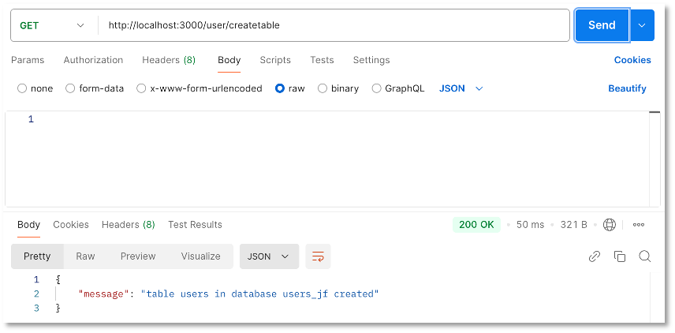
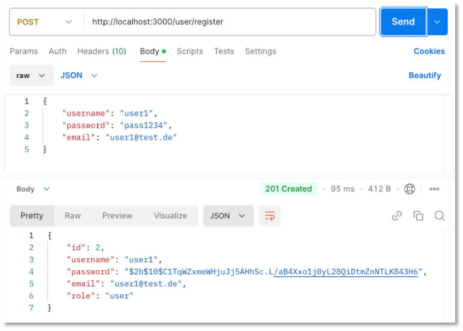
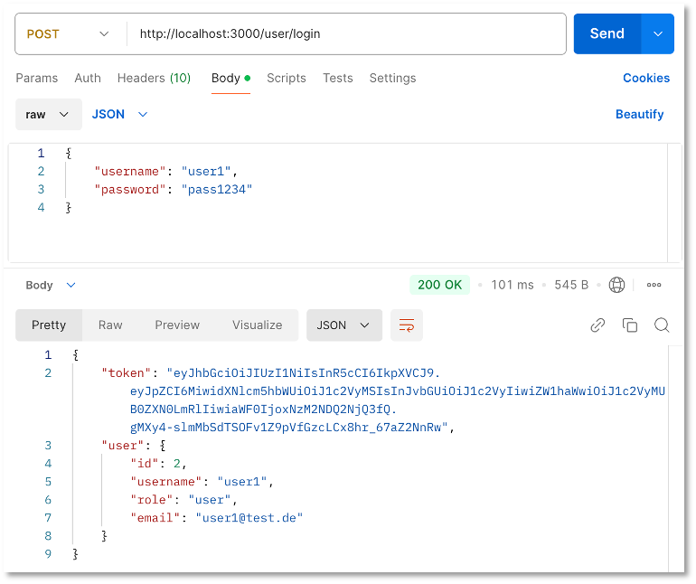
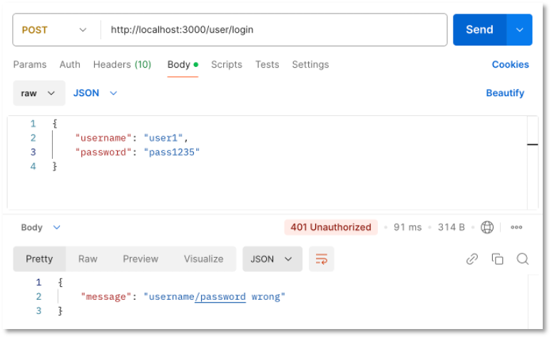
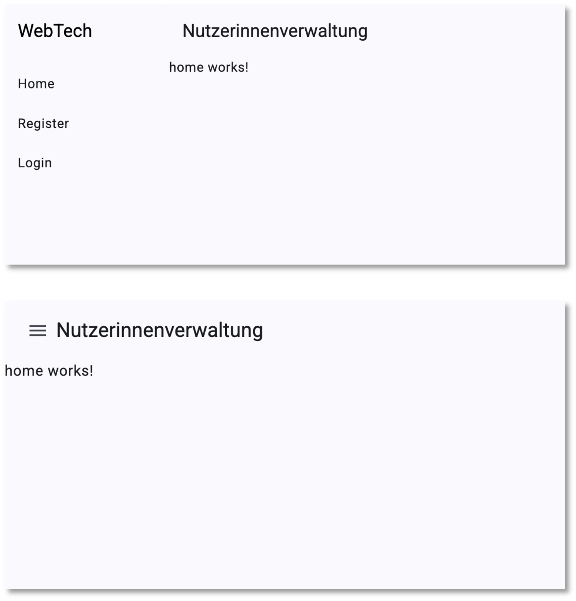
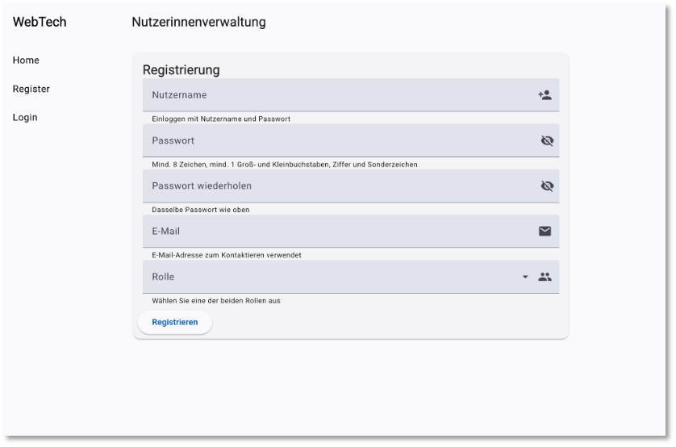
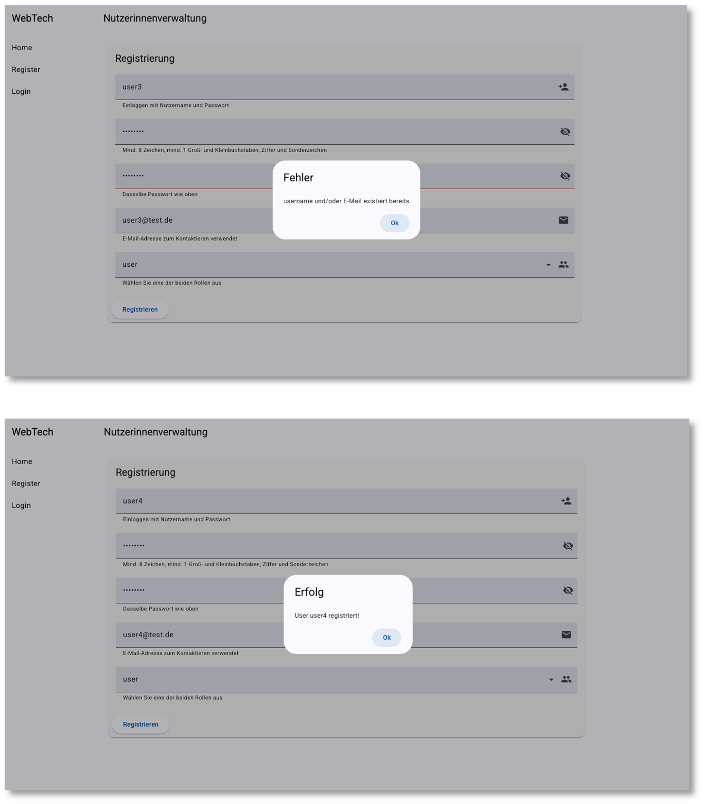
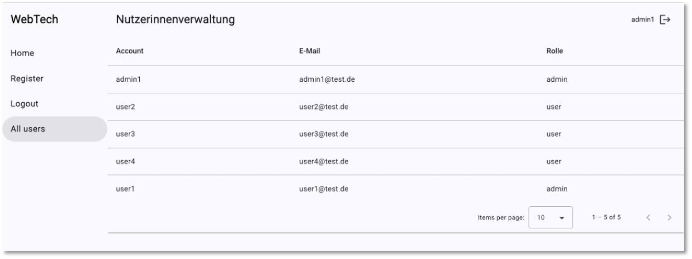
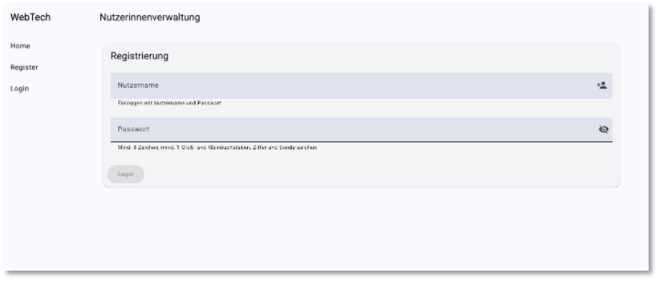

# Subject, Observable, Observer und Guards

Wir wollen am Beispiel einer Nutzerverwaltung die Verwendung von *Subject*, *Observable*, *Observer* und *Guards* demonstrieren. Alle diese Konzepte werden im Frontend verwendet. *Subject*, *Observable*, *Observer* dienen dazu, Werte an *Subscriber* zu propagieren. Eine gute Übersicht über *Subject*, *Observable*, *Observer* bietet die folgende Abbildung ([hier](https://www.tektutorialshub.com/angular/subjects-in-angular) entnommen).


*Subject*, *Observable*, *Observer* finden sich im [RxJS](https://rxjs.dev/)-Paket. [Subject](https://rxjs.dev/guide/subject) hat den großen Vorteil, dass ein (neuer) Wert an viele Subscriber gesendet (*multicast*) werden kann. Wir werden *Subjects* z.B. verwenden, um der `nav`-Komponente mitzuteilen, dass sich eine Nutzerin ein- bzw. ausgelogged hat. Ein *Subject* ist sowohl ein *Observer* als auch ein *Observable*. [Observable]() kann mehrere Werte (nacheinander) *pushen* (an die *Subscriber*). Folgende Tabelle [aus]() gibt einen guten Überblick über die Funktionalität eines *Observable*s.


Ein [Observer](https://rxjs.dev/guide/observer) konsumiert die Werte, die ein [Observable](https://rxjs.dev/guide/observable) liefert. Alle Funktionen des HTTP-Clients sind *Observables*. Sie liefern die Werte vom Backend (mittels einer `next`-Funktion). Mithilfe eines Observers werden wir diese Werte empfangen (`next`, `error`, `complete`).


## Sicherheitskonzepte

- Wir werden in diesem Abschnitt unterschiedliche "Sicherheitskonzepte" umsetzen. Einerseits werden wir die REST-API so gestalten, dass nicht alle Endpunkte frei verfügbar sind, sondern für einige Endpunkte nur dann eine wirksame Funktionalität ausgeführt wird, wenn sich der Aufrufer des Endpunktes als Administrator "ausweisen" kann. Wir werden dazu [JSON Web Tokens](https://jwt.io/) verwenden. 

- Außerdem zeigen wir, wie wir Passworte verschlüsselt in der Datenbank ablegen und wie dann ein Passwort-Vergleich durchgeführt wird. Dazu verwenden wir [bcrypt](https://www.npmjs.com/package/bcrypt).  

- Mithilfe von *Guards* wird die Verwendung von Komponenten im Frontend gesteuert. Eine Komponente soll z.B. nur dann aufgerufen werden können, wenn die Nutzerin eingelogged ist. 

Der letzte Punkt betrifft das Frontend. Die ersten beiden Punkte betreffen das Backend. Damit fangen wir an. 

## Abgesicherte REST-API zur Nutzerverwaltung (Backend)

Folgende Endpunkte soll die REST-API zur Verfügung stellen:

| Endpunkt | Beschreibung | Abgesichert |
|----------|--------------|-------------|
|`GET /user` |gebe alle `user`-Einträge zurück | kann nur durch einen `admin` aufgerufen werden |
|`GET /user/:username` |gibt den `user` mit `username` zurück | kann nur durch einen `admin` aufgerufen werden |
|`POST /user/register` |erstelle einen neuen `user` (`Registrierung`-Funktion)| frei verfügbar, Registrierung jedoch nur als Rolle `user` |
|`POST /user/login` |Prüft, ob `username` existiert und ob das Passwort stimmt (`Login`-Funktion) | frei verfügbar |
|`DELETE /user/:id` |löscht den `user` mit `id == id` |kann nur durch einen `admin` aufgerufen werden |
|`PUT /changepasswaord` |ändert das Passwort einer Nutzerin | frei verfügbar |
|`PUT /setadmin` |setzt die Rolle für eine Nutzerin von `user` auf `admin` | kann nur durch einen `admin` aufgerufen werden |

Wir gehen wie in [REST-API (PostgreSQL)](backend_pg.md#rest-api) vor und erstellen uns ein `Node.js`-Projekt:

```bash
mkdir backend
cd backend
npm init
npm i express 
npm i pg 
npm i dotenv 
npm i cors 
npm i bcrypt
npm i jsonwebtoken
```

Als Einstiegspunkt wählen wir `server.js`. Diese sieht wie folgt aus:

=== "server.js"
	```js linenums="1"
	const express = require('express')
	const cors = require('cors')
	require('dotenv').config()
	const routes = require('./routes')

	const app = express()
	const PORT = 3000

	app.use(express.json())
	app.use(cors())
	app.use('/user', routes)

	app.listen(PORT, (err) => {
	    if(err) {
	        console.log('backend not started', err)
	    } else {
	        console.log(`Server started and listening on port ${PORT} ...`)
	    }
	})
	```

Die Verbindungsdaten zur PostgreSQL-Datenbank stehen in der `.env`-Datei. Die Verbindung zur Datenbank stellen wir im Skript `db.js` her: 

=== ".env"
	```json
	PGUSER=<s05...>
	PGHOST=psql.f4.htw-berlin.de
	PGPASSWORD='ihr_passwort'
	PGDATABASE=<name_der_datenbank_auf_ocean>
	PGPORT=5432
	```

=== "db.js"
	```js
	const pg = require('pg');

	const db = new pg.Client({
	    user: process.env.PGUSER,
	    host: process.env.PGHOST,
	    database: process.env.PGDATABASE,
	    password: process.env.OCEAN_PASSWORD, /* bei Ihnen PGPASSWORD */
	    port: process.env.PGPORT,
	});

	db.connect(err => {
	    if (err) {
	        console.log(err);
	    } else {
	        console.log('Connection to DB ...');
	    }
	});

	module.exports = db;
	```

Für die Endpunkte (Routen) erstellen wir ein Skript `routes.js`:

=== "routes.js"
	```js linenums="1"
	const express = require('express')
	const router = express.Router();
	const bcrypt = require('bcrypt')
	const db = require('./db')
	var jwt = require('jsonwebtoken');

	// call only once at the beginning - creates table users (id, username, password, email, role)
	router.get('/createtable', async(req,res) => {
	    await db.query('DROP TABLE IF EXISTS users; CREATE TABLE users(id serial PRIMARY KEY, username VARCHAR(50), password VARCHAR(255), email VARCHAR(50), role VARCHAR(50));')
	    res.send({ message: `table users in database ${process.env.PGDATABASE} created`})

	})

	/* hier fügen wir im Folgenden die weiteren Endpunkte hinzu */

	module.exports = router;
	```

Wir haben zunächst einen Endpunkt implementiert, den wir einmalig zum Erstellen der Tabelle `users` in der Datenbank benötigen. Wenn wir das Backend mit

```bash
node --watch server.js
```

starten und den Endpunkt `GET localhost:3000/user/createtable` aufrufen (im Browser oder in Postman), dann wird in unserer Datenbank (in meinem Beispiel `users_jf`) eine Tabelle `users` mit den Spalten `id`, `username`, `password`, `email` und `role` erzeugt.



## `Registrierungs`-Endpunkt

Wir fügen unserer `routes.js` folgende Implementierung hinzu:

=== "POST /user/register in routes.js" 
	```js linenums="14"
	// post one user - register as role user
	router.post('/register', async(req, res) => {
	    let username = req.body.username;
	    let password = req.body.password;
	    let hashPassword = await bcrypt.hash(password, 10);
	    console.log('hash : ', hashPassword)
	    let email = req.body.email;

	    let check = await db.query('SELECT * FROM users WHERE email = $1 OR username = $2', [email, username]) 
	    if(check.rowCount > 0) {
	        res.status(401)
	        res.send({ message: `E-Mail ${email} and/or username ${username} already exists`})
	    } else {
	        const query = `INSERT INTO users(username, password, email, role) VALUES ($1, $2, $3, $4) RETURNING *`;

	        let result = await db.query(query, [username, hashPassword, email, 'user']);
	        res.status(201)
	        res.send(result.rows[0])
	    }
	})
	```

Erläuterungen:

- zur Registrierung muss das JSON-Objekt im `body` des `requests` Werte für die Eigenschaften `username`, `password` und `email` enthalten. 

- Die Registrierung wird nur dann vorgenommen, wenn weder `username` noch `email` bereits in der Datenbank enthalten sind. Wenn einer der beiden Werte bereits vorkommt, wird Status-Code `401` gesendet und die Nachricht `E-Mail ${email} and/or username ${username} already exists` (Zeilen `23-26`). 

- Wir verschlüsseln die Passwörter mithilfe von [bcrypt](https://www.npmjs.com/package/bcrypt). Dazu installieren wir uns dieses Paket zunächst mit `npm i bcrypt` (siehe oben). Eingebunden wird es mithilfe von `const bcrypt = require('bcrypt')` (siehe oben).

- In Zeile `18` wird die `hash()`-Funktion von `bcrypt` aufgerufen. Das `password` wird als erster Parameter übergeben. Die `10` ist der Wert für die `saltRounds` und ist der empfohlene Wert. Der `hash` wird erzeugt und als Wert der Variablen `hashPassword` zuegwiesen. Dieser Hash-Wert wird in der Datenbank gespeichert (Zeile `29)`. 



Es bleibt anzumerken, dass aus dem `hash` nicht wieder das Passwort rückerzeugt werden kann. Um sich einzuloggen, muss das einegebene Passwort mit dem `hash` verglichen werden. Dazu stellt `bcrypt` ebenfalls eine Funktion zur Verfügung. Diese verwenden wir beim Login. 

## `Login`-Endpunkt

Eine `Login`-Funktion soll überprüfen, ob ein `username` existiert und ob das dazugehörige `password` korrekt ist. Dazu müssen beide Informationen mit dem *Request* übermittelt werden. Deshalb wird als Anfragemethode `POST` verwendet. Um diesen `POST`-Endpunkt vom vorherigen Endpunkt zu unterscheiden, wird der URL anstelle von `/register` hier `/login` angehängt. 

Die Implementierung dieser Funktion in der `routes.js` könnte wie folgt aussehen:


=== "POST /user/login in routes.js"
	```js linenums="35"
	// post one user - login
	router.post('/login', async(req, res) => {
	    let username = req.body.username;
	    let password = req.body.password;

	    let result = await db.query('SELECT * FROM users WHERE username = $1', [username]) 
	    if(result.rowCount > 0) {
	        const user = result.rows[0];
	        const match = await bcrypt.compare(password, user.password);
	        if(match) {
	            const userWithoutPassword = {id: user.id, username: user.username, role: user.role, email: user.email};
	            const token = jwt.sign(userWithoutPassword, username);
	            res.status(200)
	            res.send({token: token, user: userWithoutPassword })
	        }
	        else {
	            res.status(401)
	            res.send({ message: "username/password wrong"}) /* hier weiß man Passwort falsch */
	        }
	    } else {
	        res.status(401)
	        res.send({ message: "username/password wrong"})     /* hier weiß man, username falsch */
	    }
	})
	```


Erläuterungen: 

- Es wird zunächst geprüft, ob es überhaupt einen passenden `username` in der Datenbank gibt (Zeile `40`). Existiert ein solcher EIntrag nicht, wird HTTP-Status `401` zurückgesendet mit der Meldung `username/password wrong`. Man könnte hier natürlich auch konkreter `username does not exist` zurückgeben, aber zu viele Details bei einem fehlerhaften Login-Versuch sind kein guter Datenschutz.  

- Existiert ein Eintrag für `username`, wird das `password` dieses Eintrages mit dem `password` aus dem *Request* unter Verwendung der `compare()`-Funktion von `bcrypt` miteinander verglichen (Zeile `43`). Sind die Passwärter gleich, ist `match == true`. 

- Für den Fall, dass `match==true` ist, wird die Nutzerin eingelogged. Dafür wird mithilfe des `jsonwebtoken`-Paketes ein solcher `JSON Web Token (jwt)` erzeugt. Dies geschieht mithilfe der `sign()`-Funktion. Der Token enthält die Daten über die Nutzerin (außer das gehashte Passwort) als *payload*. Als Sicherheitsschlüssel wird hier der `username` verwendet (siehe [jsonwebtoken](https://www.npmjs.com/package/jsonwebtoken)). 

- Für den Fall, dass `match==false` ist, stimmte das Passwort nicht. Auch hier geben wir `401` und `username/password wrong` zurück und geben keine weiteren Informationen preis. 





## Read all

Das Auslesen aller Nutzerinnen soll nur einem Nutzer in der Rolle `admin` möglich sein. Wir haben derzeit keine Möglichkeit, einen `admin`-Nutzer zu kreieren. Wir werden zwar später noch einen Endpunkt implementieren, der für eine Nutzerin die Rolle `user` in die Rolle `admin` wechselt, aber auch dies wird nur einem `admin` möglich sein. Wir benötigen also einmalig einen Nutzer in der Rolle `admin` in unserer Tabelle. Diesen können wir entweder über 

- [pgAdmin](https://www.pgadmin.org/) oder
- [psql](https://www.timescale.com/blog/how-to-install-psql-on-mac-ubuntu-debian-windows) 

direkt in die Tabelle mit z.B. `INSERT INTO users(username, password, email, role) VALUES ("admin1", hashPassword, "admin1@test.de", "admin")` einrichten. Das `hasPassword` lässt sich z.B. auf [bcrypt.online](https://bcrypt.online/) erzeugen. Oder wir passen den Endpunkt `GET /user/createtablle` kurz wie folgt an:

```js
// call only once at the beginning - creates table users (id, username, password, email, role)
router.get('/createtable', async(req,res) => {
    const password = await bcrypt.hash('pass1234', 10)
    const query = `INSERT INTO users(username, password, email, role) VALUES ($1, $2, $3, $4);`
    await db.query('DROP TABLE IF EXISTS users;')
    await db.query('CREATE TABLE users(id serial PRIMARY KEY, username VARCHAR(50), password VARCHAR(255), email VARCHAR(50), role VARCHAR(50));')
    await db.query(query, ["admin1", password, "admin1@test.de", "admin"])
    res.send({ message: `table users in database ${process.env.PGDATABASE} created`})
})
```

Dann sollten wir ihn aber nach einmaliger Ausführung auch wieder aus unserem Backend entfernen.

Nun haben wir eine Nutzerin in der `admin`-Rolle und erzeugen beim Einloggen (wie für alle Nutzerinnen beim Einloggen) ein JSON-Web-Token (jwt).

### JSON-Web-Token (JWT)


Über JSON-Web-Tokens (JWT) können Sie sich [hier](https://jwt.io/introduction) und aber auch in dem frei verfügbaren [Handbuch](https://auth0.com/resources/ebooks/jwt-handbook) informieren. JWT ist ein offener [Standard](https://datatracker.ietf.org/doc/html/rfc7519) und dient dem sicheren Informationsaustausch zwischen zwei Parteien. Am häufigsten wird JWT zur Autorisierung, d.h. zur Überprüfung von Zugriffsrechten genutzt. 

!!! info "Autorisierung vs. Authentififizierung"
	Durch **Authentifizierung** wird bestätigt, dass Benutzer diejenigen sind, die sie zu sein vorgeben, während diese Benutzer per **Autorisierung** die Erlaubnis erhalten, auf Ressourcen zuzugreifen.

Um eine Ressource nutzen zu können, autorisiert man den Zugriff mithilfe eines Tokens. Wenn wir einen Endpunkt einer REST-API nutzen wollen, dann senden wir diesen Token im `header` des Requests mit. Zunächst muss der Token jedoch erzeugt werden. Dies passiert beim Login. Wir schauen uns einen solchen Token im Detail an:

Ein JWT besteht aus 

- einem *Header*,
- einem *Paload* und
- einer *Signatur*.

Der *Header* enthält zwei Einträge: den Typ des Tokens (`JWT`) und den Algorithmus, der zum Signieren des Tokens verwendet wird, z.B. [HMAC SH265](https://de.wikipedia.org/wiki/HMAC) oder [RSA](https://de.wikipedia.org/wiki/RSA-Kryptosystem). Ein Beispiel für den *Header*  könnte sein:

```json
{
  "alg": "HS256",
  "typ": "JWT"
}
```

Der *Payload* enthält typischerweise Daten über den Nutzer, z.B.

```json
{
  "username": "muster",
  "email": "muster@test.de",
  "role": "admin"
}
```

Die *Signatur* verschlüsselt den *Header* und den *Payload* mit dem angegebenen Signaturalgorithmus und verwendet dabei ein `secret`. Dieses `secret` kann ein öffentlicher Schlüssel oder einfach ein alphanumerischer String sein. 

Zur Erzeugung und Prüfung von JWT verwenden wir in unserem Backend das [jsonwebtoken](https://www.npmjs.com/package/jsonwebtoken)-Paket. Zur Erzeugung des Tokens stellt dieses Package die Funktion `sign()` zur Verfügung. 

Wir zeigen zunächst nochmal den Code, der beim `Login` zur Erstellung des Tokens führt:

=== "aus POST /user/login"
	```js linenums="48"
    const userWithoutPassword = {id: user.id, username: user.username, role: user.role, email: user.email};
    const token = jwt.sign(userWithoutPassword, username);
    res.status(200)
    res.send({token: token, user: userWithoutPassword })
	```

Wir verwenden darin das `userWithoutPassword`-Objekt als *Payload* des JWT und den `username` als `secret`. Wenn nun ein Endpunkt angesprochen wird, der eine Autorisierung verlangt, prüfen wir folgendes:

=== "Autorisierung mit JWT"
	```js linenums="1"
    /* ------------------ check if caller is admin    ---- start --------------------- */
    console.log('request headers: ', req.headers)
    const token = req.headers['authorization'];
    const callerusername = req.headers['username'];

    if(!token) {
        return res.status(401).send({ message: 'No token provided' });
    }
    try {
        const decoded = jwt.verify(token, callerusername)
        console.log('decoded : ', decoded)

        const check = await db.query('SELECT * FROM users WHERE username=$1', [decoded.username])
        console.log('check ', check)
        if(check.rows[0].role!='admin') {
            return res.status(401).send({ message: 'you are not an admin' });
        }

    } catch(err) {
        return res.status(401).send({ message: 'Invalid token' });
    }
    /* ------------------ check if caller is admin    ---- end --------------------- */
    ```

Erläuterungen:

- In den Zeilen `3` und `4` lesen wir den `token` und den `callerusername` aus, die beide im `header` des *requests* gesendet werden. 

- Wenn im `header` unter dem Schlüssel `authorization` kein `token` gesendet wird, wird die Anfrage mit einer `401`-Response abgelehnt (Zeilen `6-8`).

- Wenn ein `token` verfügbar ist, wird dieser mithilfe der Funktion `verify()` des `jsonwebtoken`-Paketes dekodiert. Dabei wird der `callerusername` als `secret` verwendet (wie beim Signieren). 

- Nun fragen wir in der Datenbank an, ob es sich bei dem `callerusername` um einen `admin` handelt. Das steht zwar auch im *payload* des `token`, kann sich aber in der Zwischenzeit theoretisch geändert haben. 

- Wenn es sich nicht um einen `admin` handelt, wird die Anfrage ebenfalls mit einer `401`-Response abgelehnt (Zeilen `15-17`).

- Falls die `verify()`-Funktion einen Fehler geworfen hat, z.B. weil das `secret` nicht korrekt war, wird ebenfalls die Anfrage mit einer `401`-Response abgelehnt. 

Erst, wenn diese Prüfungen alle erfolgreich absolviert werden, kann der nachfolgende Code ausgeführt werden. Wir werden die oben gezeigt Implementierung nun in jedem Endpunkt voranstellen, der `admin`-Rechte zur Anbfrage benötigt. 


### Read-all-Endpunkt

Der *read-all*-Endpunkt (`GET /user`) sieht demnach so aus:

=== "GET /user"
	```js linenums="63"
	// get all users
	router.get('/', async(req, res) => {

	    /* ------------------ check if caller is admin    ---- start --------------------- */
	    console.log('request headers: ', req.headers)
	    const token = req.headers['authorization'];
	    const callerusername = req.headers['username'];

	    if(!token) {
	        return res.status(401).send({ message: 'No token provided' });
	    }
	    try {
	        const decoded = jwt.verify(token, callerusername)
	        console.log('decoded : ', decoded)

	        const check = await db.query('SELECT * FROM users WHERE username=$1', [decoded.username])
	        console.log('check ', check)
	        if(check.rows[0].role!='admin') {
	            return res.status(401).send({ message: 'you are not an admin' });
	        }

	    } catch(err) {
	        return res.status(401).send({ message: 'Invalid token' });
	    }
	    /* ------------------ check if caller is admin    ---- end --------------------- */

	    /* ------- if caller is admin, then do the following --------------------------- */
	    const query = `SELECT * FROM users `;

	    try {
	        const result = await db.query(query)
	        console.log(res)
	        res.status(200)
	        res.send(result.rows);
	    } catch (err) {
	        console.log(err.stack)
	    }
	});
	```


Abzüglich der Überprüfung des JWT sieht der Endpunkt also so aus, wie wir ihn bereits kennen. Das gilt im Prinzip auch für die folgenden Endpunkte.

### Read one user by username

Im `header` wird hier wieder unter `authorization` der JWT und unter `username` der `callerusername` erwartet. Als Parameter wird der `username` aufgerufen, dessen Daten gesendet werden, falls er existiert.

=== "GET /user/:username"
	```js linenums="103"
	// get one user bei username
	router.get('/:username', async(req, res) => {

	    /* ------------------ check if caller is admin    ---- start --------------------- */
	    console.log('request headers: ', req.headers)
	    const token = req.headers['authorization'];
	    const callerusername = req.headers['username'];

	    if(!token) {
	        return res.status(401).send({ message: 'No token provided' });
	    }
	    try {
	        const decoded = jwt.verify(token, callerusername)
	        console.log('decoded : ', decoded)

	        const check = await db.query('SELECT * FROM users WHERE username=$1', [decoded.username])
	        console.log('check ', check)
	        if(check.rows[0].role!='admin') {
	            return res.status(401).send({ message: 'you are not an admin' });
	        }

	    } catch(err) {
	        return res.status(401).send({ message: 'Invalid token' });
	    }
	    /* ------------------ check if caller is admin    ---- end --------------------- */

	    /* ------- if caller is admin, then do the following --------------------------- */
	    const query = `SELECT * FROM users WHERE username = $1`;

	    try {
	        const username = req.params.username;
	        const result = await db.query(query, [username])
	        if(result.rowCount > 0) {
	            res.status(200)
	            res.send(result.rows[0]);
	        } else {
	            res.status(404)
	            res.send({message: `user with username ${username} does not exist`});
	        }
	    } catch (err) {
	        console.log(err.stack)
	    }
	});
	```


### Change password

Im `body` des Requests wird der `username`, das `oldpassword` und das `newpassword` erwartet. Das `oldpassword` wird mittels `bcrypt.compare()` mit dem in der Datenbank gespeicherten Passwort verglichen. Bei Erfolg, wird das gehashte `newpassword` (`bcrypt.hash()`) in die Datenbank anstelle des alten Passwortes gespeichert. Der Endpunkt benötigt keine Autorisierung.

=== "PUT /user/changepassword"
	```js linenums="147"
	// put ({username, oldpassword, newpassword}) - changepassword
	router.put('/changepassword', async(req, res) => {
	    let username = req.body.username;
	    let oldpassword = req.body.oldpassword;
	    let newpassword = req.body.newpassword;

	    let hashPassword = await bcrypt.hash(newpassword, 10);
	    console.log('hash : ', hashPassword)

	    let result = await db.query('SELECT * FROM users WHERE username = $1', [username]) 
	    if(result.rowCount > 0) {
	        const user = result.rows[0];
	        const match = await bcrypt.compare(oldpassword, user.password);
	        if(match) {
	            const updatequery = `UPDATE users SET 
	            username = $1, 
	            password = $2
	            WHERE username=$3
	            RETURNING *;`;
	        
	            const updateresult = await db.query(updatequery, [username, hashPassword, username]);
	            console.log('updateresult : ', updateresult)
	            res.status(200)
	            res.send(updateresult.rows[0])
	        }
	        else {
	            res.status(401)
	            res.send({ message: "username/password wrong"})
	        }
	    } else {
	        res.status(401)
	        res.send({ message: "username/password wrong"})
	    }
	})
	```


---


## Registrierung und Login (Frontend)

Wir erstellen uns mithilfe von Angular eine kleine Webanwendung, die mindestens eine Regstrierungs- und eine Login-Komponente enthält. Wir wollen dieses Mal [Material Design](https://material.angular.io/) anstelle von Bootstrap als CSS-Framework verwenden. 

Im Terminal geben wir Folgendes ein:

| Terminalbefehl | Beschreibung |
|----------------|--------------|
|`ng new frontend --routing` | erstellt Projekt `frontend` mit Routing |
|`cd frontend` ||
|`ng g c login` | erstellt Komponente `login` |
|`ng g c home` | erstellt Komponente `home` |
|`ng g s shared/auth` | erstellt Service `auth` im Ordner `shared` |
|`ng g i shared/user` | erstellt Interface `user` im Ordner `shared` |
|`ng add @angular/material` | fügt [Material Design](https://material.angular.io/guide/getting-started) hinzu |

Nach dem Hinzufügen von *Material Design* sollte im Terminal ungefähr folgende Ausgabe erscheinen:

```bash
ℹ Using package manager: npm
✔ Found compatible package version: @angular/material@15.0.4.
✔ Package information loaded.

The package @angular/material@15.0.4 will be installed and executed.
Would you like to proceed? Yes
✔ Packages successfully installed.
? Choose a prebuilt theme name, or "custom" for a custom theme: Indigo/Pink        [ Preview: 
https://material.angular.io?theme=indigo-pink ]
? Set up global Angular Material typography styles? Yes
? Include the Angular animations module? Include and enable animations
UPDATE package.json (1105 bytes)
✔ Packages installed successfully.
UPDATE src/app/app.module.ts (654 bytes)
UPDATE angular.json (2844 bytes)
UPDATE src/index.html (576 bytes)
UPDATE src/styles.css (181 bytes)
```

Als `prebuild theme` wurde hier `Indigo/Pink` und sowohl für die `typography styles` als auch für die `animations` wurde `y` ausgewählt.

*Material Design* bietet sogenannte [Schematics](https://material.angular.io/guide/schematics) an. Wir wählen das `navigation`-Schema und geben im Terminal ein:

```bash
ng generate @angular/material:navigation nav
``` 
Es entsteht eine `nav`-Komponente. Außerdem wählen wir das `address-form`-Schema und erstellen damit eine Komponente `register`:

```bash
ng generate @angular/material:address-form register
``` 

Die `app.component.html` ändern wir wie folgt:

=== "app.component.html"
	```html
	<app-nav></app-nav>
	```

Darin wird also nur noch die `nav`-Komponente statisch eingebunden.

Ehe wir an der `nav.component.html` umfangreichere Änderungen vornehmen, defininieren wir zunächst noch folgende Routen:

=== "app-routing.module.ts"
	```js linenums="1" hl_lines="3-5 8-23"
	import { NgModule } from '@angular/core';
	import { RouterModule, Routes } from '@angular/router';
	import { HomeComponent } from './home/home.component';
	import { LoginComponent } from './login/login.component';
	import { RegisterComponent } from './register/register.component';

	const routes: Routes = [
	  {
	    path: "",
	    title: "Home",
	    component: HomeComponent,
	    pathMatch: 'full'
	  },
	  {
	    path: "register",
	    title: "Register",
	    component: RegisterComponent
	  },
	  {
	    path: "login",
	    title: "Login",
	    component: LoginComponent
	  }
	];

	@NgModule({
	  imports: [RouterModule.forRoot(routes)],
	  exports: [RouterModule]
	})
	export class AppRoutingModule { }
	``` 

Nun können wir die `nav.component.html` entsprechend anpassen:

=== "nav.component.html"
	```html linenums="1" hl_lines="8-10 23 26"
	<mat-sidenav-container class="sidenav-container">
	  <mat-sidenav #drawer class="sidenav" fixedInViewport
	      [attr.role]="(isHandset$ | async) ? 'dialog' : 'navigation'"
	      [mode]="(isHandset$ | async) ? 'over' : 'side'"
	      [opened]="(isHandset$ | async) === false">
	    <mat-toolbar>Menu</mat-toolbar>
	    <mat-nav-list>
	      <a mat-list-item [routerLink]="''">Home</a>
	      <a mat-list-item [routerLink]="'register'">Register</a>
	      <a mat-list-item [routerLink]="'login'">Login</a>
	    </mat-nav-list>
	  </mat-sidenav>
	  <mat-sidenav-content>
	    <mat-toolbar color="primary">
	      <button
	        type="button"
	        aria-label="Toggle sidenav"
	        mat-icon-button
	        (click)="drawer.toggle()"
	        *ngIf="isHandset$ | async">
	        <mat-icon aria-label="Side nav toggle icon">menu</mat-icon>
	      </button>
	      <span>Nutzerinnenverwaltung</span>
	    </mat-toolbar>
	    <!-- Add Content Here -->
	    <router-outlet></router-outlet>
	  </mat-sidenav-content>
	</mat-sidenav-container>
	``` 

In den Zeilen `8-10` werden die Menüeinträge geändert und die Verweise auf `routerLinks` geändert. In Zeile `23` wird die Überschrift geändert und in Zeile `26` erscheint der Platzhalter für die per Routing eingebundenen Komponenten. 

Die Anwendung sieht nun wie folgt aus (Desktop- und Mobile-Ansicht):



Die Menüeinträge funktionieren und bei der `register`-Komponente wird bereits ein recht umfangreiches Formular angezeigt (wegen des verwendeten `address-form`-Schemas).

### Registrierung

Wir passen die durch das `address-form`-Schema erstellte `register`-Komponente an. Die Dateien der `register`-Komponente könnten z.B. so aussehen:

=== "register.component.ts"
	```ts linenums="1"
	import { Component } from '@angular/core';
	import { FormControl, FormGroup, Validators } from '@angular/forms';
	import { User } from '../shared/user';

	@Component({
	  selector: 'app-register',
	  templateUrl: './register.component.html',
	  styleUrls: ['./register.component.css']
	})
	export class RegisterComponent {
	  registerForm = new FormGroup({
	    username: new FormControl('', Validators.required),
	    password: new FormControl('', [Validators.required, Validators.minLength(8)]),
	    password2: new FormControl('', [Validators.required, Validators.minLength(8)]),
	    email: new FormControl('', [Validators.required, Validators.email]),
	    role: new FormControl('', Validators.required)
	  });
	  roles = [ "admin", "user"];
	  hide = true;
	  hide2 = true;
	  user!: User;

	  constructor() {}

	  onSubmit(): void {
	    const values = this.registerForm.value;
	    this.user = {
	      username: values.username!,
	      password: values.password!,
	      email: values.email!,
	      role: values.role!
	    };
	    console.log(this.user)
	  }
	}
	```

=== "register.component.html"
	```html linenums="1"
	<form [formGroup]="registerForm" novalidate (ngSubmit)="onSubmit()">
	  <mat-card class="shipping-card">
	    <mat-card-header>
	      <mat-card-title>Registrierung</mat-card-title>
	    </mat-card-header>
	    <mat-card-content>

	      <div class="row">
	        <div class="col">
	          <mat-form-field hintLabel="Einloggen mit Nutzername und Passwort" class="full-width">
	            <input matInput placeholder="Nutzername" formControlName="username">
	            <mat-icon matSuffix >person_add</mat-icon>
	            <mat-error *ngIf="registerForm.controls['username'].hasError('required')">
	              Nutzername <strong>erforderlich</strong>
	            </mat-error>
	          </mat-form-field>
	        </div>
	      </div>
	      <div class="row">
	        <div class="col">
	          <mat-form-field hintLabel="Mind. 8 Zeichen, mind. 1 Groß- und Kleinbuchstaben, Ziffer und Sonderzeichen" class="full-width">
	            <input matInput [type]="hide ? 'password' : 'text'" placeholder="Passwort" formControlName="password">
	            <button mat-icon-button matSuffix (click)="hide = !hide" [attr.aria-label]="'Hide password'" [attr.aria-pressed]="hide">
	              <mat-icon>{{hide ? 'visibility_off' : 'visibility'}}</mat-icon>
	            </button>
	            <mat-error *ngIf="registerForm.controls['password'].hasError('required')">
	              Passwort <strong>erforderlich</strong>
	            </mat-error>
	          </mat-form-field>
	        </div>
	      </div>
	      <div class="row">
	        <div class="col">
	          <mat-form-field hintLabel="Dasselbe Passwort wie oben" class="full-width">
	            <input matInput  [type]="hide2 ? 'password' : 'text'" placeholder="Passwort wiederholen" formControlName="password2">
	            <button mat-icon-button matSuffix (click)="hide2 = !hide2" [attr.aria-label]="'Hide password'" [attr.aria-pressed]="hide">
	              <mat-icon>{{hide2 ? 'visibility_off' : 'visibility'}}</mat-icon>
	            </button>
	            <mat-error *ngIf="registerForm.controls['password2'].hasError('required')">
	              Wiederholung Passwort <strong>erforderlich</strong>
	            </mat-error>
	          </mat-form-field>
	        </div>
	      </div>

	      <div class="row">
	        <div class="col">
	          <mat-form-field hintLabel="E-Mail-Adresse zum Kontaktieren verwendet" class="full-width">
	            <input matInput placeholder="E-Mail" formControlName="email">
	            <mat-icon matSuffix>email</mat-icon>
	            <mat-error *ngIf="registerForm.controls['email'].hasError('required')">
	              E-Mail-Adresse <strong>erforderlich</strong>
	            </mat-error>
	          </mat-form-field>
	        </div>
	      </div>
	      <div class="row">
	        <div class="col">
	          <mat-form-field hintLabel="Wählen Sie eine der beiden Rollen aus" class="full-width">
	            <mat-select placeholder="Rolle" formControlName="role">
	              <mat-option *ngFor="let role of roles" [value]="role">
	                {{ role }}
	              </mat-option>
	            </mat-select>
	            <mat-icon matSuffix>group</mat-icon>
	            <mat-error *ngIf="registerForm.controls['role'].hasError('required')">
	              Rolle <strong>erforderlich</strong>
	            </mat-error>
	          </mat-form-field>
	        </div>
	      </div>

	    </mat-card-content>
	    <mat-card-actions>
	      <button mat-raised-button color="primary" type="submit">Registrieren</button>
	    </mat-card-actions>
	  </mat-card>
	</form>

	```

=== "register.component.css"
	```css linenums="1"
	.full-width {
	  width: 100%;
	}

	.shipping-card {
	  min-width: 120px;
	  max-width: 80%;
	  margin-left: auto;
	  margin-right: auto;
	  margin: 3% auto;
	}

	.mat-radio-button {
	  display: block;
	  margin: 5px 0;
	}

	.row {
	  display: flex;
	  flex-direction: row;
	}

	.col {
	  flex: 1;
	  margin-right: 20px;
	}

	.col:last-child {
	  margin-right: 0;
	}

	```

Das ergibt folgende Ansicht:



### Service verwenden

In dem `auth`-Service binden wir das Backend an und nutzen bspw. die im Registrierungsformular eingegebenen Daten, um die Nutzerin zu registrieren. 

!!! warning "Achtung!"

	Nicht vergessen, das `HttpClientModule` in der `app.module.ts` zu importieren (unter `imports` eintragen und `import { HttpClientModule } from '@angular/common/http';` einfügen lassen)!

	Wichtig ist auch, dass das Backend läuft!

Der Service könnte z.B. so aussehen:

=== "auth.service.js"
	```js linenums="1"
	import { HttpClient } from '@angular/common/http';
	import { Injectable } from '@angular/core';
	import { Observable } from 'rxjs';
	import { User } from './user';

	@Injectable({
	  providedIn: 'root'
	})
	export class AuthService {
	  baseUrl = 'http://localhost:3000';

	  constructor(private http: HttpClient) { }

	  getAllUsers(): Observable<User[]>{
	    return this.http.get<User[]>(this.baseUrl + '/users');
	  }

	  registerUser(user:User): Observable<any> {
	    return this.http.post(this.baseUrl + '/users/register', user);
	  }
	}
	```

und die `submit()`-Funktion in der `register.component.ts` könnte zunächst wie folgt erweitert werden:

```js linenums="26"
  onSubmit(): void {
    const values = this.registerForm.value;
    this.user = {
      username: values.username!,
      password: values.password!,
      email: values.email!,
      role: values.role!
    };
    console.log(this.user)
    this.auth.registerUser(this.user).subscribe({
        next: (response) => console.log('response', response),
        error: (err) => console.log(err),
        complete: () => console.log('register completed')
    });
  }
```

Wenn nun das Registrierungsformular vollständig ausgefüllt wird und weder `username` noch `email` bereits in der Datenbank existieren, wird ein neuer Datensatz in der Datenbank angelegt. Die neue Nutzerin ist registriert. Wenn jedoch der `username` und/oder die `email` bereits existier(t/en), wird nicht die `next`-Eigenschaft des Observers aufgerufen, sondern die `error`-Eigenschaft. Das heißt, entweder gibt es unter `next` eine `response`, nämlich den neu angelegten `user` oder es gibt unter `error` ein Fehlerobjekt, welches selbst eine `error`-Eigenschaft hat (mit `{ error: 'username and/or email exist(s)'}`) und dessen Status `400` ist. 

### Modaler Dialog zur Bestätigung

Derzeit gibt es keine Rückmeldung darüber, ob die neue Nutzerin registriert wurde oder nicht. Wir wollen dazu einen modalen Dialog öffnen, der die entsprechenden Informationen zur Verfügung stellt. Dieser Dialog wird eine Komponente. Da diese Komponente jedoch ausschließlich von der Registrierungskomponente verwendet wird, erstellen wir sie als *Kindkomponente* der Registrierungskomponente. Wir werden dabei insbesondere lernen, wie wir Daten von Elternkomponenten an Kindkomponenten weiterleiten können. 

Zunächst erstellen wir die (Kind-)Komponente `confirm`:

```bash
ng g c register/confirm
```

Unter dem Ordner `register` entsteht ein weiterer Ordner `confirm`, der die `.html`, `.ts` und `.css` der Kindkomponente `confirm` enthält. Wir verwenden [Dialog](https://material.angular.io/components/dialog/overview) von Material Design. Wir gehen vor, wie in [Dialog Examples](https://material.angular.io/components/dialog/examples) gezeigt. Beachten Sie, dass Sie in `app.module.ts` das Modul `MatDialogModule` (aus `@angular/material/dialog`) importieren müssen!

=== "register.component.ts"
	```js linenums="1" hl_lines="4 8-11 45 49 56-58"
	import { ConfirmComponent } from './confirm/confirm.component';
	import { Component } from '@angular/core';
	import { FormControl, FormGroup, Validators } from '@angular/forms';
	import { MatDialog } from '@angular/material/dialog';
	import { AuthService } from '../shared/auth.service';
	import { User } from '../shared/user';

	export interface DialogData {
	  headline: string;
	  info: string;
	}

	@Component({
	  selector: 'app-register',
	  templateUrl: './register.component.html',
	  styleUrls: ['./register.component.css']
	})
	export class RegisterComponent {
	  registerForm = new FormGroup({
	    username: new FormControl('', Validators.required),
	    password: new FormControl('', [Validators.required, Validators.minLength(8)]),
	    password2: new FormControl('', [Validators.required, Validators.minLength(8)]),
	    email: new FormControl('', [Validators.required, Validators.email]),
	    role: new FormControl('', Validators.required)
	  });
	  roles = [ "admin", "user"];
	  hide = true;
	  hide2 = true;
	  user!: User;

	  constructor(private auth: AuthService, public dialog: MatDialog) {}

	  onSubmit(): void {
	    const values = this.registerForm.value;
	    this.user = {
	      username: values.username!,
	      password: values.password!,
	      email: values.email!,
	      role: values.role!
	    };
	    console.log(this.user)
	    this.auth.registerUser(this.user).subscribe({
	        next: (response) => {
	          console.log('response', response)
	          this.openDialog({ headline: "Erfolg", info: "User " + response.username + " registriert!" });
	        },
	        error: (err) => {
	          console.log('error', err.error.error)
	          this.openDialog({ headline: "Fehler", info: "username und/oder E-Mail existiert bereits" });
	        },
	        complete: () => console.log('register completed')
	    });

	  }

	    openDialog(data: DialogData) {
	      this.dialog.open(ConfirmComponent, { data });
	  }
	}

	```

=== "confirm.component.ts"
	```js linenums="1" 
	import { Component, Inject } from '@angular/core';
	import { MAT_DIALOG_DATA} from '@angular/material/dialog';
	import { DialogData } from '../register.component';

	@Component({
	  selector: 'app-confirm',
	  templateUrl: './confirm.component.html',
	  styleUrls: ['./confirm.component.css']
	})
	export class ConfirmComponent {
	  constructor(@Inject(MAT_DIALOG_DATA) public data: DialogData) {}
	}
	```

=== "confirm.component.html"
	```html linenums="1" 
	<h1 mat-dialog-title>{{ data.headline }}</h1>
	<div mat-dialog-content>
	  {{ data.info }}
	</div>
	<div mat-dialog-actions>
	  <button mat-button mat-dialog-close cdkFocusInitial>Ok</button>
	</div>
	```

Wenn nun die Registrierung erfolgreich war, erscheint ein entsprechender modaler Dialog und ebenso, wenn die Registrierung nicht erfolgt ist:




## Guards

Mithilfe von [Guards](https://angular.io/guide/router-tutorial-toh#milestone-5-route-guards) können wir festlegen, dass Komponenten z.B. nur dann aufgerufen werden können, wenn man eingelogged ist (aber nicht, wenn man nicht eingelogged ist) oder wenn man z.B. als `admin` eingelogged (und nicht nur als `user`) eingelogged ist. Wir werden hier demonstrieren, wie man solche Guards implementiert und verwendet. Dazu erstellen wir uns zunächst eine weitere Komponente. Die Komponente `userlist` soll alle `user` aus der Datenbank auflisten (als Tabelle). Diese Komponente soll nur aufgerufen werden können, wenn man als `admin` eingelogged ist. Außerdem werden wir den Aufruf der `HomeComponent` nur für den Fall erlauben, dass man eingelogged ist.

### `userlist`-Komponente

Die `userlist`-Komponente erstellen wir mithilfe des Material-Design-Schemas [table](https://material.angular.io/guide/schematics#table-schematic):

```bash
ng generate @angular/material:table userlist
```

Für das vereinfachte Beispiel hier haben wir jedoch die z.B. die [Paginierung](https://material.angular.io/components/table/overview#pagination) weggelassen. Viele Beispiele zu Tabellen mit Sortierung, Filterung, Paginierung usw. finden Sie [hier](https://material.angular.io/components/table/overview).

=== "userlist.component.ts"
	```js linenums="1"
	import { Component, OnInit } from '@angular/core';
	import { AuthService } from '../shared/auth.service';
	import { User } from '../shared/user';

	@Component({
	  selector: 'app-userlist',
	  templateUrl: './userlist.component.html',
	  styleUrls: ['./userlist.component.css']
	})
	export class UserlistComponent implements OnInit {

	  users: User[] = [];

	  /** Columns displayed in the table. Columns IDs can be added, removed, or reordered. */
	  displayedColumns = ['username', 'email', 'role'];

	  constructor(private auth: AuthService) {

	  }
	  ngOnInit(): void {
	    this.auth.getAllUsers().subscribe({
	      next: (response) => {
	        this.users = response;
	        console.log('this.users', this.users)
	      }
	    })
	  }

	}
	```

=== "userlist.component.html"
	```html linenums="1"
	<div class="mat-elevation-z8">
	  <table mat-table class="full-width-table" [dataSource]="users" aria-label="Elements">
	    <!-- username Column -->
	    <ng-container matColumnDef="username">
	      <th mat-header-cell *matHeaderCellDef>Nutzername</th>
	      <td mat-cell *matCellDef="let user">{{user.username}}</td>
	    </ng-container>

	    <!-- email Column -->
	    <ng-container matColumnDef="email">
	      <th mat-header-cell *matHeaderCellDef>E-Mail</th>
	      <td mat-cell *matCellDef="let user">{{user.email}}</td>
	    </ng-container>

	    <!-- role Column -->
	    <ng-container matColumnDef="role">
	      <th mat-header-cell *matHeaderCellDef>Rolle</th>
	      <td mat-cell *matCellDef="let user">{{user.role}}</td>
	    </ng-container>

	    <tr mat-header-row *matHeaderRowDef="displayedColumns"></tr>
	    <tr mat-row *matRowDef="let user; columns: displayedColumns;"></tr>
	  </table>

	  <mat-paginator #paginator
	      [length]="users.length"
	      [pageIndex]="0"
	      [pageSize]="10"
	      [pageSizeOptions]="[5, 10, 20]"
	      aria-label="Select page">
	  </mat-paginator>
	</div>

	```

Die Tabelle sieht dann wie folgt aus:




### Guard für den Komponentenzugriff - Logged in

In [Routen absichern mit Guards](routing.md#routen-absichern-mit-guards) haben wir bereits die Grundidee von *Guards* vorgestellt. Wir wollen diese hier anwenden und beschränken uns dabei auf den *Guard-Typ* `CanActivate`. Wir wollen sicherstellen, dass die `HomeComponent` nur aktiviert werden kann, wenn man eingelogged ist und die `RegisterComponent` nur dann, wenn man als `admin` eingelogged ist, um das Prinzip zu verdeutlichen. Wir erstellen uns also einen `CanActivate`-Guard (im Ordner `guards`):

```bash
ng g guard shared/authguard --implements CanActivate
```

Diesen `AuthGuard` implementieren wir wie folgt: 

=== "shared/authguard.guards.ts"
    ```js linenums="1"
    import { Injectable } from '@angular/core';
    import { ActivatedRouteSnapshot, CanActivate, Router, RouterStateSnapshot, UrlTree } from '@angular/router';
    import { AuthService } from './auth.service';

    @Injectable({
      providedIn: 'root'
    })
    export class AuthguardGuard implements CanActivate {

      constructor(
        private as: AuthService,
        private router: Router
      ) {}

      canActivate(
        route: ActivatedRouteSnapshot,
        state: RouterStateSnapshot): boolean | UrlTree {
        return this.as.isLoggedin()
          ? true
          : this.router.parseUrl('/login');
      }

    }
    ```

Dieser *Guard* gibt bei Aufruf der `canActivate()`-Funktion ein `true` zurück, wenn eine Nutzerin eingelogged ist (`isLoggedin()` aus dem `AuthService`). Wenn niemand eingelogged ist, (wenn also `isLoggedin()` ein `false` zurückgibt), dann wird die aktuelle Route nach `/login` umgeleitet. Die Funktion `isLoggedin()` sieht im `auth.service.ts` wie folgt aus (außerdem erweitern wir den Service gleich noch um einige weitere nützliche Funktionen):

=== "shared/auth.service.ts"
	```js linenums="1"
	import { HttpClient } from '@angular/common/http';
	import { Injectable } from '@angular/core';
	import { Observable } from 'rxjs';
	import { User } from './user';

	@Injectable({
	  providedIn: 'root'
	})
	export class AuthService {
	  baseUrl = 'http://localhost:3000';
	  user!: User | null;
	  loggedIn = false;

	  constructor(private http: HttpClient) { }

	  getAllUsers(): Observable<User[]>{
	    return this.http.get<User[]>(this.baseUrl + '/users');
	  }

	  getOneUser(username: string): Observable<User>{
	    return this.http.get<User>(this.baseUrl + '/users/' + username);
	  }

	  registerUser(user:User): Observable<any> {
	    return this.http.post(this.baseUrl + '/users/register', user);
	  }

	  isLoggedin(): boolean {
	    return this.loggedIn;
	  }
	  
	  loginUser(username: string, password: string ): Observable<any>{
	    return this.http.post(this.baseUrl + '/users/login/', { username: username, password: password }, {observe: 'response'});
	  }

	  logout(): void {
	    this.loggedIn = false;
	    this.user = null;
	  }

	  getUser(): User | null {
	    return this.user;
	  }

	  isAdmin(): boolean {
	    if(this.user?.role === 'admin')
	    {
	      return true;
	    }
	    return false;
	  }

	  isUser(): boolean {
	    if(this.user?.role === 'user')
	    {
	      return true;
	    }
	    return false;
	  }
	}

	```

Beachten Sie, dass der `post()`-Funktion in `loginUser()` noch die Option `observe: 'response'` hinzugefügt wurde, um die gesamte Response zu erhalten und nicht nur den `body` als `json`. Das gibt uns die Möglichkeit, den `status` der Response auszuwerten. Schauen Sie sich dazu auch den `POST /users/login`-Endpunkt im Backend an. Der schickt verschiedene Status zurück, je nachdem, ob das Login erfolgreich war (`201`) oder nicht (`204` bzw. `400`). 

In der `RegisterComponent` können wir nun auch noch die `login()`-Funktion des Services aufrufen, wenn die Registrierung erfolgreich war:

=== "register.component.ts"
	```js linenums="33" hl_lines="13-14"
	  onSubmit(): void {
    const values = this.registerForm.value;
    this.user = {
      username: values.username!,
      password: values.password!,
      email: values.email!,
      role: values.role!
    };
    console.log(this.user)
    this.auth.registerUser(this.user).subscribe({
        next: (response) => {
          console.log('response', response)
          this.user = response;
          this.auth.login(this.user)
          this.openDialog({ headline: "Erfolg", info: "User " + response.username + " registriert!" });
        },
        error: (err) => {
          console.log('error', err.error.error)
          this.openDialog({ headline: "Fehler", info: "username und/oder E-Mail existiert bereits" });
        },
        complete: () => console.log('register completed')
    });
    ```

Wir fügen diesen Guard nun in die `app-routing.module.ts` ein:

=== "app-routing.module.ts"
    ```js linenums="1" hl_lines="6 15"
	import { NgModule } from '@angular/core';
	import { RouterModule, Routes } from '@angular/router';
	import { HomeComponent } from './home/home.component';
	import { LoginComponent } from './login/login.component';
	import { RegisterComponent } from './register/register.component';
	import { AuthguardGuard } from './shared/authguard.guard';
	import { UserlistComponent } from './userlist/userlist.component';

	const routes: Routes = [
	  	{
		    path: "",
		    title: "Home",
		    component: HomeComponent,
		    pathMatch: 'full',
	      	canActivate: [AuthguardGuard]
		},
		{
		    path: "register",
		    title: "Register",
		    component: RegisterComponent
		},
		{
		    path: "login",
		    title: "Login",
		    component: LoginComponent
		},
		{
		    path: "users",
		    title: "All Users",
		    component: UserlistComponent
		}
	];

	@NgModule({
	  imports: [RouterModule.forRoot(routes)],
	  exports: [RouterModule]
	})
	export class AppRoutingModule { }

    ```

Wenn wir nun die Anwendung öffnen, dann kommen wir gar nicht auf `HomeComponent`, sondern werden stets zur `LoginComponent` geleitet. Erst wenn wir eingelogged sind, ist die `HomeComponent` erreichbar. 

### Login-Komponente

Ehe wir noch einen weiteren Guard zur Erkennung implementieren, ob wir als `admin` eingelogged sind oder nicht, implementieren wir der Vollständigkeit halber noch die Login-Komponente.

=== "login.component.ts"
	```js linenums="1"
	import { Component } from '@angular/core';
	import { FormBuilder, Validators } from '@angular/forms';
	import { Router } from '@angular/router';
	import { AuthService } from '../shared/auth.service';

	@Component({
	  selector: 'app-login',
	  templateUrl: './login.component.html',
	  styleUrls: ['./login.component.css']
	})
	export class LoginComponent {
	  hide = true;

	  loginForm = this.fb.group({
	    username: [null, Validators.required],
	    password: [null, Validators.required]
	  });

	  constructor(private fb: FormBuilder, private auth: AuthService, private router: Router) {}

	  onSubmit(): void {
	    const values = this.loginForm.value;
	    const username = values.username;
	    const password =  values.password;
	    console.log('values username', username)
	    console.log('values password', password)

	    this.auth.loginUser(username!, password!).subscribe({
	       next: (response) => {
	          console.log('login response',response);
	          if(response.status == 201)
	          {
	            this.auth.getOneUser(username!).subscribe(
	              (response) => {
	                  this.auth.login(response);
	                  this.router.navigate(['/home'])
	              }
	            )
	          } else {
	            console.log('kein Login - Nutzername und/oder Passwort stimmen nicht')
	          }
	      },
	      error: (err) => {
	        console.log('login error',err);
	      },
	      complete: () => console.log('login completed')
	    }
	    )

	  }
	}

	```

=== "login.component.html"
	```html linenums="1"
	<form [formGroup]="loginForm" novalidate (ngSubmit)="onSubmit()">
	  <mat-card class="shipping-card">
	    <mat-card-header>
	      <mat-card-title>Login</mat-card-title>
	    </mat-card-header>
	    <mat-card-content>
	      <p>
	        <mat-form-field class="full-width">
	          <mat-label>Nutzername</mat-label>
	          <input matInput placeholder="Nutzername" formControlName="username">
	          <mat-icon matSuffix>person</mat-icon>
	          <mat-error *ngIf="loginForm.controls['username'].hasError('required')">
	            Nutzername <strong>erforderlich</strong>
	          </mat-error>
	        </mat-form-field>
	      </p>
	      <p>
	        <mat-form-field class="full-width" >
	          <mat-label>Passwort</mat-label>
	          <input matInput placeholder="Passwort" formControlName="password" [type]="hide ? 'password' : 'text'">
	          <button mat-icon-button matSuffix (click)="hide = !hide" [attr.aria-label]="'Hide password'"
	            [attr.aria-pressed]="hide">
	            <mat-icon>{{hide ? 'visibility_off' : 'visibility'}}</mat-icon>
	          </button>
	        </mat-form-field>
	      </p>
	    </mat-card-content>
	    <mat-card-actions>
	      <button mat-raised-button color="primary" type="submit">Login</button>
	    </mat-card-actions>
	  </mat-card>
	</form>

	```

=== "login.component.css"
	```css linenums="1"
	mat-card {
	  margin: 5% 20%;
	}

	.full-width {
	  width: 100%;
	}

	mat-card-header {
	  margin-bottom: 3%;
	}
	```

Das ergibt folgende Ansicht:



Wenn das Login erfolgreich war, wird direkt die `home`-Komponente aufgerufen. Ist das Login nicht erfolgreich, wird bei der Login-Komponente verblieben. Es erfolgt nur eine Nachricht auf der Konsole - hier könnte (sollte!) natürlich auch ein modaler Dialog erscheinen, wie bei der Registrierung.


### Guard für den Komponentenzugriff - `admin`


Wir erstellen noch einen weiteren Guard, um auch abzuprüfen, ob wir als `admin` eingelogged sind und wollen mit diesem Guard die `UserlistComponent` sichern, d.h. diese Komponente soll nur aufgerufen werden dürfen, wenn die eingeloggte Nutzerin die Rolle `admin` besitzt (nicht `user`). 

```bash
ng g guard shared/adminguard --implements CanActivate
```

=== "shared/adminguard.guards.ts"
    ```js linenums="1"
	import { Injectable } from '@angular/core';
	import { ActivatedRouteSnapshot, CanActivate, Router, RouterStateSnapshot, UrlTree } from '@angular/router';
	import { AuthService } from './auth.service';

	@Injectable({
	  providedIn: 'root'
	})
	export class AdminguardGuard implements CanActivate {

	  constructor(
	    private auth: AuthService,
	    private router: Router
	  ) {}

	  canActivate(
	    route: ActivatedRouteSnapshot,
	    state: RouterStateSnapshot): boolean | UrlTree {
	    return this.auth.isAdmin()
	      ? true
	      : this.router.parseUrl('');
	  }

	}

    ```

Dieses Mal wird geprüft, ob die Nutzerin eingelogged **und** in der `admin`-Rolle ist. Diesen Guard fügen wir der `/users`-Route hinzu (also für die `UserlistComponent)`. Nur ein `admin` darf alle Nutzerinnen sehen (wird hier exemplarisch angenommen).


=== "app-routing.module.ts"
    ```js linenums="1" hl_lines="3 11 20"
	import { NgModule } from '@angular/core';
	import { RouterModule, Routes } from '@angular/router';
	import { HomeComponent } from './home/home.component';
	import { LoginComponent } from './login/login.component';
	import { RegisterComponent } from './register/register.component';
	import { AdminguardGuard } from './shared/adminguard.guard';
	import { AuthguardGuard } from './shared/authguard.guard';
	import { UserlistComponent } from './userlist/userlist.component';

	const routes: Routes = [
	  	{
		    path: "",
		    title: "Home",
		    component: HomeComponent,
		    pathMatch: 'full',
	      canActivate: [AuthguardGuard]
		  },
	    { path: 'home',   redirectTo: ''},
		  {
		    path: "register",
		    title: "Register",
		    component: RegisterComponent
		  },
		  {
		    path: "login",
		    title: "Login",
		    component: LoginComponent
		  },
		  {
		    path: "users",
		    title: "All Users",
		    component: UserlistComponent,
	      canActivate: [AdminguardGuard]
		  },
	    { path: '**',   redirectTo: '/home'}
	];

	@NgModule({
	  imports: [RouterModule.forRoot(routes)],
	  exports: [RouterModule]
	})
	export class AppRoutingModule { }

    ```

Wenn nun eine `admin`-Userin eingelogged ist, kann sie alle Komponenten öffnen. Ist eine `user`-Userin eingelogged, hat sie keinen Zugriff auf die `UserlistComponent`, aber auf alle anderen Komponenten. Ist niemand eingelogged, kann nur die `Login`- und die `RegisterComponent` verwendet werden. 

### Subjects für Login/Logout

Wir wollen in der `nav`-Komponente ein Login-Icon eintegrieren, wenn keine Nutzerin eingelogged ist bzw. den Nutzernamen der eingeloggten Nutzerin. Die `nav`-Komponente muss also darüber informiert werden, wenn sich eine Nutzerin einlogged bzw. auslogged. Dazu verwenden wir [Subjects](https://rxjs.dev/guide/subject).

Wir erweitern dazu den `AuthService`:

=== "auth.service.ts"
	```js linenums="1" hl_lines="3 12-15 18-23 48 50 56 58"
	import { HttpClient } from '@angular/common/http';
	import { Injectable } from '@angular/core';
	import { Observable, Subject } from 'rxjs';
	import { User } from './user';

	@Injectable({
	  providedIn: 'root'
	})

	export class AuthService {
	  baseUrl = 'http://localhost:3000';
	  user: User = {username: '', password: '', email: '', role: ''};
	  userChange: Subject<User> = new Subject<User>();
	  loggedIn = false;
	  loggedInChange: Subject<boolean> = new Subject<boolean>();

	  constructor(private http: HttpClient) {
	    this.loggedInChange.subscribe((value) => {
	            this.loggedIn = value
	    });
	    this.userChange.subscribe((value) => {
	            this.user = value
	    });
	  }

	  getAllUsers(): Observable<User[]>{
	    return this.http.get<User[]>(this.baseUrl + '/users');
	  }

	  getOneUser(username: string): Observable<User>{
	    return this.http.get<User>(this.baseUrl + '/users/' + username);
	  }

	  registerUser(user:User): Observable<any> {
	    return this.http.post(this.baseUrl + '/users/register', user);
	  }

	  loginUser(username: string, password: string ): Observable<any>{
	    return this.http.post(this.baseUrl + '/users/login/', { username: username, password: password }, {observe: 'response'});
	  }

	  isLoggedin(): boolean {
	    return this.loggedIn;
	  }

	  login(user: User): void {
	    this.loggedIn = true
	    this.loggedInChange.next(this.loggedIn);
	    this.user = user;
	    this.userChange.next(this.user);
	    console.log('login() : ', this.user);
	  }

	  logout(): void {
	    this.loggedIn = false;
	    this.loggedInChange.next(this.loggedIn);
	    this.user = {username: '', password: '', email: '', role: ''};
	    this.userChange.next(this.user);
	  }

	  isAdmin(): boolean {
	    if(this.user?.role === 'admin')
	    {
	      return true;
	    }
	    return false;
	  }

	  isUser(): boolean {
	    if(this.user?.role === 'user')
	    {
	      return true;
	    }
	    return false;
	  }
	}

	```

Wir haben nun *Subjects*, die darüber informieren (`next()`), wenn sich ein bestimmter Wert ändert. In der `NavComponent` melden wir uns an diese *Subjects* an (`subscribe`):

=== "nav.component.ts"
	```js linenums="1" hl_lines="25 28"
	import { Router } from '@angular/router';
	import { Component } from '@angular/core';
	import { BreakpointObserver, Breakpoints } from '@angular/cdk/layout';
	import { Observable } from 'rxjs';
	import { map, shareReplay } from 'rxjs/operators';
	import { AuthService } from '../shared/auth.service';
	import { User } from '../shared/user';

	@Component({
	  selector: 'app-nav',
	  templateUrl: './nav.component.html',
	  styleUrls: ['./nav.component.css']
	})
	export class NavComponent {
	  isLoggedIn = false;
	  username: string = '';

	  isHandset$: Observable<boolean> = this.breakpointObserver.observe(Breakpoints.Handset)
	    .pipe(
	      map(result => result.matches),
	      shareReplay()
	    );

	  constructor(private breakpointObserver: BreakpointObserver, private auth: AuthService, private router: Router) {
	    this.auth.loggedInChange.subscribe( value => {
	      this.isLoggedIn = value
	      if(this.isLoggedIn) {
	        this.auth.userChange.subscribe( val => {
	          console.log('nav user', val)
	          this.username = val?.username;
	          console.log('nav username', this.username)
	        })

	      }
	    })
	  }

	  callLogin() {
	    this.router.navigate(['/login'])
	  }

	  callLogout() {
	    this.isLoggedIn = false;
	    this.auth.logout();
	    this.router.navigate(['/login'])
	  }

	}

	```

=== "nav.component.html"
	```html linenums="1" hl_lines="25-33"
	<mat-sidenav-container class="sidenav-container">
	  <mat-sidenav #drawer class="sidenav" fixedInViewport
	      [attr.role]="(isHandset$ | async) ? 'dialog' : 'navigation'"
	      [mode]="(isHandset$ | async) ? 'over' : 'side'"
	      [opened]="(isHandset$ | async) === false">
	    <mat-toolbar>Menu</mat-toolbar>
	    <mat-nav-list>
	        <a mat-list-item [routerLink]="''">Home</a>
	        <a mat-list-item [routerLink]="'register'">Register</a>
	        <a mat-list-item [routerLink]="'login'">Login</a>
	        <a mat-list-item [routerLink]="'users'">All users</a>
	    </mat-nav-list>
	  </mat-sidenav>
	  <mat-sidenav-content>
	    <mat-toolbar color="primary" class="flex">
	      <button class="left"
	        type="button"
	        aria-label="Toggle sidenav"
	        mat-icon-button
	        (click)="drawer.toggle()"
	        *ngIf="isHandset$ | async">
	        <mat-icon aria-label="Side nav toggle icon">menu</mat-icon>
	      </button>
	      <span class="left">Nutzerinnenverwaltung</span>
	      <button *ngIf="!isLoggedIn" mat-icon-button class="right" (click)="callLogin()">
	        <mat-icon>login</mat-icon>
	      </button>
	      <div *ngIf="isLoggedIn" class="right">
	        <span>{{username}} </span>
	        <button mat-icon-button (click)="callLogout()">
	          <mat-icon>logout</mat-icon>
	        </button>
	      </div>

	    </mat-toolbar>
	    <!-- Add Content Here -->
	    <router-outlet></router-outlet>
	  </mat-sidenav-content>
	</mat-sidenav-container>

	```

=== "nav.component.css"
	```css linenums="1"
	.sidenav-container {
	  height: 100%;
	}

	.sidenav {
	  width: 200px;
	}

	.sidenav .mat-toolbar {
	  background: inherit;
	}

	.mat-toolbar.mat-primary {
	  position: sticky;
	  top: 0;
	  z-index: 1;
	}


	.flex {
	  display: flex;
	  justify-content: space-between;
	  flex-direction: row;
	  width: 100%;
	}

	.left,
	.right {
	  display:block;
	}

	.left {
	  float: left;
	}

	.right {
	  text-align: right;
	  float: right;
	}

	```

Die `nav`-Komponente hat nun oben rechts ein Login-Icon (Button), wenn niemand eingelogged ist bzw. den `username` und einen Logout-Icon (Button) der Nutzerin, die eingelogged ist. Mithilfe von *Subject* wird sofort darauf reagiert, wenn sich jemand ein- bzw. ausloggt.

!!! success
    Wir haben eine (sehr einfache) Nutzerverwaltung implementiert. Eine Nutzerin kann sich registrieren und einloggen. Die Registrierungsdaten werden in der Datenbank gespeichert. Das Passwort wird verschlüsselt abgelegt. Jeder Nutzerin kann eine Rolle zugewiesen werden. Abhängig davon, ob jemand eingelogged ist bzw. in welcher Rolle, sind die Komponenten unterschiedlich erreichbar. Dies wurde mit Guards realisiert. Für das Layout wurde Angular Material verwendet. Die Nutzerverwaltung ist noch sehr rudimentär. Es fehlt z.B. noch das Ausloggen. Es wäre auch gut, wenn die Nutzerin nach misslungenem Einloggen eine entsprechende Nachricht bekäme. Die Konzepte für eine Dialoggestaltung, für die Erweitereung und Anbindung des Backends sowie für eine Weitereleitung auf eine andere Komponente wurden jedoch alle exemplarisch gezeigt.  