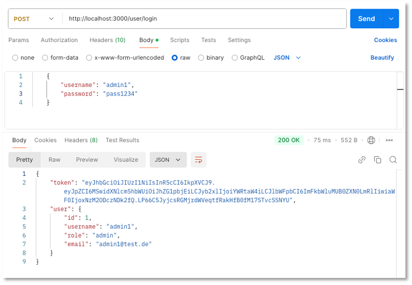
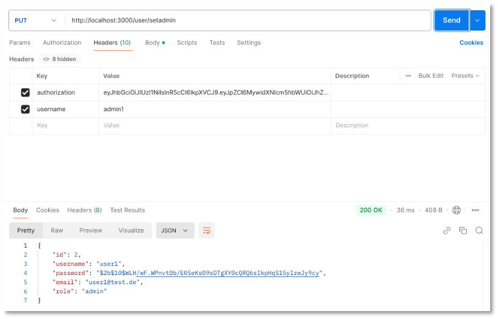

# Subject, Observable, Observer und Guards

Wir wollen am Beispiel einer Nutzerverwaltung die Verwendung von *Subject*, *Observable*, *Observer* und *Guards* demonstrieren. Alle diese Konzepte werden im Frontend verwendet. *Subject*, *Observable*, *Observer* dienen dazu, Werte an *Subscriber* zu propagieren. Eine gute Übersicht über *Subject*, *Observable*, *Observer* bietet die folgende Abbildung ([hier](https://www.tektutorialshub.com/angular/subjects-in-angular) entnommen).


*Subject*, *Observable*, *Observer* finden sich im [RxJS](https://rxjs.dev/)-Paket. [Subject](https://rxjs.dev/guide/subject) hat den großen Vorteil, dass ein (neuer) Wert an viele Subscriber gesendet (*multicast*) werden kann. Wir werden *Subjects* z.B. verwenden, um der `nav`-Komponente mitzuteilen, dass sich eine Nutzerin ein- bzw. ausgelogged hat. Ein *Subject* ist sowohl ein *Observer* als auch ein *Observable*. [Observable]() kann mehrere Werte (nacheinander) *pushen* (an die *Subscriber*). Folgende Tabelle [aus]() gibt einen guten Überblick über die Funktionalität eines *Observable*s.


Ein [Observer](https://rxjs.dev/guide/observer) konsumiert die Werte, die ein [Observable](https://rxjs.dev/guide/observable) liefert. Alle Funktionen des HTTP-Clients sind *Observables*. Sie liefern die Werte vom Backend (mittels einer `next`-Funktion). Mithilfe eines Observers werden wir diese Werte empfangen (`next`, `error`, `complete`).


## Sicherheitskonzepte

- Wir werden in diesem Abschnitt unterschiedliche "Sicherheitskonzepte" umsetzen. Einerseits werden wir die REST-API so gestalten, dass nicht alle Endpunkte frei verfügbar sind, sondern für einige Endpunkte nur dann eine wirksame Funktionalität ausgeführt wird, wenn sich der Aufrufer des Endpunktes als Administrator "ausweisen" kann. Wir werden dazu [JSON Web Tokens](https://jwt.io/) verwenden. 

- Außerdem zeigen wir, wie wir Passworte verschlüsselt in der Datenbank ablegen und wie dann ein Passwort-Vergleich durchgeführt wird. Dazu verwenden wir [bcrypt](https://www.npmjs.com/package/bcrypt).  

- Mithilfe von *Guards* wird die Verwendung von Komponenten im Frontend gesteuert. Eine Komponente soll z.B. nur dann aufgerufen werden können, wenn die Nutzerin eingelogged ist. 

Der letzte Punkt betrifft das Frontend. Die ersten beiden Punkte betreffen das Backend. Damit fangen wir an. 

## Abgesicherte REST-API zur Nutzerverwaltung (Backend)

Folgende Endpunkte soll die REST-API zur Verfügung stellen:

| Endpunkt | Beschreibung | Abgesichert |
|----------|--------------|-------------|
|`GET /user` |gebe alle `user`-Einträge zurück | kann nur durch einen `admin` aufgerufen werden |
|`GET /user/:username` |gibt den `user` mit `username` zurück | kann nur durch einen `admin` aufgerufen werden |
|`POST /user/register` |erstelle einen neuen `user` (`Registrierung`-Funktion)| frei verfügbar, Registrierung jedoch nur als Rolle `user` |
|`POST /user/login` |Prüft, ob `username` existiert und ob das Passwort stimmt (`Login`-Funktion) | frei verfügbar |
|`DELETE /user/:id` |löscht den `user` mit `id == id` |kann nur durch einen `admin` aufgerufen werden |
|`PUT /changepasswaord` |ändert das Passwort einer Nutzerin | frei verfügbar |
|`PUT /setadmin` |setzt die Rolle für eine Nutzerin von `user` auf `admin` | kann nur durch einen `admin` aufgerufen werden |

Wir gehen wie in [REST-API (PostgreSQL)](backend_pg.md#rest-api) vor und erstellen uns ein `Node.js`-Projekt:

```bash
mkdir backend
cd backend
npm init
npm i express 
npm i pg 
npm i dotenv 
npm i cors 
npm i bcrypt
npm i jsonwebtoken
```

Als Einstiegspunkt wählen wir `server.js`. Diese sieht wie folgt aus:

=== "server.js"
	```js linenums="1"
	const express = require('express')
	const cors = require('cors')
	require('dotenv').config()
	const routes = require('./routes')

	const app = express()
	const PORT = 3000

	app.use(express.json())
	app.use(cors())
	app.use('/user', routes)

	app.listen(PORT, (err) => {
	    if(err) {
	        console.log('backend not started', err)
	    } else {
	        console.log(`Server started and listening on port ${PORT} ...`)
	    }
	})
	```

Die Verbindungsdaten zur PostgreSQL-Datenbank stehen in der `.env`-Datei. Die Verbindung zur Datenbank stellen wir im Skript `db.js` her: 

=== ".env"
	```json
	PGUSER=<s05...>
	PGHOST=psql.f4.htw-berlin.de
	PGPASSWORD='ihr_passwort'
	PGDATABASE=<name_der_datenbank_auf_ocean>
	PGPORT=5432
	```

=== "db.js"
	```js
	const pg = require('pg');

	const db = new pg.Client({
	    user: process.env.PGUSER,
	    host: process.env.PGHOST,
	    database: process.env.PGDATABASE,
	    password: process.env.OCEAN_PASSWORD, /* bei Ihnen PGPASSWORD */
	    port: process.env.PGPORT,
	});

	db.connect(err => {
	    if (err) {
	        console.log(err);
	    } else {
	        console.log('Connection to DB ...');
	    }
	});

	module.exports = db;
	```

Für die Endpunkte (Routen) erstellen wir ein Skript `routes.js`:

=== "routes.js"
	```js linenums="1"
	const express = require('express')
	const router = express.Router();
	const bcrypt = require('bcrypt')
	const db = require('./db')
	var jwt = require('jsonwebtoken');

	// call only once at the beginning - creates table users (id, username, password, email, role)
	router.get('/createtable', async(req,res) => {
	    await db.query('DROP TABLE IF EXISTS users; CREATE TABLE users(id serial PRIMARY KEY, username VARCHAR(50), password VARCHAR(255), email VARCHAR(50), role VARCHAR(50));')
	    res.send({ message: `table users in database ${process.env.PGDATABASE} created`})

	})

	/* hier fügen wir im Folgenden die weiteren Endpunkte hinzu */

	module.exports = router;
	```

Wir haben zunächst einen Endpunkt implementiert, den wir einmalig zum Erstellen der Tabelle `users` in der Datenbank benötigen. Wenn wir das Backend mit

```bash
node --watch server.js
```

starten und den Endpunkt `GET localhost:3000/user/createtable` aufrufen (im Browser oder in Postman), dann wird in unserer Datenbank (in meinem Beispiel `users_jf`) eine Tabelle `users` mit den Spalten `id`, `username`, `password`, `email` und `role` erzeugt.


## `Registrierungs`-Endpunkt

Wir fügen unserer `routes.js` folgende Implementierung hinzu:

=== "POST /user/register in routes.js" 
	```js linenums="14"
	// post one user - register as role user
	router.post('/register', async(req, res) => {
	    let username = req.body.username;
	    let password = req.body.password;
	    let hashPassword = await bcrypt.hash(password, 10);
	    console.log('hash : ', hashPassword)
	    let email = req.body.email;

	    let check = await db.query('SELECT * FROM users WHERE email = $1 OR username = $2', [email, username]) 
	    if(check.rowCount > 0) {
	        res.status(401)
	        res.send({ message: `E-Mail ${email} and/or username ${username} already exists`})
	    } else {
	        const query = `INSERT INTO users(username, password, email, role) VALUES ($1, $2, $3, $4) RETURNING *`;

	        let result = await db.query(query, [username, hashPassword, email, 'user']);
	        res.status(201)
	        res.send(result.rows[0])
	    }
	})
	```

Erläuterungen:

- zur Registrierung muss das JSON-Objekt im `body` des `requests` Werte für die Eigenschaften `username`, `password` und `email` enthalten. 

- Die Registrierung wird nur dann vorgenommen, wenn weder `username` noch `email` bereits in der Datenbank enthalten sind. Wenn einer der beiden Werte bereits vorkommt, wird Status-Code `401` gesendet und die Nachricht `E-Mail ${email} and/or username ${username} already exists` (Zeilen `23-26`). 

- Wir verschlüsseln die Passwörter mithilfe von [bcrypt](https://www.npmjs.com/package/bcrypt). Dazu installieren wir uns dieses Paket zunächst mit `npm i bcrypt` (siehe oben). Eingebunden wird es mithilfe von `const bcrypt = require('bcrypt')` (siehe oben).

- In Zeile `18` wird die `hash()`-Funktion von `bcrypt` aufgerufen. Das `password` wird als erster Parameter übergeben. Die `10` ist der Wert für die `saltRounds` und ist der empfohlene Wert. Der `hash` wird erzeugt und als Wert der Variablen `hashPassword` zuegwiesen. Dieser Hash-Wert wird in der Datenbank gespeichert (Zeile `29)`. 


Es bleibt anzumerken, dass aus dem `hash` nicht wieder das Passwort rückerzeugt werden kann. Um sich einzuloggen, muss das einegebene Passwort mit dem `hash` verglichen werden. Dazu stellt `bcrypt` ebenfalls eine Funktion zur Verfügung. Diese verwenden wir beim Login. 

## `Login`-Endpunkt

Eine `Login`-Funktion soll überprüfen, ob ein `username` existiert und ob das dazugehörige `password` korrekt ist. Dazu müssen beide Informationen mit dem *Request* übermittelt werden. Deshalb wird als Anfragemethode `POST` verwendet. Um diesen `POST`-Endpunkt vom vorherigen Endpunkt zu unterscheiden, wird der URL anstelle von `/register` hier `/login` angehängt. 

Die Implementierung dieser Funktion in der `routes.js` könnte wie folgt aussehen:


=== "POST /user/login in routes.js"
	```js linenums="35"
	// post one user - login
	router.post('/login', async(req, res) => {
	    let username = req.body.username;
	    let password = req.body.password;

	    let result = await db.query('SELECT * FROM users WHERE username = $1', [username]) 
	    if(result.rowCount > 0) {
	        const user = result.rows[0];
	        const match = await bcrypt.compare(password, user.password);
	        if(match) {
	            const userWithoutPassword = {id: user.id, username: user.username, role: user.role, email: user.email};
	            const token = jwt.sign(userWithoutPassword, username);
	            res.status(200)
	            res.send({token: token, user: userWithoutPassword })
	        }
	        else {
	            res.status(401)
	            res.send({ message: "username/password wrong"}) /* hier weiß man Passwort falsch */
	        }
	    } else {
	        res.status(401)
	        res.send({ message: "username/password wrong"})     /* hier weiß man, username falsch */
	    }
	})
	```


Erläuterungen: 

- Es wird zunächst geprüft, ob es überhaupt einen passenden `username` in der Datenbank gibt (Zeile `40`). Existiert ein solcher EIntrag nicht, wird HTTP-Status `401` zurückgesendet mit der Meldung `username/password wrong`. Man könnte hier natürlich auch konkreter `username does not exist` zurückgeben, aber zu viele Details bei einem fehlerhaften Login-Versuch sind kein guter Datenschutz.  

- Existiert ein Eintrag für `username`, wird das `password` dieses Eintrages mit dem `password` aus dem *Request* unter Verwendung der `compare()`-Funktion von `bcrypt` miteinander verglichen (Zeile `43`). Sind die Passwärter gleich, ist `match == true`. 

- Für den Fall, dass `match==true` ist, wird die Nutzerin eingelogged. Dafür wird mithilfe des `jsonwebtoken`-Paketes ein solcher `JSON Web Token (jwt)` erzeugt. Dies geschieht mithilfe der `sign()`-Funktion. Der Token enthält die Daten über die Nutzerin (außer das gehashte Passwort) als *payload*. Als Sicherheitsschlüssel wird hier der `username` verwendet (siehe [jsonwebtoken](https://www.npmjs.com/package/jsonwebtoken)). 

- Für den Fall, dass `match==false` ist, stimmte das Passwort nicht. Auch hier geben wir `401` und `username/password wrong` zurück und geben keine weiteren Informationen preis. 


## Read all

Das Auslesen aller Nutzerinnen soll nur einem Nutzer in der Rolle `admin` möglich sein. Wir haben derzeit keine Möglichkeit, einen `admin`-Nutzer zu kreieren. Wir werden zwar später noch einen Endpunkt implementieren, der für eine Nutzerin die Rolle `user` in die Rolle `admin` wechselt, aber auch dies wird nur einem `admin` möglich sein. Wir benötigen also einmalig einen Nutzer in der Rolle `admin` in unserer Tabelle. Diesen können wir entweder über 

- [pgAdmin](https://www.pgadmin.org/) oder
- [psql](https://www.timescale.com/blog/how-to-install-psql-on-mac-ubuntu-debian-windows) 

direkt in die Tabelle mit z.B. `INSERT INTO users(username, password, email, role) VALUES ("admin1", hashPassword, "admin1@test.de", "admin")` einrichten. Das `hasPassword` lässt sich z.B. auf [bcrypt.online](https://bcrypt.online/) erzeugen. Oder wir passen den Endpunkt `GET /user/createtablle` kurz wie folgt an:

```js
// call only once at the beginning - creates table users (id, username, password, email, role)
router.get('/createtable', async(req,res) => {
    const password = await bcrypt.hash('pass1234', 10)
    const query = `INSERT INTO users(username, password, email, role) VALUES ($1, $2, $3, $4);`
    await db.query('DROP TABLE IF EXISTS users;')
    await db.query('CREATE TABLE users(id serial PRIMARY KEY, username VARCHAR(50), password VARCHAR(255), email VARCHAR(50), role VARCHAR(50));')
    await db.query(query, ["admin1", password, "admin1@test.de", "admin"])
    res.send({ message: `table users in database ${process.env.PGDATABASE} created`})
})
```

Dann sollten wir ihn aber nach einmaliger Ausführung auch wieder aus unserem Backend entfernen.

Nun haben wir eine Nutzerin in der `admin`-Rolle und erzeugen beim Einloggen (wie für alle Nutzerinnen beim Einloggen) ein JSON-Web-Token (jwt).

### JSON-Web-Token (JWT)


Über JSON-Web-Tokens (JWT) können Sie sich [hier](https://jwt.io/introduction) und aber auch in dem frei verfügbaren [Handbuch](https://auth0.com/resources/ebooks/jwt-handbook) informieren. JWT ist ein offener [Standard](https://datatracker.ietf.org/doc/html/rfc7519) und dient dem sicheren Informationsaustausch zwischen zwei Parteien. Am häufigsten wird JWT zur Autorisierung, d.h. zur Überprüfung von Zugriffsrechten genutzt. 

!!! info "Autorisierung vs. Authentififizierung"
	Durch **Authentifizierung** wird bestätigt, dass Benutzer diejenigen sind, die sie zu sein vorgeben, während diese Benutzer per **Autorisierung** die Erlaubnis erhalten, auf Ressourcen zuzugreifen.

Um eine Ressource nutzen zu können, autorisiert man den Zugriff mithilfe eines Tokens. Wenn wir einen Endpunkt einer REST-API nutzen wollen, dann senden wir diesen Token im `header` des Requests mit. Zunächst muss der Token jedoch erzeugt werden. Dies passiert beim Login. Wir schauen uns einen solchen Token im Detail an:

Ein JWT besteht aus 

- einem *Header*,
- einem *Paload* und
- einer *Signatur*.

Der *Header* enthält zwei Einträge: den Typ des Tokens (`JWT`) und den Algorithmus, der zum Signieren des Tokens verwendet wird, z.B. [HMAC SH265](https://de.wikipedia.org/wiki/HMAC) oder [RSA](https://de.wikipedia.org/wiki/RSA-Kryptosystem). Ein Beispiel für den *Header*  könnte sein:

```json
{
  "alg": "HS256",
  "typ": "JWT"
}
```

Der *Payload* enthält typischerweise Daten über den Nutzer, z.B.

```json
{
  "username": "muster",
  "email": "muster@test.de",
  "role": "admin"
}
```

Die *Signatur* verschlüsselt den *Header* und den *Payload* mit dem angegebenen Signaturalgorithmus und verwendet dabei ein `secret`. Dieses `secret` kann ein öffentlicher Schlüssel oder einfach ein alphanumerischer String sein. 

Zur Erzeugung und Prüfung von JWT verwenden wir in unserem Backend das [jsonwebtoken](https://www.npmjs.com/package/jsonwebtoken)-Paket. Zur Erzeugung des Tokens stellt dieses Package die Funktion `sign()` zur Verfügung. 

Wir zeigen zunächst nochmal den Code, der beim `Login` zur Erstellung des Tokens führt:

=== "aus POST /user/login"
	```js linenums="48"
    const userWithoutPassword = {id: user.id, username: user.username, role: user.role, email: user.email};
    const token = jwt.sign(userWithoutPassword, username);
    res.status(200)
    res.send({token: token, user: userWithoutPassword })
	```

Wir verwenden darin das `userWithoutPassword`-Objekt als *Payload* des JWT und den `username` als `secret`. Wenn nun ein Endpunkt angesprochen wird, der eine Autorisierung verlangt, prüfen wir folgendes:

=== "Autorisierung mit JWT"
	```js linenums="1"
    /* ------------------ check if caller is admin    ---- start --------------------- */
    console.log('request headers: ', req.headers)
    const token = req.headers['authorization'];
    const callerusername = req.headers['username'];

    if(!token) {
        return res.status(401).send({ message: 'No token provided' });
    }
    try {
        const decoded = jwt.verify(token, callerusername)
        console.log('decoded : ', decoded)

        const check = await db.query('SELECT * FROM users WHERE username=$1', [decoded.username])
        console.log('check ', check)
        if(check.rows[0].role!='admin') {
            return res.status(401).send({ message: 'you are not an admin' });
        }

    } catch(err) {
        return res.status(401).send({ message: 'Invalid token' });
    }
    /* ------------------ check if caller is admin    ---- end --------------------- */
    ```

Erläuterungen:

- In den Zeilen `3` und `4` lesen wir den `token` und den `callerusername` aus, die beide im `header` des *requests* gesendet werden. 

- Wenn im `header` unter dem Schlüssel `authorization` kein `token` gesendet wird, wird die Anfrage mit einer `401`-Response abgelehnt (Zeilen `6-8`).

- Wenn ein `token` verfügbar ist, wird dieser mithilfe der Funktion `verify()` des `jsonwebtoken`-Paketes dekodiert. Dabei wird der `callerusername` als `secret` verwendet (wie beim Signieren). 

- Nun fragen wir in der Datenbank an, ob es sich bei dem `callerusername` um einen `admin` handelt. Das steht zwar auch im *payload* des `token`, kann sich aber in der Zwischenzeit theoretisch geändert haben. 

- Wenn es sich nicht um einen `admin` handelt, wird die Anfrage ebenfalls mit einer `401`-Response abgelehnt (Zeilen `15-17`).

- Falls die `verify()`-Funktion einen Fehler geworfen hat, z.B. weil das `secret` nicht korrekt war, wird ebenfalls die Anfrage mit einer `401`-Response abgelehnt. 

Erst, wenn diese Prüfungen alle erfolgreich absolviert werden, kann der nachfolgende Code ausgeführt werden. Wir werden die oben gezeigt Implementierung nun in jedem Endpunkt voranstellen, der `admin`-Rechte zur Anbfrage benötigt. 


### Read-all-Endpunkt

Der *read-all*-Endpunkt (`GET /user`) sieht demnach so aus:

=== "GET /user"
	```js linenums="63"
	// get all users
	router.get('/', async(req, res) => {

	    /* ------------------ check if caller is admin    ---- start --------------------- */
	    console.log('request headers: ', req.headers)
	    const token = req.headers['authorization'];
	    const callerusername = req.headers['username'];

	    if(!token) {
	        return res.status(401).send({ message: 'No token provided' });
	    }
	    try {
	        const decoded = jwt.verify(token, callerusername)
	        console.log('decoded : ', decoded)

	        const check = await db.query('SELECT * FROM users WHERE username=$1', [decoded.username])
	        console.log('check ', check)
	        if(check.rows[0].role!='admin') {
	            return res.status(401).send({ message: 'you are not an admin' });
	        }

	    } catch(err) {
	        return res.status(401).send({ message: 'Invalid token' });
	    }
	    /* ------------------ check if caller is admin    ---- end --------------------- */

	    /* ------- if caller is admin, then do the following --------------------------- */
	    const query = `SELECT * FROM users `;

	    try {
	        const result = await db.query(query)
	        console.log(res)
	        res.status(200)
	        res.send(result.rows);
	    } catch (err) {
	        console.log(err.stack)
	    }
	});
	```


Abzüglich der Überprüfung des JWT sieht der Endpunkt also so aus, wie wir ihn bereits kennen. Das gilt im Prinzip auch für die folgenden Endpunkte.

### Read one `user` by `username`

Im `header` wird hier wieder unter `authorization` der JWT und unter `username` der `callerusername` erwartet. Als Parameter wird der `username` aufgerufen, dessen Daten gesendet werden, falls er existiert.

=== "GET /user/:username"
	```js linenums="103"
	// get one user bei username
	router.get('/:username', async(req, res) => {

	    /* ------------------ check if caller is admin    ---- start --------------------- */
	    console.log('request headers: ', req.headers)
	    const token = req.headers['authorization'];
	    const callerusername = req.headers['username'];

	    if(!token) {
	        return res.status(401).send({ message: 'No token provided' });
	    }
	    try {
	        const decoded = jwt.verify(token, callerusername)
	        console.log('decoded : ', decoded)

	        const check = await db.query('SELECT * FROM users WHERE username=$1', [decoded.username])
	        console.log('check ', check)
	        if(check.rows[0].role!='admin') {
	            return res.status(401).send({ message: 'you are not an admin' });
	        }

	    } catch(err) {
	        return res.status(401).send({ message: 'Invalid token' });
	    }
	    /* ------------------ check if caller is admin    ---- end --------------------- */

	    /* ------- if caller is admin, then do the following --------------------------- */
	    const query = `SELECT * FROM users WHERE username = $1`;

	    try {
	        const username = req.params.username;
	        const result = await db.query(query, [username])
	        if(result.rowCount > 0) {
	            res.status(200)
	            res.send(result.rows[0]);
	        } else {
	            res.status(404)
	            res.send({message: `user with username ${username} does not exist`});
	        }
	    } catch (err) {
	        console.log(err.stack)
	    }
	});
	```


### Change password

Im `body` des Requests wird der `username`, das `oldpassword` und das `newpassword` erwartet. Das `oldpassword` wird mittels `bcrypt.compare()` mit dem in der Datenbank gespeicherten Passwort verglichen. Bei Erfolg, wird das gehashte `newpassword` (`bcrypt.hash()`) in die Datenbank anstelle des alten Passwortes gespeichert. Der Endpunkt benötigt keine Autorisierung.

=== "PUT /user/changepassword"
	```js linenums="147"
	// put ({username, oldpassword, newpassword}) - changepassword
	router.put('/changepassword', async(req, res) => {
	    let username = req.body.username;
	    let oldpassword = req.body.oldpassword;
	    let newpassword = req.body.newpassword;

	    let hashPassword = await bcrypt.hash(newpassword, 10);
	    console.log('hash : ', hashPassword)

	    let result = await db.query('SELECT * FROM users WHERE username = $1', [username]) 
	    if(result.rowCount > 0) {
	        const user = result.rows[0];
	        const match = await bcrypt.compare(oldpassword, user.password);
	        if(match) {
	            const updatequery = `UPDATE users SET 
	            username = $1, 
	            password = $2
	            WHERE username=$3
	            RETURNING *;`;
	        
	            const updateresult = await db.query(updatequery, [username, hashPassword, username]);
	            console.log('updateresult : ', updateresult)
	            res.status(200)
	            res.send(updateresult.rows[0])
	        }
	        else {
	            res.status(401)
	            res.send({ message: "username/password wrong"})
	        }
	    } else {
	        res.status(401)
	        res.send({ message: "username/password wrong"})
	    }
	})
	```


### Rolle `user` auf `admin` setzen

Im `header` wird hier wieder unter `authorization` der JWT und unter `username` der `callerusername` erwartet, d.h. es handelt sich um einen geschützten Endpunkt. Im `body` des Requests wird der `username` der Nutzerin erwartet, deren Rolle auf `admin` gesetzt werden soll. Dies geschieht, ohne dass geprüft wird, ob die Rolle vorher `user` war.


=== "PUT /user/setadmin"
	```js linenums="182"
	router.put('/setadmin', async(req, res) => {

	    /* ------------------ check if caller is admin    ---- start --------------------- */
	    console.log('request headers: ', req.headers)
	    const token = req.headers['authorization'];
	    const callerusername = req.headers['username'];

	    if(!token) {
	        return res.status(401).send({ message: 'No token provided' });
	    }
	    try {
	        const decoded = jwt.verify(token, callerusername)
	        console.log('decoded : ', decoded)

	        const check = await db.query('SELECT * FROM users WHERE username=$1', [decoded.username])
	        console.log('check ', check)
	        if(check.rows[0].role!='admin') {
	            return res.status(401).send({ message: 'you are not an admin' });
	        }

	    } catch(err) {
	        return res.status(401).send({ message: 'Invalid token' });
	    }
	    /* ------------------ check if caller is admin    ---- end --------------------- */

	    /* ------- if caller is admin, then do the following --------------------------- */
	    let username = req.body.username;

	    const updatequery = `UPDATE users SET 
	    role='admin'
	    WHERE username=$1
	    RETURNING *;`;

	    const updateresult = await db.query(updatequery, [username]);
	    console.log('updateresult : ', updateresult)
	    res.status(200)
	    res.send(updateresult.rows[0])
	})
	```


### Delete one `user` by `id`

Im `header` wird hier wieder unter `authorization` der JWT und unter `username` der `callerusername` erwartet, d.h. es handelt sich um einen geschützten Endpunkt. Die `id` der zu löschenden Nutzerin wird als Parameter der Route übergeben.


=== "DELETE /user/:id"
	```js linenums="221"
	// delete one user via id
	router.delete('/:id', async(req, res) => {

	    /* ------------------ check if caller is admin    ---- start --------------------- */
	    console.log('request headers: ', req.headers)
	    const token = req.headers['authorization'];
	    const callerusername = req.headers['username'];

	    if(!token) {
	        return res.status(401).send({ message: 'No token provided' });
	    }
	    try {
	        const decoded = jwt.verify(token, callerusername)
	        console.log('decoded : ', decoded)

	        const check = await db.query('SELECT * FROM users WHERE username=$1', [decoded.username])
	        console.log('check ', check)
	        if(check.rows[0].role!='admin') {
	            return res.status(401).send({ message: 'you are not an admin' });
	        }

	    } catch(err) {
	        return res.status(401).send({ message: 'Invalid token' });
	    }
	    /* ------------------ check if caller is admin    ---- end --------------------- */

	    /* ------- if caller is admin, then do the following --------------------------- */
	    try {
	        const id = req.params.id;
	        const query = `DELETE FROM users WHERE id=$1`;
	        const result = await db.query(query, [id])
	        console.log(result)
	        if (result.rowCount == 1)
	            res.send({ message: "User with id=" + id + " deleted" });
	        else {
	            res.status(404)
	            res.send({ message: "No user found with id=" + id });
	        }
	    } catch (err) {
	        console.log(err.stack)
	    } 
	});
	```


### Testen der abgesicherten Endpunkte in Postman

Um die abgesicherten Endpunkte in Postman zu testen, müssen wir die benötigten Informationen im `Header` an das `request`-Objekt übergeben. Die folgenden Screenshots zeigen, wie das geht. 

Wir loggen uns zunächst mit einem `admin`-Account ein:



In der `Response` erhalten wir einen `token`. Diesen benötigen wir, um uns für die abgesicherten Endpunkte zu autorisieren:



Wir wählen in der oberen `Request`-Hälfte den Menüpunkt `Headers` aus und geben dort den `key` `authorization` ein und dafür als Wert den `token`, den wir in der `Response` vom `Login` erhalten haben. Als zweiten Schlüssel geben wir `username` ein und als Wert den `username`, für den der `token` erzeugt wurde. Dieser `username` wurde bei der Token-Erstellung als `secret` verwendet. Obere Abbildung zeigt den Aufruf des Endpunktes `PUT /user/setadmin`. Dafür muss auch noch im `Body` des `Requests` der `username` übergeben werden, für den die Rolle auf `admin` gewechselt werden soll, z.B. 

```json
{
    "username": "user1"
}
```

Mit den erforderlichen Autorisierungsinformationen im Header können die abgesicherten Endpunkte in Postman getestet werden. 


!!! success
	Wir haben ein Backend zur Nutzerverwaltung erstellt. Es stellt die [oben](guards.md#abgesicherte-rest-api-zur-nutzerverwaltung-backend) beschriebenen Endpunkte zur Verfügung. Es ist leicht um weitere Endpunkte erweiterbar, z.B. ein weiterer Endpunkt, der aus einer Nutzerin in der Rolle `admin` die Rolle `user` zuweist. Einige der Endpunkte sind mittels [JWT](https://jwt.io/) abgesichert, so dass sie nur von als `admin` eingeloggten Nutzerinnen genutzt werden können. Wir werden nun ein dazu passendes Frontend erstellen, welches das Backend nutzen wird. 


---


## Registrierung und Login (Frontend)

Wir erstellen uns mithilfe von Angular eine kleine Webanwendung, die mindestens eine Regstrierungs- und eine Login-Komponente enthält. Wir wollen dieses Mal [Material Design](https://material.angular.io/) anstelle von Bootstrap als CSS-Framework verwenden. 

Im Terminal geben wir Folgendes ein:

| Terminalbefehl | Beschreibung |
|----------------|--------------|
|`ng new frontend` | erstellt Projekt `frontend` (alle Fragen mit `Enter` beantworten) |
|`cd frontend` ||
|`ng g c login` | erstellt Komponente `login` |
|`ng g c home` | erstellt Komponente `home` |
|`ng g c table` | erstellt Komponente `table` |
|`ng g s shared/auth` | erstellt Service `auth` im Ordner `shared` |
|`ng g i shared/user` | erstellt Interface `user` im Ordner `shared` |
|`ng add @angular/material@18` | fügt [Material Design](https://material.angular.io/guide/getting-started) hinzu |

**Achtung:** Das Hinzufügen von *Material Design* mithilfe von `...@18` ist wichtig (Stand Januar 2025). Es gibt zwar bereits Version `19`, aber dort gibt es noch Probleme mit Abhängigkeiten von Paketen.  Nach dem Hinzufügen von *Material Design* sollte im Terminal ungefähr folgende Ausgabe erscheinen:

```bash
(base) jornfreiheit@MB-JF frontend % ng add @angular/material@18
✔ Determining Package Manager
  › Using package manager: npm
✔ Loading package information from registry
✔ Confirming installation
✔ Installing package
? Choose a prebuilt theme name, or "custom" for a custom theme: Azure/Blue         [Preview: 
https://material.angular.io?theme=azure-blue]
? Set up global Angular Material typography styles? yes
? Include the Angular animations module? Include and enable animations
UPDATE package.json (1122 bytes)
✔ Packages installed successfully.
UPDATE src/app/app.config.ts (421 bytes)
UPDATE angular.json (2778 bytes)
UPDATE src/index.html (529 bytes)
UPDATE src/styles.css (181 bytes)
```

Als `prebuild theme` wurde hier `Azure/Blue` und sowohl für die `typography styles` als auch für die `animations` wurde `y` ausgewählt.

*Material Design* bietet sogenannte [Schematics](https://material.angular.io/guide/schematics) an. Wir wählen das `navigation`-Schema und geben im Terminal ein:

```bash
ng generate @angular/material:navigation nav
``` 
Es entsteht eine `nav`-Komponente. Außerdem wählen wir das `address-form`-Schema und erstellen damit eine Komponente `register`:

```bash
ng generate @angular/material:address-form register
``` 

Die `app.component.html` ändern wir wie folgt und in die `app.component.ts` importieren wir die `NavComponent` (dafür kann `RouterOutlet` entfernt werden):

=== "app.component.html"
	```html
	<app-nav></app-nav>
	```

=== "app.component.ts"
	```ts
	import { Component } from '@angular/core';
	import { NavComponent } from './nav/nav.component';

	@Component({
	  selector: 'app-root',
	  standalone: true,
	  imports: [NavComponent],
	  templateUrl: './app.component.html',
	  styleUrl: './app.component.css'
	})
	export class AppComponent {
	  title = 'frontend';
	}
	```


Darin wird also nur noch die `nav`-Komponente statisch eingebunden.

Ehe wir an der `nav.component.html` umfangreichere Änderungen vornehmen, defininieren wir zunächst noch folgende Routen:

=== "app.routes.ts"
	```js linenums="1" hl_lines="2-4 8-22"
	import { Routes } from '@angular/router';
	import { HomeComponent } from './home/home.component';
	import { RegisterComponent } from './register/register.component';
	import { LoginComponent } from './login/login.component';

	export const routes: Routes = [
	    {
		    path: "",
		    title: "Home",
		    component: HomeComponent,
		    pathMatch: 'full'
		  },
		  {
		    path: "register",
		    title: "Register",
		    component: RegisterComponent
		  },
		  {
		    path: "login",
		    title: "Login",
		    component: LoginComponent
		  }
	];
	``` 

Nun können wir die `nav.component.html` entsprechend anpassen:

=== "nav.component.html"
	```html linenums="1" hl_lines="6 8-10 24 27"
	<mat-sidenav-container class="sidenav-container">
	  <mat-sidenav #drawer class="sidenav" fixedInViewport
	      [attr.role]="(isHandset$ | async) ? 'dialog' : 'navigation'"
	      [mode]="(isHandset$ | async) ? 'over' : 'side'"
	      [opened]="(isHandset$ | async) === false">
	    <mat-toolbar><a href="https://freiheit.f4.htw-berlin.de/webtech/guards/#registrierung-und-login-frontend">WebTech</a></mat-toolbar>
	    <mat-nav-list>
	      <a mat-list-item [routerLink]="['']">Home</a>
	      <a mat-list-item [routerLink]="['register']">Register</a>
	      <a mat-list-item [routerLink]="['login']">Login</a>
	    </mat-nav-list>
	  </mat-sidenav>
	  <mat-sidenav-content>
	    <mat-toolbar color="primary">
	      @if (isHandset$ | async) {
	        <button
	          type="button"
	          aria-label="Toggle sidenav"
	          mat-icon-button
	          (click)="drawer.toggle()">
	          <mat-icon aria-label="Side nav toggle icon">menu</mat-icon>
	        </button>
	      }
	      <span>Nutzerinnenverwaltung</span>
	    </mat-toolbar>
	    <!-- Add Content Here -->
	    <router-outlet></router-outlet>
	  </mat-sidenav-content>
	</mat-sidenav-container>
	``` 

In den Zeilen `8-10` werden die Menüeinträge geändert und die Verweise auf `routerLinks` geändert. In Zeile `24` wird die Überschrift geändert und in Zeile `27` erscheint der Platzhalter für die per Routing eingebundenen Komponenten. Zeile `6` wurde hier nur optional als Demo geändert, kann natürlich auch bleiben.

Die erforderlichen Anpassungen in der `nav.component.ts` und der `nav.component.css` sehen dann so aus:

=== "nav.component.ts"
	```js linenums="1" hl_lines="11 25 26"
	import { Component, inject } from '@angular/core';
	import { BreakpointObserver, Breakpoints } from '@angular/cdk/layout';
	import { AsyncPipe } from '@angular/common';
	import { MatToolbarModule } from '@angular/material/toolbar';
	import { MatButtonModule } from '@angular/material/button';
	import { MatSidenavModule } from '@angular/material/sidenav';
	import { MatListModule } from '@angular/material/list';
	import { MatIconModule } from '@angular/material/icon';
	import { Observable } from 'rxjs';
	import { map, shareReplay } from 'rxjs/operators';
	import { RouterLink, RouterOutlet } from '@angular/router';

	@Component({
	  selector: 'app-nav',
	  templateUrl: './nav.component.html',
	  styleUrl: './nav.component.css',
	  standalone: true,
	  imports: [
	    MatToolbarModule,
	    MatButtonModule,
	    MatSidenavModule,
	    MatListModule,
	    MatIconModule,
	    AsyncPipe,
	    RouterOutlet,
	    RouterLink
	  ]
	})
	export class NavComponent {
	  private breakpointObserver = inject(BreakpointObserver);

	  isHandset$: Observable<boolean> = this.breakpointObserver.observe(Breakpoints.Handset)
	    .pipe(
	      map(result => result.matches),
	      shareReplay()
	    );
	}
	``` 

=== "nav.component.css"
	```css linenums="1" hl_lines="19-22"
	.sidenav-container {
	  height: 100%;
	}

	.sidenav {
	  width: 200px;
	}

	.sidenav .mat-toolbar {
	  background: inherit;
	}

	.mat-toolbar.mat-primary {
	  position: sticky;
	  top: 0;
	  z-index: 1;
	}

	a {
	  text-decoration: none;
	  color: black;
	}
	``` 


Die Anwendung sieht nun wie folgt aus (Desktop- und Mobile-Ansicht):

{ width="50%" }

Die Menüeinträge funktionieren und bei der `register`-Komponente wird bereits ein recht umfangreiches Formular angezeigt (wegen des verwendeten `address-form`-Schemas).

### Registrierung

Wir passen die durch das `address-form`-Schema erstellte `register`-Komponente an. Die Dateien der `register`-Komponente könnten z.B. so aussehen:

=== "register.component.ts"
	```ts linenums="1"
	import { Component, inject } from '@angular/core';

	import { ReactiveFormsModule, FormBuilder, Validators, FormControl, FormGroup } from '@angular/forms';
	import { MatInputModule } from '@angular/material/input';
	import { MatButtonModule } from '@angular/material/button';
	import { MatSelectModule } from '@angular/material/select';
	import { MatRadioModule } from '@angular/material/radio';
	import { MatCardModule } from '@angular/material/card';
	import { User } from '../shared/user';
	import { MatIconModule } from '@angular/material/icon';


	@Component({
	  selector: 'app-register',
	  templateUrl: './register.component.html',
	  styleUrl: './register.component.css',
	  standalone: true,
	  imports: [
	    MatIconModule,
	    MatInputModule,
	    MatButtonModule,
	    MatSelectModule,
	    MatRadioModule,
	    MatCardModule,
	    ReactiveFormsModule
	  ]
	})
	export class RegisterComponent {
	  registerForm = new FormGroup({
	    username: new FormControl('', Validators.required),
	    password: new FormControl('', [Validators.required, Validators.minLength(8)]),
	    password2: new FormControl('', [Validators.required, Validators.minLength(8)]),
	    email: new FormControl('', [Validators.required, Validators.email]),
	    role: new FormControl('', Validators.required)
	  });
	  roles = [ "admin", "user"];
	  hide = true;
	  hide2 = true;
	  user!: User;

	  onSubmit(): void {
	    const values = this.registerForm.value;
	    this.user = {
	      username: values.username!,
	      password: values.password!,
	      email: values.email!,
	      role: values.role!
	    };
	    console.log(this.user)
	  }
	}
	```

=== "register.component.html"
	```html linenums="1"
	<form [formGroup]="registerForm" novalidate (ngSubmit)="onSubmit()">
	  <mat-card class="shipping-card">
	    <mat-card-header>
	      <mat-card-title>Registrierung</mat-card-title>
	    </mat-card-header>
	    <mat-card-content>

	      <div class="row">
	        <div class="col">
	          <mat-form-field hintLabel="Einloggen mit Nutzername und Passwort" class="full-width">
	            <input matInput placeholder="Nutzername" formControlName="username">
	            <mat-icon matSuffix >person_add</mat-icon>
	            @if(registerForm.controls['username'].hasError('required')) {
	              <mat-error>
	                Nutzername <strong>erforderlich</strong>
	              </mat-error>
	            }
	          </mat-form-field>
	        </div>
	      </div>
	      <div class="row">
	        <div class="col">
	          <mat-form-field hintLabel="Mind. 8 Zeichen, mind. 1 Groß- und Kleinbuchstaben, Ziffer und Sonderzeichen" class="full-width">
	            <input matInput [type]="hide ? 'password' : 'text'" placeholder="Passwort" formControlName="password">
	            <button mat-icon-button matSuffix (click)="hide = !hide" [attr.aria-label]="'Hide password'" [attr.aria-pressed]="hide">
	              <mat-icon>{{hide ? 'visibility_off' : 'visibility'}}</mat-icon>
	            </button>
	            @if(registerForm.controls['password'].hasError('required')) {
	              <mat-error>
	                Passwort <strong>erforderlich</strong>
	              </mat-error>
	            }
	          </mat-form-field>
	        </div>
	      </div>
	      <div class="row">
	        <div class="col">
	          <mat-form-field hintLabel="Dasselbe Passwort wie oben" class="full-width">
	            <input matInput  [type]="hide2 ? 'password' : 'text'" placeholder="Passwort wiederholen" formControlName="password2">
	            <button mat-icon-button matSuffix (click)="hide2 = !hide2" [attr.aria-label]="'Hide password'" [attr.aria-pressed]="hide">
	              <mat-icon>{{hide2 ? 'visibility_off' : 'visibility'}}</mat-icon>
	            </button>
	            @if(registerForm.controls['password2'].hasError('required')) {
	              <mat-error>
	                Wiederholung Passwort <strong>erforderlich</strong>
	              </mat-error>
	            }
	          </mat-form-field>
	        </div>
	      </div>

	      <div class="row">
	        <div class="col">
	          <mat-form-field hintLabel="E-Mail-Adresse zum Kontaktieren verwendet" class="full-width">
	            <input matInput placeholder="E-Mail" formControlName="email">
	            <mat-icon matSuffix>email</mat-icon>
	            @if(registerForm.controls['email'].hasError('required')) {
	              <mat-error>
	                E-Mail-Adresse <strong>erforderlich</strong>
	              </mat-error>
	            }
	          </mat-form-field>
	        </div>
	      </div>
	      <div class="row">
	        <div class="col">
	          <mat-form-field hintLabel="Wählen Sie eine der beiden Rollen aus" class="full-width">
	            <mat-select placeholder="Rolle" formControlName="role">
	              @for(role of roles; track $index) {
	                <mat-option [value]="role">
	                  {{ role }}
	                </mat-option>
	              }
	            </mat-select>
	            <mat-icon matSuffix>group</mat-icon>
	            @if(registerForm.controls['role'].hasError('required')) {
	              <mat-error>
	                Rolle <strong>erforderlich</strong>
	              </mat-error>
	            }
	          </mat-form-field>
	        </div>
	      </div>

	    </mat-card-content>
	    <mat-card-actions>
	      <button mat-raised-button color="primary" type="submit">Registrieren</button>
	    </mat-card-actions>
	  </mat-card>
	</form>
	```

=== "register.component.css"
	```css linenums="1"
	.full-width {
	  width: 100%;
	}

	.shipping-card {
	  min-width: 120px;
	  max-width: 80%;
	  margin: 2% 2% auto 2%;
	}

	.mat-radio-button {
	  display: block;
	  margin: 5px 0;
	}

	.row {
	  display: flex;
	  flex-direction: row;
	}

	.col {
	  flex: 1;
	  margin-right: 20px;
	}

	.col:last-child {
	  margin-right: 0;
	}
	```

Das ergibt folgende Ansicht:

{ width="50%" }

### Service verwenden

In dem `auth`-Service binden wir das Backend an und nutzen bspw. die im Registrierungsformular eingegebenen Daten, um die Nutzerin zu registrieren. Im Gegensatz zu [Frontend-Backend-Anbindung](fe-be-anbindung.md#frontend-backend-anbindung), wo wir nur die [Fetch-API]() zum Aufruf der Endpunkte verwendet haben, zeigen wir hier einmal die Verwendung des [HTTP Client](https://angular.dev/guide/http)-Moduls. Wir verwenden hier aber das *HTTP-Client-Modul* mit der *Fetch-API* (und nicht mit [XMLHttpRequest](https://developer.mozilla.org/de/docs/Web/API/XMLHttpRequest)). Dazu binden wir das [HTTP-Client-Modul](https://angular.dev/guide/http/setup#configuring-features-of-httpclient) wie folgt in die `app.config.ts` ein: 

=== "app.config.ts"
	```js linenums="1" hl_lines="6 13"
	import { ApplicationConfig, provideZoneChangeDetection } from '@angular/core';
	import { provideRouter } from '@angular/router';

	import { routes } from './app.routes';
	import { provideAnimationsAsync } from '@angular/platform-browser/animations/async';
	import { provideHttpClient, withFetch } from '@angular/common/http';

	export const appConfig: ApplicationConfig = {
	  providers: [
	    provideZoneChangeDetection({ eventCoalescing: true }), 
	    provideRouter(routes), 
	    provideAnimationsAsync(), 
	    provideHttpClient(withFetch(),)]
	};
	```

!!! warning "Achtung!"
	Nicht vergessen, dass das Backend läuft!

Der Service könnte z.B. so aussehen:

=== "auth.service.js"
	```js linenums="1"
	import { HttpClient } from '@angular/common/http';
	import { Injectable } from '@angular/core';
	import { Observable } from 'rxjs';
	import { User } from './user';

	@Injectable({
	  providedIn: 'root'
	})
	export class AuthService {
	  baseUrl = 'http://localhost:3000';

	  constructor(private http: HttpClient) { }

	  registerUser(user:User): Observable<any> {
	    return this.http.post(this.baseUrl + '/user/register', user);
	  }

	  loginUser(user: {username: string; password: string;}): Observable<any> {
	    return this.http.post(this.baseUrl + '/user/login', user);
	  }
	}
	```

und die `submit()`-Funktion in der `register.component.ts` könnte zunächst wie folgt erweitert werden (in der Klasse noch `private auth = inject(AuthService)` hinzufügen und den Service importieren `import { AuthService } from '../shared/auth.service';`):


=== "aus register.component.ts"
	```js linenums="56"
	  onSubmit(): void {
	    const values = this.registerForm.value;
	    this.user = {
	      username: values.username!,
	      password: values.password!,
	      email: values.email!,
	      role: values.role!
	    };
	    console.log(this.user)
	    this.auth.registerUser(this.user).subscribe({
	        next: (response) => console.log('response', response),
	        error: (err) => console.log('HttpErrorResponse : ', err),
	        complete: () => console.log('register completed')
	    });
	  }
	```

Wenn nun das Registrierungsformular vollständig ausgefüllt wird und weder `username` noch `email` bereits in der Datenbank existieren, wird ein neuer Datensatz in der Datenbank angelegt. Die neue Nutzerin ist registriert. Wenn jedoch der `username` und/oder die `email` bereits existier(t/en), wird nicht die `next`-Eigenschaft des Observers aufgerufen, sondern die `error`-Eigenschaft. Das heißt, entweder gibt es unter `next` eine `response`, nämlich den neu angelegten `user` oder es gibt unter `error` ein Fehlerobjekt, welches selbst eine `error`-Eigenschaft hat (mit `{ message: 'E-Mail test@test.de and/or username user1 already exists'}` - `test@test.de` und `user1` hier Beispiele) und dessen Status `401` ist. Die Eigenschaften `error`, `ok`, `status` (und weitere) können aus `err` ausgelesen werden. 

Beachten Sie, dass es im Formular möglich ist, zwischen der Rolle `admin` und `user` zu wählen. Das ist aber nur zu Demonstrationszwecken. Der Endpunkt `POST /user/register` im Backend ignoriert die `role`-Eigenschaft und registriert die neue Nutzerin stets als `user`. 

### Validierungen

Mit den zusätzlichen Validierungen sehen `register.component.html` und `register.component.ts` wie folgt aus:


=== "register.component.html"
	```html linenums="1" hl_lines="13-17 28-36 50-62 72-80 95-99"
	<form [formGroup]="registerForm" novalidate (ngSubmit)="onSubmit()">
	  <mat-card class="shipping-card">
	    <mat-card-header>
	      <mat-card-title>Registrierung</mat-card-title>
	    </mat-card-header>
	    <mat-card-content>

	      <div class="row">
	        <div class="col">
	          <mat-form-field hintLabel="Einloggen mit Nutzername und Passwort" class="full-width">
	            <input matInput placeholder="Nutzername" formControlName="username">
	            <mat-icon matSuffix >person_add</mat-icon>
	            @if(registerForm.controls['username'].hasError('required')) {
	              <mat-error>
	                Nutzername <strong>erforderlich</strong>
	              </mat-error>
	            }
	          </mat-form-field>
	        </div>
	      </div>
	      <div class="row">
	        <div class="col">
	          <mat-form-field hintLabel="Mind. 8 Zeichen, mind. 1 Groß- und Kleinbuchstaben, Ziffer und Sonderzeichen" class="full-width">
	            <input matInput [type]="hide ? 'password' : 'text'" placeholder="Passwort" formControlName="password">
	            <button mat-icon-button matSuffix (click)="hide = !hide" [attr.aria-label]="'Hide password'" [attr.aria-pressed]="hide">
	              <mat-icon>{{hide ? 'visibility_off' : 'visibility'}}</mat-icon>
	            </button>
	            @if(registerForm.controls['password'].hasError('required')) {
	              <mat-error>
	                Passwort <strong>erforderlich</strong>
	              </mat-error>
	            } @else if(registerForm.controls['password'].hasError('minlength')) {
	              <mat-error>
	                Passwort muss mind. <strong>8</strong> Zeichen enthalten!
	              </mat-error>
	            }
	          </mat-form-field>
	        </div>
	      </div>
	      <div class="row">
	        <div class="col">
	          <mat-form-field hintLabel="Dasselbe Passwort wie oben" class="full-width">
	            <input matInput  
	            [class.ng-invalid]="differentPassword()" 
	            [class.ng-valid]="!differentPassword()"
	            [type]="hide2 ? 'password' : 'text'" placeholder="Passwort wiederholen" formControlName="password2">
	            <button mat-icon-button matSuffix (click)="hide2 = !hide2" [attr.aria-label]="'Hide password'" [attr.aria-pressed]="hide">
	              <mat-icon>{{hide2 ? 'visibility_off' : 'visibility'}}</mat-icon>
	            </button>
	            @if(registerForm.controls['password2'].hasError('required')) {
	              <mat-error>
	                Wiederholung Passwort <strong>erforderlich</strong>
	              </mat-error>
	            } @else if(registerForm.controls['password2'].hasError('minlength')) {
	              <mat-error>
	                Passwort muss mind. <strong>8</strong> Zeichen enthalten!
	              </mat-error>
	            } @else if(differentPassword()) {
	              <mat-error>
	                Passwörter nicht identisch!
	              </mat-error>
	            }
	          </mat-form-field>
	        </div>
	      </div>

	      <div class="row">
	        <div class="col">
	          <mat-form-field hintLabel="E-Mail-Adresse zum Kontaktieren verwendet" class="full-width">
	            <input matInput placeholder="E-Mail" formControlName="email">
	            <mat-icon matSuffix>email</mat-icon>
	            @if(registerForm.controls['email'].hasError('required')) {
	              <mat-error>
	                E-Mail-Adresse <strong>erforderlich</strong>
	              </mat-error>
	            } @else if(registerForm.controls['email'].hasError('email')) {
	              <mat-error>
	                keine <strong>gültige</strong> E-Mail-Adresse 
	              </mat-error>
	            }
	          </mat-form-field>
	        </div>
	      </div>
	      <div class="row">
	        <div class="col">
	          <mat-form-field hintLabel="Wählen Sie eine der beiden Rollen aus" class="full-width">
	            <mat-select placeholder="Rolle" formControlName="role">
	              @for(role of roles; track $index) {
	                <mat-option [value]="role">
	                  {{ role }}
	                </mat-option>
	              }
	            </mat-select>
	            <mat-icon matSuffix>group</mat-icon>
	            @if(registerForm.controls['role'].hasError('required')) {
	              <mat-error>
	                Rolle <strong>erforderlich</strong>
	              </mat-error>
	            }
	          </mat-form-field>
	        </div>
	      </div>

	    </mat-card-content>
	    <mat-card-actions>
	      <button mat-raised-button color="primary" type="submit">Registrieren</button>
	    </mat-card-actions>
	  </mat-card>
	</form>
	```

=== "register.component.ts"
	```js linenums="1" hl_lines="43-55 57-66 77"
	import { Component, inject } from '@angular/core';

	import { ReactiveFormsModule, FormBuilder, Validators, FormControl, FormGroup } from '@angular/forms';
	import { MatInputModule } from '@angular/material/input';
	import { MatButtonModule } from '@angular/material/button';
	import { MatSelectModule } from '@angular/material/select';
	import { MatRadioModule } from '@angular/material/radio';
	import { MatCardModule } from '@angular/material/card';
	import { User } from '../shared/user';
	import { MatIconModule } from '@angular/material/icon';
	import { AuthService } from '../shared/auth.service';


	@Component({
	  selector: 'app-register',
	  templateUrl: './register.component.html',
	  styleUrl: './register.component.css',
	  standalone: true,
	  imports: [
	    MatIconModule,
	    MatInputModule,
	    MatButtonModule,
	    MatSelectModule,
	    MatRadioModule,
	    MatCardModule,
	    ReactiveFormsModule
	  ]
	})
	export class RegisterComponent {
	  private auth = inject(AuthService)
	  registerForm = new FormGroup({
	    username: new FormControl('', Validators.required),
	    password: new FormControl('', [Validators.required, Validators.minLength(8)]),
	    password2: new FormControl('', [Validators.required, Validators.minLength(8)]),
	    email: new FormControl('', [Validators.required, Validators.email]),
	    role: new FormControl('', Validators.required)
	  });
	  roles = [ "admin", "user"];
	  hide = true;
	  hide2 = true;
	  user!: User;

	  valid(): boolean {
	    const check = 
	    !this.registerForm.controls['username'].hasError('required') &&
	    !this.registerForm.controls['password'].hasError('required') &&
	    !this.registerForm.controls['password'].hasError('minlength') &&
	    !this.registerForm.controls['password2'].hasError('required') &&
	    !this.registerForm.controls['password2'].hasError('minlength') &&
	    !this.registerForm.controls['email'].hasError('required') &&
	    !this.registerForm.controls['email'].hasError('email') &&
	    this.registerForm.value.password == this.registerForm.value.password2;
	    console.log('valid : ', check)
	    return check;
	  }

	  differentPassword(): boolean {
	    const check = this.registerForm.dirty && this.registerForm.value.password != this.registerForm.value.password2;
	    if(check) {
	      this.registerForm.controls.password2.setErrors({'incorrect': true});
	    } else {
	      this.registerForm.controls.password2.setErrors({'incorrect': false});
	    }
	    console.log('check : ', check)
	    return check;
	  }

	  onSubmit(): void {
	    const values = this.registerForm.value;
	    this.user = {
	      username: values.username!,
	      password: values.password!,
	      email: values.email!,
	      role: values.role!
	    };
	    console.log(this.user)
	    if(this.valid()) {
	      console.log('eingaben gueltig! Registrierung wird vorgenommen')
	      this.auth.registerUser(this.user).subscribe({
	        next: (response) => console.log('response', response),
	        error: (err) => console.log('HttpErrorResponse : ', err),
	        complete: () => console.log('register completed')
	    });
	    } else {
	      console.log('eingaben ungueltig! Registrierung wird abgelehnt')
	    }

	  }
	}

	```

Anstatt die Validität der Eingaben in der `submit()`-Funktion zu prüfen, könnte auch der Button `Registrieren` solange disabled bleiben, solange `valid()` ein `false` zurückgibt (`[disabled]="!valid()!"`). 

### Modaler Dialog zur Bestätigung

Derzeit gibt es keine Rückmeldung darüber, ob die neue Nutzerin registriert wurde oder nicht. Wir wollen dazu einen modalen Dialog öffnen, der die entsprechenden Informationen zur Verfügung stellt. Dieser Dialog wird eine Komponente. Da diese Komponente jedoch ausschließlich von der Registrierungskomponente verwendet wird, erstellen wir sie als *Kindkomponente* der Registrierungskomponente. Wir werden dabei insbesondere die Informationen verwenden, wie wir [Datenfluss und Signals](signals.md#datenfluss-und-signals) eingeführt haben. 

Zunächst erstellen wir die (Kind-)Komponente `confirm`:

```bash
ng g c register/confirm
```

Unter dem Ordner `register` entsteht ein weiterer Ordner `confirm`, der die `.html`, `.ts` und `.css` der Kindkomponente `confirm` enthält. Wir verwenden [Dialog](https://material.angular.io/components/dialog/overview) von Material Design. Wir gehen vor, wie in [Dialog Examples](https://material.angular.io/components/dialog/examples) gezeigt. 

=== "register.component.ts"
	```js linenums="1" hl_lines="12-13 15-18 33 90 94 103-105"
	import { Component, inject } from '@angular/core';

	import { ReactiveFormsModule, FormBuilder, Validators, FormControl, FormGroup } from '@angular/forms';
	import { MatInputModule } from '@angular/material/input';
	import { MatButtonModule } from '@angular/material/button';
	import { MatSelectModule } from '@angular/material/select';
	import { MatRadioModule } from '@angular/material/radio';
	import { MatCardModule } from '@angular/material/card';
	import { User } from '../shared/user';
	import { MatIconModule } from '@angular/material/icon';
	import { AuthService } from '../shared/auth.service';
	import { MatDialog, MatDialogModule } from '@angular/material/dialog';
	import { ConfirmComponent } from './confirm/confirm.component';

	export interface DialogData {
	  headline: string;
	  info: string;
	}

	@Component({
	  selector: 'app-register',
	  templateUrl: './register.component.html',
	  styleUrl: './register.component.css',
	  standalone: true,
	  imports: [
	    MatIconModule,
	    MatInputModule,
	    MatButtonModule,
	    MatSelectModule,
	    MatRadioModule,
	    MatCardModule,
	    ReactiveFormsModule,
	    MatDialogModule
	  ]
	})
	export class RegisterComponent {
	  private auth = inject(AuthService)
	  public dialog = inject(MatDialog)
	  registerForm = new FormGroup({
	    username: new FormControl('', Validators.required),
	    password: new FormControl('', [Validators.required, Validators.minLength(8)]),
	    password2: new FormControl('', [Validators.required, Validators.minLength(8)]),
	    email: new FormControl('', [Validators.required, Validators.email]),
	    role: new FormControl('', Validators.required)
	  });
	  roles = [ "admin", "user"];
	  hide = true;
	  hide2 = true;
	  user!: User;

	  valid(): boolean {
	    const check = 
	    !this.registerForm.controls['username'].hasError('required') &&
	    !this.registerForm.controls['password'].hasError('required') &&
	    !this.registerForm.controls['password'].hasError('minlength') &&
	    !this.registerForm.controls['password2'].hasError('required') &&
	    !this.registerForm.controls['password2'].hasError('minlength') &&
	    !this.registerForm.controls['email'].hasError('required') &&
	    !this.registerForm.controls['email'].hasError('email') &&
	    this.registerForm.value.password == this.registerForm.value.password2;
	    console.log('valid : ', check)
	    return check;
	  }

	  differentPassword(): boolean {
	    const check = this.registerForm.dirty && this.registerForm.value.password != this.registerForm.value.password2;
	    if(check) {
	      this.registerForm.controls.password2.setErrors({'incorrect': true});
	    } else {
	      this.registerForm.controls.password2.setErrors({'incorrect': false});
	    }
	    console.log('check : ', check)
	    return check;
	  }

	  onSubmit(): void {
	    const values = this.registerForm.value;
	    this.user = {
	      username: values.username!,
	      password: values.password!,
	      email: values.email!,
	      role: values.role!
	    };
	    console.log(this.user)
	    if(this.valid()) {
	      console.log('eingaben gueltig! Registrierung wird vorgenommen')
	      this.auth.registerUser(this.user).subscribe({
	        next: (response) => {
	          console.log('response', response);
	          this.openDialog({ headline: "Erfolg", info: "User " + response.username + " registriert!" });
	        },
	        error: (err) => {
	          console.log('HttpErrorResponse : ', err);
	          this.openDialog({ headline: "Fehler", info: "username und/oder E-Mail existiert bereits" });
	        },
	        complete: () => console.log('register completed')
	    });
	    } else {
	      console.log('eingaben ungueltig! Registrierung wird abgelehnt')
	    }
	  }

	  openDialog(data: DialogData) {
	    this.dialog.open(ConfirmComponent, { data: data });
	  }
	}
	```

=== "confirm.component.ts"
	```js linenums="1" 
	import { Component, inject } from '@angular/core';
	import { MatButtonModule } from '@angular/material/button';
	import { MAT_DIALOG_DATA, MatDialogActions, MatDialogClose, MatDialogContent, MatDialogTitle } from '@angular/material/dialog';

	@Component({
	  selector: 'app-confirm',
	  standalone: true,
	  imports: [
	    MatDialogTitle, 
	    MatDialogContent, 
	    MatDialogActions, 
	    MatDialogClose, 
	    MatButtonModule,
	  ],
	  templateUrl: './confirm.component.html',
	  styleUrl: './confirm.component.css'
	})
	export class ConfirmComponent {
	  data = inject(MAT_DIALOG_DATA)
	}
	```

=== "confirm.component.html"
	```html linenums="1" 
	<h1 mat-dialog-title>{{ data.headline }}</h1>
	<mat-dialog-content class="mat-typography">
	  {{ data.info }}
	</mat-dialog-content>
	<mat-dialog-actions align="end">
	  <button mat-button [mat-dialog-close]="true" cdkFocusInitial>Ok</button>
	</mat-dialog-actions>
	```

Wenn nun die Registrierung erfolgreich war, erscheint ein entsprechender modaler Dialog und ebenso, wenn die Registrierung nicht erfolgt ist:

{ width="50%" }

### Login-Komponente

Wir implementieren nun die Login-Komponente, da wir beim Login ein [JWT]() erhalten, mit dem wir einerseits den Zugriff auf Komponenten in unserem Frontend (über [Guards](guards.md#guards)) und andererseits den Zugriff auf Endpunkte in unserem Backend autorisieren wollen.

Die Log-Komponente enthält erneut ein Formular. Das kennen wir bereits aus der Registrierungs-Komponente.

=== "login.component.ts"
	```js linenums="1"
	import { Component } from '@angular/core';
	import { ReactiveFormsModule, FormControl, FormGroup, Validators } from '@angular/forms';
	import { MatInputModule } from '@angular/material/input';
	import { MatButtonModule } from '@angular/material/button';
	import { MatRadioModule } from '@angular/material/radio';
	import { MatCardModule } from '@angular/material/card';
	import { MatIconModule } from '@angular/material/icon';
	@Component({
	  selector: 'app-login',
	  standalone: true,
	  imports: [
	    MatIconModule,
	    MatInputModule,
	    MatButtonModule,
	    MatRadioModule,
	    MatCardModule,
	    ReactiveFormsModule,
	  ],
	  templateUrl: './login.component.html',
	  styleUrl: './login.component.css'
	})
	export class LoginComponent {
	  loginForm = new FormGroup({
	    username: new FormControl('', Validators.required),
	    password: new FormControl('', [Validators.required, Validators.minLength(8)]),
	  });
	  hide = true;

	  onSubmit() {

	  }

	  valid(): boolean {
	    const check = 
	    !this.loginForm.controls['username'].hasError('required') &&
	    !this.loginForm.controls['password'].hasError('required') &&
	    !this.loginForm.controls['password'].hasError('minlength')
	    console.log('valid : ', check)
	    return check;
	  }
	}
	```

=== "login.component.html"
	```html linenums="1"
	<form [formGroup]="loginForm" novalidate (ngSubmit)="onSubmit()">    
	    <mat-card class="shipping-card">
	        <mat-card-header>
	            <mat-card-title>Registrierung</mat-card-title>
	        </mat-card-header>
	        <mat-card-content>
	    
	            <div class="row">
	                <div class="col">
	                    <mat-form-field hintLabel="Einloggen mit Nutzername und Passwort" class="full-width">
	                    <input matInput placeholder="Nutzername" formControlName="username">
	                    <mat-icon matSuffix >person_add</mat-icon>
	                    @if(loginForm.controls['username'].hasError('required')) {
	                        <mat-error>
	                        Nutzername <strong>erforderlich</strong>
	                        </mat-error>
	                    }
	                    </mat-form-field>
	                </div>
	            </div>
	            <div class="row">
	                <div class="col">
	                    <mat-form-field hintLabel="Mind. 8 Zeichen, mind. 1 Groß- und Kleinbuchstaben, Ziffer und Sonderzeichen" class="full-width">
	                    <input matInput [type]="hide ? 'password' : 'text'" placeholder="Passwort" formControlName="password">
	                    <button mat-icon-button matSuffix (click)="hide = !hide" [attr.aria-label]="'Hide password'" [attr.aria-pressed]="hide">
	                        <mat-icon>{{hide ? 'visibility_off' : 'visibility'}}</mat-icon>
	                    </button>
	                    @if(loginForm.controls['password'].hasError('required')) {
	                        <mat-error>
	                        Passwort <strong>erforderlich</strong>
	                        </mat-error>
	                    } @else if(loginForm.controls['password'].hasError('minlength')) {
	                        <mat-error>
	                        Passwort muss mind. <strong>8</strong> Zeichen enthalten!
	                        </mat-error>
	                    }
	                    </mat-form-field>
	                </div>
	            </div>

	        </mat-card-content>
	        <mat-card-actions>
	        <button mat-raised-button color="primary" type="submit" [disabled]="!valid()!">Login</button>
	        </mat-card-actions>
	    </mat-card>
	</form>

	```

=== "login.component.css"
	```css linenums="1"
	.full-width {
	    width: 100%;
	}

	.shipping-card {
	    width: clamp(240px, 80vw, min(80vw, 1200px));
	    margin: 2% 2% auto 2%;
	}

	.mat-radio-button {
	    display: block;
	    margin: 5px 0;
	}

	.row {
	    display: flex;
	    flex-direction: row;
	    margin-bottom: 2%;
	}

	.col {
	    flex: 1;
	    margin-right: 20px;
	}
	.mat-mdc-card-header {
	    margin-bottom: 2%;
	}

	.mat-mdc-card-actions {
	    margin-top: 2%;
	}

	.col:last-child {
	    margin-right: 0;
	}
	```

Das ergibt folgende Ansicht:

{ width="50%"}

### Service anbinden

Wir implementieren jetzt noch die `submit()`-Funktion. Darin rufen wir die `loginUser()`-Funktion aus dem `AuthService` auf. Dazu muss der Service per `private auth = inject(AuthService)` in die `login.component.ts` injiziert und `AuthService` importiert werden. 

=== "submit() in login.component.ts"
	```js linenums="31"
	onSubmit(): void {
	    const values = this.loginForm.value;
	    const username = values.username!;
	    const password =  values.password!;
	    
	    const user = {username: username, password: password}
	    console.log('user', user)
	    this.auth.loginUser(user).subscribe({
	       next: (response) => {
	          console.log('user logged in ',response);
	      },
	      error: (err) => {
	        console.log('login error',err);
	      },
	      complete: () => console.log('login completed')
	    }
	    )
	}
	```


In der `submit()`-Funktion werden die Werte aus dem Formular ausgelesen. Da der `Login`-Button erst `enabled` ist, wenn die Eingaben valide sind, enthlten die Eingabefelder sicher Werte. Aus den Werten wird ein `user`-Objekt zusammengesetzt und der `loginUser()`-Funktion aus dem Service übergeben. Wir fangen in der `error`-Eigenschaft die mögliche Response ab, dass `username` und/oder `password` nicht korrekt sind. 

Wir überlegen uns nun, wie wir mit der erfolgreichen Response umgehen (also damit, dass eine Nutzerin nun erfolgreich eingeloggt ist). Wir wollen sowohl die Informationen über die Nutzerin speichern als auch insbesondere den JWToken, der zurückgegeben wird. Dazu erweitern wir den `AuthService`.

### Speichern des JWT im Service

Wir nutzen [Signals](https://angular.dev/guide/signals) zum Speichern des eingeloggten `user` und des dazugehörigen `token` im `AuthService`.

=== "auth.service.ts"
	```js linenums="1" hl_lines="2 11-14 18-21 23-26"
	import { HttpClient } from '@angular/common/http';
	import { computed, Injectable, Signal, signal, WritableSignal } from '@angular/core';
	import { Observable } from 'rxjs';
	import { User } from './user';

	@Injectable({
	  providedIn: 'root'
	})
	export class AuthService {
	  baseUrl = 'http://localhost:3000';
	  user: WritableSignal<User> = signal({id: 0, username: '', password: '', email: '', role: ''});
	  token: WritableSignal<string> = signal('');
	  loggedIn: Signal<boolean> = computed(() => this.user().id && this.user().id! > 0 || false);
	  isAdmin: Signal<boolean> = computed(() => this.user().role == 'admin' || false);

	  constructor(private http: HttpClient) { }

	  setUser(token: string, user: User): void {
	    this.user.set(user);
	    this.token.set(token);
	  }

	  unsetUser(): void {
	    this.user.set({id: 0, username: '', password: '', email: '', role: ''});
	    this.token.set('');
	  }

	  registerUser(user:User): Observable<any> {
	    return this.http.post(this.baseUrl + '/user/register', user);
	  }

	  loginUser(user: {username: string; password: string;}): Observable<any> {
	    return this.http.post(this.baseUrl + '/user/login', user);
	  }
	}
	```

Erläuterungen:

- `user` und `token` sind [WritableSignal](https://angular.dev/guide/signals#writable-signals)s. Sie werden mithilfe von `signal()` initialisiert, wobai man den initialen Wert als Parameter übergibt. 
- `loggedIn` und `isAdmin` sind ebenfalls [Signals](https://angular.dev/guide/signals#what-are-signals), werden aber aus dem Wert des *Signals* `user` berechnet. Immer, wenn `user` einen neuen Wert annimmt, berechnet sich der Wert von `loggedIn` und `isAdmin` neu. 
- In den Methoden `setUser()` und `unsetUser()` werden die Werte der *Signals* `user` und `token` mithilfe der `set()`-Funktion neu gesetzt. 

Wir werden nun nach einem erfolgreichen Login die Werte der *Signals* mithilfe der `setUser()`-Funktion setzen:


=== "submit() in login.component.ts"
	```js linenums="31" hl_lines="11"
	  onSubmit(): void {
	    const values = this.loginForm.value;
	    const username = values.username!;
	    const password =  values.password!;
	    
	    const user = {username: username, password: password}
	    console.log('user', user)
	    this.auth.loginUser(user).subscribe({
	       next: (response) => {
	          console.log('user logged in ',response);
	          this.auth.setUser(response.token, response.user)
	      },
	      error: (err) => {
	        console.log('login error',err);
	      },
	      complete: () => console.log('login completed')
	    }
	    )
	  }
	```


### Mögliche Erweiterungen in der Login-Komponente

Wenn das Login erfolgreich war, könnte direkt die `home`-Komponente aufgerufen werden. Ist das Login nicht erfolgreich, wird bei der Login-Komponente verblieben. Es erfolgt nur eine Nachricht auf der Konsole - hier könnte z.B. auch ein modaler Dialog erscheinen, wie bei der Registrierung.

### Nutzen der Signals

Wir zeigen den Nutzen und die Nutzung von *Signals* zunächst an einem einfachen Beispiel anhand unserer `NavComponent`. Derzeit zeigt diese als Menüeintrag stets `Login` an, unabhängig davon, ob eine Nutzerin eingeloggt ist oder nicht. Sinnvoller wäre es hier, dass sich dieser Eintrag auf `Logout` ändert, sobald eine Nutzerin eingeloggt ist. Über diesen Eintrag soll dann jederzeit ein `Logout` möglich sein. 

Außerdem könnte solange rechts oben ein `Login`-Icon angezeigt werden, solange niemand eingeloogt ist und sobald eine Nutzerin eingeloggt ist, erscheint rechts oben ihr `username` und das `Logout`-Icon. 

Wir passen die `NavComponent` entsprechend an:


=== "nav.component.ts"
	```js linenums="1" hl_lines="33-34 36-37 45-48 50-52"
	import { Component, computed, inject, Signal } from '@angular/core';
	import { BreakpointObserver, Breakpoints } from '@angular/cdk/layout';
	import { AsyncPipe } from '@angular/common';
	import { MatToolbarModule } from '@angular/material/toolbar';
	import { MatButtonModule } from '@angular/material/button';
	import { MatSidenavModule } from '@angular/material/sidenav';
	import { MatListModule } from '@angular/material/list';
	import { MatIconModule } from '@angular/material/icon';
	import { Observable } from 'rxjs';
	import { map, shareReplay } from 'rxjs/operators';
	import { Router, RouterLink, RouterOutlet } from '@angular/router';
	import { AuthService } from '../shared/auth.service';
	import { User } from '../shared/user';

	@Component({
	  selector: 'app-nav',
	  templateUrl: './nav.component.html',
	  styleUrl: './nav.component.css',
	  standalone: true,
	  imports: [
	    MatToolbarModule,
	    MatButtonModule,
	    MatSidenavModule,
	    MatListModule,
	    MatIconModule,
	    AsyncPipe,
	    RouterOutlet,
	    RouterLink
	  ]
	})
	export class NavComponent {
	  private breakpointObserver = inject(BreakpointObserver);
	  private auth = inject(AuthService);
	  private router = inject(Router);
	  
	  loggedIn: Signal<boolean> = computed( () => this.auth.loggedIn() )
	  user: Signal<User> = computed( () => this.auth.user() )

	  isHandset$: Observable<boolean> = this.breakpointObserver.observe(Breakpoints.Handset)
	    .pipe(
	      map(result => result.matches),
	      shareReplay()
	    );

	  logout() {
	    this.auth.unsetUser();
	    this.router.navigate(['/login']);
	  }

	  login() {
	    this.router.navigate(['/login']);
	  }
	}
	```
=== "nav.component.html"
	```html linenums="1" hl_lines="12-17 32-42"
	<mat-sidenav-container class="sidenav-container">
	  <mat-sidenav #drawer class="sidenav" fixedInViewport
	      [attr.role]="(isHandset$ | async) ? 'dialog' : 'navigation'"
	      [mode]="(isHandset$ | async) ? 'over' : 'side'"
	      [opened]="(isHandset$ | async) === false">
	    <mat-toolbar>
	        <a href="https://freiheit.f4.htw-berlin.de/webtech/guards/#registrierung-und-login-frontend">WebTech</a>
	    </mat-toolbar>
	    <mat-nav-list>
	      <a mat-list-item [routerLink]="['']">Home</a>
	      <a mat-list-item [routerLink]="['register']">Register</a>
	      @if(loggedIn()) {
	       <a mat-list-item (click)="logout()">Logout</a>
	       <a mat-list-item [routerLink]="['users']">All users</a>
	      } @else {
	       <a mat-list-item [routerLink]="['login']">Login</a>
	      }
	    </mat-nav-list>
	  </mat-sidenav>
	  <mat-sidenav-content>
	    <mat-toolbar color="primary">
	        @if (isHandset$ | async) {
	          <button
	            type="button"
	            aria-label="Toggle sidenav"
	            mat-icon-button
	            (click)="drawer.toggle()">
	            <mat-icon aria-label="Side nav toggle icon">menu</mat-icon>
	          </button>
	        }
	        <span>Nutzerinnenverwaltung</span>
	        <span class="example-spacer"></span>
	        @if(loggedIn()) {
	          <span class="smalltext">{{ user().username }}</span>
	          <button mat-icon-button class="example-icon logout-icon" aria-label="logout icon" (click)= "logout()">
	            <mat-icon>logout</mat-icon>
	          </button>
	        } @else {
	          <button mat-icon-button class="example-icon login-icon" aria-label="login icon" (click)= "login()">
	            <mat-icon>login</mat-icon>
	          </button>
	        }
	    </mat-toolbar>
	    <!-- Add Content Here -->
	    <router-outlet></router-outlet>
	  </mat-sidenav-content>
	</mat-sidenav-container>
	```
=== "nav.component.css"
	```css linenums="1" hl_lines="24-26 28-30"
	.sidenav-container {
	  height: 100%;
	}

	.sidenav {
	  width: 200px;
	}

	.sidenav .mat-toolbar {
	  background: inherit;
	}

	.mat-toolbar.mat-primary {
	  position: sticky;
	  top: 0;
	  z-index: 1;
	}

	a {
	  text-decoration: none;
	  color: black;
	}

	.example-spacer {
	  flex: 1 1 auto;
	}

	.smalltext {
	  font-size: 0.6em;
	}
	```


Erläuterungen:

- In der `nav.component.ts` definieren wir selbst ein *Signal* `loggedIn`. Der Wert dieses *Signals* berechnet sich aus dem Wert des *Signals* `loggedIn` aus dem `AuthService`. Dieses *Signal* hätte hier auch direkt verwendet werden können, aber wir wollten einmal die `computed()`-Funktion von *Signals* zeigen. 
- In der `nav.component.html` lesen wir den Wert des *Signals* mithilfe von `loggedIn()` aus. Ist er `true`, wird `Logout` angezeigt, ist er `false`, zeigt das Menü `Login`.
- Für `Logout` wurde eine Funktion `logout()` definiert, die `user` und `token` im `AuthService` zurücksetzt und die auf die `Login`-Seite navigiert. Die `login()`-Funktion leitet einfach nur auf die `Login`-Seite weiter.

## Guards

Mithilfe von [Guards](https://angular.io/guide/router-tutorial-toh#milestone-5-route-guards) können wir festlegen, dass Komponenten z.B. nur dann aufgerufen werden können, wenn man eingeloggt ist (aber nicht, wenn man nicht eingeloggt ist) oder wenn man z.B. als `admin` eingeloggt (und nicht nur als `user`) eingeloggt ist. Wir werden hier demonstrieren, wie man solche Guards implementiert und verwendet. Dazu erstellen wir uns zunächst eine weitere Komponente. Die Komponente `userlist` soll alle `user` aus der Datenbank auflisten (als Tabelle). Diese Komponente soll nur aufgerufen werden können, wenn man als `admin` eingelogged ist. Außerdem werden wir den Aufruf der `HomeComponent` nur für den Fall erlauben, dass man eingelogged ist.

### `userlist`-Komponente

Die `userlist`-Komponente erstellen wir mithilfe des Material-Design-Schemas [table](https://material.angular.io/guide/schematics#table-schematic):

```bash
ng generate @angular/material:table userlist
```

Für das vereinfachte Beispiel hier haben wir jedoch die z.B. die [Paginierung](https://material.angular.io/components/table/overview#pagination) weggelassen. Viele Beispiele zu Tabellen mit Sortierung, Filterung, Paginierung usw. finden Sie [hier](https://material.angular.io/components/table/overview).


=== "userlist-datasource.ts"
	```js linenums="1"
	import { DataSource } from '@angular/cdk/collections';
	import { MatPaginator } from '@angular/material/paginator';
	import { MatSort } from '@angular/material/sort';
	import { map } from 'rxjs/operators';
	import { Observable, of as observableOf, merge } from 'rxjs';
	import { User } from '../shared/user';
	import { AuthService } from '../shared/auth.service';
	import { inject } from '@angular/core';


	/**
	 * Data source for the Userlist view. This class should
	 * encapsulate all logic for fetching and manipulating the displayed data
	 * (including sorting, pagination, and filtering).
	 */
	export class UserlistDataSource extends DataSource<User> {
	  private auth = inject(AuthService)
	  data!: User[];
	  paginator: MatPaginator | undefined;
	  sort: MatSort | undefined;

	  constructor() {
	    super();
	    this.auth.getAllUsers().subscribe({
	      next: (response) => {
	        this.data = response;
	        console.log('this.users', this.data)
	      },
	      error: (err) => console.log('error', err),
	      complete: () => console.log('getAllUsers() complete')
	  });
	  }

	  /**
	   * Connect this data source to the table. The table will only update when
	   * the returned stream emits new items.
	   * @returns A stream of the items to be rendered.
	   */
	  connect(): Observable<User[]> {
	    if (this.paginator && this.sort) {
	      // Combine everything that affects the rendered data into one update
	      // stream for the data-table to consume.
	      return merge(observableOf(this.data), this.paginator.page, this.sort.sortChange)
	        .pipe(map(() => {
	          return this.getPagedData(this.getSortedData([...this.data ]));
	        }));
	    } else {
	      throw Error('Please set the paginator and sort on the data source before connecting.');
	    }
	  }

	  /**
	   *  Called when the table is being destroyed. Use this function, to clean up
	   * any open connections or free any held resources that were set up during connect.
	   */
	  disconnect(): void {}

	  /**
	   * Paginate the data (client-side). If you're using server-side pagination,
	   * this would be replaced by requesting the appropriate data from the server.
	   */
	  private getPagedData(data: User[]): User[] {
	    if (this.paginator) {
	      const startIndex = this.paginator.pageIndex * this.paginator.pageSize;
	      return data.splice(startIndex, this.paginator.pageSize);
	    } else {
	      return data;
	    }
	  }

	  /**
	   * Sort the data (client-side). If you're using server-side sorting,
	   * this would be replaced by requesting the appropriate data from the server.
	   */
	  private getSortedData(data: User[]): User[] {
	    if (!this.sort || !this.sort.active || this.sort.direction === '') {
	      return data;
	    }

	    return data.sort((a, b) => {
	      const isAsc = this.sort?.direction === 'asc';
	      switch (this.sort?.active) {
	        case 'name': return compare(a.username, b.username, isAsc);
	        case 'role': return compare(a.role, b.role, isAsc);
	        default: return 0;
	      }
	    });
	  }
	}

	/** Simple sort comparator for example ID/Name columns (for client-side sorting). */
	function compare(a: string | number, b: string | number, isAsc: boolean): number {
	  return (a < b ? -1 : 1) * (isAsc ? 1 : -1);
	}

	```

=== "userlist.component.ts"
	```js linenums="1"
	import { AfterViewInit, Component, ViewChild } from '@angular/core';
	import { MatTableModule, MatTable } from '@angular/material/table';
	import { MatPaginatorModule, MatPaginator } from '@angular/material/paginator';
	import { MatSortModule, MatSort } from '@angular/material/sort';
	import { UserlistDataSource } from './userlist-datasource';
	import { User } from '../shared/user';

	@Component({
	  selector: 'app-userlist',
	  templateUrl: './userlist.component.html',
	  styleUrl: './userlist.component.css',
	  standalone: true,
	  imports: [
	    MatTableModule, 
	    MatPaginatorModule, 
	    MatSortModule, 
	]
	})
	export class UserlistComponent implements AfterViewInit {
	  @ViewChild(MatPaginator) paginator!: MatPaginator;
	  @ViewChild(MatSort) sort!: MatSort;
	  @ViewChild(MatTable) table!: MatTable<User>;
	  dataSource = new UserlistDataSource();

	  /** Columns displayed in the table. Columns IDs can be added, removed, or reordered. */
	  displayedColumns = ['username', 'email', 'role'];

	  ngAfterViewInit(): void {
	    this.dataSource.sort = this.sort;
	    this.dataSource.paginator = this.paginator;
	    this.table.dataSource = this.dataSource;
	  }
	}
	```

=== "userlist.component.html"
	```html linenums="1"
	<div class="mat-elevation-z2">
	  <table mat-table class="full-width-table" matSort aria-label="Elements">
	    <!-- username Column -->
	    <ng-container matColumnDef="username">
	      <th mat-header-cell *matHeaderCellDef mat-sort-header>Account</th>
	      <td mat-cell *matCellDef="let row">{{row.username}}</td>
	    </ng-container>

	    <!-- email Column -->
	    <ng-container matColumnDef="email">
	      <th mat-header-cell *matHeaderCellDef mat-sort-header>E-Mail</th>
	      <td mat-cell *matCellDef="let row">{{row.email}}</td>
	    </ng-container>

	    <!-- role Column -->
	    <ng-container matColumnDef="role">
	      <th mat-header-cell *matHeaderCellDef mat-sort-header>Rolle</th>
	      <td mat-cell *matCellDef="let row">{{row.role}}</td>
	    </ng-container>

	    <tr mat-header-row *matHeaderRowDef="displayedColumns"></tr>
	    <tr mat-row *matRowDef="let row; columns: displayedColumns;"></tr>
	  </table>

	  <mat-paginator #paginator
	      [length]="dataSource.data.length"
	      [pageIndex]="0"
	      [pageSize]="10"
	      [pageSizeOptions]="[5, 10, 20]"
	      aria-label="Select page">
	  </mat-paginator>
	</div>
	```

Die Tabelle sieht dann wie folgt aus:


### Guard für den Komponentenzugriff - Logged in

In [Routen absichern mit Guards](routing.md#routen-absichern-mit-guards) haben wir bereits die Grundidee von *Guards* vorgestellt. Wir wollen diese hier anwenden und beschränken uns dabei auf den *Guard-Typ* `CanActivate`. Wir wollen sicherstellen, dass die `HomeComponent` nur aktiviert werden kann, wenn man eingeloggt ist und die `UserlistComponent` nur dann, wenn man als `admin` eingelogged ist, um das Prinzip zu verdeutlichen. Wir erstellen uns also einen `CanActivate`-Guard (im Ordner `shared`):

```bash
ng g guard shared/authguard --implements CanActivate
```

Diesen `AuthGuard` implementieren wir wie folgt: 

=== "shared/authguard.guards.ts"
    ```js linenums="1"
	import { CanActivateFn, Router } from '@angular/router';
	import { AuthService } from './auth.service';
	import { inject } from '@angular/core';

	export const authguardLogin: CanActivateFn = (route, state) => {
	  return inject(AuthService).loggedIn() ? true : inject(Router).navigate(['/login']);
	};

	export const authguardAdmin: CanActivateFn = (route, state) => {
	  return inject(AuthService).isAdmin() ? true : inject(Router).navigate(['/login']);
	};
    ```

Erläuterungen: 

- Dieser *Guard* stellt zwei Funktionen zur Verfügung: `authguardLogin` und `authguardAdmin`.
- `authguardLogin` gibt bei Aufruf ein `true` zurück, wenn eine Nutzerin eingeloggt ist (`loggedIn()` aus dem `AuthService`). Wenn niemand eingeloggt ist, (wenn also `loggedIn()` ein `false` zurückgibt), dann wird die aktuelle Route nach `/login` umgeleitet. 
- `authguardAdmin` gibt bei Aufruf ein `true` zurück, wenn eine Nutzerin die Rolle `admin` hat (`isAdmin()` aus dem `AuthService`). Wenn nicht, (wenn also `isAdmin()` ein `false` zurückgibt), dann wird die aktuelle Route nach `/login` umgeleitet. 

Hier nochmal der entsprechende `AuthService`:

=== "shared/auth.service.ts"
	```js linenums="1"
	import { HttpClient } from '@angular/common/http';
	import { computed, Injectable, Signal, signal, WritableSignal } from '@angular/core';
	import { Observable } from 'rxjs';
	import { User } from './user';

	@Injectable({
	  providedIn: 'root'
	})
	export class AuthService {
	  baseUrl = 'http://localhost:3000';
	  user: WritableSignal<User> = signal({id: 0, username: '', password: '', email: '', role: ''});
	  token: WritableSignal<string> = signal('');
	  loggedIn: Signal<boolean> = computed(() => this.user().id && this.user().id! > 0 || false);
	  isAdmin: Signal<boolean> = computed(() => this.user().role == 'admin' || false);

	  constructor(private http: HttpClient) { }

	  getAllUsers(): Observable<User[]>{
	    return this.http.get<User[]>(this.baseUrl + '/user', {
	      headers: {
	        'authorization': this.token(),
	        'username': this.user().username
	      }
	    });
	  }

	  setUser(token: string, user: User): void {
	    this.user.set(user);
	    this.token.set(token);
	  }

	  unsetUser(): void {
	    this.user.set({id: 0, username: '', password: '', email: '', role: ''});
	    this.token.set('');
	  }

	  registerUser(user:User): Observable<any> {
	    return this.http.post(this.baseUrl + '/user/register', user);
	  }

	  loginUser(user: {username: string; password: string;}): Observable<any> {
	    return this.http.post(this.baseUrl + '/user/login', user);
	  }
	}
	```

Wir fügen den `AuthGuard` nun in die `app.routes.ts` ein:

=== "app.routes.ts"
    ```js linenums="1" hl_lines="14 30"
	import { Routes } from '@angular/router';
	import { HomeComponent } from './home/home.component';
	import { RegisterComponent } from './register/register.component';
	import { LoginComponent } from './login/login.component';
	import { UserlistComponent } from './userlist/userlist.component';
	import { authguardAdmin, authguardLogin } from './shared/authguard.guard';

	export const routes: Routes = [
	    {
		    path: "",
		    title: "Home",
		    component: HomeComponent,
		    pathMatch: 'full',
			canActivate: [authguardLogin]
		  },
		  {
		    path: "register",
		    title: "Register",
		    component: RegisterComponent
		  },
		  {
		    path: "login",
		    title: "Login",
		    component: LoginComponent
		  },
		  {
			path: "users",
			title: "All Users",
			component: UserlistComponent,
			canActivate: [authguardAdmin]
		  }
	];
    ```

Wenn wir nun die Anwendung öffnen, dann kommen wir gar nicht auf `HomeComponent`, sondern werden stets zur `LoginComponent` geleitet. Erst wenn wir eingeloggt sind, ist die `HomeComponent` erreichbar. Die `UserListComponent` ist nur dann aufrufbar, wenn wir in der Rolle `admin` eingeloggt sind. Ansonsten würden wir auch bei Aufruf `/users` an die `/login`-Route weitergeleitet werden. 


### Letzte Anpassung an die NavComponent

Wir passen die Menüeinträge in der `NavComponent` nun noch so an, dass `Home` im Menü erscheint, sobald wir eingeloggt sind (egal, ob als `admin` oder als `user`). Die `UserList` soll stattdessen nur aufrufbar sein, wenn wir als `admin` eingeloggt sind. 


=== "nav.component.ts"
    ```js linenums="1" hl_lines="37"
	import { Component, computed, inject, Signal } from '@angular/core';
	import { BreakpointObserver, Breakpoints } from '@angular/cdk/layout';
	import { AsyncPipe } from '@angular/common';
	import { MatToolbarModule } from '@angular/material/toolbar';
	import { MatButtonModule } from '@angular/material/button';
	import { MatSidenavModule } from '@angular/material/sidenav';
	import { MatListModule } from '@angular/material/list';
	import { MatIconModule } from '@angular/material/icon';
	import { Observable } from 'rxjs';
	import { map, shareReplay } from 'rxjs/operators';
	import { Router, RouterLink, RouterOutlet } from '@angular/router';
	import { AuthService } from '../shared/auth.service';
	import { User } from '../shared/user';

	@Component({
	  selector: 'app-nav',
	  templateUrl: './nav.component.html',
	  styleUrl: './nav.component.css',
	  standalone: true,
	  imports: [
	    MatToolbarModule,
	    MatButtonModule,
	    MatSidenavModule,
	    MatListModule,
	    MatIconModule,
	    AsyncPipe,
	    RouterOutlet,
	    RouterLink
	  ]
	})
	export class NavComponent {
	  private breakpointObserver = inject(BreakpointObserver);
	  private auth = inject(AuthService);
	  private router = inject(Router);
	  
	  loggedIn: Signal<boolean> = computed( () => this.auth.loggedIn() )
	  isAdmin: Signal<boolean> = computed( () => this.auth.isAdmin() )
	  user: Signal<User> = computed( () => this.auth.user() )

	  isHandset$: Observable<boolean> = this.breakpointObserver.observe(Breakpoints.Handset)
	    .pipe(
	      map(result => result.matches),
	      shareReplay()
	    );

	  logout() {
	    this.auth.unsetUser();
	    this.router.navigate(['/login']);
	  }

	  login() {
	    this.router.navigate(['/login']);
	  }
	}
    ```

=== "nav.component.html"
    ```html linenums="1" hl_lines="11-19"
	<mat-sidenav-container class="sidenav-container">
	  <mat-sidenav #drawer class="sidenav" fixedInViewport
	      [attr.role]="(isHandset$ | async) ? 'dialog' : 'navigation'"
	      [mode]="(isHandset$ | async) ? 'over' : 'side'"
	      [opened]="(isHandset$ | async) === false">
	    <mat-toolbar>
	        <a href="https://freiheit.f4.htw-berlin.de/webtech/guards/#registrierung-und-login-frontend">WebTech</a>
	    </mat-toolbar>
	    <mat-nav-list>
	      <a mat-list-item [routerLink]="['register']">Register</a>
	      @if(loggedIn()) {
	       <a mat-list-item [routerLink]="['']">Home</a>
	       <a mat-list-item (click)="logout()">Logout</a>
	      } @else {
	       <a mat-list-item [routerLink]="['login']">Login</a>
	      }
	      @if(isAdmin()) {
	        <a mat-list-item [routerLink]="['users']">All users</a>
	      }
	    </mat-nav-list>
	  </mat-sidenav>
	  <mat-sidenav-content>
	    <mat-toolbar color="primary">
	        @if (isHandset$ | async) {
	          <button
	            type="button"
	            aria-label="Toggle sidenav"
	            mat-icon-button
	            (click)="drawer.toggle()">
	            <mat-icon aria-label="Side nav toggle icon">menu</mat-icon>
	          </button>
	        }
	        <span>Nutzerinnenverwaltung</span>
	        <span class="example-spacer"></span>
	        @if(loggedIn()) {
	          <span class="smalltext">{{ user().username }}</span>
	          <button mat-icon-button class="example-icon logout-icon" aria-label="logout icon" (click)= "logout()">
	            <mat-icon>logout</mat-icon>
	          </button>
	        } @else {
	          <button mat-icon-button class="example-icon login-icon" aria-label="login icon" (click)= "login()">
	            <mat-icon>login</mat-icon>
	          </button>
	        }
	    </mat-toolbar>
	    <!-- Add Content Here -->
	    <router-outlet></router-outlet>
	  </mat-sidenav-content>
	</mat-sidenav-container>
    ```

### Home-Komponente

Die `HomeComponent` haben wir ganz schlicht gehalten und dient nur dem Zeigen des Zugriffs sowohl eingeloggt als `user` als auch eingeloggt als `admin`. Hier soll nur das Prinzip gezeigt werden. Für ide `HomeComponent` gilt:

- ist (nur) aufrufbar, wenn man eingeloggt ist (realisiert per *Guard* `authguardLogin()`),
- zeigt generell eine [Card](https://material.angular.io/components/card/overview),
- diese *Card* enthält einen *Button* (mit der Weiterleitung zur `UserListComponent`), wenn man als `admin` eingeloggt ist.


=== "home.component.ts"
    ```js linenums="1"
	import { Component, computed, inject, OnInit, Signal } from '@angular/core';
	import { MatCardModule } from '@angular/material/card';
	import { MatChipsModule } from '@angular/material/chips';
	import { AuthService } from '../shared/auth.service';
	import { RouterLink } from '@angular/router';

	@Component({
	  selector: 'app-home',
	  standalone: true,
	  imports: [ MatCardModule, MatChipsModule, RouterLink ],
	  templateUrl: './home.component.html',
	  styleUrl: './home.component.css'
	})
	export class HomeComponent implements OnInit{

	  private auth = inject(AuthService);
	  isAdmin: Signal<boolean> = computed( () => this.auth.isAdmin());

	  
	  ngOnInit(): void {
	  	// braucht man nicht - nur zum Debuggen
	    console.log('isAdmin : ', this.isAdmin())
	  }
	}
    ```

=== "home.component.html"
    ```html linenums="1"
	<div class="space">
	    <mat-card class="example-card" appearance="outlined">
	        <mat-card-header>
	            <mat-card-title>Home-Komponente</mat-card-title>
	        </mat-card-header>
	        <mat-card-content>
	        	<p>Hier ist Ihre eigentliche Anwendung. Die Home-Komponente kann nur aufgerufen werden, 
	            wenn man eingeloggt ist (egal, ob als <strong>admin</strong> oder <strong>user</strong>.)</p>
	            <p>Sollten Sie <strong>admin</strong> sein, sehen Sie unten sogar einen Button, der 
	                Sie zur <strong>UserList</strong>-Komponente weiterleitet.</p>
	        </mat-card-content>
	        @if(isAdmin()) {
	            <mat-card-footer class="example-card-footer">
	            <mat-chip-set aria-label="link zu login">
	                <mat-chip><a [routerLink]="['/users']">UserList-Komponente</a></mat-chip>
	            </mat-chip-set>
	            </mat-card-footer>
	        }
	    </mat-card>
	</div>
    ```

=== "home.component.css"
    ```css linenums="1"
	.example-card {
	    width: clamp(max(50vw, 400px), 50vw, min(50vw, 1200px));
	}

	.example-card p{
	    padding: 2%;
	} 

	.example-card-footer {
	    padding: 2%;
	}

	.space mat-card {
	    margin-top: 5%;
	    margin-left: 5%;
	}

	a {
	    text-decoration: none;
	}
    ```


!!! success
    Wir haben eine (sehr einfache) Nutzerverwaltung implementiert. Eine Nutzerin kann sich registrieren und einloggen. Die Registrierungsdaten werden in der Datenbank gespeichert. Das Passwort wird verschlüsselt abgelegt. Jeder Nutzerin kann eine Rolle zugewiesen werden. Abhängig davon, ob jemand eingeloggt ist bzw. in welcher Rolle, sind die Komponenten unterschiedlich erreichbar. Dies wurde mit Guards realisiert. Für das Layout wurde Angular Material verwendet. Die Konzepte für eine Dialoggestaltung, für die Erweitereung und Anbindung des Backends sowie für eine Weitereleitung auf eine andere Komponente wurden jedoch alle exemplarisch gezeigt.  