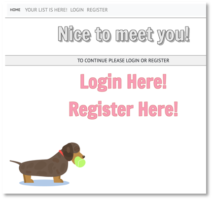
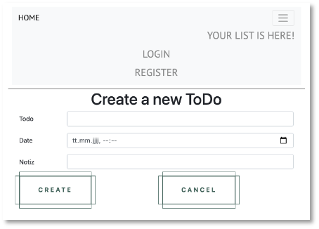
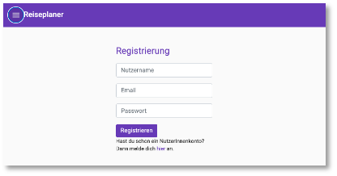
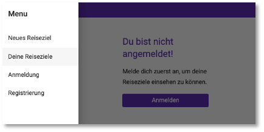

# Web-Technologien

Herzlich willkommen zur WebTech-Veranstaltung im Wintersemester 2024/25! 

### Grober Inhalt

In dieser Veranstaltung lernen Sie, was das World Wide Web ist und wie man eigene Webseiten und -anwendungen realisiert. Sie lernen die Protokolle und Sprachen ``http``, ``HTML``, ``CSS``, ``JavaScript`` und `TypeScript` kennen und machen sich mit ``Angular``, ``Node.js`` und ``REST`` vertraut. Zentrales Thema ist der sogenannte [MEAN](https://www.ibm.com/cloud/learn/mean-stack-explained)-Stack, d.h. Sie lernen die Entwicklung mithilfe von <b>M</b>ongoDB, <b>E</b>xpress.js, <b>A</b>ngular und <b>N</b>ode.js kennen. Neben `MongoDB` lernen wir aber auch kennen, wie Sie `PostgreSQL` als Datenbank in Ihre Anwendung einbinden. 

Nachfolgend der vorläufige Wochenplan (wird eventuell angepasst). 

| | Woche | Themen (Vorlesung) | Übung | Aufgabe (Stand) | Abgabe Übung bis | 
|-|-------|--------------------|-------|-----------------|------------------|
| 1. | 07.-11.10.2024 | [Einführung](einfuehrung.md#webtechnologien-einfuhrung) und [Organisatorisches](#organisatorisches) | [Übung 0](uebungen.md#ubung-0) | - | - | 
| 2. | 14.-18.10.2024 | [HTML](html.md) | [Übung 1](uebungen.md#ubung-1) | Idee | 21.10.2024 | 
| 3. | 21.-25.10.2024 | [CSS (Eigenschaften und Selektoren](css.md#css) | [Übung 2](uebungen.md#ubung-2) | - | 28.10.2024 | 
| 4. | 28.-01.11.2024 | [CSS (Grid)](css.md#grid) | [Übung 3](uebungen.md#ubung-3) | Konzept | 04.11.2024 | 
| 5. | 04.-08.11.2024 | [RWD (responsive Webdesign)](rwd.md#responsive-web-design) | [Übung 4](uebungen.md#ubung-4) | - | 11.11.2024 | 
| 6. | 11.-15.11.2024 | [JavaScript (DOM)](javascript.md#javascript) | [Übung 5](uebungen.md#ubung-5) | Datenmodell | 18.11.2024 | 
| 7. | 18.-22.11.2024 | [Angular (Einführung und Komponenten)](angular.md#angular) | [Übung 6](uebungen.md#ubung-6) | Schnittstelle | 25.11.2024 | 
| 8. | 25.-29.11.2024 | [Angular (Bindings und Direktiven) + JSON](angular2.md#json-und-direktiven) | [Übung 7](uebungen.md#ubung-7) | Frontend (c+r)| 02.12.2024 | 
| 9. | 02.-06.12.2024 | [Angular (Routing und Services)](routing.md#routing-und-services) | [Übung 8](uebungen.md#ubung-8) | Frontend (u+d)| 09.12.2024 | 
| 10. | 09.-13.12.2024 | [Node.js + Express (REST-Server + MongoDB)](backend.md#rest-api-mongodb) |  [Übung 9](uebungen.md#ubung-9)| Frontend fertig | 16.12.2024 | 
| | | | | | | |
| 11. | 16.-20.12.2024 | [Angular (Anbindung ans Backend)](fe-be-anbindung.md#frontend-backend-anbindung) | [Übung 10](uebungen.md#ubung-10) | Backend ( c ) | 06.01.2025 | 
| 12. | 06.-10.01.2025 | [Nutzerverwaltung und Material](guards.md#subject-observable-observer-und-guards) | - | Backend (r + u) | 13.01.2025 |
| 13. | 13.-17.01.2025 | Signals  | - | Backend (d + fertig)| 20.01.2025 |
| 14. | 20.-24.01.2025 | Wiederholung | - | fertig stellen | 27.01.2025 |
| 15. | 27.-31.01.2025 | - | Fragen | - | - |
| 16. | 03.-07.02.2025 | - | Fragen | Abgabe 1.PZ 5.2.2025, Gespräche 6.2.2025  |
|  |  |  |  |Abgabe 2.PZ 26.3.2025, Gespräche 27.3.2025 (evtl. auch 28.3.2025)| - |


Die Erfahrung zeigt, dass die Mehrheit der Abgeben im 2.PZ erfolgt. Sie sollten allerdings bedenken, dass es zwischen dem 1. und dem 2.PZ keine Konsultationen gibt. 

### Organisatorisches 

Zur erfolgreichen Durchführung der Veranstaltung müssen Sie die Übungen lösen und zu den jeweiligen Fristen per Git auf einen Server (GitHub oder GitLab) laden. Am Ende des Semesters ist eine Aufgabe abzugeben. Diese Aufgabe wird bewertet. Die Bewertung entspricht dann der Modulnote. 

[Hier](uebungen.md#ubungen) sind die Übungen beschrieben, die Sie in jeder Woche ausführen sollen. Damit Sie dies erfolgreich erledigen können, ist jeweils angegeben, welche Themen Sie dafür durcharbeiten müssen. Das Durcharbeiten der jeweiligen Themen entspricht jeweils einer Vorlesung. Diese wird also selbständig durchgeführt. 

Für die Kommunikation untereinander verwenden wir [**Slack**](https://slack.com/intl/de-de/). Dort können Sie alle inhaltlichen und organisatorischen Fragen stellen. Ich fände es gut, wenn ich dort möglichst wenig Fragen - zumindest die inhaltlichen - beantworten müsste, sondern eine Art internes Diskussionsforum entsteht. Es ist sehr gewünscht, dort Fragen zu stellen und noch mehr gewünscht, diese von Ihnen dort beantwortet zu sehen. Damit wäre allen geholfen und ich kann besser erkennen, wo noch Nachhol- bzw. Erläuterungsbedarf bei den meisten besteht.  

## Code aus der Vorlesung


??? question "Code Vorlesung HTML"
	```html
	<!DOCTYPE html>
	<html lang="en">
	<head>
	    <meta charset="UTF-8" />
	    <meta name="viewport" content="width=device-width, initial-scale=1.0" />
	    <title>Unsere erste Webseite</title>
	</head>
	<body>
	    <h1>Überschrift 1</h1> 
	    <h2>Überschrift 2</h2>
	    <h3>Überschrift 3</h3>
	    <h4>Überschrift 4</h4>
	    <h5>Überschrift 5</h5>
	    <h6>Überschrift 6</h6>
	    <p>
	        Hier kann ein langer Text stehen. Ist ein ganzer Absatz.     
	        
	        ganz viel anderer Text <br />
	        und nochmehr Text
	        Text mit ganz viel                            Platz
	    </p>
	    
	    
	    <!-- 
	    das ist ein Kommentar
	    -->
	<p>ein neuer Absatz</p>
	    <h3>Input-Elemente</h3>

	    <input type="text" />
	    <textarea></textarea>
	    <input type="color" />
	    <input type="datetime-local" />
	    <input type="file" />

	    <h3>Formulare</h3>

	    <form>
	        <label>Account : </label>
	        <input type = "text" name="account" placeholder="freiheit" title="Geben Sie Ihren Accountnamen ein"/> <br />
	        <label>Password : </label>
	        <input type="password" name="passwort"/> <br/>
	        <button type="submit">Login mit viel Text</button>
	        <input type="button" value="Login">
	    </form>

	</body>
	</html>
	```


??? question "Code Vorlesung CSS"
	=== "01_cascading.html"
		```html
		<!DOCTYPE html>
		<html lang="en">
		<head>
		    <meta charset="UTF-8">
		    <meta http-equiv="X-UA-Compatible" content="IE=edge">
		    <meta name="viewport" content="width=device-width, initial-scale=1.0">
		    <link rel="stylesheet" href="./mystyle.css">
		    <title>Cascading</title>
		    <style>
		        li {
		            display: block;
		        }

		        #firstH2 {
		            font-style: italic;
		        }

		        .fgYellow {
		            color: yellow;
		        }

		        p.bgBrown {
		            background-color: brown;
		        }

		        ol,
		        ul {
		            color: blue;
		        }

		        h2+article+article {
		            color: red;
		        }

		        body {
		            font-family:Verdana;
		        }

		        a {
		            text-decoration: none;
		        }

		        a:link {
		            color: red;
		        }

		        a:visited {
		            color: darkgrey;
		        }

		        a:hover {
		            font-weight: bold;
		        }

		        a:active {
		            color: lightblue;
		        }
		    </style>
		</head>
		<body>
		    <header>
		        <h1 style="color: rgb(79, 101, 79);">Cascading Style Sheets - CSS</h1>
		    </header>
		    <main>
		        <section>
		            <h2 id="firstH2">Section 1</h2>
		            <article>
		                <p class="fgYellow bgBrown">Lorem ipsum dolor sit amet consectetur adipisicing elit. Quisquam, quae.</p>
		                <p class="fgYellow bgBrown">Lorem ipsum dolor sit amet consectetur adipisicing elit. Quisquam, quae.</p>
		            </article>
		            <article class="bgBrown">
		                <p>Lorem ipsum dolor sit amet consectetur adipisicing elit. Quisquam, quae.</p>
		                <p>Lorem ipsum dolor sit amet consectetur adipisicing elit. Quisquam, quae.</p>
		            </article>
		            <p>direktes Kind einer section</p>
		        </section>
		        <section>
		            <h2>Section 2</h2>
		            <article>
		                <p>Lorem ipsum dolor sit amet consectetur adipisicing elit. Quisquam, quae.</p>
		                hallo ballo
		                <p>Lorem ipsum dolor sit amet consectetur adipisicing elit. Quisquam, quae.</p>
		            </article>
		            <article>
		                <p>Lorem ipsum dolor sit amet consectetur adipisicing elit. Quisquam, quae.</p>
		                <p>Lorem ipsum dolor sit amet consectetur adipisicing elit. Quisquam, quae.</p>
		            </article>
		        </section>
		        <ol>
		            <li>item 1
		                <ul>
		                    <li>subitem</li>
		                    <li>subitem</li>
		                    <li>subitem</li>
		                </ul>
		            </li>
		            <li>item 2</li>
		            <li>item 3</li>
		            <li>item 4</li>
		            <li>item 5</li>
		        </ol>
		    </main>
		    <aside>
		        <h2>Aside</h2>
		        <p>Lorem ipsum dolor sit amet consectetur adipisicing elit. Quisquam, quae.</p>
		        <p>Lorem ipsum dolor sit amet consectetur adipisicing elit. Quisquam, quae.</p>
		    </aside>
		    <footer>
		        <p>
		            <a href="./02_boxmodel.html">Boxmodel</a>&nbsp;&middot;&nbsp;
		            <a href="./03_rangfolge.html">Rangfolge</a>
		            <a href="https://www.htw-berlin.de">HTW Berlin</a>

		        </p>
		    </footer>

		</body>
		</html>
		```

	=== "02_boxmodel.html"
		```html
		<!DOCTYPE html>
		<html lang="en">
		<head>
		    <meta charset="UTF-8">
		    <meta http-equiv="X-UA-Compatible" content="IE=edge">
		    <meta name="viewport" content="width=device-width, initial-scale=1.0">
		    <title>Box-Model</title>
		</head>
		<body>
		    <header>
		        <h1>Box-Model</h1>
		    </header>
		    <main>
		        
		        <div>Das FIW-Logo hat eine Breite von 350px (width:350px).
		            Der Inhalt dieser Box hat eine Breite von 320px.
		            Dazu kommt padding von 10px (auf beiden Seiten)
		            und ein Rahmen mit der Breite von 5px. Macht zusammen
		            350px.
		        </div>
		    </main>
		    <footer>
		        <p><a href="./01_cascading.html">Einführung</a>&nbsp;&middot;&nbsp;<a href="./03_rangfolge.html">Rangfolge</a></p>
		    </footer>

		</body>
		</html>
		```

	=== "03_rangfolge.html"
		```html
		<!DOCTYPE html>
		<html lang="en">
		<head>
		    <meta charset="UTF-8">
		    <meta http-equiv="X-UA-Compatible" content="IE=edge">
		    <meta name="viewport" content="width=device-width, initial-scale=1.0">
		    <title>Reihenfolge Selektoren</title>
		</head>
		<body>
		    <header>
		        <h1>Reihenfolge Wirkung Selektoren</h1>
		    </header>
		    <main>
		        <h4>Test</h4>
		        <ul id="navigation">
		            <li><a href="./01_cascading.html" class="link">Einführung</a></li>
		            <li><a href="./02_boxmodel.html" class="link">Boxmodel</a></li>
		        </ul>
		        <h4>Prinzip</h4>
		        <dl>
		            <dt><em>Kategorie A</em></dt>
		            <dd>erhält den Wert 1, wenn CSS-Definitionen direkt im style-Attribut eines HTML-Elementes notiert sind</dd>
		            <dt><em>Kategorie B</em></dt>
		            <dd>erhält den Wert 1 bei Selektoren für Elemente mit id-Attributen</dd>
		            <dt><em>Kategorie C</em></dt>
		            <dd>Anzahl der von einem Selektor betroffenen Klassen und Pseudoklassen</dd>
		            <dt><em>Kategorie D</em></dt>
		            <dd>Anzahl der von einem Selektor betroffenen Elementnamen und Pseudo-Elemente</dd>
		        </dl>
		        <ol>
		            <li>Bei der Reihenfolge der Sortierung gilt: A > B > C > D, also z.B. 1 0 0 0 vor (größer als) 0 1 2 2.</li>
		            <li>Bei Gleichheit gilt die letzte Definition</li>
		        </ol>
		    </main>
		    <footer>
		        <p><a href="./02_boxmodel.html">Boxmodel</a>&nbsp;&middot;&nbsp;<a href="./01_cascading.html">Einführung</a></p>
		    </footer>

		</body>
		</html>
		```

	=== "04_display.html"
		```html
		<!DOCTYPE html>
		<html lang="en">
		<head>
		    <meta charset="UTF-8">
		    <meta name="viewport" content="width=device-width, initial-scale=1.0">
		    <title>display</title>
		    <style>

				p {
		            color: red;
		        }

		        nav {
		            background-color: darkgray;
		            color: white;
		            text-align: center; 
		        }
        
		    </style>
		</head>
		<body>
		<header>
		    <nav>
		<ul>
		    <li><a href="./02_boxmodel.html">Boxmodel</a></li>
		    <li><a href="./01_cascading.html">Cascading</a></li>
		    <li><a href="#">Display</a></li>
		    <li><a href="./05_grid">Grid</a></li>
		</ul>
		    </nav>
		</header>
		<main>
		<h1>The display Property</h1>

		<h2>display: none:</h2>
		<div>
		Lorem ipsum dolor sit amet, consectetur adipiscing elit. Etiam semper diam at erat pulvinar, at pulvinar felis blandit. <p class="ex1">none!</p> Vestibulum volutpat tellus diam, consequat gravida libero rhoncus ut.
		</div>

		<h2>display: inline:</h2>
		<div>
		Lorem ipsum dolor sit amet, consectetur adipiscing elit. Etiam semper diam at erat pulvinar, at pulvinar felis blandit. <p class="ex2">inline!</p> Vestibulum volutpat tellus diam, consequat gravida libero rhoncus ut.
		</div>

		<h2>display: block:</h2>
		<div>
		Lorem ipsum dolor sit amet, consectetur adipiscing elit. Etiam semper diam at erat pulvinar, at pulvinar felis blandit. <p class="ex3">block!</p> Vestibulum volutpat tellus diam, consequat gravida libero rhoncus ut.
		</div>

		<h2>display: inline-block:</h2>
		<div>
		Lorem ipsum dolor sit amet, consectetur adipiscing elit. Etiam semper diam at erat pulvinar, at pulvinar felis blandit. <p class="ex4">neue Zeile und dann inline!</p> Vestibulum volutpat tellus diam, consequat gravida libero rhoncus ut.
		</div>   

		<ul>
		    <li><a href="https://developer.mozilla.org/en-US/docs/Web/CSS/display?retiredLocale=de">Gibt noch sehr viele andere</a></li>
		    <li><a href="./index.html">Zurück</a></li>
		</ul>
		</main>
		    <footer>

		    </footer>
		</body>
		</html>

		```

	=== "05_grid.html"
		```html
		<!DOCTYPE html>
		<html lang="en">
		<head>
		    <meta charset="UTF-8">
		    <meta http-equiv="X-UA-Compatible" content="IE=edge">
		    <meta name="viewport" content="width=device-width, initial-scale=1.0">
		    <title>CSS-Grid</title>
		    <style>

		        .orange {
		            background-color: orange;
		            opacity: 0.5;
		            border: 2px solid gray;
		            border-radius: 5px;
		            padding: 30px;
		        }

		    </style>
		</head>
		<body>
		    <header>
		        <h1>CSS-Grid</h1>
		    </header>
		    <main class="wrapper">
		        <div class="one orange">One</div>
		        <div class="two orange">Two</div>
		        <div class="three orange">Three</div>
		        <div class="four orange">Four</div>
		        <div class="five orange">Five</div>
		        <div class="six orange">Six</div>
		    </main>
		    <footer>
		        <p><a href="https://www.w3schools.com/cssref/pr_grid.php">grid</a></p>
		        <p><a href="https://www.w3schools.com/cssref/pr_grid-template-columns.php">grid-template-columns</a></p>
		        <p><a href="https://css-tricks.com/introduction-fr-css-unit/">fr - fraction</a></p>
		        <p><a href="./index.html">Zurück</a></p>
		    </footer>

		</body>
		</html>
		```


??? question "Code Vorlesung RWD"
	=== "rwd1.html"
		```html
		<!DOCTYPE html>
		<html lang="en">

		<head>
		    <meta charset="UTF-8">
		    <meta http-equiv="X-UA-Compatible" content="IE=edge">
		    <meta name="viewport" content="width=device-width, initial-scale=1.0">
		    <title>Document</title>
		    <style>
		        div {
		            width: 100vw;
		            height: 100vh;
		            text-align: center;
		            background-color: red;
		            padding-top: 20%;
		            padding-bottom: 20%;
		            font-size: medium;
		        }

		    </style>
		</head>

		<body>
		    <div>Ändern Sie die Breite des Browsers, um den Effekt zu sehen.</div>
		</body>
		</body>

		</html>
		```

	=== "rwd2.html"
		```html
		<!DOCTYPE html>
		<html lang="en">

		<head>
		    <meta charset="UTF-8">
		    <meta name="viewport" content="width=device-width, initial-scale=1">
		    <title>Responsive Webdesign</title>
		    <style>
		        .wrapper {
		            display: grid;
		        }

		    </style>
		</head>

		<body>
		    <main class="wrapper small medium large">
		        <p>
		            Lorem ipsum dolor sit amet, consetetur sadipscing elitr, sed diam nonumy eirmod tempor invidunt ut labore et dolore magna aliquyam erat, sed diam voluptua. At vero eos et accusam et justo duo dolores et ea rebum. Stet clita kasd gubergren, no sea takimata
		            sanctus est Lorem ipsum dolor sit amet. Lorem ipsum dolor sit amet, consetetur sadipscing elitr, sed diam nonumy eirmod tempor invidunt ut labore et dolore magna aliquyam erat, sed diam voluptua. At vero eos et accusam et justo duo dolores et
		            ea rebum. Stet clita kasd gubergren, no sea takimata sanctus est Lorem ipsum dolor sit amet. Lorem ipsum dolor sit amet, consetetur sadipscing elitr, sed diam nonumy eirmod tempor invidunt ut labore et dolore magna aliquyam erat, sed diam voluptua.
		            At vero eos et accusam et justo duo dolores et ea rebum. Stet clita kasd gubergren, no sea takimata sanctus est Lorem ipsum dolor sit amet. Duis autem vel eum iriure dolor in hendrerit in vulputate velit esse molestie consequat, vel illum dolore
		            eu feugiat nulla facilisis at vero eros et accumsan et iusto odio dignissim qui blandit praesent luptatum zzril delenit augue duis dolore te feugait nulla facilisi. Lorem ipsum dolor sit amet,
		        </p>
		        <p>
		            Lorem ipsum dolor sit amet, consetetur sadipscing elitr, sed diam nonumy eirmod tempor invidunt ut labore et dolore magna aliquyam erat, sed diam voluptua. At vero eos et accusam et justo duo dolores et ea rebum. Stet clita kasd gubergren, no sea takimata
		            sanctus est Lorem ipsum dolor sit amet. Lorem ipsum dolor sit amet, consetetur sadipscing elitr, sed diam nonumy eirmod tempor invidunt ut labore et dolore magna aliquyam erat, sed diam voluptua. At vero eos et accusam et justo duo dolores et
		            ea rebum. Stet clita kasd gubergren, no sea takimata sanctus est Lorem ipsum dolor sit amet. Lorem ipsum dolor sit amet, consetetur sadipscing elitr, sed diam nonumy eirmod tempor invidunt ut labore et dolore magna aliquyam erat, sed diam voluptua.
		            At vero eos et accusam et justo duo dolores et ea rebum. Stet clita kasd gubergren, no sea takimata sanctus est Lorem ipsum dolor sit amet. Duis autem vel eum iriure dolor in hendrerit in vulputate velit esse molestie consequat, vel illum dolore
		            eu feugiat nulla facilisis at vero eros et accumsan et iusto odio dignissim qui blandit praesent luptatum zzril delenit augue duis dolore te feugait nulla facilisi. Lorem ipsum dolor sit amet,
		        </p>
		        <p>
		            Lorem ipsum dolor sit amet, consetetur sadipscing elitr, sed diam nonumy eirmod tempor invidunt ut labore et dolore magna aliquyam erat, sed diam voluptua. At vero eos et accusam et justo duo dolores et ea rebum. Stet clita kasd gubergren, no sea takimata
		            sanctus est Lorem ipsum dolor sit amet. Lorem ipsum dolor sit amet, consetetur sadipscing elitr, sed diam nonumy eirmod tempor invidunt ut labore et dolore magna aliquyam erat, sed diam voluptua. At vero eos et accusam et justo duo dolores et
		            ea rebum. Stet clita kasd gubergren, no sea takimata sanctus est Lorem ipsum dolor sit amet. Lorem ipsum dolor sit amet, consetetur sadipscing elitr, sed diam nonumy eirmod tempor invidunt ut labore et dolore magna aliquyam erat, sed diam voluptua.
		            At vero eos et accusam et justo duo dolores et ea rebum. Stet clita kasd gubergren, no sea takimata sanctus est Lorem ipsum dolor sit amet. Duis autem vel eum iriure dolor in hendrerit in vulputate velit esse molestie consequat, vel illum dolore
		            eu feugiat nulla facilisis at vero eros et accumsan et iusto odio dignissim qui blandit praesent luptatum zzril delenit augue duis dolore te feugait nulla facilisi. Lorem ipsum dolor sit amet,
		        </p>
		        <p>
		            Lorem ipsum dolor sit amet, consetetur sadipscing elitr, sed diam nonumy eirmod tempor invidunt ut labore et dolore magna aliquyam erat, sed diam voluptua. At vero eos et accusam et justo duo dolores et ea rebum. Stet clita kasd gubergren, no sea takimata
		            sanctus est Lorem ipsum dolor sit amet. Lorem ipsum dolor sit amet, consetetur sadipscing elitr, sed diam nonumy eirmod tempor invidunt ut labore et dolore magna aliquyam erat, sed diam voluptua. At vero eos et accusam et justo duo dolores et
		            ea rebum. Stet clita kasd gubergren, no sea takimata sanctus est Lorem ipsum dolor sit amet. Lorem ipsum dolor sit amet, consetetur sadipscing elitr, sed diam nonumy eirmod tempor invidunt ut labore et dolore magna aliquyam erat, sed diam voluptua.
		            At vero eos et accusam et justo duo dolores et ea rebum. Stet clita kasd gubergren, no sea takimata sanctus est Lorem ipsum dolor sit amet. Duis autem vel eum iriure dolor in hendrerit in vulputate velit esse molestie consequat, vel illum dolore
		            eu feugiat nulla facilisis at vero eros et accumsan et iusto odio dignissim qui blandit praesent luptatum zzril delenit augue duis dolore te feugait nulla facilisi. Lorem ipsum dolor sit amet,
		        </p>
		    </main>
		</body>

		</html>

		```


??? question "Code Vorlesung Bootstrap"
	=== "bootstrap.html"
		```html
		<!DOCTYPE html>
		<html lang="en">

		<head>
		    <meta charset="UTF-8">
		    <meta name="viewport" content="width=device-width, initial-scale=1, shrink-to-fit=no">
		    <!-- <link href="../bootstrap.min.css" rel="stylesheet"> -->
		    <title>Bootstrap</title>
		</head>

		<body>
		    <main role="main">
		        <div class="p-5 mb-4 bg-warning rounded-3">
		            <div class="container-fluid py-5">
		                <h1 class="display-5 fw-bold">Jetzt mit Bootstrap!</h1>
		                <p class="col-md-8 fs-4">Wir verwenden jetzt Bootstrap und schauen uns mal die Anwendung ein wenig genauer an. Das Grundprinzip besteht darin, HTML-Elementen Klassen zuzuordnen. </p>
		                <p><a class="btn btn-primary btn-lg" href="https://getbootstrap.com/docs/5.3/examples/" role="button">Bootstrap Beispiele &raquo;</a></p>
		            </div>
		        </div>

		        <div class="container">
		            <h2>Formular mit Validierung, ob Eingabe erfolgte (nur mit CSS - kein JavaScript!)</h2>
		            <p>Hier wird z.B. die Klasse <code>.was-validated</code> verwendet, um zu überprüfen, ob in den Textfeldern und der Checkbox eine Eingabe erfolgt ist.</p>
		            <form class="was-validated">
		                <div class="form-group">
		                    <label for="uname">Username:</label>
		                    <input type="text" class="form-control" id="uname" placeholder="Enter username" name="uname" required>
		                    <div class="valid-feedback">Korrekt</div>
		                    <div class="invalid-feedback">Feld bitte ausfüllen!</div>
		                </div>
		                <div class="form-group">
		                    <label for="pwd">Password:</label>
		                    <input type="password" class="form-control" id="pwd" placeholder="Enter password" name="pswd" required>
		                    <div class="valid-feedback">Korrekt</div>
		                    <div class="invalid-feedback">Feld bitte ausfüllen!</div>
		                </div>
		                <div class="form-group form-check">
		                    <label class="form-check-label">
		                    <input class="form-check-input" type="checkbox" name="remember" required> Ich habe die Datenschutzerklärung gelesen und stimme ihr zu.
		                    <div class="valid-feedback">Korrekt</div>
		                    <div class="invalid-feedback">Hier bitte bestätigen!</div>
		                </label>
		                </div>
		                <button type="submit" class="btn btn-primary">Login</button>
		            </form>
		        </div>
		    </main>
		</body>

		</html>
		```

	=== "bs_grid.html"
		```html
		<!DOCTYPE html>
		<html lang="en">

		<head>
		    <meta charset="UTF-8">
		    <meta name="viewport" content="width=device-width, initial-scale=1, shrink-to-fit=no">
		    <link href="https://cdn.jsdelivr.net/npm/bootstrap@5.3.3/dist/css/bootstrap.min.css" rel="stylesheet" integrity="sha384-QWTKZyjpPEjISv5WaRU9OFeRpok6YctnYmDr5pNlyT2bRjXh0JMhjY6hW+ALEwIH" crossorigin="anonymous">
		  
		    <title>Grid</title>
		    <style>
		        div div {
		            padding: 10px;
		        }
		    </style>
		</head>

		<body>
		    <main class="container pt-5 ">
		        <h2>Wichtig ist, dass die Spaltenanzahl in einer Zeile 12 ergibt</h2>
		        <div class="row">
		            <div class="col-3" style="background-color: lightgrey;">
		                <h3>col-3</h3>
		                <p>Diesem &lt;div&gt; wurde die Klasse <code>col-3</code> zugewiesen</p>
		            </div>
		            <div class="col-4" style="background-color: darkgrey;">
		                <h3>col-4</h3>
		                <p>Diesem &lt;div&gt; wurde die Klasse <code>col-4</code> zugewiesen</p>
		            </div>
		            <div class="col-5" style="background-color: grey;">
		                <h3>col-5</h3>
		                <p>Diesem &lt;div&gt; wurde die Klasse <code>col-5</code> zugewiesen</p>
		            </div>
		        </div>
		    </main>
		</body>

		</html>
		```

	=== "bs_responsive.html"
		```html
		<!DOCTYPE html>
		<html lang="en">

		<head>
		    <meta charset="UTF-8">
		    <meta name="viewport" content="width=device-width, initial-scale=1, shrink-to-fit=no">
		    <link href="https://cdn.jsdelivr.net/npm/bootstrap@5.3.3/dist/css/bootstrap.min.css" rel="stylesheet" integrity="sha384-QWTKZyjpPEjISv5WaRU9OFeRpok6YctnYmDr5pNlyT2bRjXh0JMhjY6hW+ALEwIH" crossorigin="anonymous">
		  
		    <title>Grid</title>
		    <style>
		        div div {
		            padding: 10px;
		            margin-top: 5px;
		            margin-bottom: 5px;
		        }

		        .row div:nth-child(odd) {
		            background-color: lightgrey;
		            color: black;
		        }

		        .row div:nth-child(even) {
		            background-color: grey;
		            color: white;
		        }
		    </style>
		</head>

		<body>
		    <main class="container pt-5 ">
		        <h2>Jetzt responsiv - ändern Sie die Monitorbreite</h2>
		        <div class="row">
		            <div class="col-12 col-sm-6 col-md-4 col-lg-3 col-xl-2">
		                <ul>
		                    <li>xs: <code>col-12</code> 1/1</li>
		                    <li>sm: <code>col-sm-6</code> 1/2</li>
		                    <li>md: <code>col-md-4</code> 1/3</li>
		                    <li>lg: <code>col-lg-3</code> 1/4</li>
		                    <li>xl: <code>col-xl-2</code> 1/6</li>
		                </ul>
		            </div>
		            <div class="col-12 col-sm-6 col-md-4 col-lg-3 col-xl-2">
		                <ul>
		                    <li>xs: <code>col-12</code> 1/1</li>
		                    <li>sm: <code>col-sm-6</code> 2/2</li>
		                    <li>md: <code>col-md-4</code> 2/3</li>
		                    <li>lg: <code>col-lg-3</code> 2/4</li>
		                    <li>xl: <code>col-xl-2</code> 2/6</li>
		                </ul>
		            </div>
		            <div class="col-12 col-sm-6 col-md-4 col-lg-3 col-xl-2">
		                <ul>
		                    <li>xs: <code>col-12</code> 1/1</li>
		                    <li>sm: <code>col-sm-6</code> 1/2</li>
		                    <li>md: <code>col-md-4</code> 3/3</li>
		                    <li>lg: <code>col-lg-3</code> 3/4</li>
		                    <li>xl: <code>col-xl-2</code> 3/6</li>
		                </ul>
		            </div>
		            <div class="col-12 col-sm-6 col-md-4 col-lg-3 col-xl-2">
		                <ul>
		                    <li>xs: <code>col-12</code> 1/1</li>
		                    <li>sm: <code>col-sm-6</code> 2/2</li>
		                    <li>md: <code>col-md-4</code> 1/3</li>
		                    <li>lg: <code>col-lg-3</code> 4/4</li>
		                    <li>xl: <code>col-xl-2</code> 4/6</li>
		                </ul>
		            </div>
		            <div class="col-12 col-sm-6 col-md-4 col-lg-6 col-xl-2">
		                <ul>
		                    <li>xs: <code>col-12</code> 1/1</li>
		                    <li>sm: <code>col-sm-6</code> 1/2</li>
		                    <li>md: <code>col-md-4</code> 2/3</li>
		                    <li>lg: <code>col-lg-6</code> 1/2</li>
		                    <li>xl: <code>col-xl-2</code> 5/6</li>
		                </ul>
		            </div>
		            <div class="col-12 col-sm-6 col-md-4 col-lg-6 col-xl-2">
		                <ul>
		                    <li>xs: <code>col-12</code> 1/1</li>
		                    <li>sm: <code>col-sm-6</code> 2/2</li>
		                    <li>md: <code>col-md-4</code> 3/3</li>
		                    <li>lg: <code>col-lg-6</code> 2/2</li>
		                    <li>xl: <code>col-xl-2</code> 6/6</li>
		                </ul>
		            </div>
		        </div>
		    </main>
		</body>

		</html>

		```

??? question "Code Vorlesung JavaScript"
	=== "js_vorl.html"
		```html
		<!DOCTYPE html>
		<html lang="en">
		<head>
		    <meta charset="UTF-8">
		    <meta name="viewport" content="width=device-width, initial-scale=1.0">
		    <title>JavaScript</title>
		    <style>
		        .kap {
		            text-transform: uppercase;
		        }

		        .normal {
		            text-transform: lowercase;
		        }

		    </style>
		</head>
		<body onload="init()">
		    <main>
		        <h4 class="kap">Ergebnisliste</h4>
		        <ul id="ulresult">
		            <li id="liresult1"></li>
		        </ul>
		        <input type="text" id="input" placeholder="Name" value="Maria" onchange="text()" onfocus="changeStyle()" onblur=""/>
		        <button type="button" onclick="klickMich()">Klick Mich!</button>
		    </main>
		    <ol id="ol">
		        
		    </ol>
		    <script>  
		        let nr = 2;
		        
		        function klickMich() {

		            console.log("Hello FIW!");
		            let input = document.querySelector('#input');
		            console.log("input ", input.value)

		            let li1 = document.querySelector('#liresult1');
		            if(li1.textContent == '')
		            {
		                let text = document.createTextNode(input.value);
		                li1.appendChild(text)
		            }
		            else
		            {
		                let li = document.createElement('li');
		                let text = document.createTextNode(input.value);
		                li.appendChild(text)
		                document.querySelector('#ulresult').appendChild(li)
		                console.log('liresult : ', 'liresult' + nr)
		                li.id = 'liresult' + nr;
		                nr++;
		                
		            }
		        }

		        function init() {
		            const body = document.querySelector('body');
		            console.log('body : ', body)
		            const bodyKids = body.children;
		            for(let kid of bodyKids)
		            {
		                console.log(kid)
		            }
		            console.log(bodyKids[0])

		            let h1 = document.createElement('h1');
		            let h1Text = document.createTextNode('Überschrift');
		            h1.appendChild(h1Text);
		            h1.style.color = 'green';

		            h1.addEventListener('mouseover', () => {
		                h1.style.color = 'red';
		                h1.classList.add('kap')
		                h1.classList.remove('normal')
		            })
		            h1.addEventListener('mouseout', () => {
		                h1.style.color = 'green';
		                h1.classList.remove('kap')
		                h1.classList.add('normal')
		            })

		            body.insertBefore(h1, bodyKids[0])

		            let ol = document.querySelector('ol')
		            let item1 = "Item 1"
		            let item2 = "Item 2"

		            // ol.innerHTML = '<li>' + item1 + '</li> <li>' + item2 + '</li>' ;
		            ol.innerHTML = `<li> ${item1} </li>
		            <li> ${item2} </li>`

		        }

		        function text()
		        {
		            console.log(' input : ', document.querySelector('#input').value)
		        }

		        function changeStyle() {
		            let input = document.querySelector('#input');
		            console.log('input : ', input)
		            input.style.backgroundColor = 'lightgrey';
		            input.style.border= '2px solid red'
		            input.style.outline = 'none'
		        }

		    </script>
		</body>
		</html>
		```

	=== "js_create.html"
		```html
		<!DOCTYPE html>
		<html lang="en">
		<head>
		    <meta charset="UTF-8">
		    <meta name="viewport" content="width=device-width, initial-scale=1.0">
		    <link href="https://cdn.jsdelivr.net/npm/bootstrap@5.2.3/dist/css/bootstrap.min.css" rel="stylesheet"
		        integrity="sha384-rbsA2VBKQhggwzxH7pPCaAqO46MgnOM80zW1RWuH61DGLwZJEdK2Kadq2F9CUG65" crossorigin="anonymous">
		    <title>Javascript</title>
		    <style>
		        div#output {
		            height: 300px;
		        }
		    </style>
		</head>
		<body class="container">
		    <h1>Formular auslesen</h1>
		    <h4>Kommentare</h4>

		    <form id="form" onsubmit="return false;"> 
		        <div class="form-floating mb-3">
		            <input type="text" class="form-control" id="input1" placeholder="Kommentar 1" onchange="fixeInput()" />
		            <label for="input1">Kommentar 1</label>
		        </div>
		    </form> 
		    <script>
		        let nr = 1;

		        function fixeInput() {
		            let curInputId = "input" + nr;
		            let curInputElement = document.getElementById(curInputId);
		            console.log(curInputElement.value);
		            curInputElement.disabled = "true";

		            let newDiv = document.createElement('div');
		            newDiv.classList.add("form-floating", "mb-3");
		            nr++;
		            let newInputId = "input"+nr;
		            let newInput = document.createElement('input');
		            newInput.classList.add("form-control");
		            newInput.placeholder = "Kommentar " + nr;
		            newInput.id = newInputId;
		            newInput.addEventListener("change", fixeInput);
		            let newLabel = document.createElement('label');
		            newLabel.for = newInputId;
		            newLabel.textContent = "Kommentar " + nr;
		            newDiv.appendChild(newInput);
		            newDiv.appendChild(newLabel);
		            let form = document.getElementById('form');
		            form.appendChild(newDiv);

		            newInput.focus();
		        }
		    </script>

		</body>
		</html>

		```

	=== "js_object.html"
		```html
		<!DOCTYPE html>
		<html lang="en">
		<head>
		    <meta charset="UTF-8">
		    <meta name="viewport" content="width=device-width, initial-scale=1.0">
		    <link href="https://cdn.jsdelivr.net/npm/bootstrap@5.2.3/dist/css/bootstrap.min.css" rel="stylesheet"
		        integrity="sha384-rbsA2VBKQhggwzxH7pPCaAqO46MgnOM80zW1RWuH61DGLwZJEdK2Kadq2F9CUG65" crossorigin="anonymous">
		    <title>Javascript</title>
		    <style>
		        div#output {
		            height: 300px;
		        }

		        input[type=text] {
		            border: white;
		        }
		    </style>
		</head>
		<body class="container" onload="setBackgroundColorDiv()">

		    <h1>JavaScript-Objekte</h1>
		    <div id="output">

		    </div>
		    <div class="my-3">
		        <div class="row">
		            <div class="col-2">
		                <label for="hueIP" class="form-label">Hue (Farbton)</label>
		            </div>
		            <div class="col-2">
		                <input type="text" class="form-range" id="hueOP" value="50" disabled>
		            </div>
		            <div class="col-8">
		                <input type="range" class="form-range" min="0" max="360" id="hueIP" oninput="setBackgroundColorDiv()" value="50">
		            </div>
		        </div>
		        <div class="row">
		            <div class="col-2">
		                <label for="satIP" class="form-label">Saturation (Sättigung)</label>
		            </div>
		            <div class="col-2">
		                <input type="text" class="form-range" id="satOP" value="50" disabled>
		            </div>
		            <div class="col-8">
		                <input type="range" class="form-range" min="0" max="100" id="satIP" oninput="setBackgroundColorDiv()" value="50">
		            </div>
		        </div>
		        <div class="row">
		            <div class="col-2">
		                <label for="lightIP" class="form-label">Lightness (Helligkeit)</label>
		            </div>
		            <div class="col-2">
		                <input type="text" class="form-range" id="lightOP" value="50" disabled>
		            </div>
		            <div class="col-8">
		                <input type="range" class="form-range" min="0" max="100" id="lightIP" oninput="setBackgroundColorDiv()" value="50">
		            </div>
		        </div>
		    </div>
		   <script>
		    function setBackgroundColorDiv() {
		        let colorHSL = {
		            hue: document.querySelector('#hueIP').value,
		            saturation: document.querySelector('#satIP').value,
		            lightness: document.querySelector('#lightIP').value,
		            getColor: () => `hsl(${colorHSL.hue}, ${colorHSL.saturation}%, ${colorHSL.lightness}%)`
		        }

		        document.querySelector('#hueOP').value = colorHSL.hue;
		        document.querySelector('#satOP').value = colorHSL.saturation;
		        document.querySelector('#lightOP').value = colorHSL.lightness;

		        let div = document.getElementById('output');
		        div.style.backgroundColor = colorHSL.getColor();
		    }


		   </script>
		</body>
		</html>

		```


## Semesteraufgabe

Am Ende des Kurses geben Sie eine Webanwendung ab. Diese wird bewertet und bildet die Modulnote für "WebTech" (es gibt also keine Klausur o.ä.). Überlegen Sie sich früh, was Sie implementieren wollen. Ihrer Kreativität sind keine Grenzen gesetzt. Es können 2 Studentinnen gemeinsam ein Projekt durchführen und abgeben. Sie erhalten dann (höchstwahrscheinlich) die gleiche Note. Es muss an den Commits erkennbar sein, welchen Anteil am Ergebnis jede der beiden Studentinnen hatte.

??? question "Mindestanforderungen"
	Folgende Anforderungen werden an Ihr Projekt gestellt:

	* das Frontend soll mit Angular entwickelt werden,
	* das Backend mit Node.js,
	* es soll eine Datenbank (MongoDB, kann aber auch MySQL oder PostgreSQL oder MariaDB - aber **nicht** Firebase) verwendet werden,
	* es soll CRUD implementiert sein, d.h. Sie benötigen 
	    * eine Komponente zur Erstellung und Speicherung eines Datenbankeintrages (<b>C</b>reate),
	    * eine Komponente zur Änderung eines Datenbankeintrages (<b>U</b>pdate),
	    * eine Komponente zur Anzeige *aller* Datenbankeinträge (<b>R</b>ead),
	    * eine Komponente zum Löschen eines Datenbankeintrages (<b>D</b>elete).
    * wenn Sie die Anwendung alleine umsetzen, dann genügen 3 der 4 CRUD-Funktionalitäten
    * wenn Sie die Anwendung zu zweit entwickeln, dann
    	* sollen alle 4 CRUD-Funktionalitäten umgesetzt werden und
    	* Login (Username + Passwort) und
    	* ich schaue mir die Commit-Hiostorie im Git genauer an, um sicherzugehen, dass beide Studentinnen gleich viel an der Anwendung mitentwickelt haben

	Datenbankeinträge können Bücher, CDs, ToDos, Einkaufslisten, Vorlesungen, Kühlschrankinhalte usw. sein - wie gesagt, Ihrer Kreativität sind keine Grenzen gesetzt. 

	Die Anwendung soll in einem Git-Dienst (GitHub, GitLab, ...) verfügbar sein. 

	Verwenden Sie ein CSS-Framework, wie z.B. Materialize, Bootstrap o.ä.! Ihre Anwendung soll "modern" aussehen und responsive sein. 

	Erstellen Sie eine **informative (ausführliche) README**-Datei (`README.md`). Diese Datei sollte beinhalten:

	 - Eine Beschreibung Ihrer Anwendung. Am besten mit Screenshots, so dass sie Ihren Kommilitoninnen aus den nächsten Jahren hilft, ein Verständnis dafür zu entwickeln, was mögliche Semesteraufgaben sein können.
	 - Eine Anleitung zur Installation Ihrer Anwendung. 

	Super wäre es, wenn Sie die Datenbank, die Sie verwenden, per Skript vorausfüllen, d.h. es wäre schön, wenn zum Testen der Anwendung nur das Frontend und das Backend gestartet werden müssten und alles andere automatisch passieren würde. Super wäre es auch, wenn Sie Ihre Anwendung deployen würden. 
	
	Nach Abgabe vereinbaren wir ein Online-Meeting, in dem Sie mir Ihre Anwendung nochmal zeigen können und ich Ihnen Fragen zu Ihrem Code stellen werde. Ist keine Prüfung, sondern eher ein fachliches Gespräch. 

## Abgabe- und Gesprächstermine

Die Lösung für die Semesteraufgabe pushen Sie in Ihr Respository. In einem Gespräch führen Sie die Lösung vor und wir unterhalten uns über Ihre Lösung. Dafür stehen verschiedene Termine zur Verfügung. 

- 1. Prüfungszeitraum: 5.2.2025 Abgabe und 6.2.2025 Gespräch
- 2. Püfungszeitraum: 26.3.2025 Abgabe und 27.3.2025 Gespräch

Bitte tragen Sie sich in [Moodle](https://moodle.htw-berlin.de/course/view.php?id=49991) in den von Ihnen gewünschten Gesprächstermin ein! Wenn Sie im 1.PZ abgeben, tragen Sie sich im LSF zum ersten PZ zur Prüfung ein, ansonsten im 2.PZ. 

### Einige Beispiele

#### Mieter- und Zahlungsinformationen verwalten

- 
- 
	

#### ToDo-Liste

- 
- 
- 	

- 
- 


#### Dog-O-Mat

- 


#### Reiseplaner

- 
- 

