# Web-Technologien

Herzlich willkommen zur WebTech-Veranstaltung im Sommersemester 2026! 

### Grober Inhalt

In dieser Veranstaltung lernen Sie, was das World Wide Web ist und wie man eigene Webseiten und -anwendungen realisiert. Sie lernen die Protokolle und Sprachen ``http``, ``HTML``, ``CSS``, ``JavaScript`` und `TypeScript` kennen und machen sich mit ``Angular``, ``Node.js`` und ``REST`` vertraut. Zentrales Thema ist der sogenannte [MEAN](https://www.ibm.com/cloud/learn/mean-stack-explained)-Stack, d.h. Sie lernen die Entwicklung mithilfe von <b>M</b>ongoDB, <b>E</b>xpress.js, <b>A</b>ngular und <b>N</b>ode.js kennen. Allerdings verwenden wir statt `MongoDB` hier als Datenbank `PostgreSQL`, um dichter an unserem Datenbankmodul im Studiengang zu sein. Der Stack heißt komischerweise trotzdem `MEAN` (und nicht `PEAN`). 

Nachfolgend der vorläufige Wochenplan (wird eventuell angepasst). 

| Woche | Themen (Vorlesung) | Übung | Aufgabe (Stand) | 
|-------|--------------------|-------|-----------------|
| 06.-10.4.2026 | [Einführung](einfuehrung.md#webtechnologien-einfuhrung) und [Organisatorisches](#organisatorisches) | [Übung 0](uebungen.md#ubung-0) | - | 
| 13.-17.4.2026 | [HTML](html.md) | [Übung 1](uebungen.md#ubung-1) | | 
| 20.-27.4.2026 | [CSS (Eigenschaften und Selektoren](css.md#css) | [Übung 2](uebungen.md#ubung-2) | | 
| 27.-01.5.2026 | [CSS (Grid)](css.md#grid) | [Übung 3](uebungen.md#ubung-3) | | 
| 04.-08.5.2026 | [RWD (responsive Webdesign)](rwd.md#responsive-web-design) | [Übung 4](uebungen.md#ubung-4) | | 
| 11.-15.5.2026 | [JavaScript (DOM)](javascript.md#javascript) | [Übung 5](uebungen.md#ubung-5) | | 
| 18.-22.5.2026  | [Angular (Einführung und Komponenten)](angular.md#angular) | [Übung 6](uebungen.md#ubung-6) | Angular-Projekt und <br/>Frontend-Repo |  
| 25.-29.5.2026 | [Templates (Bindings)](templates.md#templates-bindings) | [Übung 7](uebungen.md#ubung-7) | Komponenten Frontend + Routing |  
| 01.-05.6.2026  | [Angular (Routing und Services)](routing.md#routing-und-services) | [Übung 8](uebungen.md#ubung-8) | Formulare Frontend | 
| 08.-12.6.2026 | [Node.js + Express (REST-Server MongoDB)](backend.md#rest-api) |  [Übung 9](uebungen.md#ubung-9)| Node.js-Projekt und <br/>Backend-Repo | 
| 15.-19.6.2026 | [Angular (Anbindung ans Backend)](fe-be-anbindung.md#frontend-backend-anbindung) | [Übung 10](uebungen.md#ubung-10) | Datenbank und <br/>REST-Endpunkte | 
| 22.-26.6.2026 | [Nutzerverwaltung und Material](guards.md#subject-observable-observer-und-guards) | - | Backend-Frontend-Anbindung | 
| 29.-03.7.2026 | Signals  | - | Backend fertig | 
| 06.-10.7.2026  | Wiederholung | - | fertig stellen | 
| 20.-24.7.2026  | Fragen | - | - |
| 27.-31.7.2026  | Fragen | - | - |
| - | - | Abgabe 1.PZ 3.8., Gespräche 4.8.2026  |
| - | - | Abgabe 2.PZ 28.9.2026, Gespräche 29.9.2026 (evtl. auch 30.9.2026) |


Die Erfahrung zeigt, dass die Mehrheit der Abgeben im 2.PZ erfolgt. Sie sollten allerdings bedenken, dass es zwischen dem 1. und dem 2.PZ keine Konsultationen gibt. 

### Organisatorisches 

Zur erfolgreichen Durchführung der Veranstaltung müssen Sie die Übungen lösen und zu den jeweiligen Fristen per Git auf einen Server (GitHub oder GitLab) laden. Am Ende des Semesters ist eine Aufgabe abzugeben. Diese Aufgabe wird bewertet. Die Bewertung entspricht dann der Modulnote. 

[Hier](uebungen.md#ubungen) sind die Übungen beschrieben, die Sie in jeder Woche ausführen sollen. Damit Sie dies erfolgreich erledigen können, ist jeweils angegeben, welche Themen Sie dafür durcharbeiten müssen. Das Durcharbeiten der jeweiligen Themen entspricht jeweils einer Vorlesung. Diese wird also selbständig durchgeführt. 

Für die Kommunikation untereinander verwenden wir [**Slack**](https://slack.com/intl/de-de/). Dort können Sie alle inhaltlichen und organisatorischen Fragen stellen. Ich fände es gut, wenn ich dort möglichst wenig Fragen - zumindest die inhaltlichen - beantworten müsste, sondern eine Art internes Diskussionsforum entsteht. Es ist sehr gewünscht, dort Fragen zu stellen und noch mehr gewünscht, diese von Ihnen dort beantwortet zu sehen. Damit wäre allen geholfen und ich kann besser erkennen, wo noch Nachhol- bzw. Erläuterungsbedarf bei den meisten besteht.  

## Code aus der Vorlesung

??? hint "HTML-Vorlesung 14.04.2026"
	
	Download [htw.jpg](./files/htw.jpg) --> Abspeichern im Ordner `images`.

	=== "index.html"
		```html
		<!DOCTYPE html>
		<html lang="de">
		<head>
		  <meta charset="UTF-8">
		  <meta name="viewport" content="width=device-width, initial-scale=1.0">
		  <title>Erstes HTML</title>
		</head>
		<body>
		  <header>
		    <h1>Große Überschrift</h1>
		    <h3>Mittlere Überschrift</h3>
		    <h6>Kleinste Überschrift</h6>
		  </header>
		  <nav>
		    <a href="./page1.html"> Zur Unterseite </a>
		  </nav>
		  <main>

		    <p>
		      Lorem, ipsum dolor sit amet consectetur adipisicing elit. Beatae possimus blanditiis vel laudantium, officiis tempora dolores debitis praesentium sunt iusto necessitatibus nam temporibus fuga aspernatur assumenda ab nesciunt exercitationem explicabo deserunt illo alias optio ipsam repudiandae facere. Unde enim deserunt tempora ad quos cupiditate fuga assumenda dignissimos, animi nisi voluptatum.
		    </p>
		    <p>
		      Lorem, ipsum dolor sit amet consectetur adipisicing elit. Beatae possimus blanditiis vel laudantium, officiis tempora dolores debitis praesentium sunt iusto necessitatibus nam temporibus fuga aspernatur assumenda ab nesciunt exercitationem explicabo deserunt illo alias optio ipsam repudiandae facere. Unde enim deserunt tempora ad quos cupiditate fuga assumenda dignissimos, animi nisi voluptatum.
		    </p>
		    <p>
		      Hier steht ein bisschen Text. Auch über die <a href="https://www.htw-berlin.de/">
		        HTW Berlin
		      </a>. Text geht weiter.
		      
		      <br/>
		      der Text geht weiter
		    </p>
		    <h3>Listen</h3>
		    <ol>
		      <li>List Item 1</li>
		      <li>List Item 2
		        <ul>
		          <li>Unterpunkt 1</li>
		          <li>Unterpunkt 2</li>
		          <li>Unterpunkt 3</li>
		        </ul>
		      </li>
		      <li>List Item 3</li>
		    </ol>
		    <h3>Tabellen</h3>
		    <table>
		      <thead>
		        <tr>
		          <th>HTML-Element</th>
		          <th>Bedeutung</th>
		        </tr>
		      </thead>
		      <tbody>
		        <tr>
		          <td><code>&lt;tr&gt;</code></td>
		          <td>Tabellenzeile</td>
		        </tr>
		        <tr>
		          <td><code>&lt;th&gt;</code></td>
		          <td>Spaltenüberschrift</td>
		        </tr>
		        <tr>
		          <td><code>&lt;td&gt;</code></td>
		          <td>Datenzelle</td>
		        </tr>
		      </tbody>
		    </table>
		        
		  </main>
		  <footer>
		    copyright 2026
		  </footer>
		</body>
		</html>
		```

	=== "page1.html"
		```html
		<!DOCTYPE html>
		<html lang="de">
		<head>
		    <meta charset="UTF-8">
		    <meta name="viewport" content="width=device-width, initial-scale=1.0">
		    <title>HTML Einführung - Lerne die Grundlagen</title>
		    <!-- 
		    <link rel="stylesheet" href="css/style.css"> 
		    -->
		</head>
		<body>

		    <header>
		        <h1>Willkommen zur HTML-Einführung</h1>
		        <p>HTML enthält alle Inhalte</p>
		    </header>

		    <nav>
		        <h3>Inhaltsverzeichnis</h3>
		        <ul>
		            <li><a href="#struktur">Die Grundstruktur</a></li>
		            <li><a href="#texte">Texte und Formatierung</a></li>
		            <li><a href="#medien">Bilder und Links</a></li>
		            <li><a href="#tabellen">Tabellen</a></li>
		            <li><a href="#details">Akkordeon</a></li>
		            <li><a href="#dialog">Modaler Dialog</a></li>
		        </ul>
		    </nav>

		    <main>
		        <section id="struktur">
		            <h2>1. Die Grundstruktur</h2>
		            <p>Jedes HTML-Dokument beginnt mit dem <code>&lt;!DOCTYPE html&gt;</code>. Dies sagt dem Browser, dass es sich um ein modernes HTML5-Dokument handelt.</p>
		            <p>Die wichtigsten "Eltern-Elemente" sind:</p>
		            <ul>
		                <li><strong>&lt;html&gt;</strong>: Die Wurzel des Dokuments.</li>
		                <li><strong>&lt;head&gt;</strong>: Enthält Metadaten (nicht sichtbar auf der Seite).</li>
		                <li><strong>&lt;body&gt;</strong>: Hier kommt alles rein, was die Nutzerin sieht.</li>
		            </ul>
		        </section>

		        <section id="texte">
		            <h2>2. Texte und Listen</h2>
		            <p>Man nutzt Überschriften von <code>&lt;h1&gt;</code> bis <code>&lt;h6&gt;</code>, um Inhalte zu strukturieren.</p>
		            
		            <h3>Geordnete Liste (Beispiel)</h3>
		            <ol>
		                <li>HTML lernen</li>
		                <li>CSS lernen</li>
		                <li>JavaScript lernen</li>
		            </ol>
		        </section>

		        <section id="medien">
		            <h2>3. Bilder und Verweise</h2>
		            <p>Ein Link wird mit dem <span class="highlight">Anchor-Tag</span> <code>&lt;a&gt;</code> erstellt:</p>
		            <a href="https://www.htw-berlin.de/" target="_blank">Dies ist ein externer Link zur HTW-Seite</a>

		            <h3>Ein Bild einbinden</h3>
		            <p>Bilder benötigen ein <code>src</code> (Quelle) und ein <code>alt</code> (Alternative für Screenreader) Attribut.</p>
		            
		        </section>

		        <section id="tabellen">
		            <h2>4. Daten in Tabellen strukturieren</h2>
		            <p>Tabellen werden in HTML Zeile für Zeile aufgebaut. Hier sind die wichtigsten Tags:</p>
		            <ul>
		                <li><code>&lt;table&gt;</code>: Das umschließende Element.</li>
		                <li><code>&lt;tr&gt;</code>: Eine Tabellenzeile (Table Row).</li>
		                <li><code>&lt;th&gt;</code>: Eine Kopfzelle (Table Header) – der Text ist meist fett und zentriert.</li>
		                <li><code>&lt;td&gt;</code>: Eine normale Datenzelle (Table Data).</li>
		            </ul>

		            <table border="1" style="width: 100%; border-collapse: collapse; margin-top: 10px;">
		                <thead>
		                    <tr style="background-color: #eee;">
		                        <th>Tag</th>
		                        <th>Beschreibung</th>
		                        <th>Beispiel</th>
		                    </tr>
		                </thead>
		                <tbody>
		                    <tr>
		                        <td><code>&lt;tr&gt;</code></td>
		                        <td>Table Row</td>
		                        <td>Definiert eine Zeile</td>
		                    </tr>
		                    <tr>
		                        <td><code>&lt;th&gt;</code></td>
		                        <td>Table Header</td>
		                        <td>Überschrift in der Tabelle</td>
		                    </tr>
		                    <tr>
		                        <td><code>&lt;td&gt;</code></td>
		                        <td>Table Data</td>
		                        <td>Inhalt einer Zelle</td>
		                    </tr>
		                </tbody>
		            </table>
		        </section>

		        <section id="formular">
		            <h2>5. Interaktion (Formulare)</h2>
		            <form>
		                <div>
		                  <label for="name">Vollständiger Name:</label><br>
		                  <input type="text" id="name" name="name" placeholder="Erika Musterfrau" required>
		                </div>

		                <div>
		                    <label for="email">Passwort:</label><br>
		                    <input type="password" id="email" name="email" placeholder="musterfrau@htw-berlin.de">
		                </div>

		                <div>
		                    <label for="alter">Alter:</label><br>
		                    <input type="number" id="alter" name="alter" min="18" max="99" value="25">
		                </div>

		                <div>
		                    <label for="termin">Gewünschtes Datum:</label><br>
		                    <input type="date" id="termin" name="termin">
		                </div>

		                <div>
		                    <label for="zufriedenheit">Zufriedenheit (1-10):</label><br>
		                    <input type="range" id="zufriedenheit" name="zufriedenheit" min="1" max="10">
		                </div>

		                <div>
		                    <label for="farbe">Lieblingsfarbe:</label><br>
		                    <input type="color" id="farbe" name="farbe" value="#3498db">
		                </div>

		                <div>
		                    <label for="datei">Profilbild hochladen:</label><br>
		                    <input type="file" id="datei" name="datei" accept="image/*">
		                </div>

		                <div>
		                  <label>Lieblingssprache:</label><br>
		                  <input type="radio" id="html" name="fav" value="HTML"> <label for="html">HTML</label><br>
		                  <input type="radio" id="css" name="fav" value="CSS"> <label for="css">CSS</label><br><br>
		                </div>

		                <button type="button" onclick="alert('HTML ist super!')">Abschicken</button>
		            </form>
		        </section>

		        <section id="details">
		          <h2>6. Akkordeon</h2>
		          <details>
		              <summary>Was ist der Vorteil von nativem HTML?</summary>
		              <div class="details-content">
		                  <p>Es spart JavaScript, verbessert die Performance und ist von Haus aus barrierefrei (zugänglich für Screenreader).</p>
		              </div>
		          </details>
		        </section>

		        <section id="dialog">
		            <h2>7. Interaktives Dialog-Fenster</h2>
		            <p>Klicke auf den Button, um das native HTML-Modal zu testen:</p>

		            <button onclick="meinModal.showModal()">Modal öffnen</button>

		            <dialog class="btn-open" id="meinModal" style="">
		                <h3>Dies ist ein natives Modal!</h3>
		                <p>Ich liege über allen anderen Elementen.</p>
		                
		                <form method="dialog">
		                    <button class="btn-close">Schließen</button>
		                </form>
		            </dialog>
		        </section>
		    </main>

		    <footer>
		        <p>&copy; 2026 - WebTech - HTML-Einführung</p>
		    </footer>

		</body>
		</html>
		```


## Semesteraufgabe

Am Ende des Kurses geben Sie eine Webanwendung ab. Diese wird bewertet und bildet die Modulnote für "WebTech" (es gibt also keine Klausur o.ä.). Überlegen Sie sich früh, was Sie implementieren wollen. Ihrer Kreativität sind keine Grenzen gesetzt. Es können 2 Studentinnen gemeinsam ein Projekt durchführen und abgeben. Sie erhalten dann (höchstwahrscheinlich) die gleiche Note. Es muss an den Commits erkennbar sein, welchen Anteil am Ergebnis jede der beiden Studentinnen hatte. Beachten Sie auch dringend die Regeln zum Umgang mit KI in den folgenden Mindestanforderungen!

!!! question "Mindestanforderungen"
	Folgende Anforderungen werden an Ihr Projekt gestellt:

	* das Frontend soll mit Angular entwickelt werden,
	* das Backend mit Node.js,
	* es soll eine Datenbank (MongoDB, kann aber auch MySQL oder PostgreSQL oder MariaDB - aber **nicht** Firebase) verwendet werden,
	* es soll CRUD implementiert sein, d.h. Sie benötigen 
	    * eine Komponente zur Erstellung und Speicherung eines Datenbankeintrages (<b>C</b>reate),
	    * eine Komponente zur Änderung eines Datenbankeintrages (<b>U</b>pdate),
	    * eine Komponente zur Anzeige *aller* Datenbankeinträge (<b>R</b>ead),
	    * eine Komponente zum Löschen eines Datenbankeintrages (<b>D</b>elete).
    * wenn Sie die Anwendung zu zweit entwickeln, dann
    	* Login (Username + Passwort) und die einzelnen Daten sind Usern zugeordnet, d.h. eine Nutzerin sieht nur ihre Daten
    	* ich schaue mir die Commit-Hiostorie im Git genauer an, um sicherzugehen, dass beide Studentinnen gleich viel an der Anwendung mitentwickelt haben

	Datenbankeinträge können Bücher, CDs, ToDos, Einkaufslisten, Vorlesungen, Kühlschrankinhalte usw. sein - wie gesagt, Ihrer Kreativität sind keine Grenzen gesetzt. Backend, Frontend und Datenbank müssen sich schon von dem unterscheiden, was wir in der Vorlesung und in der Übung gemacht haben (und somit vom Skript). 

	Die Anwendung **muss** in einem Git-Dienst (GitHub, GitLab, ...) verfügbar sein. 

	* Aus der Commit-Historie **muss** die fortlaufende Entwicklung Ihrer Anwendung sichtbar sein! 
	* Typisch sind 50-100 Commits über einen Zeitraum von mehreren Wochen (ohne Commits für die Readme).
	* In beiden Repositories (Frontend und Backend) **muss** es jeweils in mind. 5 Wochen jeweils mehrere Commits geben!

	Verwenden Sie ein CSS-Framework, wie z.B. Materialize, Bootstrap o.ä.! Ihre Anwendung soll "modern" aussehen und responsive sein. 

	Erstellen Sie eine **informative (ausführliche) README**-Datei (`README.md`). Diese Datei sollte beinhalten:

	 - Eine Beschreibung Ihrer Anwendung. Am besten mit Screenshots, so dass sie Ihren Kommilitoninnen aus den nächsten Jahren hilft, ein Verständnis dafür zu entwickeln, was mögliche Semesteraufgaben sein können.
	 - Eine Anleitung zur Installation Ihrer Anwendung. 

	Super wäre es, wenn Sie die Datenbank, die Sie verwenden, per Skript vorausfüllen, d.h. es wäre schön, wenn zum Testen der Anwendung nur das Frontend und das Backend gestartet werden müssten und alles andere automatisch passieren würde. Super wäre es auch, wenn Sie Ihre Anwendung deployen würden. 

	Wenn alle Anforderungen kritiklos erfüllt sind, ist die Note schonmal eine `1.7` (bei leichter Kritik `2.0`). Es zeigte sich jedoch in den letzten Jahren, dass es wirklich herausragende Lösungen gab, die dann auch mit einer `1.3` und einige (wenige) sogar mit einer `1.0` bewertet werden konnten. Die Erwartungen für solche Lösungen lassen sich nicht formulieren, denn sie gehen ja "über die Erwartungen hinaus" :slight_smile:. 
	
	Nach Abgabe vereinbaren wir ein Online-Meeting, in dem Sie mir Ihre Anwendung nochmal zeigen können und ich Ihnen Fragen zu Ihrem Code stellen werde. Ist keine Prüfung, sondern eher ein fachliches Gespräch.  

	**Beachten Sie folgende Regeln zum Umgang mit KI :** <br/>

	1. Die Nutzung von KI bei der Erstellung der Semesterabgabe ist grundsätzlich erlaubt.
	2. In der `README.md` muss es ein Verzeichnis der verwendeten KI-Werkzeuge geben (stichpunktartig, wofür welche KI verwendet wurde).
	3. Ihren Code müssen Sie erklären und einfache Änderungen und Ergänzungen durchführen können. ***Wenn Sie mehrere/alle Fragen im Gespräch nicht beantworten können, gilt die Arbeit als Täuschungsversuch!***


## Abgabe- und Gesprächstermine

Die Lösung für die Semesteraufgabe pushen Sie in Ihr Respository. In einem Gespräch führen Sie die Lösung vor und wir unterhalten uns über Ihre Lösung. Dafür stehen verschiedene Termine zur Verfügung. 

- 1. Prüfungszeitraum: 3.8.2026 Abgabe und 4.8.2026 Gespräch
- 2. Püfungszeitraum: 28.9.2026 Abgabe und 29.9.2026 (evtl. auch 30.9.2026) Gespräch

Bitte tragen Sie sich in [Moodle](https://moodle.htw-berlin.de/course/view.php?id=59709) in den von Ihnen gewünschten Gesprächstermin ein! Wenn Sie im 1.PZ abgeben, tragen Sie sich im LSF zum ersten PZ zur Prüfung ein, ansonsten im 2.PZ. 


## Einige READMEs früherer Abgaben

??? success "AnimeWatchList [deployed](https://anime-watchlist-frontend.vercel.app/anime-uebersicht)"

	# 🌸 AnimeWatchlist

	AnimeWatchlist is a simple and intuitive platform for managing your personal anime collection. It helps you organize titles by watch status, search and filter your list, and easily update entries as your progress changes.

	Designed for efficiency and clarity, it streamlines your tracking experience — whether you're planning, watching, pausing, or completing an anime.

	## 📸 Screenshots
	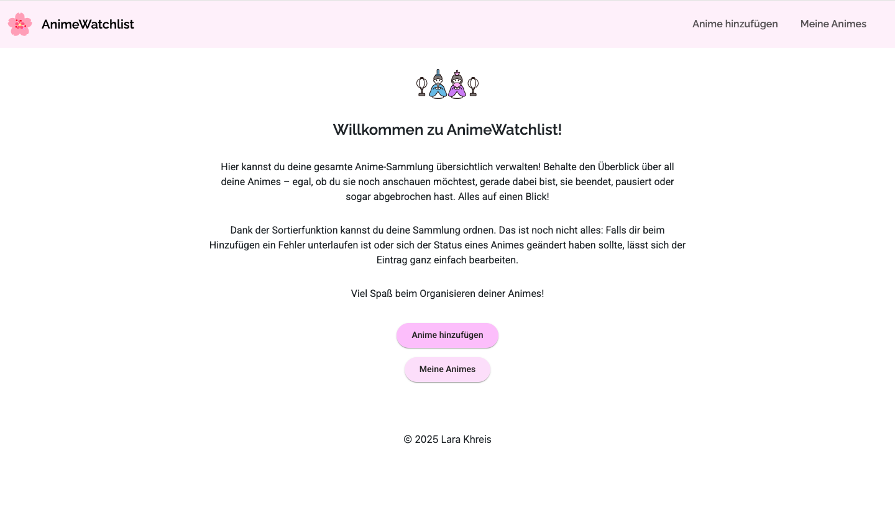
	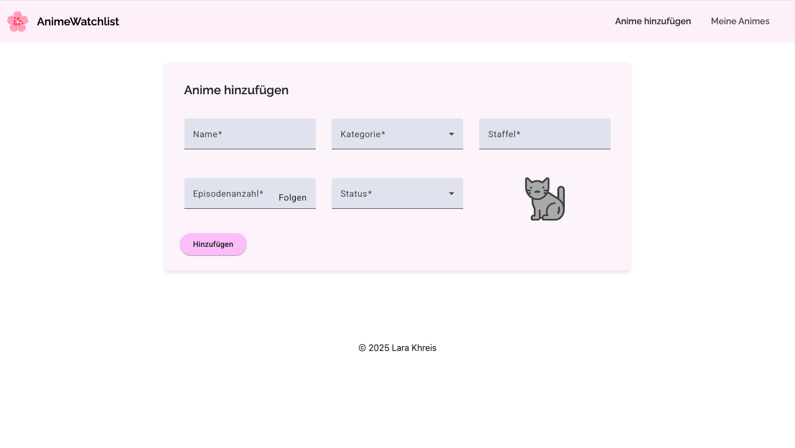
	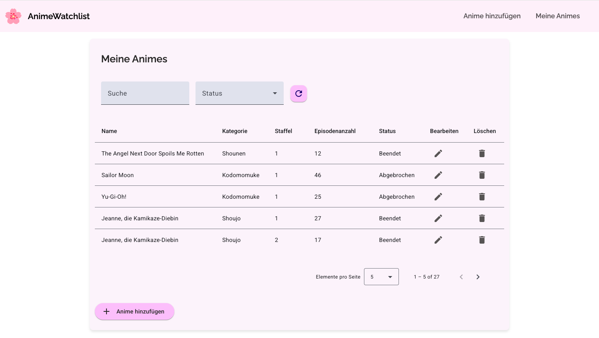

	## ✨ Features
	- 📋 Add, edit, and delete anime entries

	- 📂 Sort and filter by title, category, season, status, and more

	- 🔍 Search bar with real-time filtering

	- 🔄 Status selection via dropdown (e.g., Watching, Planned, Paused, Dropped, Finished)

	- 📊 Pagination and sorting support with Angular Material

	- 💾 Backend integration for persistent data storage

	## ⚙️ Installation
	### Prerequisites  
	Before you begin, make sure the following programs are installed:  
	- [Git](https://git-scm.com/downloads)
	- [Node.js](https://nodejs.org/en/download)
	- [Angular CLI](https://angular.dev/installation) — Install it globally via:

	```bash
	npm install -g @angular/cli
	```

	### **Initialize Git Repository**  
	If you don't have a Git repository yet, initialize it by running:  

	```bash
	git init
	```

	**Clone Repositories**

	Clone both the backend and frontend repositories:

	```bash
	git clone https://gitlab.rz.htw-berlin.de/s0549057/anime-watchlist-backend.git

	git clone https://gitlab.rz.htw-berlin.de/s0549057/anime-watchlist-frontend.git
	```
	**Install and Start Backend**

	Navigate to the backend directory and install all dependencies:

	```bash
	cd anime-watchlist-backend
	npm install
	```
	Create a ```.env``` file in the root directory of the project with the following variables

	```bash
	PGUSER=your_username
	PGHOST=psql.f4.htw-berlin.de
	PGDATABASE=anime_watchlist
	PGPASSWORD=your_password
	PGPORT=5432
	```

	To start the backend:

	```bash
	node server.js
	```
	Use ```--watch``` for restarting the application automatically!

	**Install and Start Frontend**

	Navigate to the frontend directory and install all dependencies:

	```bash
	cd anime-watchlist-frontend/anime-watchlist
	npm install
	```

	To start the frontend:

	```bash
	ng serve
	```

	**Access the Application**

	- **Frontend:** Open your browser and go to http://localhost:4200 to view the frontend.

	## 🚀 Deployment

	This application is deployed and accessible at:

	👉 https://anime-watchlist-frontend.vercel.app

	## 📦 Tech Stack

	Technologies used in the project:

	**Client (Frontend):** Angular CLI (for building a dynamic and responsive user interface as well managing the Angular application)

	**UI Components:** <br>
	**Angular Material** (for modern and consistent UI elements) <br>
	**Bootstrap** (for responsive and mobile-first design)

	**Server (Backend):** Node.js (used for the backend logic and API services)

	## 🗺 Roadmap
	The application can be expanded to allow the addition of anime movies alongside anime series. Unlike series, anime movies do not have seasons or episode counts; instead, they are defined by parts and release years. This distinction will be made using an Angular Material stepper. Depending on whether "Anime-Serie" or "Anime-Film" is selected in the first step, the corresponding form will be displayed in the second step.

	Additionally, the application can be enhanced by implementing user registration and login functionality. Registered users will be able to add their own animes and manage their personalized list.

	Another potential feature is the ability for users to upload images for each anime.
	


??? success "whispery - Dein digitales Tagebuch"

	# whispery – Dein digitales Tagebuch ✨

	**whispery** ist eine moderne Webanwendung zum Führen eines digitalen Tagebuchs.  
	Nutzer:innen können sich registrieren, anmelden und persönliche Einträge erstellen, bearbeiten oder löschen – begleitet von Emotionen in Emoji-Form.


	---

	## Inhaltsverzeichnis

	1. [Features](#features)  
	2. [Technologien](#technologien)  
	3. [Screenshots](#screenshots)  
	4. [Installation & Nutzung](#installation--nutzung)  
	5. [Datenbankstruktur](#datenbankstruktur)  
	6. [Deployment](#deployment)  
	7. [Bekannte Einschränkungen](#bekannte-einschränkungen)
	8. [KI-Nutzung](#ki-nutzung)  
	9. [Autorin](#autorin)

	---

	## Features

	- 📓 Tagebucheinträge erstellen, anzeigen, bearbeiten und löschen (CRUD)
	- 🔐 Registrierung & Login mit Passwort-Hashing (bcryptjs) und Token-Authentifizierung (JWT)
	- 🔓 Logout mit Token-Entfernung
	- 😊 Gefühle durch Emojis ausdrücken
	- 📅 Datum wird automatisch pro Eintrag gespeichert
	- 💾 Speicherung aller Einträge in einer MongoDB-Datenbank (MongoDB Atlas)
	- 🪄 Nutzerfreundliche Popups bei Aktionen
	- 🎨 Responsive Design mit Bootstrap

	---

	## Technologien

	- **Frontend**: Angular  
	- **Backend**: Node.js, Express  
	- **Datenbank**: MongoDB (Atlas)  
	- **CSS-Framework**: Bootstrap  
	- **Deployment**: Netlify (Frontend), Render (Backend)

	---

	## Screenshots

	#### Begrüßungsseite von whispery mit Möglichkeit zur Registrierung oder Login:
	

	#### Das Formular zur Registrierung eines neuen Accounts:
	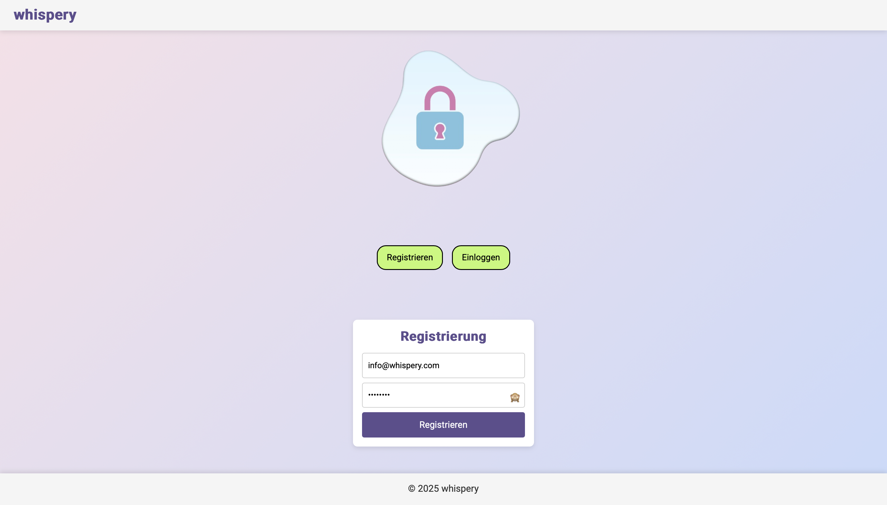

	#### Popup nach erfolgreicher Registrierung:
	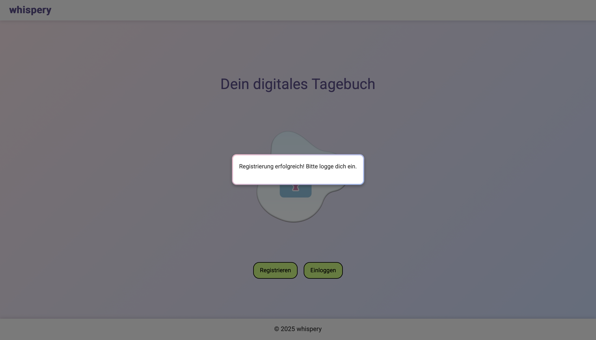

	#### Fehlermeldung bei bereits registrierter E-Mail-Adresse:
	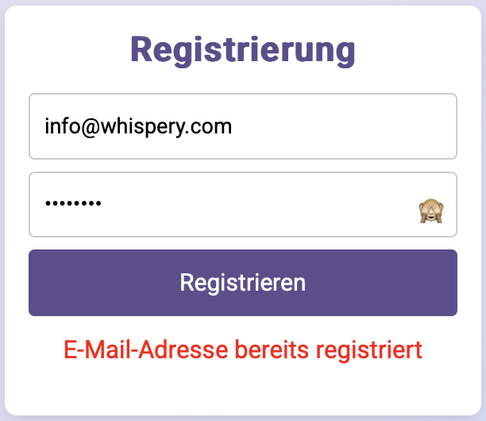

	#### Validierungshinweis für ein sicheres Passwort:
	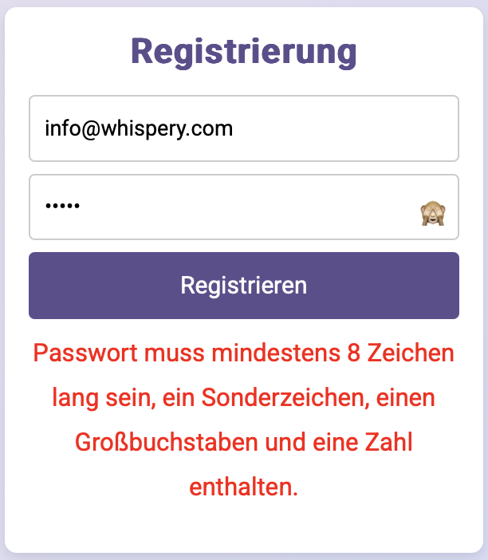

	#### Fehlermeldung bei falscher E-Mail:
	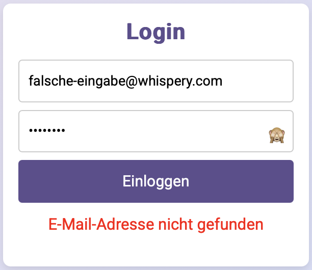

	#### Fehlermeldung bei falschem Passwort:
	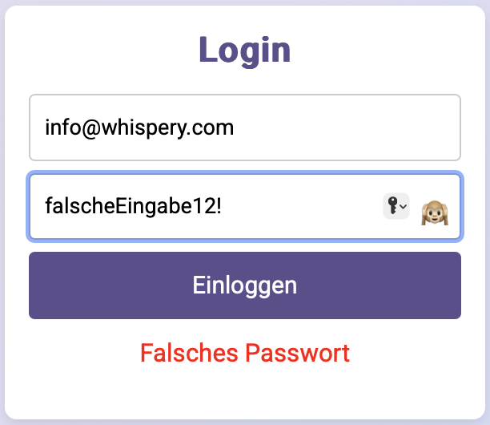

	#### Eingabemaske zur Erstellung eines neuen Tagebucheintrags:
	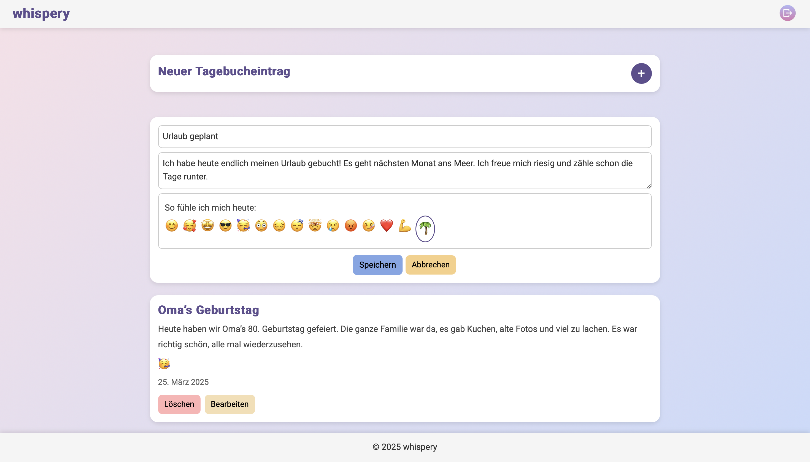

	#### Popup nach dem erfolgreichen Speichern eines neuen Eintrags:
	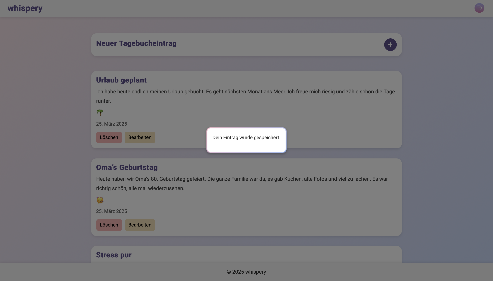

	#### Übersicht aller vorhandenen Tagebucheinträge:
	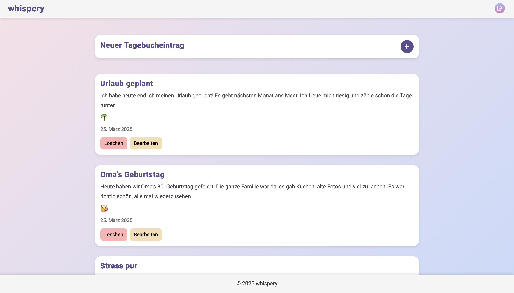

	#### Bearbeitungsansicht eines bestehenden Eintrags:
	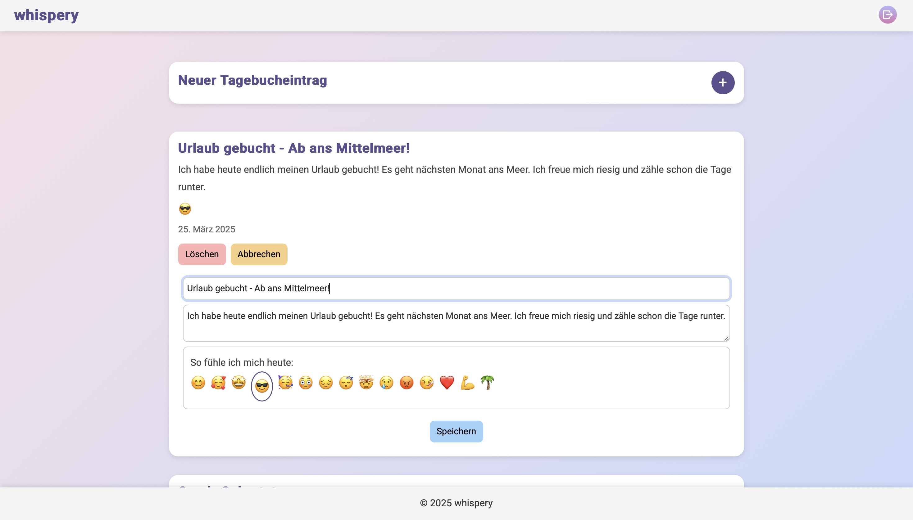

	#### Popup nach erfolgreicher Bearbeitung eines Eintrags:
	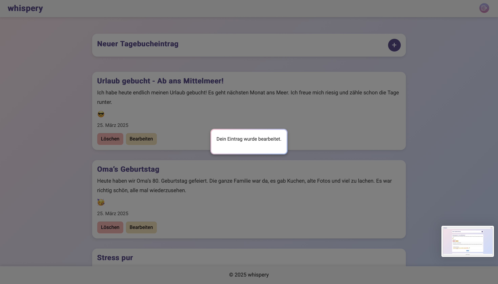

	#### Bestätigungsdialog zum Löschen eines Eintrags:
	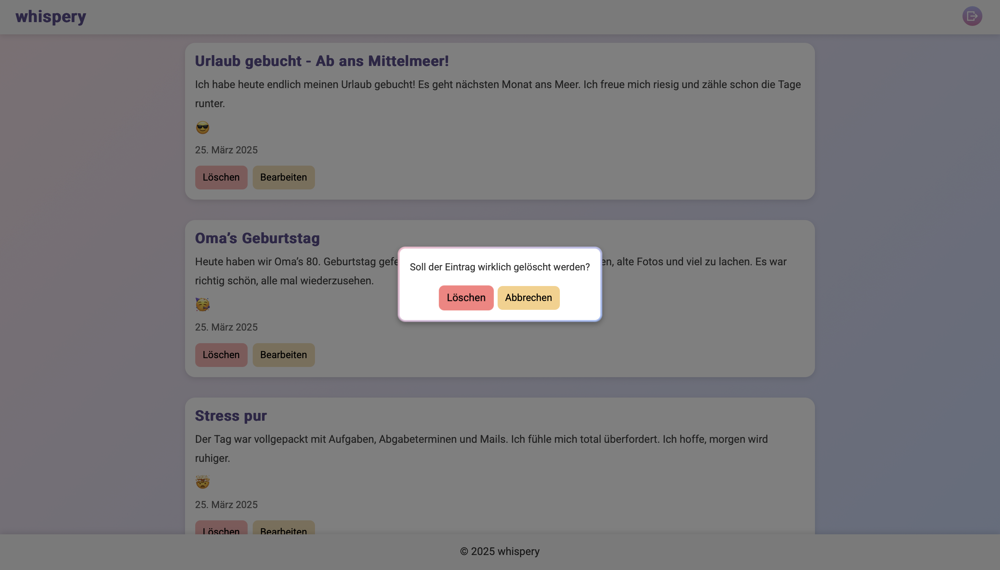

	#### Popup nach erfolgreichem Löschen eines Eintrags:
	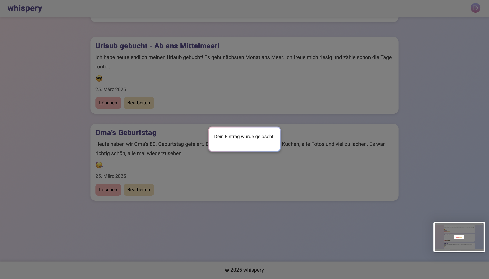

	#### Popup nach dem Ausloggen des Users:
	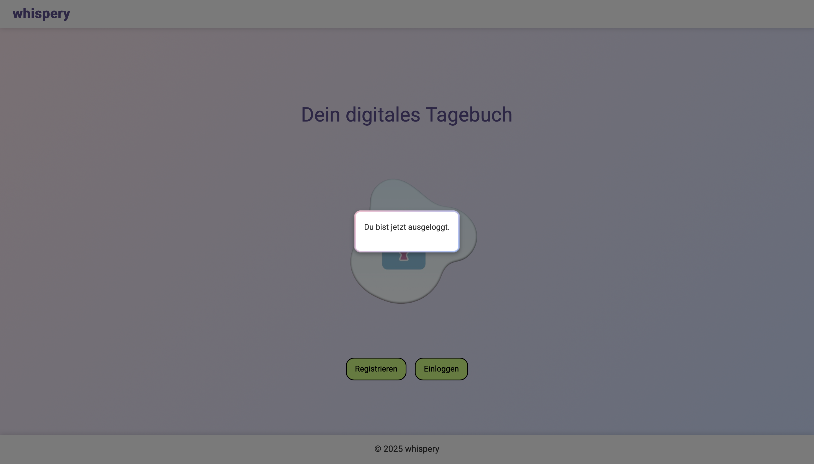


	---

	## Installation & Nutzung

	### Voraussetzungen
	- Node.js
	- Angular CLI
	- MongoDB Atlas Zugang

	### Projekt klonen

	```bash
	git clone https://github.com/Fuerueze/whispery-frontend.git
	git clone https://github.com/Fuerueze/whispery-backend.git
	```

	### Backend starten

	```bash
	cd whispery-backend
	npm install
	```

	Erstelle im Ordner `whispery-backend` eine Datei namens `.env` mit folgendem Inhalt:  
	**Trage hier deine eigenen Werte ein!**

	```env
	MONGO_URI=<deine eigene MongoDB-Verbindungs-URL>
	JWT_SECRET=<dein eigenes geheimes JWT-Passwort>
	PORT=5001
	```

	#### Erklärungen zu den Variablen

	- **`MONGO_URI`**: Deine eigene MongoDB-Verbindung, z.B. über [MongoDB Atlas](https://www.mongodb.com/cloud/atlas)
	- **`JWT_SECRET`**: Ein beliebiger geheimer String, der zur Signierung der Tokens verwendet wird
	- **`PORT`**: Optional – falls nicht gesetzt, wird automatisch `5001` verwendet

	#### Backend starten

	```bash
	node server.js
	```

	### Frontend starten

	```bash
	cd whispery-frontend
	npm install
	ng serve --proxy-config proxy.conf.json
	```

	#### Anwendung im Browser öffnen:

	[http://localhost:4200](http://localhost:4200)


	---

	## Datenbankstruktur

	Die folgende Struktur zeigt das Datenmodell der Anwendung:

	### Sammlung: `users`

	```json
	{
	  "_id": "ObjectId",
	  "email": "string",
	  "password": "string (gehasht mit bcrypt)",
	  "__v": 0
	}
	```

	### Sammlung: `diaryentries`

	```json
	{
	  "_id": "ObjectId",
	  "title": "string",
	  "content": "string",
	  "emoji": "string", 
	  "date": "ISODate",
	  "user": "ObjectId (Referenz auf User)",
	  "__v": 0
	}
	```


	---

	## Deployment

	- **Frontend (Netlify)**: https://whispery-tagebuch.netlify.app  
	- **Backend (Render)**: https://whispery-backend.onrender.com


	---

	## Bekannte Einschränkungen

	**Hinweis:**  
	Im aktuellen Deployment über **Netlify** (Frontend) und **Render** (Backend) funktioniert die Registrierung und der Login **derzeit nicht wie erwartet**.

	Es erfolgt keine Rückmeldung bei Klick auf "Registrieren" oder "Einloggen".

	**Lokal funktioniert alles korrekt.**  
	Eine Lösung wird in Kürze nachgereicht.


	---

	## KI-Nutzung

	| Tool             | Zweck                                   |
	|------------------|-----------------------------------------|
	| ChatGPT          | Planung, Codeoptimierung, README        |
	| DeepSeek         | Codeoptimierung                         |


??? success "VerseLogic"

	# VerseLogic 
	VerseLogic ist eine Webanwendung zur Unterstützung des Songwriting-Prozesses.  
	Das Projekt verwendet:  
	- **Frontend**: Angular (Version 19.0.2)  
	- **Backend**: Node.js (Version 22.11.0)

	## Installation & Setup  

	### Voraussetzungen  
	- **Node.js** 
	- **Angular CLI** (falls nicht installiert: `npm install -g @angular/cli`) 
	- **Git** (zum Klonen des Repositories)
	- **PostgreSQL-Datenbank** 

	### Repository klonen
	Befehl zum Klonen des Repositories:
	```sh
	git clone https://gitlab.rz.htw-berlin.de/s0592157/webtech_aufgabe.git
	cd webtech_aufgabe
	```

	### Abhängigkeiten installieren
	**Frontend:**
	```sh
	cd VerseLogic
	npm install
	```
	**Backend:**
	```sh
	cd Backend
	npm install
	```

	### Anwendung starten  
	#### Datenbank initialisieren:
	Bevor die Anwendung gestartet werden kann, muss eine .env-Datei erstellt werden, in der die Verbindungsdaten zu einer Datenbank hinterlegt sind. 
	```sh
	cd Backend
	touch .env
	```
	#### Backend starten:
	```sh
	node server.js
	```
	#### Tabellen erstellen:
	Um die Tabellen zu initialisieren, rufe im Browser folgenden Link auf:
	`http://localhost:3000/init`
	#### Frontend starten:
	Öffne ein neues Terminalfenster und führe folgende Befehle aus, um das Frontend zu starten.
	```sh
	cd VerseLogic
	ng serve
	```

	Sobald das Backend und Frontend laufen, ist die Anwendung unter `http://localhost:4200/` erreichbar.

	## Hauptfunktionen
	- User-Authentifizierung: Registrierung & Login
	- Song-Erstellung: Benutzer können neue Songs mit Namen & Sprache erstellen
	- Song-Verwaltung:
	  - Songs auflisten, nach Name & Status filtern
	  - Songs löschen oder bearbeiten
	- Song-Editor:
	  - Lyrics-Ansicht: Texte schreiben & speichern, inkl. Link zu einer Reimmaschine
	  - Tabs-Ansicht: Tabs erstellen und bearbeiten sowie Songstruktur hinzufügen
	  - Einstellungsansicht: Song-Details konfigurieren (Titel, Status, Sprache)

	## Screenshots
	**Login**
	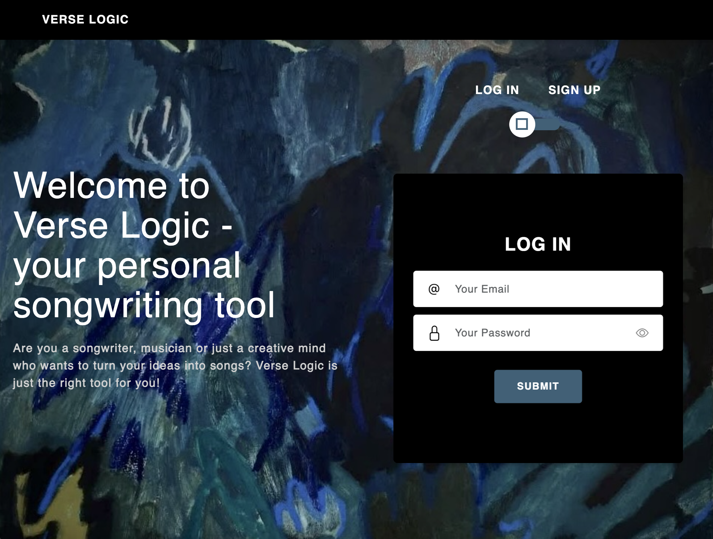
	**Registrierung**
	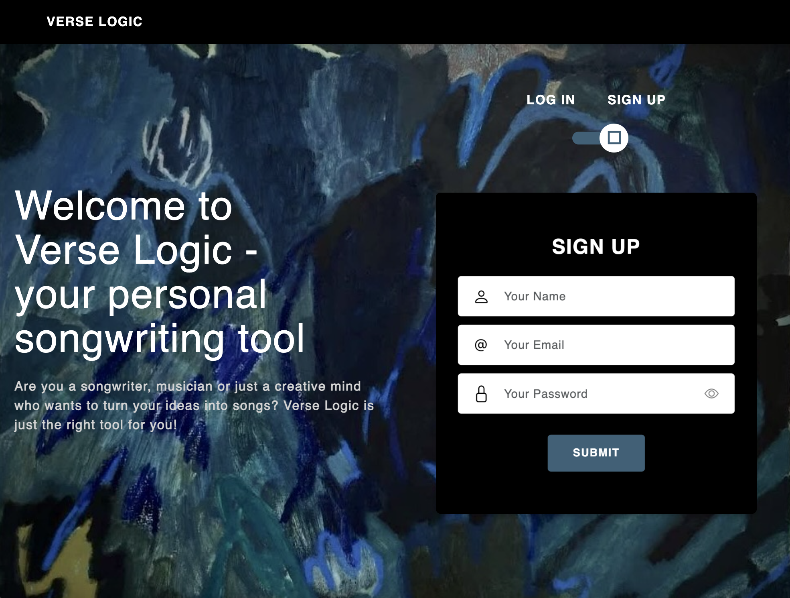
	**Startseite**
	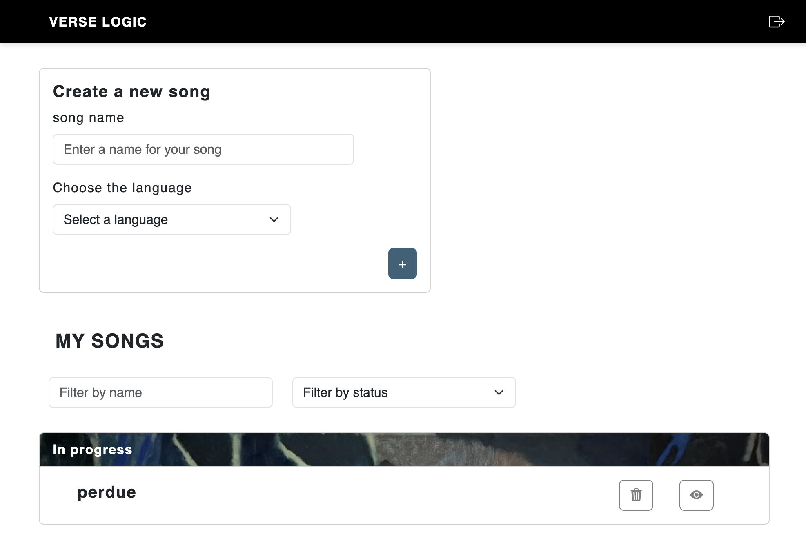
	**Songansicht - Lyrics**
	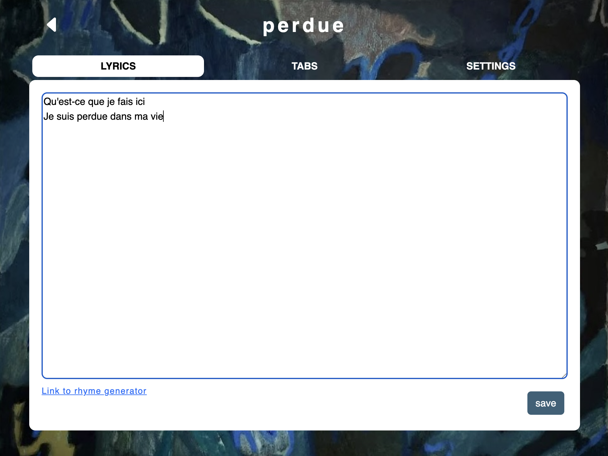
	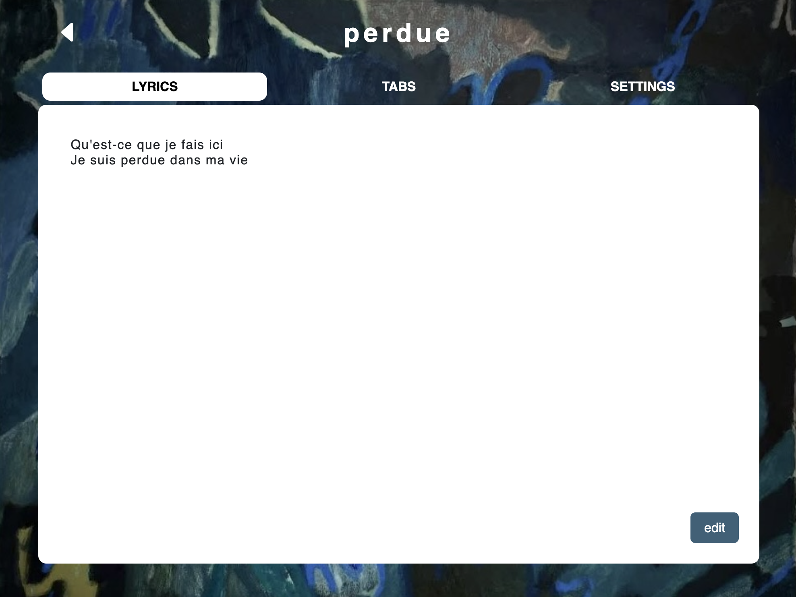
	**Songansicht - Tabs**
	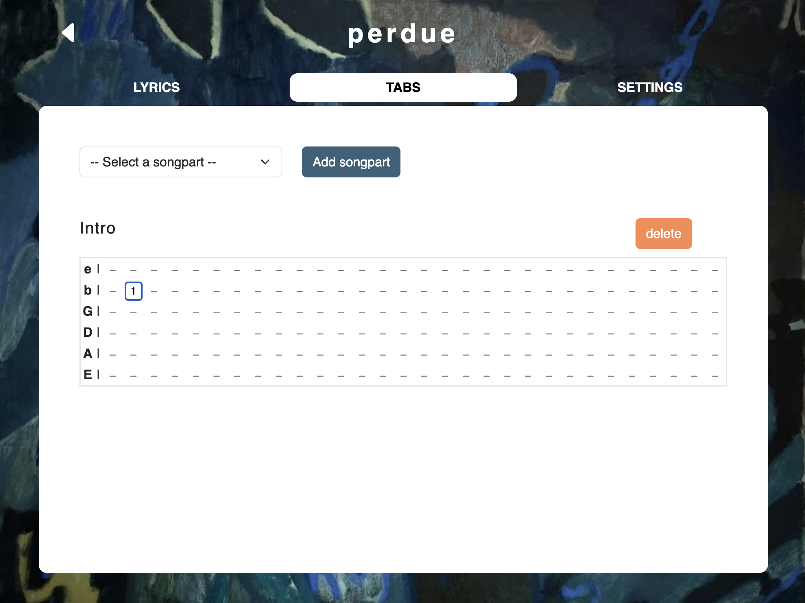
	**Songansicht - Settings**
	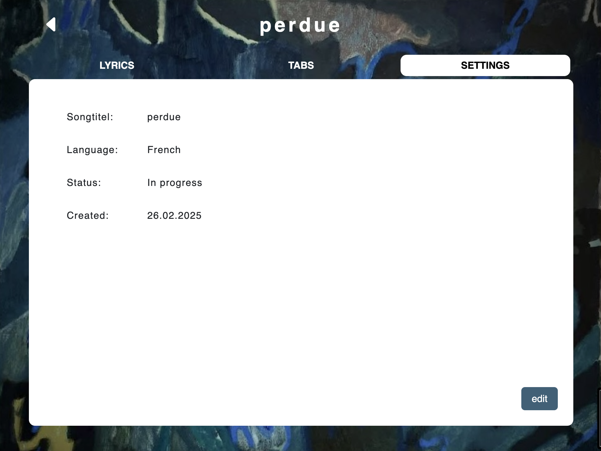
	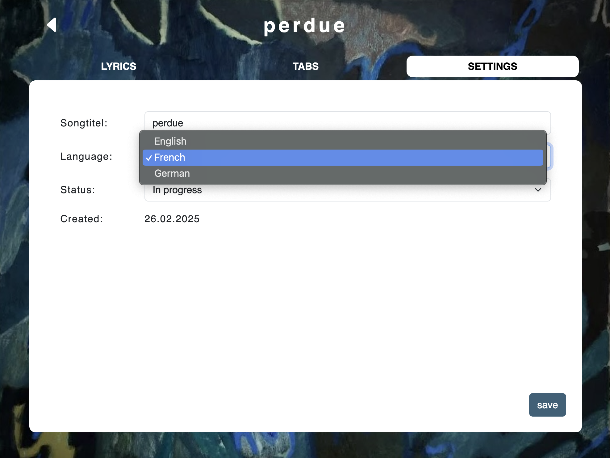

	## Verwendete Tools
	- ChatGPT: Unterstützung bei Verständnisfragen, Generierung von Lösungsansätzen
	- Codepen: Entwicklung und Gestaltung der Login/Register-Seite

	## To-Do / Nächste mögliche Features
	- KI-gestützte Song-Generierung
	- Notenschreibsystem für andere Instrumente als Gitarre
	- Möglichkeit, Audioinhalte hinzuzufügen
	- Export der Lyrics & Tabs als PDF


??? success "TeilEs"

	# <span style="color:#2F5264; font-family: 'comfortaa';">WebTech2025</span>

	


	## <span style="color:#2F5264; font-family: 'comfortaa';">Was ist TeilEs?</span>

	**Warum kaufen, wenn man es sich auch leihen kann!?** <br>
	TeilEs ist eine Plattform auf der du ganz einfach mit anderen Dinge teilen kann.<br> 
	Du sparst Geld, handelst nachhaltig und kommst mit anderen in Kontakt. 

	Suche und finde oder biete etwas an, was du gerne teilen möchtest. Natürlich alles kostenlos.


	## <span style="color:#2F5264; font-family: 'comfortaa';">Inhalt</span>

	1. [Was ist TeilEs](#was-ist-teiles)
	2. [Installationsanleitung](#installationsanleitung)
	    - [Voraussetzung & Technologien](#voraussetzung-und-technologien)
	    - [Installation](#installation)
	3. [Screenshots der Anwendung](#screenshots-der-anwendung)
	4. [Verwendung von KI-Werkzeugen](#verwendung-von-ki-werkzeugen-und-deren-einsatz)
	5. [API Dokumentation](#api-dokumentation)
	6. [Weiteres](#weiteres)
	7. [Entwicklungsteam](#entwicklungsteam)


	## <span style="color:#2F5264; font-family: 'comfortaa';">Installationsanleitung</span>

	### <span style="color:#2F5264; font-family: 'comfortaa';">Voraussetzung und Technologien</span>

	- [Node.js](https://nodejs.org/en) (verwendete Version 22.14.0)
	- [Angular CLI](https://angular.dev) (verwendete Version 19.2.1) - Installation über npm install -g @angular/cli
	- [Bootstrap](https://getbootstrap.com)
	- [MongoDB](https://www.mongodb.com) (lokal oder als Cloud-Service) - Datenbank startet automatisch


	### <span style="color:#2F5264; font-family: 'comfortaa';">Installation</span>


	**1. Repository clonen:**

	```
	git clone https://gitlab.rz.htw-berlin.de/Olivia.Lawinski/webtech2025.git
	cd webtech2025
	```

	**2. Dependencies installieren**

	```
	cd frontend
	npm install
	cd ../backend
	npm install
	```

	**3. Backend starten**

	Backend läuft auf dem PORT 3000

	```
	cd backend
	node server.js 
	```

	**4. Frontend starten** 

	Frontend läuft auf dem PORT 4200

	```
	cd frontend
	ng serve 
	```

	**5. Anwendung im Browser starten**

	```
	http://localhost:4200
	```


	## <span style="color:#2F5264; font-family: 'comfortaa';">Screenshots der Anwendung</span>

	#### Home

	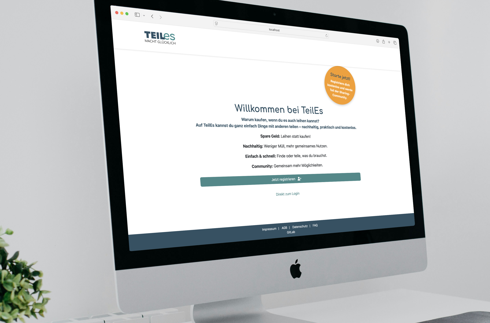 
	#### Login
	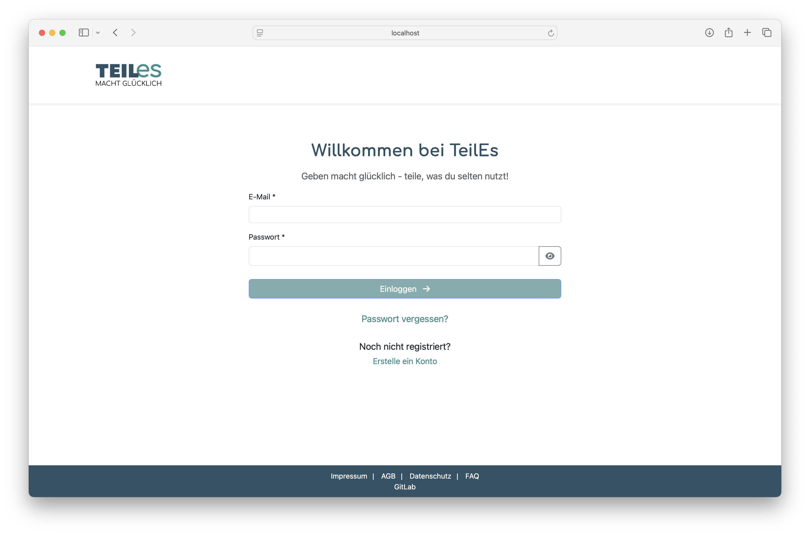
	#### Produktliste mit aktiver Suche
	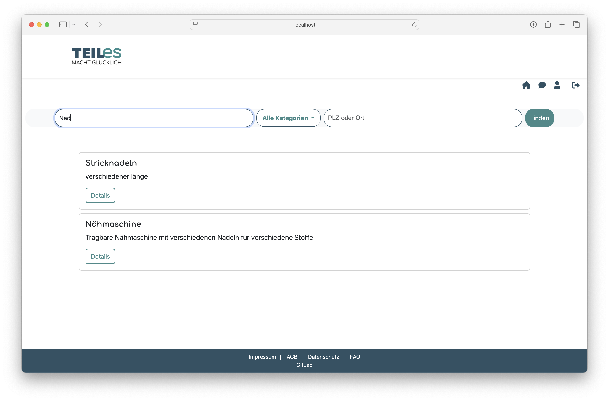
	#### Produktdetails mit Kontaktaufnahme des Anbieters
	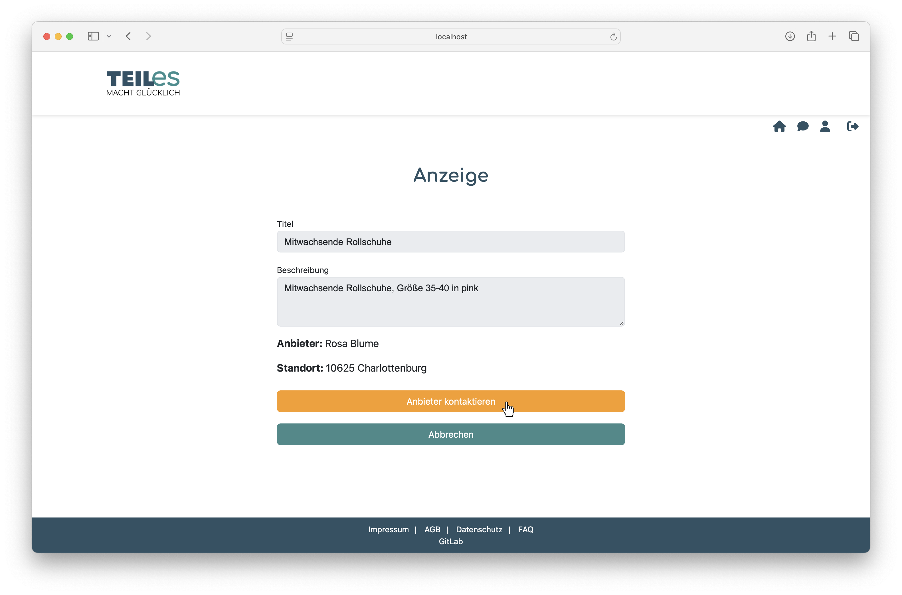
	#### Chat | Benachrichtigung einer eingegangenen Nachricht
	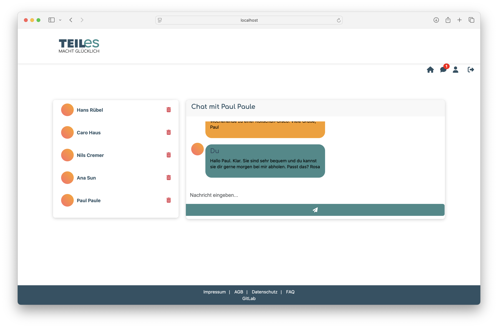
	#### Übersicht der eigenen Anzeigen
	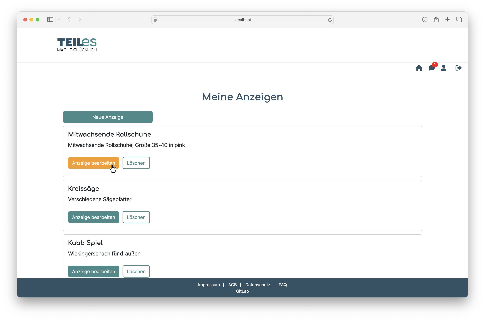


	## <span style="color:#2F5264; font-family: 'comfortaa';">Verwendung von KI-Werkzeugen und deren Einsatz</span>


	ChatGPT (OpenAI): 
	-   Unterstützung bei der Implementierung des Codes für den Chat sowie Bildupload (Bildupload nicht final implementiert)
	-   zur Fehleranalyse, z.B. Chat: Namensanzeige des Chatpartner war fehlerhaft und um Tippfehler zu finden
	-   Erstellung der GeoDaten (nicht final implementiert)   
	     

	## <span style="color:#2F5264; font-family: 'comfortaa';">API Dokumentation</span>

	Dieses Projekt verwendet **Swagger** zur Dokumentation der API.<br>
	Lokal : http://localhost:3000/api-docs/#/


	## <span style="color:#2F5264; font-family: 'comfortaa';">Weiteres</span>

	#### Verwendete Software: 
	<div align="center">
	  
	  
	  
	  
	  
	  
	  
	  
	  
	  
	  
	  
	</div>

	<br>
	<br>


	Icons by <a target="_blank" href="https://icons8.com">Icons8</a>: <a target="_blank" href="https://icons8.com/icon/0OQR1FYCuA9f/visual-studio-code-2019">Visual Studio Code 2019</a>, <a target="_blank" href="https://icons8.com/icon/bosfpvRzNOG8/mongo-db">Mongo Db</a>, <a target="_blank" href="https://icons8.com/icon/EPbEfEa7o8CB/postman-inc">Postman Inc</a>, <a target="_blank" href="https://icons8.com/icon/zfHRZ6i1Wg0U/figma">Figma</a>, <a target="_blank" href="https://icons8.com/icon/gdT1pX6POU5R/affinity-designer">Affinity Designer</a>, <a target="_blank" href="https://icons8.com/icon/YP2lOU31pp9S/affinity-photo">Affinity Photo</a>, <a target="_blank" href="https://icons8.com/icon/21049/trello">Trello</a>, <a target="_blank" href="https://icons8.com/icon/30464/google-docs">Google Docs</a>, <a target="_blank" href="https://icons8.com/icon/7csVZvHoQrLW/zoom">Zoom</a>, <a target="_blank" href="https://icons8.com/icon/4n94I13nDTyw/slack">Slack</a>, <a target="_blank" href="https://icons8.com/icon/FBO05Dys9QCg/chatgpt">Chat GPT</a>         


	#### Fonts:  Comfortaa https://fonts.google.com/specimen/Comfortaa

	#### Bildnachweis: <a href="https://unsplash.com/de/@byteddygr?utm_content=creditCopyText&utm_medium=referral&utm_source=unsplash">Teddy GR</a> auf <a href="https://unsplash.com/de/fotos/silberner-imac-auf-weissem-holztisch-mGSs24hZ2CE?utm_content=creditCopyText&utm_medium=referral&utm_source=unsplash">Unsplash</a> 


??? success "Game Vault"

	# Game Vault👾


	## Description📜
	**Game Vault** is your own personal database for storing games with your rating.

	## Key Features of Game Vault ⭐
	- 🔍 **Filter your games** to easily find what you're looking for  
	- 🖥️ **Responsive design** for a seamless experience on desktops and laptops
	- 🔐 **Personal database** – each user has their own secure game collection  

	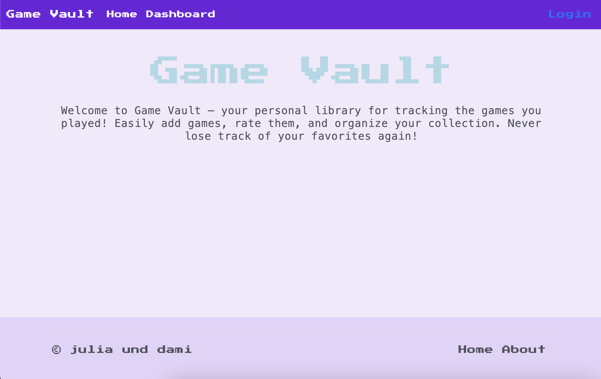
	

	## How to Install 🚀
	1. Connect to the HTW Berlin network via [OpenVPN](https://rz.htw-berlin.de/en/tutorials/vpn/)
	2. In your terminal, run:<br>
	```sh
	chmod +x setup.sh # Make it executable (only once)
	```
	```sh
	./setup.sh # Run the script
	```
	3. Configurate your `.env` file:
	```
	PGUSER=<s05...>
	PGHOST=psql.f4.htw-berlin.de
	PGPASSWORD='your_password'
	PGDATABASE=game_vault
	PGPORT=5432
	```

	## Use of AI in This Project 🤖
	We used Artificial Intelligence for the following points in this project:
	- Understanding concepts
	- Filter games by genres, publishers, platforms
	- Initializing Select2
	- Building complex database structure with JOINS

	## Support 💬
	If you have any questions, suggestions, or need assistance, please write us at damaris.liedtke@student.htw-berlin.de or julia.neubert@student.htw-berlin.de 🤝


??? success "Finanzverwaltung mit EasyFinance"

	# Finanzverwaltung mit EasyFinance

	## Übersicht zur Webanwendung:
	1. [Allgemeine Infos](#allgemeine-infos)
	2. [Projektstruktur](#projektstruktur)
	3. [Beschreibung der Anwendung mit Screenshots](#beschreibung-der-anwendung-mit-screenshots)
	4. [Datenmodell mit ER Diagramm und Konzept](#datenmodell-mit-er-diagramm-und-konzept)
	5. [Technologien](#technologien)
	6. [Verwendete KI](#verwendete-ki)
	7. [Anleitung zur Installation](#anleitung-zur-installation)
	8. [Lizenz](#lizenz)
	9. [Kontakt](#kontakt)

	## 1. Allgemeine Infos: <a name="allgemeine-infos"></a>
	EasyFinance ist eine Webanwendung,
	die im Kurs Webtechnologien 2024/25
	unter der Leitung von Prof. Freiheit
	von Maryam Mirza entwickelt wurde.
	Das Backend wurde mit Render deployed und ist unter https://backendwebtech.onrender.com
	erreichbar. Das Frontend ist mit Vercel deployed und
	die Anwendung ist unter https://frontend-webtech.vercel.app erreichbar.
	Hinweis: Weil das Backend über Render läuft und Render nach längerer Inaktivität einen Moment braucht, 
	dauert es ca. 1min bis die Tabelle mit den Daten angezeigt wird.


	Die Webanwendung wurde mit Angular, Node.js und PostgreSQL gebaut.

	## 2.  Projektstruktur <a name="projektstruktur"></a>

	Backend:
	```plaintext
	webtechnologien_backend/
	│
	├── controllers/
	│   ├── kategorien.controller.js      - Logik für CRUD-Operationen auf Kategorien
	│   └── transaktion.controller.js     - Logik für CRUD-Operationen auf Transaktionen
	│
	├── routes/
	│   ├── kategorie.routes.js           - Definiert die API-Routen für Kategorien
	│   ├── transaktion.routes.js         - Definiert die API-Routen für Transaktionen
	│   └──root.js                       - Beispiel für eine einfache Route
	│
	│
	├── db.js                             - Setzt die Verbindung zur PostgreSQL-Datenbank auf
	├── initdb.js                         - Initialisiert die Datenbank und befüllt sie mit Beispieldaten
	│
	├── .env                              - Enthält Umgebungsvariablen, z. B. DB-Zugangsdaten (nicht hochladen!)
	├── .gitignore                        - Definiert Dateien und Ordner, die von Git ignoriert werden sollen
	├── package.json                      - Beschreibt das Projekt und die installierten Abhängigkeiten
	├── package-lock.json                 - Speichert die exakte Version der Abhängigkeiten
	└─ server.js                          - Startpunkt des Servers, konfiguriert Express und Bindet Routen ein
	```

	Frontend: 
	```plaintext
	webtechnologien_frontend/
	│
	src/
	│
	├── app/                                        # Hauptordner für die Anwendungslogik
	│   ├── header/                                 # Header-Komponente
	│   │   ├── header.component.html              
	│   │   ├── header.component.ts                
	│   │   └── header.component.css               
	│   │
	│   ├── footer/                                 # Footer-Komponente
	│   │   ├── footer.component.html             
	│   │   ├── footer.component.ts              
	│   │   └── footer.component.css                
	│   │
	│   ├── dialog-loeschen/                        # Dialog zum Löschen
	│   │   ├── dialog-loeschen.component.html      
	│   │   ├── dialog-loeschen.component.ts        
	│   │   └── dialog-loeschen.component.css       
	│   │
	│   ├── main/                                   # Hauptkomponente
	│   │   ├── main.component.html                 
	│   │   ├── main.component.ts                   
	│   │   └── main.component.css                
	│   │
	│   ├── services/                               # Dienste für Daten- und Backend-Logik
	│   │   ├── backend-kategorien.service.ts       # Service für Kategorien-Backend mit URL
	│   │   ├── backend-transaktions.service.ts     # Service für Transaktionen-Backend mit URL
	│   │   ├── kategorien.ts
	│   │   └── transaktion.ts                      
	│   │
	│   ├── transaktionen/                          # Verwaltung und Anzeige von der Tabelle Transaktionen
	│   │   ├── transaktionen.component.html        
	│   │   ├── transaktionen.component.ts         
	│   │   └── transaktionen.component.css         
	│   │
	│   ├── transaction-dialog-hinzufuegen/         # Dialog zum Hinzufügen von Transaktionen
	│   │   ├── transaction-dialog.component.html   
	│   │   ├── transaction-dialog.component.ts    
	│   │   └── transaction-dialog.component.css   
	│   │
	│   ├── app.component.html                      # Root-Template der Anwendung
	│   ├── app.component.ts                        # Root-Komponente der Anwendung
	│   ├── app.component.css                      
	│   ├── app.module.ts                           # Hauptmodul der Angular-Anwendung
	│   ├── app.config.ts 
	│   └── app-routes.ts                           
	│                                  
	│
	├── styles.css                                  # Globale CSS-Dateien der App
	├── index.html                                  # Startpunkt der Angular-Anwendung
	├── main.ts                                     # Einstiegspunkt/Bootstrap der Anwendung                        
	├── .gitignore  
	├── angular.json                                # CLI-Konfiguration für das Projekt
	├── package.json  
	├── package-lock.json  
	├── README.md
	├── tsconfig.app.json
	└── tsconfig.json
	 
	```
	---

	## 3. Beschreibung der Anwendung mit Screenshots: <a name="beschreibung-der-anwendung-mit-screenshots"></a>

	EasyFinance ist ein Prototyp, der dafür gedacht ist, sich leicht einen Überblick über die eigenen Finanzen machen zu können.
	Die Idee ist einfach Ausgaben und Einnahmen eintragen zu können und mit Wichtigkeitslabels unnötige Ausgaben direkt zu entdecken.
	So entsteht eine Übersicht wo leicht zu erkennen ist, wo eingespart werden könnte.
	Praktisch ist, dass hier auch Bar Einnahmen und Ausgaben erfasst werden können, was
	bei einem herkömmlichen Kontoauszug nicht erfasst wird.

	Wenn die Anwendung weiterentwickelt werden sollte, wäre eine Registrierung und ein Login zum Datenschutz notwendig.
	Zudem müssten die Daten verschlüsselt werden.

	### 3.1 Feature 1: Transaktion hinzufuegen
	Um eine Transaktion hinzuzufügen klicke auf Transaktion hinzufügen.
	Es öffnet sich ein Dialog und du kannst alle benötigten
	Werte eingeben. Für die Transaktion gibt es ein Datepicker, sodass du schnell das passende Datum findest.
	Zudem gibt es Kategorien unter denen du per Drop Down auswählen kannst.
	In dem Drop Down Typ gibst du ein, ob es sich um eine Eingabe oder Ausgabe handelt.
	Ob es eine wichtige Ausgabe war, wird automatisch dann per Icon angezeigt, sobald du fertig bist.
	Du kannst die Transaktion auch abbrechen, falls du es dir anders überlegst.

	Ein Hinweis im Dialogfenster erinnert daran, dass alle Felder ausgefüllt werden müssen.
	Erst wenn alle Felder in korrekter Form eingetragen wurden, kann eine Transaktion hinzugefügt werden.
	Das stellt sicher, dass keine fehlerhaften Transaktionen hinzugefügt werden.

	Solange nicht alle Felder korrekt ausgefüllt sind, erscheint ein Hinweis.
	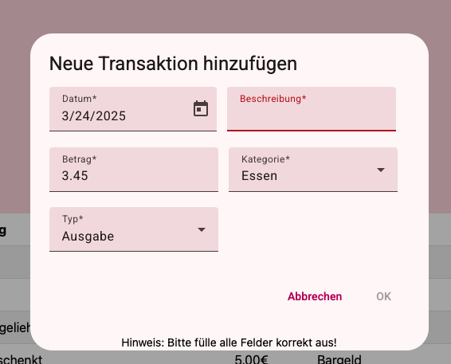


	Sobald alle Felder korrekt ausgefüllt wurden, verschwindet der Hinweis und es kann auf ok geklickt werden.
	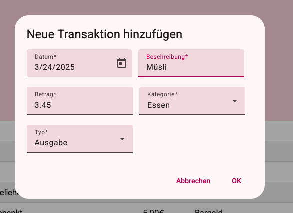

	### 3.2 Feature 2: Transaktion löschen
	Wenn mit der Maus über den Trash-Icon gehoovert wird, leuchtet das Icon in pinker Farbe auf.
	Sobald zum Löschen drauf geklickt wird, öffnet sich ein Dialog, sodass die Transaktion gelöscht werden kann.
	Der Dialog stellt sicher, dass nicht versehentlich etwas gelöscht wird.

	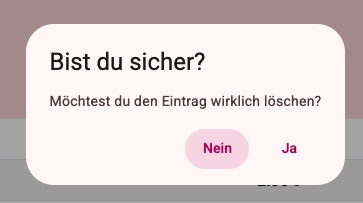

	### 3.3 Extra Feature:
	Per Hinweis mit Ausrufezeichen-Icon lassen sich unnötige Ausgaben so schnell entdecken.
	Damit erhält die Nutzer:in leicht einen Überblick, wo sie einfach einsparen könnte.
	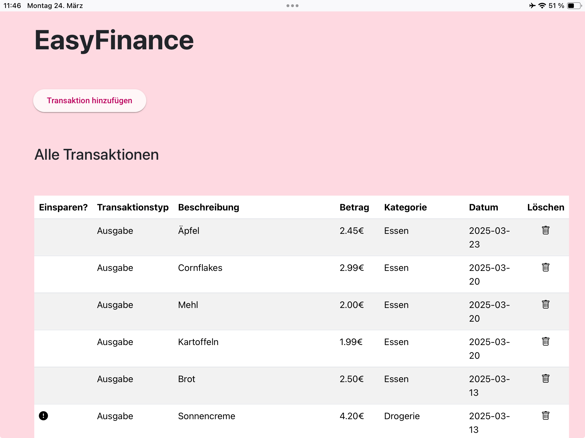
	Ipad Ansicht mit Wichtigkeitslabel bei Sonnencreme

	### 3.4 Responsives Design:
	Das Design ist mit Bootstrap resposiv gestaltet, damit Transaktionen auch vom Smartphone oder Tablet verwaltet werden können. 
	Damit die Übersicht der Transaktionen lesbar angezeigt wird, werden auf kleinen Bildschirmen nur die wichtigsten Spalten der Tabelle angezeigt.
	Die Kategorie und das Wichtigkeitslabel sind nur auf größeren Bildschirmen (ab Tabletgröße) sichtbar.

	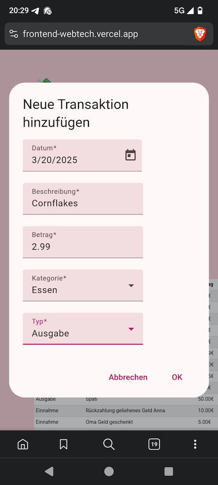

	Transaktion hinzufügen - Ansicht auf dem Smartphone

	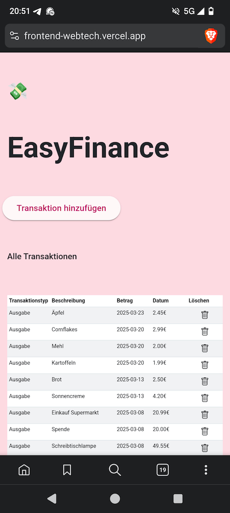

	Übersicht aller Transaktionen - Ansicht auf dem Smartphone


	## 4. Datenmodell mit ER Diagramm und Konzept <a name="datenmodell-mit-er-diagramm-und-konzept"></a>

	### ER-Diagramm: 

	


	### Konzept:
	Die Webanwendung ist ein Prototyp zur Finanzverwaltung.
	Die eingegebenen Daten sind fiktiv und dienen nur zum Ausprobieren.
	Sie können von allen, die Zugriff auf die Seite haben verändert werden.

	EasyFinance kann mit einer Registrierung und einem Login erweitert werden.
	Damit auch echte persönliche Daten eingegeben werden können, ist ein Login
	sowie eine Verschlüsselung der Datenbank zum Datenschutz notwendig.

	Die Erweiterung könnte zudem noch eine weitere Bearbeiten-CRUD Operation
	sowie Filter für eine detaillierte Analyse beinhalten.


	## 💻 5. Technologien: <a name="technologien"></a>

	* Entwicklungsumgebung: IntelliJ IDEA 2024.2.4 (Ultimate Edition)
	* Datenbank: PostgreSQL Version 16
	* Backend: [Node.js](https://nodejs.org/en) v22.11.0, Express 4.21.2, JavaScript
	* Frontend: Angular [Angular CLI](https://github.com/angular/angular-cli) version 19.2.0.
	* HTML, CSS, Typescript

	* Server für Backend und Datenbank: [Render](https://render.com/)
	* Server für Frontend: [Vercel](https://vercel.com)

	## 🤖️ 6. Verwendete KI: <a name="verwendete-ki"></a>

	* perplexity.ai
	* Github Co-Pilot
	* Backend: Controller und Routen teilweise mit Perplexity erstellt.
	* Frontend: Teilweise mit Perplexity erstellt. Z.B. bei dem Datepicker.
	* Frontend: Hinweis im Dialogfenster Transaktion hinzufügen mit Github Co-Pilot sowie Fehlermeldungen damit gefixt und Layout-Design.


	## 🛠️ 7. Anleitung zur Installation: <a name="anleitung-zur-installation"></a>

	### Wichtiger Hinweis
	Die Datenabank wurde mit Render deployed und ist bis zum 06.04.2025 erreichbar. 
	Danach wird sie von Server genommen. 
	Es kann dann stattdessen die Datenbank von ocean der HTW verwendet werden.
	Dazu muss im Backend die .env Datei angepasst werden mit den Umgebungsvariablen und Anmeldeinformation der ocean Datenbank.

	Das Backend ist unter https://backendwebtech.onrender.com erreichbar.

	Die Frontend-Anwendung ist unter https://frontend-webtech.vercel.app erreichbar.

	### Voraussetzungen:
	[Node.js](https://nodejs.org/en) installiert haben.
	[npm](https://docs.npmjs.com/downloading-and-installing-node-js-and-npm) installiert haben.

	### Repository klonen (Frontend und Backend)

	```bash
	git clone https://gitlab.rz.htw-berlin.de/s0591690/webtechnologien_frontend.git
	```
	```bash
	git clone https://gitlab.rz.htw-berlin.de/s0591690/webtechnologien_backend.git
	```

	In das entsprechende Projektverzeichnis mit der Bash wechseln:
	Beispielweise:
	```bash
	cd webtechnologien_frontend
	```
	```bash
	cd webtechnologien_backend
	```

	### Abhängigkeiten installieren
	(Frontend und Backend)
	```bash
	npm install
	```

	### VPN verbinden

	### Backend starten mit
	```bash
	node server.js
	```

	### Frontend starten mit
	```bash
	ng serve
	```
	Sobald der Server läuft, öffne deinen Browser und gehe zu `http://localhost:4200/`. 
	Die Applikation wird automatisch neu laden wenn du die source files veränderst.

	Wenn du das Projekt nicht lokal starten, 
	sondern direkt über den Browser aufrufen möchtest, 
	dann gehe zu https://frontend-webtech.vercel.app.

	### Bauen
	Um das Projekt zu deployen muss es vorher gebuildet werden. Das geht im Terminal mit:
	```bash
	ng build
	```
	Das kompiliert das Projekt und speichert die Build-Dateien im Verzeichnis `dist/`. 
	Im dist Verzeichnis ist die fertige Version von der Webanwendung drin.


	## 📝 8. Lizenz <a name="lizenz"></a>
	Dieses Projekt steht unter der MIT-Lizenz. Weitere Informationen findest du in der LICENSE-Datei.


??? success "Produktmanager"

	# Produktmanager Frontend & Backend

	Dieses Projekt ist eine Webanwendung zur Verwaltung von Produkten, die es ermöglicht, Produkte hinzuzufügen, zu aktualisieren, anzuzeigen und zu löschen. Es besteht aus einem **Angular-Frontend** und einem **Node.js-Backend** mit Verbindung zu einer **PostgreSQL-Datenbank**.

	# Funktionalitäten

	Das Produktmanager-Projekt ermöglicht folgende Funktionen:

	- **Produkterstellung:** Benutzer können neue Produkte mit Kategorien, Herstellerinformationen, Zutaten und Nährwertinformationen hinzufügen.
	- **Produktanzeige:** Eine Liste aller vorhandenen Produkte wird angezeigt, mit Detailansichten für jedes Produkt.
	- **Produktbearbeitung:** Bereits erstellte Produkte können aktualisiert werden.
	- **Produktlöschung:** Benutzer können Produkte löschen.
	- **Datenverwaltung:** Automatische Verbindung zu einer PostgreSQL-Datenbank.
	- **Benutzerfreundliche Oberfläche:** Verwenden von Angular Material für ein ansprechendes und intuitives Design.

	## 📦 Produktliste
	Dies ist die Hauptansicht der Produktliste in der Anwendung.

	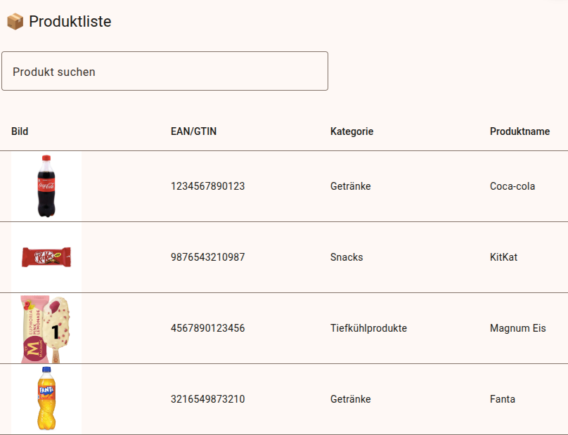

	---

	## ➕ Produkt hinzufügen
	Formular zum Hinzufügen eines neuen Produkts.

	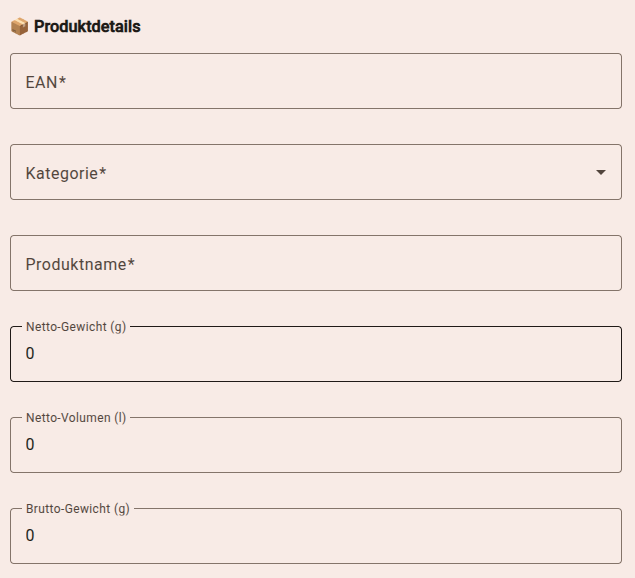

	---

	## 🔍 Produkt Details
	Detailansicht eines spezifischen Produkts.

	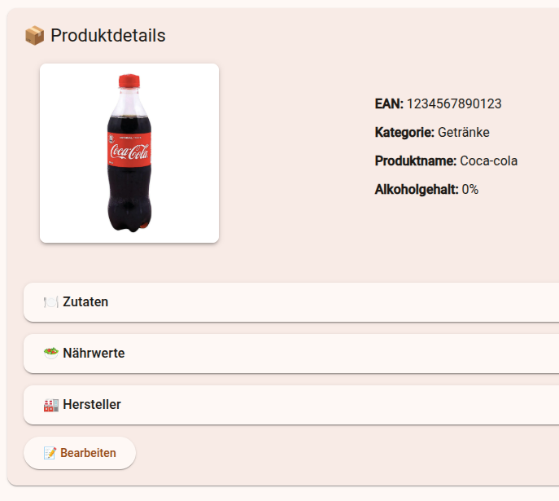

	## 🔍 Produkt Bearbeiten
	Detailansicht eines spezifischen Produkts.

	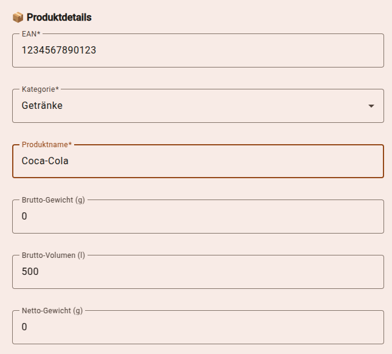

	## Installation

	### Voraussetzungen

	- Node.js (mindestens Version 16)
	- npm (mit Node.js installiert)
	- PostgreSQL Datenbank

	### Backend Setup

	1. Klone das Repository:

	```bash
	  git clone https://github.com/goncabi/produktmanager-backend.git
	```

	2. Navigiere in das Backend-Verzeichnis:

	```bash
	  cd produktmanager-backend
	```

	3. Installiere die Abhängigkeiten:

	```bash
	  npm install
	```

	4. Erstelle eine `.env` Datei im Backend-Verzeichnis mit folgendem Inhalt:

	```
	  DB_USER=<DeinBenutzername>
	  DB_PASSWORD=<DeinPasswort>
	  DB_HOST=<DatenbankHost>
	  DB_NAME=produktmanager
	  DB_PORT=5432
	```

	5. Starte den Server:

	```bash
	  node server.js
	```

	### Frontend Setup

	1. Klone das Repository:

	```bash
	  git clone https://github.com/goncabi/produktmanager-frontend.git
	```

	2. Navigiere in das Frontend-Verzeichnis:

	```bash
	  cd produktmanager-frontend
	```

	3. Installiere die Abhängigkeiten:

	```bash
	  npm install
	```

	4. Starte das Frontend:

	```bash
	  ng serve
	```

	### Deployment

	#### Backend Deployment (Render)

	1. Stelle sicher, dass deine Umgebungsvariablen auf Render gesetzt sind (DB\_USER, DB\_PASSWORD, DB\_HOST, DB\_NAME, DB\_PORT).
	2. Lade das Repository auf Render hoch und starte die Anwendung.

	#### Frontend Deployment (Render)

	1. Stelle sicher, dass `angular.json` den richtigen `outputPath` (`dist/frontend/browser`) definiert.
	2. Stelle sicher, dass du `ng build` ausführst, bevor du deployst.
	3. Lade die gebauten Dateien (`dist/frontend/browser`) auf Render hoch.

	### Verwendung

	Das Frontend kann auf `http://localhost:4200` aufgerufen werden. Das Backend läuft auf `http://localhost:5000`.

	### Technologien

	- Angular (Frontend)
	- Angular Material
	- Node.js (Backend)
	- Express
	- PostgreSQL

	### Quellen

	- Wo ChatGPT unterstützt hat:
	  - Unterstützung bei der Erstellung von Angular-Komponenten.
	  - Hilfe beim Aufbau von Backend-Routen.
	  - Beratung bei der Verbindung mit der Datenbank.
	  - Unterstützung bei der Fehlerbehebung während des Deployments.
	  - Verbesserung der Projektstruktur und der Kommunikation zwischen Frontend und Backend.
	  - Optimierung der Datenverarbeitung und Validierung im Backend.

	Viel Spaß beim Verwenden des Produktmanagers! 🚀


