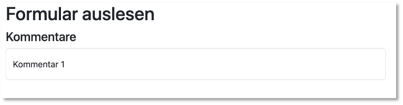

# JavaScript

JavaScript wurde 1995 von Brendan Eich entwickelt. Er arbeitete damals bei Netscape und entwickelte mit dem damals sogenannten LiveScript eine Skriptsprache für den damaligen Netscape-Browser. Ein damaliger Browser "verstand" HTML und CSS. HTML sah für Nutzerinteraktionen nur das Klicken auf Hyperlinks vor. Andere Nutzerinteraktionen waren nicht vorgesehen. Mithilfe von JavaScript wurde eine Schnittstelle geschaffen, um durch Nutzerinteraktionen den HTML-Code zu manipulieren, ohne dass ein weiteres Nachladen vom Webserver notwendig wurde. Mit der Einführung von JavaScript wurden die Fähigkeiten von Browsern erweiteret, indem nun nicht mehr nur HTML und CSS interpretiert wurde, sondern auch JavaScript - alles Client-seitig, also durch den Browser selbst. 

JavaScript ist eine sogenannte *Skriptsprache*, d.h. der Quellcode wird nicht compiliert und dann der übersetzte Byte- oder Maschinencode ausgeführt, sondern der Quellcode wird durch einen Interpreter interpretiert. Allerdings wird für Optimierungen JavaScript - insbesondere serverseitig in Node.js - durch sogenannte *Engines* doch in Maschinencode übersetzt, welcher ausgeführt wird. Die bekannteste dieser Engines ist die [Google-Engine V8](https://v8.dev/). Die Technologie der Compilierung wird als *Just-in-time-Kompilierung (JIT)* bezeichnet. 

JavaScript kennt (im Gegensatz zu TypeScript) keine Klassen. Das Objektmodell von JavaScript basiert auf *Prototypen*. Eigenschaften und Methoden können zur Laufzeit den Objekten hinzugefügt werden. Neben diesem *dynamischen* Objektmodell ist auch die Typisierung in JavaScript dynamisch. Der Typ einer Variable hängt vom Wert ab. Mit dem Wert kann sich auch der Typ der Variable ändern. 

Client-seitig haben HTML, CSS und JavaScript folgende Bedeutung (und wir sollten auch auf eine solche strikte Trennung achten):

- HTML für die Inhalte,
- CSS für das Layout, 
- JavaScript für das interaktive Verhalten

unserer Webseite.


## JavaScript in unseren Webseiten

Zunächst überlegen wir uns, wie wir das auch schon für CSS getan hatten, wo wir den JavaScript-Code in unseren Webseiten einfügen können. Prinzipiell wird JavaScript-Code in einem HTML-Dokument innerhalb eines `<script></script>`-Elementes eingefügt. Im Gegensatz zu CSS (wo wir die Definitionen innerhalb des `<style></style>`-Elementes angegeben haben, welches immer im `<head>` positioniert wird), ist es egal, ob das `<script>`-Element im `<head>`oder `<body>` angelegt wird. Sie können innerhalb eines HTML-Dokumentes auch mehrere `<script>`-Elemente haben und Sie können dann auch sowohl im `<head>` als auch im `<body>` positioniert sein. Wie bei CSS, ist es auch für JavaScript üblich, den Code in externe (.`js`)-Dateien auszulagern und diese dann in das HTML-Dokument einzubinden. Dies geschieht aber nicht über ein `<link>`-Element, sondern ebenfalls über das `<script>`-Element. Das folgende Beispiel zeigt die Verwendung des `<script>`-Eelementes zum Einbinden von JavaScript:

```html
<!DOCTYPE html>
<html lang="en">
<head>
    <meta charset="UTF-8">
    <title>DOM</title>
    <script>
        function myFunction1() {
            document.getElementById("demo1").innerHTML = "Hallo FIW!";
        }
    </script>
</head>
<body>
    <script src="myScript.js"></script>
    <h1>Überschrift</h1>
    <button type="button" onclick="myFunction1()">Klick mich</button>
    <div id="demo1"></div>
    <input id="input1" type="text" placeholder="Gibt etwas ein" onkeyup="myFunction2()"/>
    <div id="demo2"></div>
    <script>
        function myFunction2() {
            document.getElementById("demo2").innerHTML = document.getElementById("input1").value;
        }
    </script>
</body>
</html>
```

Ein gutes Vorgehen ist es, JavaScript am Ende des `<body>`-Elementes einzubinden, damit die Seite zunächst dargestellt wird und erst dann der JavaScript-Code geladen wird. Das laden des JavaScript-Codes würde ansonsten die Darstellung der Webseite verzögern. 

## Document Object Model (DOM)

Wir betrachten JavaScript zunächst nur aus client-seitiger Sicht, d.h. für die Verwendung im Browser. Der Browser stellt HTML dar, welches durch CSS in ein ansprechendes Layout gestzt wurde. Es stellt sich die Frage, inwieweit JavaScript überhaupt noch eine Erweiterung dieses Konzeptes darstellen kann. Die Antwort liegt darin, dass ohne JavaScript eine Webseite im Browser völlig statisch ist, d.h. es gibt nur eine Möglichkeit, neue Inhalte zu laden oder überhaupt etwas an der Webseite zu ändern und das ist, diese neuen Inhalte oder Änderungen von einem Webserver zu laden. Jede Nutzerinteraktion führt so immer zu einem Request-Response-Prozess mit einem Webserver. Das wird durch JavaScript geändert. Auf Nutzerinteraktionen kann durch JavaScript lokal, d.h. auf dem Client bleibend, reagiert werden. Die Schnittstelle zwischen JavaScript und HTML/CSS ist das sogenannte *Document Objekct Model (DOM)*. Das DOM stellt ein Interface (eine Schnittstelle) dar, um HTML-Dokumente "manipulieren" zu können. Damit ist hauptsächlich gemeint, dass HTML-Elemente eines HTML-Dokumentes 

- geändert, 
- hinzugefügt und 
- gelöscht 

werden können. Zum Ändern der HTML-Elemente zählen 

- das Ändern des Inhalts der Elemente und 
- das Ändern von Attributen und deren Werten. 

Die Idee ist, dass ein HTML-Dokument als ein Baum aufgefasst wird, dessen hierarchische Beziehungen durch das HTML-Dokument (und dessen hierarchischer Struktur) vorgegeben werden und in dem alle HTML-Elemente, alle Attribute und alle Inhalte als Objekte angesehen werden. 

Wir schauen uns dazu ein einfaches Beispiel an:

```html
<!DOCTYPE html>
<html lang="en">
<head>
    <meta charset="UTF-8">
    <title>DOM</title>
</head>
<body>
    <div class="container">
        <h1>Überschrift</h1>
        <ul>
            <li>
                <a href="http://www.htw-berlin.de">HTW Berlin</a>
                <a href="http://fiw.htw-berlin.de">FIW</a>
            </li>
        </ul>
    </div>
</body>
</html>
```

Ein HTML-Dokument besteht aus HTML-Elementen, welche Attribute haben können und Inhalte. Im obigen Beispiel hat z.B. das `<meta>`-Element im `<head>` ein Attribut, nämlich `charset`. Der Wert dieses Attributes ist ein Text, nämlich `UTF-8`. Der Inhalt eines `<a>`-Elementes ist auch ein Text. Im obigen Beispiel haben wir zwei `<a>`-Elemente. Das eine hat den Inhalt (Text) `HTW Berlin` und das andere `FIW`. Wir können somit zwischen drei Arten von "Objekten" in einem HTML-Dokument unterscheiden:

- Elemente
- Attribute
- Texte

Wenn wir diese Artefakte tatsächlich als *Objekte* auffassen und außerdem die hierarchische Beziehung zwischen diesen Objekten berücksichtigen, dann lässt sich ein Baum aufspannen, der aus solchen Objekten besteht. Für obiges Beispiel sieht der Baum dann so aus: 


Wir interpretieren die Objekte also als Knoten (*Node*) eines Baumes. Einen solchen Baum, der ein HTML-Dokument eindeutig repräsentiert, nennen wir *Document Object Model (DOM)* (auch *HTML-DOM*). Ein solcher DOM ist der Ausgangspunkt für die Manipulation des HTML-Dokumentes, denn JavaScript ist in der Lage, jeden beliebigen Knoten innerhalb dieses Baumes anzusprechen und bspw. zu ändern oder zu löschen. Außerdem kann auch jede beliebige Position eindeutig bestimmt werden, um z.B. ein Element hinzuzufügen. Wir schauen uns im Folgenden an, welche Funktionen JavaScript zur Verfügung stehen, um Positionen in diesem Baum eindeutig zu lokalisieren. 

### DOM-Funktionen (Lokalisation von Elementen)

Ausgangspunkt (die Wurzel) eines jeden HTML-DOM ist `document` (siehe obige Abbildung). Von `document` aus können wir uns beliebig durch den Baum bewegen. Die wohl meist verwendete Funktion zur Lokalisation eines Elementes im DOM ist `getElementById()`. In unserem obigen Beispiel haben wir nur ein Element mit einer `id` (einem `id`-Attribut) und das ist `<ul>`. Wir könnten gezielt nach diesem Element fragen:

``` javascript
document.getElementById('ul1')
``` 

und erhalten als Rückgabe das Element mit der `id="ul1"`, also das `<ul>`-Element (welches wir z.B. in einer Variable speichern könnten). Weitere Funktionen zur Lokalisation von Elementen sind 

``` javascript
document.getElementsByTagName(name)
document.getElementsByClassName(name)
```

Beide Funktionen liefern uns jeweils ein Array von Elementen zurück. Die Funktion `document.getElementsByTagName(name)` gibt ein Array von Elementen aus dem `document` zurück, die den Tag *name* haben, also z.B. alle `<p>`-Elemente, wenn `document.getElementsByTagName('p')` aufgerufen wird. Die Funktion `document.getElementsByClassName(name)` gibt ein Array von Elementen aus dem `document` zurück, die der Klasse *name* zugeordnet sind, also z.B. alle Elemente mit der Klasse `form-group`, wenn `document.getElementsByClassName('form-group')` aufgerufen wird. Mit diesen Funktionen kann man Elemente mitten im DOM lokalisieren. Daneben gibt es noch weitere Funktionen, die jeweils von einem solchen Element ausgehend "benachbarte" Knoten lokalisieren. Betrachten wir z.B. diesen Ausschnitt aus einem HTML-Code:

```html
    <main id="main">
        <h3 id="headline">DOM</h3>
        
        
        
        
    </main>
```

Der dazugehörige DOM (vereinfacht) ist in der folgenden Abbildung dargestellt sowie die Funktionen, mit denen die umgebenden Elemente lokalisiert werden können:


Für die Funktionen `getElementById()` und `getElementsByTagName()` betrachten wir ein erstes einfaches Beispiel:

<iframe width="100%" height="300" src="//jsfiddle.net/jfreiheit/vxea5dph/1/embedded/" allowfullscreen="allowfullscreen" allowpaymentrequest frameborder="0"></iframe>

In dem obigen JSFiddle können Sie die Wirkungsweise ausprobieren. Wir zeigen hier aber nochmal den vollständigen Code, damit Sie ihn sich kopieren und wir ihn besser erläutern können:

``` html linenums="1"
<!DOCTYPE html>
<html lang="en">
<head>
    <meta charset="UTF-8">
    <title>DOM</title>
    <style>
        * {
            padding: 5px;
            margin: 5px;
        }
    </style>
</head>
<body>
    <h1 onmouseover="changeColor()">Überschrift</h1>
    <button type="button" onclick="myFunction1()">Klick mich</button>
    <div id="demo1"></div>
    <input id="input1" type="text" placeholder="Gibt etwas ein" onkeyup="myFunction2()"/>
    <div id="demo2"></div>
    <script>
        function myFunction1() {
            document.getElementById("demo1").innerHTML = "Hallo FIW!";
        }

        function myFunction2() {
            document.getElementById("demo2").innerHTML = document.getElementById("input1").value;
        }

        function changeColor() {
            var h1arr = document.getElementsByTagName('h1');
            h1arr[0].style.color = "red";
        }
    </script>
</body>
</html>
```

Den `<head>` können wir ignorieren, auch das `<style>`-Element darin. Wichtig sind:

- wir haben 2 leere `<div>`-Elemente mit den Ids `id="demo1"` und `id="demo2"` (Zeilen `16` und `18`)
- wir haben einen `<button>` mit dem Attribut `onclick`. Dieses Attribut bindet einen Ereignis-Listener an den Button. Wird das `Click`-Ereignis ausgelöst, wird die JavaScript-Funktion `myFunction1()` aufgerufen (Zeile `15`)
- die JavaScript-Funktion `myFunction1()` ist im `<script>`-Element definiert (Zeilen `20-22`). Diese Funktion lokalisiert das Element mit der `id` `"demo1"` und weist ihm einen neuen HTML-Inhalt zu, nämlich `"Hallo FIW!"` 
- wir haben außerdem ein einzeiliges Eingabefeld mit der Id `id="input1"` (Zeile `17`). Diesem Eingabefeld ist außerdem das Attribut `onkeyup` zugeordnet. Dieses Attribut meldet sich bei einem Ereignis an, das ausgelöst wird, wenn innerhalb des Eingabefeldes eine Taste wieder losgelassen wird - es wird dann das `KeyUp`-Ereignis ausgelöst. Durch das Auslösen dieses Ereignisses wird die JavaScript-Funktion `myFunction2()` aufgerufen. 
- die JavaScript-Funktion `myFunction2()` ist im `<script>`-Element definiert (Zeilen `20-22`). Diese Funktion lokalisiert das Element mit der `id` `"demo2"` und weist ihm einen neuen HTML-Inhalt zu, nämlich den Wert (`value`), der in das Eingabefeld mit der `id="input1"` eingegeben wurde (Zeilen `24-26`) 
- der Überschrift `<h1>` (Zeile `14`) wurde das Attribut `onmouseover` zugeordnet. Damit wird das `MouseOver`-Ereignis abgefragt. Wird die Maus über die Überschrift bewegt, wird dieses Ereignis ausgelöst und die Funktion `changeColor()` aufgerufen
- diese Funktion lokalisiert zunächst alle Elemente mit dem Tag `h1` und speichert sie in das Array `h1arr` (Zeile `29`). Unsere Überschrift ist die erste (und einzige) Überschrift `<h1>` im Dokument. Wir greifen deshalb mit dem Index `0` auf dieses Element im `h1arr`-Array zu und ändern die Schriftfarbe auf `"red"` (Zeile `30`)

Dieses erste Beispiel zeigt mehrere interssante Punkte:

- neben den Funktionen zur Lokalisation von Elemeneten gibt es auch 
- Ereignisse, an die man sich anmelden und auf die reagiert werden kann und
- es gibt Funktionen, die den Inhalt und den Style von Elementen ändern

Wir schauen uns zunächst Ereignisse an, auf die reagiert werden kann. Zuvor betrachten wir nur noch kurz eine andere Möglichkeit, auf die Elemente zuzugreifen, nämlich mittels `querySelector(css_selector)` und `querySelectorAll(css_selector)`:

#### `querySelector()` und `querySelectorAll()`

Die Funktion `document.querySelector(css_selector)` gibt das erste HTML-Element zurück, das dem `css_selector` entspricht. Die Syntax für `css_selector` entspricht genau der in CSS für Slektoren verwendeten Syntax. Das bedeutet, dass z.B. `document.querySelector("ul")` das erste `<ul>`-Element im HTML-Code zurückgibt, `document.querySelector("#main")` gibt das Element mit der `id="main"` zurück und `document.querySelector(".red")` gibt das erste Element mit `class="red"` zurück. Die Selektoren können, wie bei CSS auch hier beliebig komplex sein, z.B. `document.querySelector("div.user-panel.main input[name='login']")` (siehe [hier](https://developer.mozilla.org/en-US/docs/Web/API/Document/querySelector)).

Die Funktion `doument.querySelectorAll(css_selector)` gibt eine [NodeList](https://developer.mozilla.org/en-US/docs/Web/API/NodeList)) zurück, die dem CSS-Selektor `css_selector` entsprechen. `doument.querySelector(css_selector)` enspricht somit `doument.querySelectorAll(css_selector)[0]`. Für `querySelectorAll()` siehe [hier](https://developer.mozilla.org/en-US/docs/Web/API/Document/querySelectorAll).

### HTML-Ereignisse 

HTML-Ereignisse "passieren" für HTML-Elemente in den allermeisten Fällen durch Nutzerinteraktionen (Maustaste drücken, Fenster vergrößern, Tatstatureingabe etc.). Mit JavaScript können wir auf diese Ereignisse reagieren. Eine einfache Form, ein HTML-Element an ein solches Ereignis anzumelden (so dass darauf reagiert werden kann), ist über Attribute. Angenommen ein solches Ereignis heißt *Event*, dann heißt das Attribut *onEvent* (es kann auch alles klein geschrieben werden). Die generelle Syntax ist wie folgt:

``` html
<element onEvent="JavaScript-Code" />
```

Der JavaScript-Code muss nicht zwingend der Aufruf einer JavaScript-Funktion, sondern kann auch eine direkte JavaScript-Anweisung sein. 

Hier eine Liste der üblichsten HTML-Ereignisse. Die Bedeutung ist aus den Namen selbsterklärend, deshalb werden die meisten Ereignisse hier nicht weiter beschrieben:

- Mausereignisse (MouseEvent): `mousedown`, `mouseup`, `click`, `dblclick`, `mousemove`, `mouseover`, `mousewheel`, `mouseout`, `contextmenu`
- Tastaturereignisse (KeyboardEvent): `keydown`, `keypress`, `keyup`
- Formularereignisse: `focus`, `blur`, `change`, `input`, `submit`
- Fensterereignisse: `scroll`, `resize`, `hashchange`, `load`, `unload`

Wir zeigen einige Beispiele:

<iframe width="100%" height="300" src="//jsfiddle.net/jfreiheit/vxea5dph/10/embedded/js,html,result/" allowfullscreen="allowfullscreen" allowpaymentrequest frameborder="0"></iframe>
In diesem Beispiel werden die Ereignisse `focus`, `blur` und `input` behandelt. Um das `blur`-Ereignis auszulösen, muss das `<input>`-Element den Focus verlieren. 

<iframe width="100%" height="300" src="//jsfiddle.net/jfreiheit/vxea5dph/16/embedded/js,html,result/" allowfullscreen="allowfullscreen" allowpaymentrequest frameborder="0"></iframe>
In diesem Beispiel wird das `change`-Ereignis behandelt. Der Inhalt des Absatzes `<p>` mit der `id="radio"` wird bei jedem `change`-Event erweitert. Es wird also nicht `innerHTML` völlig neu gesetzt, sondern mithilfe von `+=` wird der entsprechende String angehängt. Das soll insbesondere zeigen, dass das `change`-Ereignisses wirklich nur ausgelöst wird, wenn der Wert wechselt. Beachten Sie auch, dass `getElementsByName()` verwendet wird. Den Radiobuttons wurde jeweils `name="colors"` zugewiesen. Sie bilden damit auch eine Radiobutton-Group (es kann immer nur ein Radiobutton daraus ausgewählt werden).

<iframe width="100%" height="300" src="//jsfiddle.net/jfreiheit/vxea5dph/26/embedded/" allowfullscreen="allowfullscreen" allowpaymentrequest frameborder="0"></iframe>
In diesem Beispiel werden das `mouseover`- und das `mouseout`-Event behandelt. Beachten Sie auch die Übergabe von `this` an die JavaScript-Funktionen. Damit wird das `<div>`-Element übergeben. Wir müssen es innerhalb der Funktionen deshalb nicht mehr explizit mit `getElementById()` oder ähnliches holen. 

<iframe width="100%" height="300" src="//jsfiddle.net/jfreiheit/vxea5dph/29/embedded/html,result/" allowfullscreen="allowfullscreen" allowpaymentrequest frameborder="0"></iframe>
In diesem Beispiel wird JavaScript nicht als Funktion, sondern direkt in den Ereignis-Attributen aufgerufen. 

<iframe width="100%" height="300" src="//jsfiddle.net/jfreiheit/vxea5dph/31/embedded/html,result/" allowfullscreen="allowfullscreen" allowpaymentrequest frameborder="0"></iframe>
Noch ein einfaches Beispiel mit den Ereignissen `mousedown`, `mouseup`, `mouseenter` und `mouseleave`. 

Noch ein letztes Beispiel, das wir nicht in JSFiddle zeigen, da es daraum geht, die Größe des Browsers zu ändern (Ereignis `resize` - die JavaScript-Funktion heißt auch `resize()`, aber dieser Name ist frei gewählt):

```html
<!DOCTYPE html>
<html lang="en">
<head>
    <meta charset="UTF-8">
    <title>Arrays</title>
</head>
<body onresize="resize()">
<h2>Größe des Browserfensters ändern!</h2>
<p id="demo"></p>
<script>
    function resize() {
        var w = window.outerWidth;
        var h = window.outerHeight;
        var txt = "Fenstergröße: Breite=" + w + ", Höhe=" + h;
        document.getElementById("demo").innerHTML = txt;
    }
</script>
</body>
</html>
```

Wir haben uns nun einige Beispiele angesehen, wie wir HTML-Elemente ändern können. Prinzipiell geht es mit den Eigenschaften:

- `node.innerHTML =`            - Inhalt eines Elements ändern
- `node.attribute =`            - Attribut eines Elements ändern
- `node.style.`*property*` =`   - Style/Formatierung ändern
- `node.classList.add()`        - CSS-Klassen zum Element hinzufügen
- `node.classList.remove()`     - CSS-Klassen vom Element entfernen

#### Auslesen der Werte in Formularen

Wir zeigen noch ein einfaches Beispiel, in dem das Auslesen von Werten in Formularen gezeigt wird. In Formularen (`<form>`) gibt es die Besonderheit, dass das Absenden eines Formulares (`submit`) ein Neuladen der Seite zur Folge hat. Das liegt daran, dass die Formularwerte an den Webserver gesendet werden und der Browser die aktuelle Adresse neu lädt (teilweise mit den eingegeben Werten in der URL, manchmal wird auch nur ein `? ` an die URL angehängt - das diskutieren wir später nochmal genauer). Dieses `default`-Verhalten wollen wir zunächst verhindern. Wir zeigen im Folgenden, wie das geht.

Angenommen, wir haben folgenden HTML-Code (unter Verwendung von Bootstrap):

```html linenums="1"
<!DOCTYPE html>
<html lang="en">
<head>
    <meta charset="UTF-8">
    <meta name="viewport" content="width=device-width, initial-scale=1.0">
    <link href="https://cdn.jsdelivr.net/npm/bootstrap@5.2.2/dist/css/bootstrap.min.css" rel="stylesheet"
        integrity="sha384-Zenh87qX5JnK2Jl0vWa8Ck2rdkQ2Bzep5IDxbcnCeuOxjzrPF/et3URy9Bv1WTRi" crossorigin="anonymous">
    <title>Übung 4</title>
</head>
<body>
    <div class="container">
        <h1>Teilnehmerin Registrierung</h1>
    <form class="row g-3">

        <div class="col-md-6">  
            <input type="text" class="form-control" id="firstname"
                placeholder="First name" required>
            <div id="firstnameFeedback" class="invalid-feedback">
                Bitte Vornamen eingeben!
            </div>
        </div>
        <div class="col-md-6">
            <input type="text" class="form-control" id="lastname" placeholder="Last name" required>
            <div id="lastnameFeedback" class="invalid-feedback">
                Bitte Nachnamen eingeben!
            </div>
        </div>

        <div class="col-md-6">
            <input type="email" class="form-control" id="email" placeholder="E-Mail" required>
            <div id="emailFeedback" class="invalid-feedback">
                Bitte E-Mail eingeben!
            </div>
        </div>
        <div class="col-md-6">
            <input type="text" class="form-control" id="ipaddress" placeholder="IP-Address" required>
            <div id="ipaddressFeedback" class="invalid-feedback">
                Bitte IP-Adresse eingeben!
            </div>
        </div>

        <div class="col-3">
            <button class="btn btn-secondary" type="reset" onclick="reset()">Abbrechen</button>
        </div>
        <div class="col-3">
            <button class="btn btn-success" onclick="register()" type="submit">Registrieren</button>
        </div>
    </form>
    </div>
</body>
</html>
```

Es entsteht folgende Ansicht:


Wenn Sie die Breite des Viewports (Browsers) weiter verringern, erscheinen alle Eingabefelder untereinander (`md`-Option der `col`-Klassen).

Die `register()`-Funktion könnte nun wie folgt aussehen:

```js linenums="1"
<script>
    function register() {

        let fname = document.querySelector('#firstname').value;
        let lname = document.querySelector('#lastname').value;
        let email = document.querySelector('#email').value;
        let ipadr = document.querySelector('#ipaddress').value;

        console.log(fname);
        console.log(lname);
        console.log(email);
        console.log(ipadr);

    }
</script>
```

Wir greifen also mithilfe von `querySelector()` auf die Input-Elemente zu (hätten wir auch mit `getElementById()` machen können), um den jeweiligen `value` auszulesen. Wir geben diesen Wert hier zunächst jeweils nur auf die Konsole aus. Diese Ausgaben sehen wir aber gar nicht, weil die Konsole durch das Neuladen der Seite wieder gelöscht wird. Dieses Neuladen ensteht durch das Standardverhalten beim `Submit` eines Formulars (siehe oben). Wir wollen zunächst nochmal zeigen, dass durch das `Click`-Ereignis des Buttons auch das `Submit`-Ereignis des Formulars ausgelöst wird, da es sich bei dem Button `Registrieren` um einen `submit`-Button des Formulars handelt. Dazu führen wir folgende Änderungen um HTML-Code durch:


```html linenums="1" hl_lines="13 46"
<!DOCTYPE html>
<html lang="en">
<head>
    <meta charset="UTF-8">
    <meta name="viewport" content="width=device-width, initial-scale=1.0">
    <link href="https://cdn.jsdelivr.net/npm/bootstrap@5.2.2/dist/css/bootstrap.min.css" rel="stylesheet"
        integrity="sha384-Zenh87qX5JnK2Jl0vWa8Ck2rdkQ2Bzep5IDxbcnCeuOxjzrPF/et3URy9Bv1WTRi" crossorigin="anonymous">
    <title>Übung 4</title>
</head>
<body>
    <div class="container">
        <h1>Teilnehmerin Registrierung</h1>
    <form class="row g-3" onsubmit="alert('submit form')">

        <div class="col-md-6">  
            <input type="text" class="form-control" id="firstname"
                placeholder="First name" required>
            <div id="firstnameFeedback" class="invalid-feedback">
                Bitte Vornamen eingeben!
            </div>
        </div>
        <div class="col-md-6">
            <input type="text" class="form-control" id="lastname" placeholder="Last name" required>
            <div id="lastnameFeedback" class="invalid-feedback">
                Bitte Nachnamen eingeben!
            </div>
        </div>

        <div class="col-md-6">
            <input type="email" class="form-control" id="email" placeholder="E-Mail" required>
            <div id="emailFeedback" class="invalid-feedback">
                Bitte E-Mail eingeben!
            </div>
        </div>
        <div class="col-md-6">
            <input type="text" class="form-control" id="ipaddress" placeholder="IP-Address" required>
            <div id="ipaddressFeedback" class="invalid-feedback">
                Bitte IP-Adresse eingeben!
            </div>
        </div>

        <div class="col-3">
            <button class="btn btn-secondary" type="reset" onclick="reset()">Abbrechen</button>
        </div>
        <div class="col-3">
            <button class="btn btn-success" onclick="alert('click button')" type="submit">Registrieren</button>
        </div>
    </form>
    </div>
</body>
</html>
```

Wir reagieren also auf das `Click`-Ereignis mit einem `alert()` und ebenso auf das `Submit`-Ereignis des Formulars. Wenn wir nun den `Registrieren`-Button klicken, dann erscheint zunächst die Nachricht `click button` und wenn wir dieses Nachrichtenfenster schließen auch gleich die Nachricht `submit form`. Es werden also beide Ereignisse ausgelöst, wovon das `Submit`-Ereignis das neuladen der Seite nach sich zieht. 

Wenn Sie nun für den Button wieder `onclick="register()"` vereinbaren, dann sehen Sie, dass die Werte auf die Konsole ausgegeben werden und das `alert`-Fenster für das Formular erscheint. Nachdem Sie das Fenster schließen, wird die Seite neu geladen und die Konsole wird gelöscht. Wir verhindern dieses neuladen, indem wir für das Formular `onsubmit="return false;"` definieren. Dann wird das Neuladen der Seite verhindert. 

```js linenums="1"
<script>
    function register() {

        let fname = document.querySelector('#firstname').value;
        let lname = document.querySelector('#lastname').value;
        let email = document.querySelector('#email').value;
        let ipadr = document.querySelector('#ipaddress').value;

        console.log(fname);
        console.log(lname);
        console.log(email);
        console.log(ipadr);

    }
</script>
```

Eine andere Möglichkeit wäre gewesen, der `register()`-Funktion das auslösende `Event` als Objekt zu übergeben (wird dann automatisch übergeben) und für dieses `Event` die `preventDefault()`-Funktion aufzurufen:

```html linenums="46"
<button class="btn btn-success" type="submit" onclick="register(event)">Registrieren</button>
```

```js linenums="1" hl_lines="1 13"
    function register(event) {

        let fname = document.querySelector('#firstname').value;
        let lname = document.querySelector('#lastname').value;
        let email = document.querySelector('#email').value;
        let ipadr = document.querySelector('#ipaddress').value;

        console.log(fname);
        console.log(lname);
        console.log(email);
        console.log(ipadr);

        event.preventDefault();
    }
```

Zur Funktion `preventDefault()` siehe [hier](https://developer.mozilla.org/en-US/docs/Web/API/Event/preventDefault).

### Elemente hinzufügen und löschen

Nun wollen wir den DOM insofern manipulieren, als dass wir zunächst Objekte hinzufügen. Die wichtigsten Funktionen dafür sind:

- `document.createElement('tag')`    - Element erzeugen
- `document.createTextNode("text")`  - Textelement erzeugen
- `node.appendChild(childNode)`      - Element `childNode` dem Knoten `node` als direktes (letztes) Kind hinzufügen
- `node.removeChild(childNode)`      - Kind `childNode` des Elementes `node` löschen
- `node.replaceChild(newNode, oldNode)`   - Kind `oldNode` des Knotens `node` durch `newNode` ersetzen
- `node.insertBefore(newNode, oldNode)`   - Kind `newNode` des Knotens `node` vor das Kind `oldNode` des Knotens `node` einfügen

#### Create

Wir betrachten wieder ein einfaches Beispiel:

<iframe width="100%" height="300" src="//jsfiddle.net/jfreiheit/vxea5dph/34/embedded/js,html,result/" allowfullscreen="allowfullscreen" allowpaymentrequest frameborder="0"></iframe>
Im HTML-Code sehen wir ein `<input>`-Element und eine Liste `<ul>`, die bereits 2 Listitems `<li>` enthält. Dem `<input>`-Element wurde ein `change`-Listener hinzugefügt. Sobald sich der Wert in dem `<input>`-Element geändert hat, wird dieses Ereignis ausgelöst und die Funktion `addItem()` aufgerufen. Dieser Funktion wird das `<input>`-Element als Parameter übergeben. In dieser Funktion wird zuerst ein Textknoten erzeugt (`let textNode = document.createTextNode(text);`) Der `text` ist der Wert `value` des `<input>`-Elementes. Außerdem wird ein `<li>`-Knoten (Objekt) erzeugt (`let liNode = document.createElement('li');`). An diesen `<li>`-Knoten wird der Textknoten angehängt (`liNode.appendChild(textNode);`). Danach wird an die `<ul>`-Liste der `<li>`-Knoten (mit dem Textknoten) angehängt (`ulNode.appendChild(liNode);`). Das neue List-item erscheint sofort als letztes Kind in der Liste. 

Im folgenden Beispiel passiert das gleiche, nur wird das neu erzeugte List-Item nicht hinten an die Liste angehängt, sondern vorne eingefügt:
<iframe width="100%" height="300" src="//jsfiddle.net/jfreiheit/vxea5dph/35/embedded/js,html,result/" allowfullscreen="allowfullscreen" allowpaymentrequest frameborder="0"></iframe>
Tatsächlich ändert sich dafür nur die letzte Anweisung in der Funktion. Aus `ulNode.appendChild(liNode);` wird `ulNode.insertBefore(liNode, ulNode.childNodes[0]);`. Mit `ulNode.childNodes[0]` greifen wir auf das erste Kind des `ulNode` zu. Das hätten wir auch durch `ulNode.firstChild` haben können. 

#### Clone

Eine weitere Möglichkeit, ein Element zu erzeugen, ist durch *clonen* eines anderen Knotens (Elementes). Der Vorteil des Clonens besteht darin, dass ein gesamter Unterbaum eines Elementes mitkopiert werden kann. Die Syntax für das Clonen eines Knotens *node* ist `nod.cloneNode(deep)`. Wenn `deep` `true` ist, werden auch alle Kindelemente geklont, wenn `false`, dann nur das Element selbst. 

```html linenums="1"
<!DOCTYPE html>
<html lang="en">
<head>
    <meta charset="UTF-8">
    <meta name="viewport" content="width=device-width, initial-scale=1">
    <link rel="stylesheet" href="https://cdn.jsdelivr.net/npm/bootstrap@4.5.3/dist/css/bootstrap.min.css" integrity="sha384-TX8t27EcRE3e/ihU7zmQxVncDAy5uIKz4rEkgIXeMed4M0jlfIDPvg6uqKI2xXr2" crossorigin="anonymous">
    <title>Clone</title>
</head>
<body>

<div id="div1"></div>
<script>
    function cloneFunc(obj)
    {
        let imgClone = obj.cloneNode(true);
        let divNode = obj.nextElementSibling;
        console.log(divNode);       // inspizieren Sie die Konsole in den DevTools
        divNode.appendChild(imgClone);
    }
</script>
</body>
</html>
```

Im obigen Beispiel verwenden wir Bootstrap und für das ``-Element einige Bootstrap-Klassen (hauptsächlich, damit es in der Mitte ist). Wenn wir auf das Bild Doppelklicken (`dblclick`), wird die Funktion `cloneFunc()` aufgerufen, der wir das `img`-Objekt übergeben. In der Funktion clonen wir das Bild (hier ist es egal, ob `deep` clone oder nicht, da das `img`-Element keine Kindknoten hat). Der Clone wird dem `div`-Element als Kind hinzugefügt. Durch jeden Doppelklick auf das Bild wird ein weiterer Clone dem `<div>`-Element hinzugefügt. 

### addEventListener

Eigentlich ist die Verwendung der Attribute `onEvent` nicht optimal, da die Trennung zwischen HTML und JavaScript nicht groß genug ist. Wir erinnern uns, wir wollen eine Trennung in die Zuständigkeiten: 

- HTML für den Inhalt,
- CSS für das Layout und 
- JavaScript für das Verhalten.

Besser ist es, die Event-Listener ebenfalls durch JavaScript hinzuzufügen und nicht durch HTML-Attribute. Wir erweitern unser obiges Clone-Beispiel zunächst wie folgt (hinzugekommener Code hervorgehoben):

```html linenums="1" hl_lines="17 22-29"
<!DOCTYPE html>
<html lang="en">
<head>
    <meta charset="UTF-8">
    <meta name="viewport" content="width=device-width, initial-scale=1">
    <link rel="stylesheet" href="https://cdn.jsdelivr.net/npm/bootstrap@4.5.3/dist/css/bootstrap.min.css" integrity="sha384-TX8t27EcRE3e/ihU7zmQxVncDAy5uIKz4rEkgIXeMed4M0jlfIDPvg6uqKI2xXr2" crossorigin="anonymous">
    <title>Clone</title>
</head>
<body>

<div id="div1"></div>
<script>
    function cloneFunc(obj)
    {
        let imgClone = obj.cloneNode(true);
        let divNode = obj.nextElementSibling;
        divNode.addEventListener("click", removeFunc);
        console.log(divNode);       // inspizieren Sie die Konsole in den DevTools
        divNode.appendChild(imgClone);
    }

    function removeFunc(event)
    {
        let obj = event.target;
        console.log(obj);
        let parent = obj.parentElement;
        console.log(parent);
        parent.removeChild(obj);
    }
</script>
</body>
</html>
```

In Zeile `17` melden wir unseren geklonten Knoten an den Event-Listener für das `click`-Ereignis an. Wird auf das Bild geklickt, dann wird die Funktion `removeFunc()` aufgerufen. Beachten Sie, dass der erste Parameter der `addEventListener()`-Funktion das Ereignis `click` ist (und nicht das HTML-Attribut `onClick`) und dass der zweite Parameter die Referenz auf die Funktion `removeFunc` ist, nicht der Aufruf der Funktion. Würden wir dort anstelle von `removeFunc` `removeFunc()` schreiben, entspräche das dem Aufruf der Funktion und diese würde bei Aufruf der Funktion `addEventListener()` sofort ausgeführt. 

Beachten Sie außerdem, dass bei der Funktionsdefinition von `removeFunc()` das ausgelöste Event `event` als Parameter übergeben wird. Dies passiert automatisch (also immer). Wenn wir den Parameter benennen, dann können wir auf dieses Ereignis zugreifen. Das machen wir auch, nämlich in Zeile `24`, wo wir das `target` des Events abfragen, also das das Ereignis auslösende Element (unser jeweiliges ``). 

Die `console.log()`-Aufrufe sind jeweils nur zum Debuggen bzw. Inspizieren. Es gibt zwei JavaScript-Funktionen zum Löschen eines Elementes:

- `parent.removeChild(child)` - das Elternelement `parent` ruft die Funktion auf und löscht das übergebene Kind `child` 
- `node.remove()` - ein Knoten (Element) ruft für sich selbst die `remove()`-Funktion auf und löscht sich also selbst

Wir haben im obigen Abschnitt die erste Variante gewählt, um zu zeigen, wie der Elternknoten ermittelt werden kann. Man hätte aber auch auf Zeile `26` verzeichten und in Zeile `28` einfach `obj.remove()` schreiben können.

## Beispiel vollständig mit JavaScript erzeugt

Das soeben gezeigte Beispiel soll nun exemplarisch vollständig durch JavaScript erzeugt werden. Wir verwenden genau ein Event-Attribut, nämlich `onload`, das wir dem `body` zuweisen. Das `load`-Event wird aufgerufen, sobald die Seite vollständig geladen ist. Ist die (leere) Seite vollständig geladen, wird die Funktion `createAllElements()` aufgerufen: 

```html linenums="1" hl_lines="9 10 12 14 31-46"
<!DOCTYPE html>
<html lang="en">
<head>
    <meta charset="UTF-8">
    <meta name="viewport" content="width=device-width, initial-scale=1">
    <link rel="stylesheet" href="https://cdn.jsdelivr.net/npm/bootstrap@4.5.3/dist/css/bootstrap.min.css" integrity="sha384-TX8t27EcRE3e/ihU7zmQxVncDAy5uIKz4rEkgIXeMed4M0jlfIDPvg6uqKI2xXr2" crossorigin="anonymous">
    <title>Clone</title>
</head>
<body onload="createAllElements()">

<script>
    function cloneFunc(event)
    {
        let obj = event.target;
        let imgClone = obj.cloneNode(true);
        let divNode = obj.nextElementSibling;
        divNode.addEventListener("click", removeFunc);
        console.log(divNode);       // inspizieren Sie die Konsole in den DevTools
        divNode.appendChild(imgClone);
    }

    function removeFunc(event)
    {
        let obj = event.target;
        console.log(obj);
        let parent = obj.parentElement;
        console.log(parent);
        parent.removeChild(obj);
    }

    function createAllElements()
    {
        let imgNode = document.createElement('img');
        imgNode.src = "./images/fiw.jpg";
        imgNode.classList.add("rounded", "mx-auto",  "d-block");
        imgNode.style.width = "150px";
        imgNode.alt = "fiw";
        imgNode.addEventListener("dblclick", cloneFunc);

        let divNode = document.createElement('div');
        divNode.id = "div1";

        let scriptNode = document.getElementsByTagName('script')[0];
        document.body.insertBefore(imgNode, scriptNode);
        document.body.insertBefore(divNode, scriptNode);
    }
</script>
</body>
</html>
```

Hervorgehoben sind wieder die Zeilen, in dennen sich etwas geändert hat.

- Zeile `9`: Das `load`-Ereignis der Seite wird behandelt und ruft die Funktion `createAllElements()` auf.
- Zeile `10`: Der `<body>` enthält nun nur noch ein `<script>`-Element. Ansonsten keine weiteren HTML-Elemente. 
- Zeile `12`: Der Funktion `cloneFunc()` kann nun nicht mehr das `img`-Objekt selbst übergeben werden (da wir in `addEventListener()` nur die Referenz auf die Funktion übergeben). Deswegen verwenden wir auch hier wieder das automatisch übergebene `event` und ermitteln das `target` des ausgelösten Ereignisses (Zeile `14`).
- Zeilen `31-46`: Die Funktion `createAllElements()` erzeugt zunächst ein `img`-Knoten mit allen erforderlichen Attributen. Außerdem wird dieser Knoten auch noch an das `dblclick`-Ereignis angemeldet und die Referenz auf die Funktion `cloneFunc` als Event-Handler übergeben. In Zeile `44` wird dieser `img`-Knoten dem `<body>` hinzugefügt, und zwar vor dem `<script>`-Element. Außerdem wird noch unser `<div>` mit der `id="div1"` erzeugt und ebenfalls vor dem `<script>`-Element (und hinter das ``-Element) eingefügt. 

Es entsteht die exakt gleiche Webseite wie in dem Beispiel davor (siehe Beispiel aus [**addEventListener**](#addeventlistener)).


## Ein Beispielformular mit Elementerzeugung

Wir betrachten noch ein einfaches Beispiel, in dem durch Eingaben neue Eingabefelder erzeugt werden. Betrachten wir zunächst den HTML-Code:

```html
<!DOCTYPE html>
<html lang="en">
<head>
    <meta charset="UTF-8">
    <meta name="viewport" content="width=device-width, initial-scale=1.0">
    <link href="https://cdn.jsdelivr.net/npm/bootstrap@5.2.3/dist/css/bootstrap.min.css" rel="stylesheet"
        integrity="sha384-rbsA2VBKQhggwzxH7pPCaAqO46MgnOM80zW1RWuH61DGLwZJEdK2Kadq2F9CUG65" crossorigin="anonymous">
    <title>Javascript</title>
</head>
<body class="container">
    <h1>Formular auslesen</h1>
    <h4>Kommentare</h4>

    <form id="form" onsubmit="return false;"> 
        <div class="form-floating mb-3">
            <input type="text" class="form-control" id="input1" placeholder="Kommentar 1" onchange="fixeInput()">
            <label for="input1">Kommentar 1</label>
        </div>
    </form> 

</body>
</html>
```

Folgende Ansicht wird erzeugt:



Nach erfolgter Eingabe wird durch die `Enter`-Taste die `fixeInput()`-Funktion aufgerufen. Wir implementieren diese Funktion wie folgt:

```js linenums="1"
    let nr = 1;

    function fixeInput() {
        let inputId = "input" + nr;
        let ul = document.querySelector('#ul');
        let input = document.getElementById(inputId);
        input.disabled = "true";

        let newDiv = document.createElement('div');
        newDiv.classList.add("form-floating", "mb-3");
        let newInput = document.createElement('input');
        newInput.classList.add("form-control");
        nr++;
        let newInputId = "input" + nr;
        newInput.id = newInputId;
        newInput.placeholder = "Kommentar " + nr;
        newInput.addEventListener("change", fixeInput);
        newDiv.appendChild(newInput);

        let newLabel = document.createElement('label');
        newLabel.for = newInputId;
        newLabel.innerText = "Kommentar " + nr;
        newDiv.appendChild(newLabel);

        let form = document.querySelector('#form');
        let button = document.querySelector('#submitBtn');
        form.insertBefore(newDiv, button);
        newInput.focus({ focusVisible: true });
    }
```

Wir definieren eine globale Variable `nr` (Zeile `1`). In der Funktion wird diese Variable verwendet, um z.B. die `id` für das aktuelle `input`-Element zu bestimmen (Zeile `4`) und eine neue `id` für das neu zu erzeugende `input`-Element zu definieren (Zeile `14`). In den Zeilen `9` und `10` wird ein neues `div`-Element erzeugt, so dass es in HTML wie folgt aussieht:

```html
<div class="form-floating mb-3">

</div>
```

In den Zeilen `11-17` wird ein neues `input`-Element erzeugt und diesem `input`-Element die Ereignisbehandlung des `change`-Events zugewiesen (Zeile `17`) - ebenfalls Aufruf der `fixeInput()`-Funktion. In Zeile `18` wird dieses neue `input`-Element dem erzeugten `div`-Element hinzugefügt, so dass für z.B. `nr==2` folgendes HTML entsteht:

```html
<div class="form-floating mb-3">
    <input type="text" class="form-control" id="input2" placeholder="Kommentar 2" onchange="fixeInput()">
</div>
```

In Zeilen `20-23` wird das entsprechende `label` erzeugt und ebenfalls dem `div` hinzugefügt:


```html
<div class="form-floating mb-3">
    <input type="text" class="form-control" id="input2" placeholder="Kommentar 2" onchange="fixeInput()">
    <label for="input2">Kommentar 2</label>
</div>
```

So entsteht bei jedem Eintrag ein neues `div` inklusive `input`- und `label`-Element, wobai `nr` jeweils hochgezählt wird und so die `id`s `input2`, `input3`, `input4` ... bzw. die `placeholder` und `label`-Inhalte `Kommentar 1`, `Kommentar 2`, `Kommentar 3`... entstehen:


Die bereits ausgefüllten `input`-Elemente werden auf `disabled` gesetzt (`readonly` geht auch), so dass sie nicht mehr bearbeitet werden können. 


## JavaScript - Sprachelemente

### `var`, `let` und `const`

Mithilfe der Schlüsselwörter `var`, `let` und `const` können in JavaScript Variablen deklariert werden. Wenn Sie eine Variable mit `var` deklarieren, dann ist diese Variable innerhalb der gesamten Funktion, in der Sie die Variable deklarieren, gültig. Dagegen hat `let` nur eine *Blockgültigkeit*, d.h. eine mit `let` deklarierte Variable ist nur in dem Anweisungsblock gültig, in dem sie deklariert wurde. Eine mit `let` deklarierte Variable verhält sich also wie eine in Java deklarierte Variable. `const` wird zur Deklaration von Konstanten verwendet. Es ist zu bachten: Falls es sich bei der mit `const` deklarierten Konstante um eine Referenzvariable handelt (also auf ein Objekt oder Array zeigt), dann kann diese Variable ihre Referenz zwar nicht mehr ändern, das jeweilige Objekt, auf das die Variable (konstant) zeigt, kann sich aber schon ändern.

Globale Variablen, also Variablen, die von allen Funktionen geteilt werden (in allen Funktionen genutzt werden können), werden außerhalb der Funktionen deklariert. Man sollte nur sehr selten globale Variablen einsetzen, da sie in allen anderen Funktionen (auch externen) überschrieben werden können. Blöderweise ist eine Variable auch dann global, wenn sie ohne eines der genannten Schlüsselwörter (`var`, `let` und `const` ) innerhalb einer Funktion "deklariert" wurde. Das geschieht meistens durch eine Wertzuweisung in der Annahme, dass die Variable bereits deklariert wurde. Eine solche unbeabsichtigte Erstellung einer globalen Variable sollte vermieden werden - die absichtliche erst recht. Wenn globale Variable, dann die Deklaration außerhalb aller Funktionen.

### Arrow-Funktionen

*Arrow-Funktionen* werden auch als *Lambda-Ausdrücke* bezeichnet. Eine Arrow-Funktion ist eine Kurzschreibweise für eine anonyme Funktion. Anstelle von `function()` schreibt man nur noch einen Pfeil. Enthält die anonyme Funktion sogar nur ein Argument (Parameter), kann man links vom Pfeil sogar die runden Klammern weglassen. Auch die geschweiften Klammern des Funktionskörpers können entfallen. Wenn die geschweiften Klammwern weggelassen werden, dann entspricht die rechte Seite des Pfeils dem Rückgabewert der Funktion, d.h. es kann sogar `return` weggelassen werden. Folgende Funktionsdefinitionen sind äquivalent:

```js
function(foo) = {return foo+1;}
(foo) => {return foo+1;}
foo => {return foo+1;}
foo => foo+1;
```
 
### Arrays

Arrays in JavaScript werden fast genauso behandelt wie in Java. Hier ein Beispiel:

```html linenums="1"
<!DOCTYPE html>
<html lang="en">
<head>
    <meta charset="UTF-8">
    <title>Arrays</title>
</head>
<body>
<h2>JavaScript Arrays</h2>
<p id="demo"></p>

<script>
    let sgs = ["FIW", "AI", "IMI", "WI"];
    let lange = sgs.length;

    text = "<ul>";
    for (let i = 0; i < sgs.length; i++) {
        text += "<li>" + sgs[i] + "</li>";
    }
    text += "</ul>";

    document.getElementById("demo").innerHTML = text;
</script>
</body>
</html>
``` 

In Zeile `12` wird das Array `sgs` (soll Studiengänge heißen - immer sprechende Namen verwenden ;-) definiert. Es enthält lauter Strings. In JavaScript können die Elemente eines Arrays von verschiedenen Typen sein. In Zeile `16` definieren wir die `for`-Schleife, mit der wir durch das Array laufen (ist genau so numerisch indiziert, wie wir das von Java kennen). Wir greifen über die Index-Schreibweise `sgs[i]` auf alle Elemente des Arrays zu (Zeile `17`). 

Das Array kann auch aus Objekten bestehen. Angenommen, das Array sieht so aus:

```javascript
var staedte = [
    { "jahr" : 1237, "stadt" : "Berlin", "link" : "http://de.wikipedia.org/wiki/Berlin", "bild" : "images/berlin.png"},
    { "jahr" : 1624, "stadt" : "New York", "link" : "http://de.wikipedia.org/wiki/New_York_City", "bild" : "images/newyork.png"},
    { "jahr" : 1252, "stadt" : "Stockholm", "link" : "http://de.wikipedia.org/wiki/Stockholm", "bild" : "images/stockholm.png"},
    { "jahr" : 852, "stadt" : "Madrid", "link" : "http://de.wikipedia.org/wiki/Madrid", "bild" : "images/madrid.png"},
    { "jahr" : 1827, "stadt" : "Bremerhaven", "link" : "http://de.wikipedia.org/wiki/Bremerhaven", "bild" : "images/bremerhaven.png"},
    { "jahr" : 150, "stadt" : "Bremen", "link" : "http://de.wikipedia.org/wiki/Bremen", "bild" : "images/bremen.png"},
    { "jahr" : 1202, "stadt" : "Bernau", "link" : "http://de.wikipedia.org/wiki/Bernau_bei_Berlin", "bild" : "images/bernau.png"},
    { "jahr" : 929, "stadt" : "Brandenburg", "link" : "http://de.wikipedia.org/wiki/Brandenburg_an_der_Havel", "bild" : "images/brandenburg.png"},
    { "jahr" : 805, "stadt" : "Magdeburg", "link" : "http://de.wikipedia.org/wiki/Magdeburg", "bild" : "images/magdeburg.png"},
    { "jahr" : 1222, "stadt" : "Marburg", "link" : "http://de.wikipedia.org/wiki/Marburg", "bild" : "images/marburg.png"},
    { "jahr" : 766, "stadt" : "Mannheim", "link" : "http://de.wikipedia.org/wiki/Mannheim", "bild" : "images/mannheim.png"},
    { "jahr" : 782, "stadt" : "Mainz", "link" : "http://de.wikipedia.org/wiki/Mainz", "bild" : "images/mainz.png"}
];
``` 

Dann sind die Elemente des Arrays numerisch indiziert. 

### Operatoren über Arrays

Angenommen, wir haben obiges Objekt in `membersJSON` gespeichert, dann ist der Wert der Variable `membersArray` das darin enthaltene Array, wenn wir `let membersArray = membersJSON.members` definieren.

#### `length`

`length` gibt die Länge des Arrays zurück, z.B. `membersArray.length // 50`. 

#### `foreach`

`foreach()` ist eine Möglichkeit, für alle Elemente eines Arrays eine Funktion auszuführen, z.B.:

```js
let liste = "<ul>";
membersArray.forEach(createListItem);
liste += "</ul>";

function createListItem(value) {
    liste += `<li> <a href='mailto: ${value.email}'>${value.forename} ${value.surname}</a></li>`;
}

document.getElementById('listDiv').innerHTML = liste;
```

ergibt 


#### `push()`

Mithilfe von `push` kann einem Array ein weiteres Element hinzugefügt werden, z.B. 

```js
membersArray.push({
        forename: "Maria",
        surname: "Mueller",
        email: "maria@mueller.org"
    })
```

Wir hätten denselben Effekt auch erzielen können, indem wir 

```js
membersArray[membersArray.length] = {
        forename: "Maria",
        surname: "Mueller",
        email: "maria@mueller.org"
    }
```

geschrieben  und somit die Arraylänge als neuen Index verwendet hätten. Das Hinzufügen von Elementen über die Index-Schreibweise birgt jedoch die Gefahr des Überschreibens (wenn der Index bereits existiert) oder des Entstehens von "Löchern", wenn ein Index verwendet wird, der sich nicht an den letzten Index anschließt.

#### `pop()`

`pop` entfernt das letzte Element aus dem Array und gibt es zurück, z.B. 

```js
let lastElement = membersArray.pop()
console.log(lastElement)    // das letzte Element
console.log(membersArray)   // letzte Element ist entfernt
```

#### `shift()`

`shift` entfernt das erste Element aus dem Array und gibt es zurück. Alle nachfolgenden Elemente rücken nach vorne auf, so dass der Index weiterhin mit `0` beginnt, z.B. 

```js
let firstElement = membersArray.shift()
console.log(firstElement)    // das letzte Element
console.log(membersArray)   // erstes Element ist entfernt und alle 
                            // nachfolgenden Elemente sind nach 
                            // vorne gerueckt
```


#### `unshift()`

`unshift` fügt ein Element an die erste Stelle des Arrays ein und "shifted" alle nachfolgenden Elemente um eine Stelle nach hinten. Die `unshift()`-Funktion gibt die neue Länge des Arrays zurück, z.B. 

```js
let newLength = membersArray.unshift({
        forename: "Maria",
        surname: "Mueller",
        email: "maria@mueller.org"
    })
```

#### `delete`

`delete` löscht Elemente im Array unter Angabe des Index. Allerdings hinterlässt `delete` "Löcher" im Array (Elemente, die `undefined` sind). `pop` und `shift` sind deutlich besser, da sie keine "Löcher" hinterlassen. Deshalb sollte `delete` nur vernünftig verwendet werden, nämlich indem nach `delete` die nachfolgenden Elemente nach vorne shiften. 

```js
let indexDelete = 13;
delete membersArray[indexDelete];   // membersArray[13] nun undefined
console.log(membersArray)           // Laenge immernoch 50
console.log(membersArray[13])       // undefined
for(let i = indexDelete; i < membersArray.length; i++) {
    membersArray[i] = membersArray[i+1]     // alle nachfolgenden nach links shiften
}
membersArray.pop()                  // letztes Element ist undefined und wird entfernt
```

Für Löschen von Elementen aus Arrays siehe auch [hier](https://love2dev.com/blog/javascript-remove-from-array/).

#### `concat()`

`concat()` ist hauptsächlich dazu da, mehrere Arrays zu einem zu verschmelzen. Angenommen, Sie haben ein Array `arr1` und ein Array `arr2`. Dann können Sie `let arr3 = arr1.concat(arr2);` schreiben und in `arr3` sind dann alle Elemente aus `arr1` (zuerst) **und** `arr2` (folgend). Beachten Sie, dass `arr1` dabei unverändert bleibt, d.h. nur `arr1.concat(arr2);` hat keinen Effekt. Sie müssten dann `arr1 = arr1.concat(arr2);` schreiben. 

Sie können `concat()` auch dazu verwenden, ein einzelnes Element dem Arry hinzuzufügen, z.B. 

```js
membersArray = membersArray.concat({
        forename: "Maria",
        surname: "Mueller",
        email: "maria@mueller.org"
    })
```

Sie können auch mehrere Arrays in einem Schritt miteienander verbinden, z

#### `splice()`

`splice()` kann verwendet werden, um entweder Elemente zu einem Array an einer bestimmten Position hinzuzufügen oder um eine bestimmte Anzahl von Elementen zu löschen. Dazu erwartet `splice()` zunächst zwei Parameter. Der erste Parameter gibt den Index an, von dem entweder gelöscht oder eingefügt werden soll. Der zweite Parameter gibt entweder die Anzahl der zu löschenden Elemente an oder er ist `0`, dann soll eingefügt werden. Ist der zweite Parameter größer als `0` und es folgen weitere Parameter, dann handelt es sich um Ersetzen von Elementen im Array. Beispiele:

```js
membersArray.splice(13, 4);              // loescht 4 Elemente beginnend bei Index 13
membersArray.splice(13, 0, ob1, obj2);   // fuegt die beiden Objekte obj1 und obj2 ab Index 13 hinzu
membersArray.splice(13, 2, ob1, obj2);   // ersetzt die beiden Objekte in Index 13 und 14 durch obj1 und obj2
```

Die Rückgabe von `splice()` ist das Array der gelöschten (ersetzten) Elemente. 

#### `slice()`

`sclice()` erzeugt ein neues Array aus einem gegebenen Array und kopiert in das neue Array die Elemente ab dem Index, der in `slice()` als Parameter übergeben wird. Wird ein zweiter Parameter angegeben, handelt es sich dabei um die Anzahl der zu kopierenden Elemente. 


```js
let newArray = membersArray.slice(13);    // kopiere alle Elemente ab Index 13 nach newArray
newArray = membersArray.splice(13, 5);    // kopiere 5 Elemente ab Index 13 nach newArray
```
#### `sort()`

`sort()` sortiert ein Array. Allerdings ist zu beachten, dass `sort()` nur korrekt funktioniert, wenn es sich bei den Elementen um Strings handelt. Zahlen würden z.B. falsch sortiert werden, da `2` z.B. größer als `10` wäre, da `"2"` lexikographisch nach `"10"` (`"1"`) käme. Um z.B. Zahlen zu sortieren, könnte der `sort()`-Funktion z.B. folgende Funktion als Callback übergeben werden:

```js
numbersArrayToBeSorted.sort(function(a, b){return b - a});
```

Damit wird eine `compare()`-Methode implementiert. Gibt diese Methode für `b-a` einen Wert größer als `0` zurück, dann ist `b` größer als `a`, gibt sie einen Wert kleiner als `0` zurück, dann ist `a` größer als `b` und wenn der Rückgabewert `0` ist, dann gilt `a == b`. 

Um z.B. das `membersArray` nach der Eigenschaft `forename` zu sortieren, kann folgende Funktion verwendet werden: 

```js
membersArray.sort(function(a,b) {
  let a1 = a.forename.toLowerCase();
  let b1 = b.forename.toLowerCase();
  if(a1 < b1) return -1;
  if(a1 > b1) return 1;
  return 0;
});
```

In Arrow-Notation sieht die Funktion wie folgt aus:

```js
membersArray.sort((a,b) => {
  let a1 = a.forename.toLowerCase();
  let b1 = b.forename.toLowerCase();
  if(a1 < b1) return -1;
  if(a1 > b1) return 1;
  return 0;
});
```

Wir wandeln zunächst alle Vornamen in Strings mit Kleinbuchstaben um und implementieren dann eine `compare()`-Funktion wie oben. Sollte z.B. nach der Eigenschaft `surname` sortiert werden, müsste im Code `forename` durch `surname` ersetzt werden. 

#### `map()`

`map()` wird verwendet, um eine Funktion auf alle Elemente des Arrays anzuwenden. Diese Funktion wird der `map()`-Funktion als Callback übergeben. Folgender Code stellt allen E-Mailadressen aus `membersArray` ein "mailto:" voran:

```js
let mailTo = membersArray.map( (value) => {
    return value['email'] = "mailto: " + value['email'];
})
```

Das `mailTo`-Array enthält dann nur alle Werte der `email`-Eigenschaft, sieht also so aus:

```bash
['mailto: aanderson8@google.fr', 'mailto: abradley1c@globo.com', 'mailto: avasquezo@miibeian.gov.cn', 'mailto: aortizw@histats.com', 'mailto: anelson13@indiatimes.com', 'mailto: agardnerv@woothemes.com', 'mailto: abrooks16@bravesites.com', 'mailto: akim4@odnoklassniki.ru', 'mailto: bcoleman11@fc2.com', 'mailto: candrewsp@noaa.gov', 'mailto: dgeorge6@furl.net', 'mailto: ehicksc@pcworld.com', 'mailto: ematthews5@independent.co.uk', 'mailto: emillere@creativecommons.org', 'mailto: ecoleman15@businessweek.com', 'mailto: ewilliamsi@deliciousdays.com', 'mailto: jford14@cnet.com', 'mailto: jmarshallt@gnu.org', 'mailto: jroberts12@alibaba.com', 'mailto: jmoralesa@ovh.net', 'mailto: kroseg@pinterest.com', 'mailto: lstephens19@hugedomains.com', 'mailto: lolsonr@telegraph.co.uk', 'mailto: mevansh@pcworld.com', 'mailto: maria@mueller.org', 'mailto: maria@mueller.org', 'mailto: mmorganb@cloudflare.com', 'mailto: mthompsonz@yelp.com', 'mailto: mjohnsonj@hostgator.com', 'mailto: mrichardson1d@ihg.com', 'mailto: mporter9@europa.eu', 'mailto: mwatkins0@miibeian.gov.cn', 'mailto: nthompson3@admin.ch', 'mailto: pphillipss@1688.com', 'mailto: rmcdonald2@ihg.com', 'mailto: rcunninghamd@mac.com', 'mailto: rcruz7@unc.edu', 'mailto: rcampbell1@geocities.com', 'mailto: rbrownq@nifty.com', 'mailto: rcampbell17@eventbrite.com', 'mailto: rjordan1a@smugmug.com', 'mailto: rburton18@foxnews.com', 'mailto: sgibsony@alexa.com', 'mailto: sscottm@macromedia.com', 'mailto: ssanders1b@wikispaces.com', 'mailto: shamiltonu@state.tx.us', 'mailto: sandrewsn@google.co.jp', 'mailto: trayx@weather.com', 'mailto: vgrahamk@aol.com', 'mailto: vhawkinsf@ehow.com']
```

Wenn `mailTo` alle Objekte vollständig enthalten sollte, dann müsste die Funktion so aussehen:

```js
let mailTo = membersArray.map( (value) => {
    value['email'] = "mailto: " + value['email'];
    return value;
})
```

Da es sich bei den Elementen im Array um Objekte handelt, sind auch die Einträge im `membersArray` entsprechend geändert. Das wäre bei Nicht-Objekten (z.B. Strings oder Numbers)  nicht der Fall.

Die Callback-Funktion könnte auch drei Parameter erwarten: `(value, index, array)`, wobei es sich bei `array` um das Array selbst, also `membersArray` handelt.

#### `filter()`

Mithilfe der `filter()`-Funktion können Elemente aus einem Array gefiltert und in ein neues Array kopiert werden. Angenommen, wir wollen alle Elemente, in denen der Vorname mit `R` beginnt, herausfiltern:

```js
let forenamesStartingWithR = membersArray.filter ( (value) => {
    if(value.forename.startsWith("R"))
    {
        return value;
    }
})
```

Dann sieht `forenamesStartingWithR` so aus:

```bash
0 : {forename: 'Raymond', surname: 'Mcdonald', email: 'mailto: rmcdonald2@ihg.com'}
1 : {forename: 'Rebecca', surname: 'Cunningham', email: 'mailto: rcunninghamd@mac.com'}
2 : {forename: 'Richard', surname: 'Cruz', email: 'mailto: rcruz7@unc.edu'}
3 : {forename: 'Roy', surname: 'Campbell', email: 'mailto: rcampbell1@geocities.com'}
4 : {forename: 'Russell', surname: 'Brown', email: 'mailto: rbrownq@nifty.com'}
5 : {forename: 'Russell', surname: 'Campbell', email: 'mailto: rcampbell17@eventbrite.com'}
6 : {forename: 'Ruth', surname: 'Jordan', email: 'mailto: rjordan1a@smugmug.com'}
7 : {forename: 'Ryan', surname: 'Burton', email: 'mailto: rburton18@foxnews.com'}
```

#### Weitere Array-Funktionen

Auch die folgenden Funktionen erwarten eine Callback-Funktion als Parameter.

- `reduce()` reduziert ein Array auf einen einzigen Wert. Wird z.B. für ein Array aus lauter Zahlen angewendet, um die Gesamtsumme der Zahlen zu ermitteln oder den Durchschnitt. 
- `every()` prüft, ob **alle** Elemente des Arrays eine bestimmte Bedingung erfüllen, z.B. größer als `0` sind oder ungleich `undefined`. Gibt ein `true` zurück, wenn die Bedingung für alle gilt, `false` sonst.
- `some()` prüft, ob **mindestens ein** Element des Arrays eine bestimmte Bedingung erfüllen, z.B. größer als `0` ist oder ungleich `undefined`. Gibt ein `true` zurück, wenn die Bedingung für mindestens ein Element gilt, `false` sonst.
- `find()` gibt das erste Element zurück, für das eine bestimmte Bedingung gilt. `find()` muss nicht zwingend eine Callback-Funktion übergeben werden, kann auch ein Wert für ein Element sein.
- `findIndex()` gibt den Index des ersten Elementes zurück, für das die übergebene Funktion passt.

Die folgenden Funktionen erwarten keine Callback-Funktion:

- `includes()` prüft, ob ein Element im Array existiert. Das Element wird als Parameter übergeben. Gibt `true` zurück, wenn das Element existiert, `false` sonst.
- `entries()` gibt ein Array aus den Schlüssel-Wertepaaren des Arrays zurück.
- `keys()` gibt ein Array aller Schlüssel (Indizes) des Arrays zurück.
- `indexOf()` gibt den (ersten) Index des Elementes im Array zurück, welches als Parameter übergeben wird.
- `lastIndexOf()` gibt den (letzten) Index des Elementes im Array zurück, welches als Parameter übergeben wird.


### JavaScript ist dynamisch typisiert

Im Gegensatz zu z.B. Java ist JavaScript nicht statisch, sondern dynamisch typisiert. Der Wert einer Variablen bestimmt deren Typ. Beispiel:

```javascript
let number = 16;                                // number  
let name = "Johnson";                           // string
let cars = ["Saab", "Volvo", "BMW"];            // object (Array)
let obj = {firstName:"John", lastName:"Doe"};   // object
let func = new Function();                      // function
let correct = true;                             // boolean
let x;                                          // now x is undefined
let x = 5;                                      // now x is a Number
let x = "John";                                 // now x is a String
``` 

`typeof` kann verwendet werden, ob zu überprüfen, ob eine Variable überhaupt definiert ist und/oder von welchem Typ sie ist. Es liefert folgende Resultate:

- `undefined`
- `boolean`
- `function`
- `number`
- `object`
- `string`
- `symbol`

Beispiel:
```html
<div id="myDiv"></div>
<script>
    let x;
    document.getElementById("myDiv").innerHTML+=typeof(x)+"<br/>";  // undefined
    x="12";
    document.getElementById("myDiv").innerHTML+=typeof(x)+"<br/>";  // string
    x=12;
    document.getElementById("myDiv").innerHTML+=typeof(x)+"<br/>";  // number
    x=12.12;
    document.getElementById("myDiv").innerHTML+=typeof(x)+"<br/>";  // number
    x=true;
    document.getElementById("myDiv").innerHTML+=typeof(x)+"<br/>";  // boolean
    x=function(){alert("Funktion");};
    document.getElementById("myDiv").innerHTML+=typeof(x)+"<br/>";  // function
    x=new Function("alert('Funktion')");
    document.getElementById("myDiv").innerHTML+=typeof(x)+"<br/>";  // function
    x=new Object(); 
    document.getElementById("myDiv").innerHTML+=typeof(x)+"<br/>";  // object
</script>
```  

### Funktionen

Die Definition von Funktionen in JavaScript erfolgt über das Schlüsselwort `function`. Wir haben oben bereits mehrere Beispiele für Funktionen gezeigt. Hier ein weiteres:

```html
<p id="demo"></p>
<script>
function myFunction(a, b) {
    return a * b;
}
document.getElementById("demo").innerHTML = myFunction(4, 3);
</script>
``` 

Es wird eine Funktion `myFunction()` definiert, der 2 Parameter `a` und `b` übergeben werden. Die Funktion berechnet das Produkt aus `a` und `b` und gibt dieses mithilfe von `return` zurück. Der zurückgegebene Wert wird als Inhalt des Absatzes `<p>` mit der `id="demo"` verwendet. `myFunction(4, 3);` ist der Aufruf der Funktion. 

Außerdem können Funktionen als *anonyme* Funktionen deklariert werden. Es ist möglich, dass eine Variable auf eine (anonyme) Funktion zeigt. Diese Variable kann dann wie die Funktion selbst verwendet werden. Beispiel:

```javascript
let x = function (a, b) {return a * b};
``` 
Die Funktion kann nun über z.B. `x(4,3);` aufgerufen werden. 

Eine weitere (aber selten verwendete) Möglichkeit, eine Funktion zu definieren, ist die Verwendung des `Function()`-Konstruktors. Beispiel:

```javascript
let myFunction = new Function("a", "b", "return a * b");
``` 
Diese Funktion kann dann (wie oben mit `x`) mit `myFunction(4,3);` aufgerufen werden. Aber, wie gesagt, das ist eher unüblich, denn es ist äquivalent zu:

```javascript
let myFunction = function (a, b) {return a * b};
``` 
mit dem Aufruf `myFunction(4,3);`. Die Verwendung des `Function()`-Konstruktors zeigt aber, dass jede Funktion vom Typ `function` ist. In JavaScript gibt es also einen Typ `function`.  Würde man für das Beispiel mit `x` z.B. `typeof(x)` aufrufen, ist das Resultat `function`.

### Variable Anzahl von Parametern

Die Anzahl der Parameter kann, muss aber nicht in der Funktionsdefinition angegeben werden. Es geht immer (auch wenn eine feste Anzahl von Parametern angegeben wurde):

```javascript
function summe() {
    let i, sum = 0;
    for(i = 0; i < arguments.length; i++) {
        sum += arguments[i];
    }
    return sum;
}
``` 

Diese Funktion kann jetzt mit beliebig vielen Parametern aufgerufen werden:

```javascript
summe(1, 2, 3, 4, 5, 6);
summe(1, 2, 3);
```  

### Arrow-Funktionen

*Arrow-Funktionen* werden auch als *Lambda-Ausdrücke* bezeichnet. Eine Arrow-Funktion ist eine Kurzschreibweise für eine anonyme Funktion. Anstelle von `function()` schreibt man nur noch einen  Pfeil. Enthält die anonyme Funktion sogar nur ein Argument (Parameter), kann man links vom Pfeil sogar die runden Klammern weglassen. Auch die geschweiften Klammern des Funktionskörpers können entfallen. Wenn die geschweiften Klammwern weggelassen werden, dann entspricht die rechte Seite des Pfeils dem Rückgabewert der Funktion, d.h. es kann sogar `return` weggelassen werden. Folgende Funktionsdefinitionen sind äquivalent:

``` javascript
function(foo) = {return foo+1;}
(foo) => {return foo+1;}
foo => {return foo+1;}
foo => foo+1;
```

### Callback-Funktionen

Eine *Callback*-Funktion ist eine Funktion, die einer anderen Funktion als Parameter übergeben wird. Callback-Funktionen sind z.B. [hier](https://developer.mozilla.org/en-US/docs/Glossary/Callback_function) erläutert. Darin finden Sie auch das folgende einfache Beispiel einer Callback-Funktion:

``` javascript linenums="1"
function greeting(name) {
  alert('Hello ' + name);
}

function processUserInput(callback) {
  var name = prompt('Please enter your name.');
  callback(name);
}

processUserInput(greeting);
```

In den Zeilen 1-3 wird eine Funktion `greeting()` definiert, welche einen `name` erwartet. Diese Funktion gibt `Hello ` zusammen mit dem Namen in einem Alarmfenster aus. Die Funktion `greeting()` wird als *Callback*-Funktion in der Funktion `processUserInput()` (Zeilen 5-8) verwendet. Das heißt, die Funktion `greeting()` wird der Funktion `processUserInput()` als Parameter übergeben. Innerhalb der Funktion `processUserInput()` heißt die Referenz auf die Funktion `greeting()` `callback`. Der Parametername kann beliebig gewählt werden. Wir die Funktion `processUserInput()` aufgerufen (Zeile 10) und die Funktion `greeting()` als Parameter übergeben, dann erscheint zunächst ein Eingabefenster, in dem der Name eingeben wird und dieser Name wird der `greeting()`-Funktion als Parameter übergeben. Es erscheint das Alarmfenster mit der Ausgabe `Hello ` plus dem Namen. Der Funktion `processUserInput()` könnte auch jede andere Funktion als Callback-Funktion übergeben werden. 

### Promises

Eine *Promise* ist das Ergebnis einer asynchronen Operation. Es gibt vier Status einer Promise (uns interessiert in der Regel nur `resolved` oder `rejected`):

| *Status* | *Erklärung* |
|----------|-------------|
| `pending` | die Promise wartet noch auf die Beendigung der asynchronen Operation |
| `settled` | die asynchrone Operation wurde beendet |
| `resolved` | die asynchrone Operation wurde **erfolgreich beendet** |
| `rejected` | die asynchrone Operation **ist fehlgeschlagen** |

Um das Prinzip einer Promise zu erläutern, schauen wir uns ein Beispiel aus [**Node.js --> Eine Movie-Datenbank**](https://www.rheinwerk-verlag.de/nodejs-das-umfassende-handbuch/) an:

```javascript
function getAll() {
	return new Promise((resolve, reject) => {
		const query = 'SELECT * FROM Movies';
		connection.query(query, (error, results) => {
			if(error) reject(error);
			else	  resolve(results);
		})
	});
}
``` 

Die Funktion `getAll()` gibt eine Promise zurück. Diese wird mit dem Konstruktor erzeugt. Dem Konstruktor wird eine Callback-Funktion übergeben. Hier ist diese Funktion die Anfrage an die Datenbank `connection.query()`. Diese Funktion ist asynchron, d.h. sie wird ausgeführt, ohne dass andere Funktionsaufrufe stoppen müssen. Man kann auch sagen, dass die Promise die asynchrone Funktion *kapselt*. 

Die asynchrone Funktion enthält ebenfalls eine Callback-Funktion. Hier wurden als Parameternamen der Callback-Funktion `error` und `results` gewählt. Der erste Parameter wirft einen Fehler, wenn die asynchrone Funktion fehlschlägt, der zweite Parameter enthält die Daten bei Erfolg. Mit `reject` gibt man den Fehler zurück (im Fehlerfall) und mit `resolve` die Daten (im Erfolgsfall). 

!!! note "return new Promise()"
	Wir merken uns also: die `getAll()`-Funktion gibt ein `Promise`-Objekt zurück.

Wie kann eine solche Promise nun verwendet werden? Dazu schauen wir uns erneut das Beispiel aus [**Node.js --> Eine Movie-Datenbank**](https://www.rheinwerk-verlag.de/nodejs-das-umfassende-handbuch/) an:

```javascript
function listAction(request, response) {
    model.getAll().then(
        movies => response.send(view(movies)),
        error => response.send(error),
    );
}
```

Der entscheidende Punkt ist, dass ein Promise-Objekt eine `then`-Methode besitzt. Dieser `then`-Methode können wiederum zwei Callback-Funktionen übergeben werden. Die erste Funktion wird durch die `resolve`-Funktion der Promise aufgerufen, die zweite Funktion, falls die Promise die `reject`-Funktion aufruft. Werden der `resolve`- und der `reject`-Funktion Argumente übergeben (so wie oben `resolve(results)` und `reject(error)`), dann können diese Argumente in der jeweiligen Callback-Funktion ausgewertet werden (`results`-->`movies` bzw. `error`-->`error`). 

Die `then`-Funktion selbst gibt übrigens wieder ein `Promise`-Objekt zurück. Somit können mehrere Promises verkettet werden.

#### async/await vs. then

Wir schauen uns noch ein weiteres Beispiel an. Gegeben seien die beiden folgenden Funktionen:

```js linenums="1"
function makeRequest(file) {
    return new Promise( (resolve, reject) => {
        console.log('making request for ' + file)
        if(file == 'index') {
            resolve('index exists')
        } else {
            reject(file + " does not exist")
        }
    })
}

function processRequest(response) {
    return new Promise((resolve, reject) => {
        console.log('processing response ')
        resolve('processing done for ' + response)      
    })
}
```

Beide Funktionen geben ein Promise-Objekt zurück. Wir verwenden zunächst `then()`, um diese Funktionen zu verwenden:

```js linenums="1"
makeRequest('index')
.then( response => {
    console.log('response received')
    return processRequest(response)
})
.then( processedResponse => {
    console.log(processedResponse)
})
.catch( err => console.log(err))
```

Wir übergeben der Funktion `makeRequest()` den String `"index"`. Dadurch wird die Promise in dieser Funktion erfüllt (`resolve`). Die Ausgabe für diesen Fall sieht so aus:

```
making request for index
response received
processing response
processing done for index exists
```

In der `.then()`-Folge von `makeRequest()` wird die Funktion `processRequest()` aufgerufen und dieser Funktion die `response` der `makeRequest()`-Promise übergeben (`'index exists'`). Diese Promise wird zurückgegeben (`return processRequest(response)`) und dann ebenfalls mit `.then()` aufgefangen. Die Promise von `processRequest` besitzt nur ein `resolve` und kein `reject`. 

Falls wir nicht `'index'` übergeben, sondern etwas anderes, löst die Promise von `makeRequest()` ein `reject` aus:

```js linenums="1"
makeRequest('object')
.then( response => {
    console.log('response received')
    return processRequest(response)
})
.then( processedResponse => {
    console.log(processedResponse)
})
.catch( err => console.log(err))
```

Die Ausgabe ist dann wie folgt:

```
making request for object
object does not exist
```

Die zweite Zeile der Ausgabe wird durch den `reject`-Fall der `makeRequest`-Promise ausgelöst und durch den Abfangen des Fehlers `.catch( err => console.log(err))` ausgegeben. 

Eine solche Folge von `.then()`-Ketten wird schnell unübersichtlich. Deshalb wurden die Schlüsselwörter `async` und `await` eingeführt. Prinzipiell würde die obige Abfrage mithilfe von `await` so aussehen:

```js
const response = await makeRequest('index');
console.log('response received')
const processedResponse = await processRequest(response)
console.log(processedResponse)
```

Das ist sicherlich deutlich übersichtlicher. Dabei gibt es jedoch zwei Dinge zu beachten. Erstens haben wir den Fehlerfall noch nicht abgefangen. Das erledigen wir mithilfe von `try{} catch(err){}`:

```js
try {
    const response = await makeRequest('index');
    console.log('response received')
    const processedResponse = await processRequest(response)
    console.log(processedResponse)
} catch(err) {
    console.log(err)
}
```

Das macht die Sache schon gleich nicht mehr ganz so übersichtlich. Zum anderen darf `await` nur in Funktionen verwendet werden, die als `async` deklariert sind. Das heißt, wir packen obigen Anweisungsblock in eine Funktion:

```js
async function asyncFunction() {
    try {
        const response = await makeRequest('index');
        console.log('response received')
        const processedResponse = await processRequest(response)
        console.log(processedResponse)
    } catch(err) {
        console.log(err)
    }
}
``` 

Diese Funktion muss dann aufgerufen werden. Je nachdem, ob Sie `'index'` der `makeRequest()`-Funktion übergeben oder etwas anderes, erfolgt eine der beiden oben gezeigten Ausgaben. 

Sie können selbst entscheiden, ob Sie `.then()`-Verkettungen verwenden wollen oder `async/ await`. Letzteres ist etwas moderner. 


