# Service Workers

Wir betrachten einen wichtigen Grundbaustein, der solche Funktionalitäten, wie Push-Notifikationen, Hintergrund-Synchronisationen und die Möglichkeit, auch offline die Anwendung auszuführen, erst ermöglicht: sogenannte **Service Workers**.

Ein *service worker* ist zunächst einmal ein Skript (in JavaScript), welches im Browser **im Hintergrund** läuft, unabhängig von der Webseite. Ein *service worker* stellt Funktionalitäten, wie Push-Notifikationen oder Hintergrund-Synchronisationen zur Verfügung, ähnlich einer API. Entstanden sind service worker aus der Verwendung des [Application Caches](https://www.html5rocks.com/en/tutorials/appcache/beginner/). Die [service worker API](https://developer.mozilla.org/de/docs/Web/API/Service_Worker_API) wächst kontinuierlich und bietet zunehmend weitere Funktionalitäten. 

*Service worker* haben einige nützliche Eigenschaften:

- Ein *service worker* kann zwar nicht direkt das DOM einer Seite manipulieren, kann aber auf Requests der Seite mit Responses reagieren und die Seite selbst kann darufhin ihr DOM ändern. 
- Ein *service worker* ist ein "programmierbarer" Proxy, der steuert, wie Requests von der Webseite behandelt werden.
- *Service workers* verwenden die [IndexDB API](https://developer.mozilla.org/en-US/docs/Web/API/IndexedDB_API), um client-seitig strukturierte Daten persistent zu speichern. 
- *Service workers* verwenden *Promises*. Wir werden uns deshalb Promises detailliert anschauen. 

Die folgenden Abbildungen verdeutlichen die Arbeitsweise eines *service workers*. Zunächst überlegen wir uns nochmal, wie "normales" JavaScript in Webanwendungen ausgeführt wird. Die JS-Skripte werden mit den HTML-Seiten geladen. Sie stellen Funktionen bereit, die entweder durch Nutzerinteraktionen (z.B. `click`) oder durch *Lifecycle*-Events (z.B. `onload`) ausgelöst und aufgerufen werden. Diese Funktionen laufen alle in einem einzigen Thread:

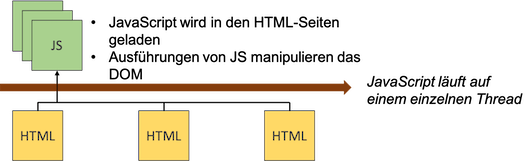. 

Service worker laufen auf einem eigenen Thread. Service worker werden an HTML-Seiten registriert, laufen aber gänzlich unabhängig von ihnen. Sie laufen sogar dann, wenn die HTML-Seiten geschlossen sind. Service worker laufen im **Hintergrund**, es handelt sich um *Hintergrundprozesse*. Service worker sind zwar JavaScript, manipulieren aber nicht den DOM. Sie sind nicht an HTML-Seiten gebunden, sondern an eine Domain. Service worker reagieren ebenfalls auf Ereignisse, aber andere, als wir sie von Webanwendungen kennnen, z.B. auf Push-Notifikationen. 

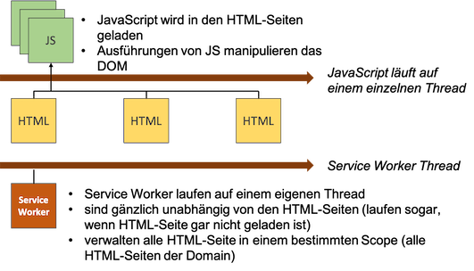. 

Service worker laufen einfach im Hintergrund und warten auf Ereignisse. Welche Ereignisse können das sein?

### Ereignisse, auf die Service Worker reagieren können

Wir betrachten hier einige der Ereignisse, auf die service worker reagieren können, auf die sie also "hören". 

#### Fetch

Wann immer der Browser etwas vom Webserver lädt, führt er ein `fetch`-Ereignis aus. Das kann eine HTML-Seite, aber auch ein Bild (`img`), eine CSS-Datei oder eine JavScript-Datei sein. Ein service worker kann auf ein solches Ereignis reagieren. Tatsächlich agiert der service worker als ein *Proxy*, der zwischen dem Browser und dem Webserver steht und die `fetch`-Anfragen (`requests`) des Browsers empfängt und eventuell an den Webserver weiterleitet. Eventuell leitet er die Anfrage auch nicht weiter, sondern beantwortet sie mit einer Resource aus dem eigen Cache. 

Für die `fetch`-Ereignisse wird die `Fetch-API` verwendet, auf die wir später noch ausführlich zu sprechen kommen. Wichtig ist an dieser Stelle zu erwähnen, dass ein (asynchrones) `XMLHttpRequest` kein `fetch`-Ereignis darstellt. Eine Single-Page-Application, die Ressourcen vom Browser nachlädt, ruft dabei keine (weiteren) `fetch`-Ereignisse auf. 

#### Push-Notifikationen

Push-Notifikationen werden von einem (anderen) Server gesendet und können durch service worker verwaltet werden. Jeder Browser verfügt über eigene Push-Web-Server. Es können von jedem beliebigen Server Push-Nachrichten an diese Push-Web-Server gesendet werden. Der service worker kann auf solche Ereignisse reagieren. Wichtig ist hier zu wiederholen, dass service worker auch dann (im Hintergrund) arbeiten, wenn die Webanwendung selbst geschlossen ist. Sie können trotzdem erkennen, wenn Push-Nachrichten eingehen und darauf geeignet reagieren. Auch hier wirken service worker wieder wie ein *Proxy*, nämlich für die Push-Web-Server. Der service worker kann z.B. eine Nachricht auf dem Startbildschirm des Smartphones erzeugen. Mit dieser Nachricht kann die Nutzerin dann etwas machen und löst dabei das folgende Ereiegnis aus:

#### Notification interaction

Klickt eine Nutzerin auf die (Push-)Nachricht, die vom service worker erzeugt wurde, wird ein entsprechendes Ereignis ausgelöst, auf das wiederum der service worker reagieren kann, z.B. eine Webseite aufrufen und öffnen oder eine Anwendung. Auch hier ist es wieder wichtig, dass das ein service worker erledigt und nicht ein JavaScript, welches zu einer Webanwendung gehört, da es ja sein kann, dass diese Webanwendung geschlossen ist.

#### Hintergrund-Synchronisation

Es kann passieren, dass in einer Webanwendung Ereignisse ausgeführt werden, jedoch keine Verbindung zum Internet besteht. Typischerweise werden die Ausführungen solcher Ereignisse, die offline ausgeführt werden, ebenfalls durch service worker erledigt. Sobald der Browser wieder mit dem Internet verbunden ist, löst er ein Ereignis aus. Auf dieses Ereignis kann der service worker reagieren und die Ereignisse, die er offline gespeichert und beantwortet hat, nun im Hintergrund online ausführen, so dass eine Hintergrund-Synchronisation erfolgt. 

#### Service-worker-Lifecycle-Ereignisse

Ein service worker durchläuft selbst einen eigenen "Lebenszyklus". Wir kennen Liefecycle-Events bereits aus Angular, z.B. `ngOnInit()` oder auch von Webseiten (`load`). Solche Lifecycle-Events existieren auch für service worker. Wir werden sie uns später im Detail anschauen. Zuerst betrachten wir aber zur Einführung ein einfaches Beispiel für die Verwendung eines *service workers* (wie wir gleich im Anschluss dikutieren werden, handelt es sich eigentlich um einen *web worker*). 

## Einfaches Beispiel service worker

Wir betrachten ein [erstes einfaches Beispiel](https://html.spec.whatwg.org/multipage/workers.html#a-background-number-crunching-worker) für die Verwendung eines service workers. Wir erstellen folgende `index.html`. 

=== "index.html"
	```html linenums="1"
	<!DOCTYPE HTML>
	<html lang="en">
	<head>
	    <meta charset="utf-8">
	    <title>Erstes Beispiel service worker</title>
	</head>
	<body>
	<p>Größte Primzahl bisher: <output id="result"></output></p>
	<script>
	    var worker = new Worker('worker.js');
	    worker.onmessage = function (event) {
	        document.getElementById('result').textContent = event.data;
	    };
	</script>
	</body>
	</html>
	```

In Zeile `10` wird mithilfe des `Worker`-Kunstruktors ein `Worker`-Objekt erzeugt. Dem Konstruktor wird die Implementierung des workers übergeben, genauer gesagt, die Implementierung des Event-Handlers für `onmessage` des `Worker`-Objektes. Die Implementierung des `onmessage`-Event-Handlers sieht typischerweise so aus, dass der service worker mit einer `postMessage` antwortet und diese an die Seite übergibt. In unserem Beispiel ist die Implementierung wie folgt: 

=== "worker.js"
	```javascript linenums="1"
	var n = 1;
	search: while (true) {
	    n += 1;
	    for (var i = 2; i <= Math.sqrt(n); i += 1)
	        if (n % i == 0)
	            continue search;
	    // found a prime!
	    postMessage(n);
	}
	```

Zeile `8` enthält die `postMessage`. Darin wird eine Zahl `n` an die Seite geschickt, sobald sie berechnet wurde. Es handelt sich bei der Berechnung um eine Primzahlberechnung. Das heißt, der service worker arbeitet im Hintergrund und "sucht" neue Primzahlen. Sobald der service worker eine neue Primzahl gefunden hat, schickt er diese mithilfe der `postMessage()`-Funktion an die Webseite. Dadurch wird das `onmessage`-Ereignis (genauer gesagt, handelt es sich um das `message`-Event) behandelt. Wann immer `onmessage` auftritt, aktualisiert die Seite, genauer gesagt, der `textContent` des `<output>`-Elementes mit der `id= "result"` (siehe Zeilen `11-13` in `index.html`). 

Dieses Beispiel ist extra einfach gehalten. genauer gesagt, handelt es sich bei dem Beispiel "nur" um einen *web worker*. Das W3C unterscheidet zwischen [*service workers*](https://www.w3.org/TR/service-workers/) und [*web workers*](https://html.spec.whatwg.org/multipage/workers.html#workers). Der Unterschied zwischen *web worker* und * service worker* wird z.B. [hier](https://bitsofco.de/web-workers-vs-service-workers-vs-worklets/) beschrieben. 

## Web worker vs. service worker

Wir verwenden für die Unterscheidung zwischen *web worker* und *service worker*  hauptsächlich [dieses Dokument](https://bitsofco.de/web-workers-vs-service-workers-vs-worklets/). Darin finden wir auch folgendes Bild zur Beschreibung eines web workers:

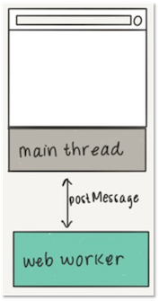

Ein *web worker* hat kein spezifisches Einsatzszenario, außer dass er unabhängig von Hauptthread der Anwendung läuft und Nachrichten mittels `postMessage()` an die Anwendung schicken kann. 

Demgegenüber ist ein *service worker* ein spezieller *web worker*, der als Proxy zwischen Anwendung und dem Netzwerk bzw. dem Cache agiert. 

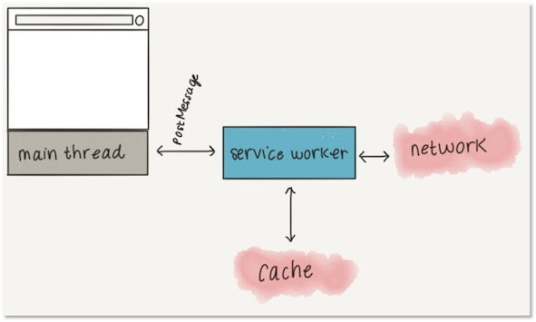

*Service workers* verfügen über mehr Funktionalitäten als *web workers*. Dazu gehören einerseits die Ereignisse, auf die *service workers* reagieren können:

- `install` und `activate` (sogenannte *Lifecycle events*),
- `fetch` und weitere Ereignisse, die durch Erweiterungen spezifiziert werden, z.B. `push`, `notificationclick`, `notificationclose`, `sync`, `canmakepayment`, `paymentrequest` usw. (sogenannte *Functional events*) sowie
- `message` und `messageerror` vom Web worker

und andererseits die Status, in denen sich ein *service worker* befinden kann:

- `parsed`, `installing`, `installed`, `activating`, `activated` und `redundant` (initial: `parsed`)

Die prinzipielle Idee der Registrierung eines service workers sieht so aus:

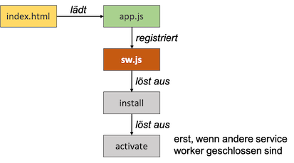

Die beiden Lifecycle-Events `install` und `activate` sind bereits eingezeichnet. Dabei ist zu betonen, dass ein *service worker*  erst dann aktiviert werden kann, wenn kein anderer service worker mehr (in der gleichen Domäne/im gleichen Scope) läuft. Ein anderer service worker, der eventuell noch läuft, muss erst geschlossen werden, bevor der neue service worker das `activate`-Ereignis auslösen kann. Damit ein solcher "alter" service worker geschlossen werden kann, müssen zumindest alle Tabs im Browser, in denen die Webanwendung läuft, geschlossen werden. Selbst dann läuft der service worker aber immernoch weiter. Er muss explizit geschlossen werden. Das zeigen wir später. 

### Registrierung eines service workers

Während wir für das einfache Beispiel mit dem *web worker* noch den `Worker()`-Konstruktor verwendet haben, erfolgt die Registrierung eines *service workers* mittels `navigator.serviceWorker.register('./sw.js')`, wobei in `sw.js` der *service worker* implementiert ist. Wir schauen uns die prinzipielle Registrierung an:

=== "index.html"
	```javascript linenums="1"
	<!DOCTYPE HTML>
	<html lang="en">
	<head>
	    <meta charset="utf-8">
	    <title>Erstes Beispiel service worker</title>
	</head>
	<body>
	<p>Öffne die developer tools</p>
	<script>
	    
	    if ('serviceWorker' in navigator) {
	        // Register a service worker hosted at the root of the
	        // site using the default scope.
	        navigator.serviceWorker.register('./sw.js').then(function(registration) {
	            console.log('Service worker registration succeeded:', registration);
	            console.log('Scope ist ' + registration.scope);
	            // At this point, you can optionally do something
	            // with registration. See https://developer.mozilla.org/en-US/docs/Web/API/ServiceWorkerRegistration
	        }).catch(function(error) {
	            console.log('Service worker registration failed:', error);
	        });

	        // Independent of the registration, let's also display
	        // information about whether the current page is controlled
	        // by an existing service worker, and when that
	        // controller changes.

	        // First, do a one-off check if there's currently a
	        // service worker in control.
	        if (navigator.serviceWorker.controller) {
	            console.log('This page is currently controlled by:', navigator.serviceWorker.controller);
	        }

	        // Then, register a handler to detect when a new or
	        // updated service worker takes control.
	        navigator.serviceWorker.oncontrollerchange = function() {
	            console.log('This page is now controlled by:', navigator.serviceWorker.controller);
	        };
	    } else {
	        console.log('Service workers are not supported.');
	    }
	</script>
	</body>
	</html>
	```

Wir haben hier die registrierung des *service workers* innerhalb des `<script>`-Elementes. Besser (und das werden wir später auch immer machen) ist die Erstellung einer eigenen `.js`-Datei dafür. 

Wenn wir die `Developer Tools` öffnen, sehen wir auf der `Console` folgende Ausgabe:

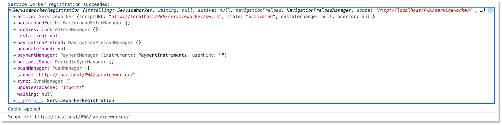

Für diejenigen, für die das Registrierungs-Beispiel oben zu lang ist, hier die Version von [W3C](https://www.w3.org/TR/service-workers/#document-context):

```javascript linenums="1"
// scope defaults to the path the script sits in
// "/" in this example
navigator.serviceWorker.register("/serviceworker.js").then(registration => {
  console.log("success!");
  if (registration.installing) {
    registration.installing.postMessage("Howdy from your installing page.");
  }
}, err => {
  console.error("Installing the worker failed!", err);
});
```


### Registrierung eines service workers in HTW-Insta

Nun, da wir wissen, wie die Registrierung eines service workers prinzipiell funktioniert, fügen wir unserem `HTW-Insta`-Beispiel einen solchen hinzu. Den aktuellen Stand der Anwendung finden Sie unter [IKT-PWA-02](https://github.com/jfreiheit/IKT-PWA-02). Das ist die Version, in der bereits das Web-App-Manifest enthalten ist. 

Zunächst beachten wir noch einen besonderen Eintrag in der `package.json`:

=== "package.json"
	```json linenums="1" hl_lines="7"
	{
	  "name": "IKT-PWA-02",
	  "version": "1.0.0",
	  "description": "Grundgerüst einer PWA mit Web-App-Manifest",
	  "main": "index.js",
	  "scripts": {
	    "start": "http-server -c-1"
	  },
	  "keywords": ["pwa", "progressive", "web", "app", "ikt", "htw", "fiw"],
	  "author": "J. freiheit",
	  "license": "ISC",
	  "devDependencies": {
	    "http-server": "^14.1.0"
	  }
	}
	```

In Zeile `7` wird definiert, dass wir bei Aufruf des `npm start`-Befehls den Webserver `http-server` starten. Das Argument `-c-1` besagt, dass wir für diesen Server **nicht** den Browser-Cache verwenden wollen. Jede datei, die wir somit vom Webserver anfordern, wird somit auch tatsächlich neu geladen. Stattdessen wollen wir nämlich nur den Cache des service workers verwenden. 

Für unseren service worker erstellen wir uns im `public`-Ordner eine Datei `sw.js`. Da der service worker im `public`-Ordner angelegt wird, ist sein Scope unsere komplette Webanwendung. Wollten wir z.B. einen service worker, der nur für unsere Hilfe-Seiten zuständig ist, so hätten wir die Datei im `help`-Ordner erzeugt. 

Um unseren service worker zu registrieren, müssen wir ihn in alle unsere HTML-Seiten einbinden. Wir haben die `/public/index.html`-Datei und die `/public/help/index.html`. Dort könnten wir innerhalb des eines `<script>`-Elementes die Registrierung durchführen. Da wir aber bereits in beiden Dateien die Datei `public/src/js/app.js` einbinden, erledigen wir die Registrierung einfach dort. Dann ist sie nur an einer Stelle und wir müssen die HTML-Dateien nicht anpassen. In die `/public/src/js/app.js` schreiben wir nun Folgendes:

=== "/public/src/js/app.js"
	```javascript linenums="1" 
	if ('serviceWorker' in navigator) {
	    navigator.serviceWorker
	        .register('/sw.js')
	        .then(function() {
	            console.log('service worker registriert')
	        });
	}
	``` 

Starten unserer Anwendung und Aufruf im Browser ergibt die Ausgabe `service worker registriert` in der Konsole der DevTools. 

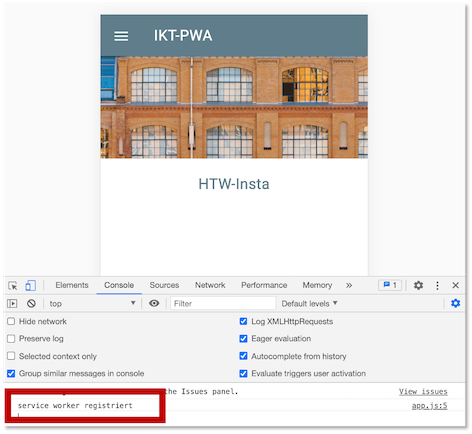

Im Zusammenhang mit service workern gibt es folgendes zu beachten:

> service worker funktionieren nur mit https oder auf localhost!

Wundern Sie sich also nicht, wenn Ihr service worker nicht funktioniert, sobald Sie Ihre Anwendung auf einem Webserver ausführen, der `https` nicht unterstützt. Anleitungen, wie Sie einen Webserver für `https` konfigurieren, finden Sie z.B. [hier](https://letsencrypt.org/getting-started/). Schauen Sie ansonsten auch [hier](tools.md#https-fur-localhost) und [hier](tools.md#https-fur-webserver).

### Service worker: Life-Cycle-Ereignisse behandeln

Nun implementieren wir den service worker. Wir haben ihn bereits registriert, aber die Datei `sw.js` ist noch leer. Die grundlegende Idee eines service workers ist es, Ereignisse zu behandeln. Wir werden unserem service worker also eine Reihe von `addEventListener()`-Funktionen hinzufügen. Diese Funktion kennen wir bereits aus "normalem" JavaScript-Code. Dort haben häufig so etwas wie `addEventListener('click', function() { /* ... */ })` geschrieben. Das `click`-Ereignis hat aber keine Relevanz für service worker, da ein service worker keine Auswirkungen auf das DOM hat. Vielmehr reagiert ein service worker auf Ereignisse, die wir bereits [oben](#web-worker-vs-service-worker) beschrieben haben. Wir fügen unserem service worker Ereignisbehandlungen hinzu:

=== "/public/sw.js"
	```javascript linenums="1" 
	self.addEventListener('install', function(event) {
	    console.log('service worker --> installing ...', event);
	})

	self.addEventListener('activate', function(event) {
	    console.log('service worker --> activating ...', event);
	    return self.clients.claim();
	})
	``` 

Wir melden uns also an zwei Ereignisse an: an das `install`-Ereignis und das `activate`-Ereignis. Beide Ereignisse sind auch gut [hier](https://developers.google.com/web/fundamentals/primers/service-workers/lifecycle) beschrieben. Beide Ereignisbehandlungen sind zunächst einfache Ausgaben auf die Konsole.

Zwei Sachen sind noch erwähnenswert: erstens wird `self` verwendet, um auf den service worker zu referenzieren. Für Erläuterungen über den Unterschied von `this` und `self` können Sie sich z.B. [hier](https://stackoverflow.com/questions/16875767/difference-between-this-and-self-in-javascript/) informieren. Grundsätzlich ist es so, dass mit `self` auf den gesamten Scope referenziert wird. In Webanwendungen ist der Scope häufig `window`, hier ist es aber die Domain, die den Scope des service workers beschreibt. Wir referenzieren also nicht auf den service worker selbst, sondern auf seinen Scope. 

Die zweite erwähnenswerte Sache steht in Zeile `7`. Wenn ein service worker registriert ist, dann "kontrolliert" er nicht automatisch alle Webseiten in seiner Domain. Erst durch das Neuladen dieser Seiten gelangen sie unter seine Kontrolle. Mithilfe der `claim()`-Funktion aus dem Interface `Clients` übernimmt der service worker die Kontrolle aber sofort, d.h. ohne ein Neuladen der Site. Einzige Ausnahme ist die Seite, die aktuell im Browser gezeigt wird. Für diese muss tatsächlich ein Reload durchgeführt werden. Weitere Informationen dazu finden Sie auch [hier](https://developers.google.com/web/fundamentals/primers/service-workers/lifecycle).

Wenn wir die Anwendung nun starten und dann im Browser aufrufen, erhalten wir folgende Ausgabe auf der Konsole:

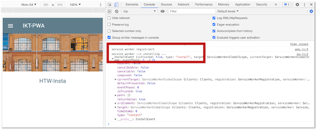

Wir sehen, dass das `install`-Ereignis ausgelöst wurde, aber offensichtlich nicht das `activate`-Ereignis. Warum wurde das `activate`-Ereignis nicht ausgelöst? Darum kümmern wir uns im folgenden Abschnitt.

Noch eine kurze Bemerkung zur Reihenfolge der Ausgaben auf der Konsole. Auf der Konsole haben wir folgende Ausgaben:

```bash
service worker registriert
service worker --> installing ...
```

Das verwundert wahrscheinlich, weil das `install`-Event ausgelöst wird, bevor der service worker (existiert und) registriert werden kann. Also müssten die Ausgaben eigentlich in der anderen Reihenfolge erscheinen. Wir erinnern uns (siehe zweite Abbildung ganz oben in diesem Kapitel): der service worker läuft auf einem anderen Thread, als das "normale" JavaScript unserer Webanwendung. Also laufen `app.js` und `sw.js` auf verschiedenen Threads. In welchem dieser beiden Threads nun zuerst eine Ausgabe erfolgt, hängt von vielen verschiedenen Faktoren ab, lässt sich aber auch nicht beeinflussen. Dieses Mal war es so, dass der `app.js`-Thread schneller mit der Ausgabe war, als der `sw.js`-Thread. Das kann beim nächsten Mal schon anders sein. Wichtig ist, dass wir wissen, dass diese beiden Threads gänzlich nebenläufig und unabhängig voneinander laufen. Sollten sich dabei Ausgaben "überholen", dann ist das kein Bug, sondern ein Feature. 

#### Service worker aktualisieren und aktivieren

Warum wurde das `activate`-Ereignis nicht ausgelöst? Dazu werfen wir einen Blick in unsere DevTools. Wir wählen den Reiter `Application` und dann im linken Menü unter `Application` den Menüpunkt `Service Woorkers`:

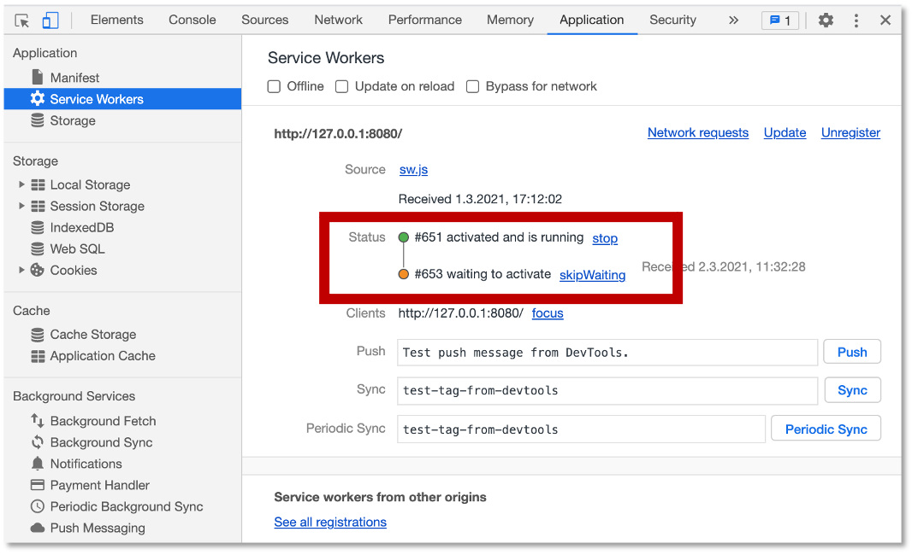

Wir sehen, dass der service worker im Status des Aktivierens ist, aber noch darauf wartet, aktiviert zu sein (`waiting to activate`). Hierzu ist es wichtig zu wissen:

- solange Sie im Browser (mindestens) einen Tab mit Ihrer Webanwendung offen haben, wird ein neuer service worker zwar installiert und registriert, aber nicht aktiviert,
- das liegt daran, dass die offene Seite eventuell noch mit einem alten service worker kommuniziert (evtl. hat der alte service worker noch etwas im Cache, das mit der Webanwendung synchronisiert werden müsste).

Wenn wir den Tab mit unserer Anwendung schließen und ihn erneut öffnen, dann sehen wir: 

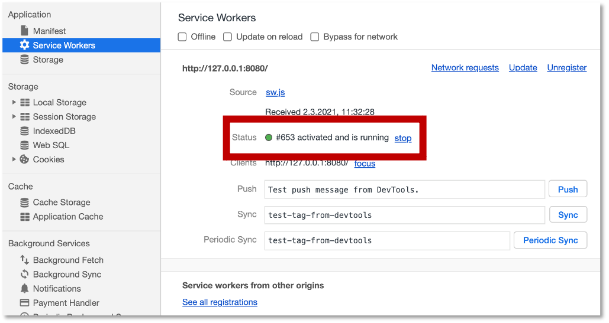

Es wurden also sowohl das `install`- als auch das `activate`-Ereignis ausgelöst. Auf der Konsole erscheint entsprechend:

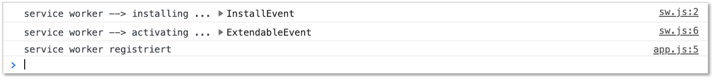

> Wenn Sie Ihren service worker aktualisiert haben, müssen Sie alle Tabs Ihrer Webanwendung schließen und erneut öffnen, um den neuen service worker zu aktivieren!

Beherzigen Sie die obige Ausgabe. Es kann Ihnen sehr viel Implementierungskummer bereiten, wenn Sie es nicht tun. Sie verändern Ihren Code im service worker, aber die Änderungen sind nicht wirksam? Dann haben Sie vielleicht nur ein Reload Ihrer Webanwendung durchgeführt - das reicht aber für den aktualisierten service worker **nicht**!

Aber zum Glück bieten die DevTools Hilfe, so dass Sie während der Entwicklung doch nicht immer den Tab schließen und neu öffnen müssen. Betrachten wir nochmals die folgende Abbildung: 


Sie haben drei Möglichkeiten, den service zu aktivieren:

1. Markieren Sie die Checkbox links neben `Update on reload`. Dann wird durch das Reload Ihrer Webanwendung der aktualisierte service worker aktiviert. 
2. Klicken Sie auf den Link `Update` oder
3. Klicken Sie auf den Link `skipWaiting`. 

Mit einem der drei Hilfen oben vermeiden Sie das Schließen und Neuöffnen des Tabs und der Webanwendung. Am einfachsten ist die erste Variante. Dann müssen Sie nur noch Reloaden und ansonsten weiter gar nichts machen. 

#### Arrow-Notation verwenden

Wenn wir uns die Implementierung des service workers anschauen, dann sehen wir, dass wir etwas "old school" unterwegs sind, also so ca. 2017 ;-). Wir sollten anstelle der `function()`-Notation lieber die `Arrow`-Notation verwenden, um ein bisschen mehr up-to-date zu sein ;-). Unsere service worker Implementierung sieht dann so aus:

=== "/public/src/sw.js"
	```javascript linenums="1" 
	self.addEventListener('install', event => {
	    console.log('service worker --> installing ...', event);
	})

	self.addEventListener('activate', event => {
	    console.log('service worker --> activating ...', event);
	    return self.clients.claim();
	})
	``` 

Die neuere Notation ändert an der Funktionalität natürlich nichts. 


### Service worker: andere Ereignisse behandeln

Bis jetzt haben wir nur Life-Cycle-Events behandelt. Jetzt schauen wir uns einmal das `fetch`-Ereignis an. [Wir wissen bereits](#fetch), dass das `fetch`-Ereignis immer dann ausgelöst wird, wenn etwas vom Webserver geladen wird, wenn also CSS-Dateien oder ein Bild oder JavaScript-Dateien geladen werden. Wir behandeln ein solches Ereignis wiederum mit einer einfachen Konsolen-Ausgabe:

=== "/public/src/sw.js"
	```javascript linenums="1" hl_lines="10-12"
	self.addEventListener('install', event => {
	    console.log('service worker --> installing ...', event);
	})

	self.addEventListener('activate', event => {
	    console.log('service worker --> activating ...', event);
	    return self.clients.claim();
	})

	self.addEventListener('fetch', event => {
	    console.log('service worker --> fetching ...', event);
	})
	``` 

Falls wir in den DevTools unter `Application`-->`Application`-->`Service Workers` das Häkchen bei `Update on Reload` gesetzt hatten, müssen wir tatsächlich nur ein Reload der Webanwendung durchführen und wir sehen auf der Konsole, dass das `fetch`-Event selbst für unsere bis jetzt sehr kleine Anwendung recht häufig aufgerufen wird:

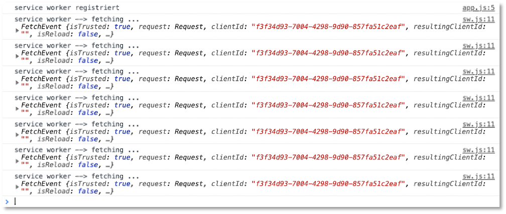

Wenn Sie in die jeweiligen `FetchEvent`-Objekte hineinklicken, welche Ressourcen jeweils per `GET` vom Webserver geladen werden. 

### Anwendung mit einem Android-Gerät verbinden

Ich kann es leider (bis jetzt noch) nicht ausprobieren, aber [hier](https://developers.google.com/web/tools/chrome-devtools/remote-debugging/) ist beschrieben, wie Sie die Anwendung auf einem Android-Gerät aufrufen können. Nun, da wir service worker verwenden, sollte es funktionieren. Das [hier](https://web.dev/customize-install/) mag auch hilfreich sein.


### Anwendung auf Ihrem iPhone aufrufen

Um die Anwendung auf Ihrem iPhone aufzurufen, müssen Sie sich zunächst nur anschauen, was im Terminal ausgegeben wird, nachdem Sie `npm start` aufgerufen haben:

```bash
Starting up http-server, serving ./public
Available on:
	http://127.0.0.1:8080
	htpp://192.168.1.24:8080
Hit CTRL-C to stop the server
```

Rufen Sie in Ihrem iPhone einen Browser auf (z.B. Safari oder Chrome) und geben dort di ezweite der beiden URLs ein (also `htpp://192.168.1.24:8080`). Die Anwendung wird ausgeführt. iOS unterstützt aber leider (noch) nicht, dass Sie ein Start-Icon dafür auf den Startbildschirm ablegen. 


