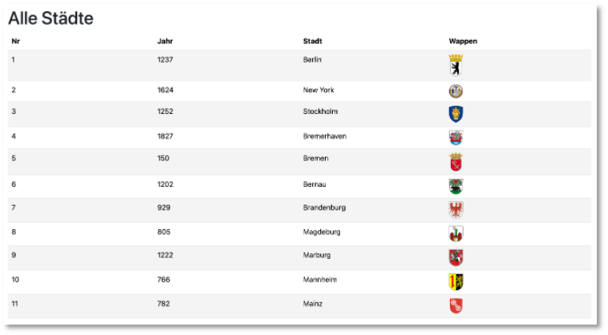
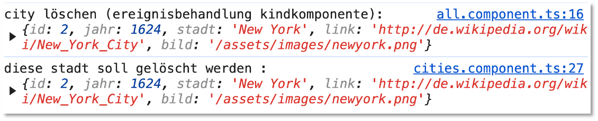

# Datenfluss und Signals

In diesem Abschnitt wird beschrieben, wie Daten von der Elternkomponente an die Kindkomponente übergeben werden können. Außerdem wird gezeigt, wie Ereignisse, die in der Kindkomponente ausgelöst wurden, an die Elternkomponente weitergereicht werden können, um dort verarbeitet zu werden. Ein wesentliches Konzept stellt dabei in Angular die Verwaltung von *Signals* dar. Wir betrachten dieses Konzept genauer. 

## Datenfluss von Eltern- zu Kindkomponente

Wir betrachten das Beispiel mit der `CitiesComponent` weiter (siehe [Routing und Services](routing.md#routing-und-services)) und nehmen nun aber an, dass wir die Darstellung *einer* (`Card`) bzw. *aller* (`Table`) Städte jeweils in einer eigenen Komponente realsisieren. Dazu erstellen wir uns mithilfe von 

```bash
ng g c cities/all 
ng g c cities/one
``` 

zwei Kindkomponenten der Elternkomponente `CitiesComponent`. 

Die `cities.component.ts` implementieren wir wie folgt:

=== "cities.component.ts"
    ```js linenums="1"
    import { Component, OnInit } from '@angular/core';
    import { DataService } from '../shared/data.service';
    import { City } from '../shared/city';
    import { ActivatedRoute, RouterLink } from '@angular/router';
    import { AllComponent } from './all/all.component';
    import { OneComponent } from './one/one.component';

    @Component({
      selector: 'app-cities',
      standalone: true,
      imports: [AllComponent, OneComponent, RouterLink],
      templateUrl: './cities.component.html',
      styleUrl: './cities.component.css'
    })
    export class CitiesComponent implements OnInit{
      staedteParent: City[] = [];
      stadtParent!: City;
      all: boolean = true;
      noCity: boolean = true;
      id: string | null = null;

      constructor(private dataservice: DataService, private route: ActivatedRoute) {
        this.route.paramMap.subscribe( params => this.ngOnInit() )
      }
      
      ngOnInit(): void {
        this.id = this.route.snapshot.paramMap.get('id');
        console.log('id : ', this.id)
        
        this.dataservice.getAll()
        .then( response => this.staedteParent = response )
        .then( staedte => { 
          if(this.id) {
            this.all = false;
            let idNum = Number(this.id);
            if(idNum > 0 && idNum < this.staedteParent.length) {
              let staedteFiltered = this.staedteParent.filter( value => value.id == idNum)
              if(staedteFiltered.length > 0) {
                this.stadtParent = staedteFiltered[0];
                this.noCity = false;
              } else {
                this.noCity = true;
              }
            }
          } else {
            this.all = true;
          }
        })
      }

    }
    ```

Erläuterungen:

- Alles, was `ActivatedRoute`, `dataService` und den `City`-Typ betrifft, wurde bereits in [Routing und Services](routing.md#routing-und-services) erläutert. Wir verwenden hier nur die `getAll()`-Funktion des [`DataService`](routing.md#service-fur-das-routing-beispiel). 
- Wenn die `Cities`-Komponente jedoch über eine parametrisierte Route aufgerufen wird, z.B. `/cities/1`, dann ermitteln wir aus dem gesamten `staedteParent`-Array die `stadtParent`, die dieser `id` entspricht. 
- Ist die Route nicht parametrisiert, ist der Schalter `all` auf `true`, sonst auf `false`. 
- Entspricht bei parametrisierter Route der Parameter keiner `id` aus dem `staedteParent`-Array, ist der Schalter `noCity` auf `true`, sonst auf `false`. 
- Die Variablen `staedteParent` und `stadtParent` hätten auch `staedte` und `stadt`heißen können, wir wollen hier aber genauer darauf aufmerksam machen, welche Variablen wo definiert werden. Deshalb das Postfix `Parent`. 


Die `cities.component.html` sieht nun wie folgt aus:

=== "cities.component.html"
	```html linenums="1"
	<div class="contaner mt-5">
	    @if(all) {
	        <app-all [staedteChild]="staedteParent"></app-all>
	    } @else if(noCity){
	        <h1>Keine Stadt ausgewählt</h1>
	        <p>Keine Stadt mit der id={{id}} verfügbar.</p>
	        <a [routerLink]="['/cities']">Zurück</a>
	    } @else {
	        <app-one [stadtChild]="stadtParent"></app-one>
	    }
	</div>
	```

	Erläuterungen:

- Ist der Schalter `all` auf `true`, wird die `AllComponent` über ihren Komponentenselektor `<app-all>` eingebunden. Als Attribut für diese Komponente wird `staedteChild` an den Wert der Variablen `staedteParent` gebunden. Die Variable `staedteChild` wird als `input()` in der `AllComponent` definiert. Das schauen wir uns gleich an.  
- Ist der Schalter `all` auf `false` und ist `noCity` auf `true`, wird dies angezeigt und ein `Button` zur Verfügung gestellt, mit dem man wieder zur `CitiesComponente` unter Verwendung der Route `/cities` (also ohne Parameter) gelangt. 
- Ist der Schalter `all` auf `false` und ist `noCity` ebenfalls auf `false`, wird die `OneComponent` über ihren Komponentenselektor `<app-one>` eingebunden. Als Attribut für diese Komponente wird `stadtChild` an den Wert der Variablen `stadtParent` gebunden. Die Variable `stadtChild` wird als `input()` in der `OneComponent` definiert.
- Es ist üblich, die zusammengehörigen Variablen der Eltern- und Kindkomponente gleich zu benennen, also statt `staedteParent` und `staedteChild` jeweils nur `staedte`. Hier wurde zur besseren Veranschaulichung des Prinzips jedoch eine Unterscheidung der Variablennamen vorgenommen. 

Die `all.component.ts` schaut nun wie folgt aus:

=== "all.component.ts"
	```js linenums="1" hl_lines="1 12"
	import { Component, input } from '@angular/core';
	import { City } from '../../shared/city';

	@Component({
	  selector: 'app-all',
	  standalone: true,
	  imports: [],
	  templateUrl: './all.component.html',
	  styleUrl: './all.component.css'
	})
	export class AllComponent {
	  staedteChild = input.required<City[]>();
	}
	```	 

Erläuterungen:

- Hier wird die die Variable `staedteChild` mithilfe der `input()`-Funktion deklariert. Es gibt zwei Varianten der [`input()`](https://angular.dev/api/core/input)-Funktion: als optionale Inputs (`input()`) und als notwendige (`input.required()`). 
- Inputs sind [Signals](https://angular.dev/guide/signals). Den *Signals* widmen wir gleich einen eigenen [Abschnitt](). Wichtig ist hier nur zu wissen, dass die Elternkomponente der Kindkomponente stets die aktuellen Werte der `staedteParent`-Variablen übergibt. 

Die `all.component.html` könnte dann z.B. so aussehen:

=== "all.component.html"
	```html linenums="1"
	<div class="conatiner">
	    <h1>Alle Städte</h1>

	    <table class="table table-striped">
	        <thead>
	            <tr>
	                <th>Nr</th>
	                <th>Jahr</th>
	                <th>Stadt</th>
	                <th>Wappen</th>
	            </tr>
	        </thead>
	        <tbody>
	            @for(item of staedteChild(); track item.id) {
	                <tr>
	                    <td>{{ item.id }}</td>
	                    <td>{{ item.jahr }}</td>
	                    <td>{{ item.stadt }}</td>
	                    <td><a [href]="item.link"></a></td>
	                </tr>
	            }
	        </tbody>
	    </table>
	</div>
	```

Beachten Sie, dass der Wert eines *Signals* (in unserem Fall `staedteChild`) per `staedteChild()` verfügbar ist. Wenn wir also auf das `staedte`-Array zugreifen, dann über `staedteChild()` (siehe Zeile `14`).

Die Anwendung sieht nun unter `localhost:4200/cities` unegfähr so aus:

	

Hier noch das dazu passende `all.component.css` zur Information:

=== "all.component.css"
	```css linenums="1"
	td, th {
	    width: 25%;
	}

	img {
	    width: 10%;
	}
	```


!!! note question "Uebung"
	Implementieren Sie passend die `OneComponent`, so dass die Stadt, die mittels `<app-one [stadtChild]="stadtParent">` an die `OneComponent` übergeben wird, dargestellt wird (z.B. als `Card`). 

## Datenfluss von Kind- an Elternkomponente

Beim Datenfluss von der Kindkomponente zur Elternkomponente handelt es sich typischerweise um die Weiterleitung eines Ereignisses, das in der Kindkomponente ausgelöst wird, an die Elternkomponente. Das Ereignis in der Kindkomponente führt dann zum Auslösen eines Ereignisses in der Elternkomponente. Wir verwenden dazu die `output()`-Funktion. Diese gibt nicht, wie `input()` ein *Signal* zurück, sondern ein [OutputEmitterRef](https://angular.dev/api/core/OutputEmitterRef). Wir schauen uns das am Beispiel an. 

Angenommen, wir erweitern die Tabelle in der `AllComponent` um eine weitere Spalte und fügen in diese Spalte `Delete`-Buttons hinzu:

??? note hint "Bootstrap-Icons hinzufügen"
	1. Geben Sie `npm i bootstrap-icons` ein. 
	2. Öfnnen Sie `angular.json` und fügen jeweils `"node_modules/bootstrap-icons/font/bootstrap-icons.css"` bei beiden `"styles"`-Eigenschaften hinzu:

		```json linenums="1" hl_lines="32 94"
		{
		  "$schema": "./node_modules/@angular/cli/lib/config/schema.json",
		  "version": 1,
		  "newProjectRoot": "projects",
		  "projects": {
		    "childparent": {
		      "projectType": "application",
		      "schematics": {},
		      "root": "",
		      "sourceRoot": "src",
		      "prefix": "app",
		      "architect": {
		        "build": {
		          "builder": "@angular-devkit/build-angular:application",
		          "options": {
		            "outputPath": "dist/childparent",
		            "index": "src/index.html",
		            "browser": "src/main.ts",
		            "polyfills": [
		              "zone.js"
		            ],
		            "tsConfig": "tsconfig.app.json",
		            "assets": [
		              {
		                "glob": "**/*",
		                "input": "public"
		              }
		            ],
		            "styles": [
		              "node_modules/bootstrap/dist/css/bootstrap.min.css",
		              "src/styles.css",
		              "node_modules/bootstrap-icons/font/bootstrap-icons.css"
		            ],
		            "scripts": [
		              "node_modules/bootstrap/dist/js/bootstrap.min.js"
		            ]
		          },
		          "configurations": {
		            "production": {
		              "budgets": [
		                {
		                  "type": "initial",
		                  "maximumWarning": "500kB",
		                  "maximumError": "1MB"
		                },
		                {
		                  "type": "anyComponentStyle",
		                  "maximumWarning": "2kB",
		                  "maximumError": "4kB"
		                }
		              ],
		              "outputHashing": "all"
		            },
		            "development": {
		              "optimization": false,
		              "extractLicenses": false,
		              "sourceMap": true
		            }
		          },
		          "defaultConfiguration": "production"
		        },
		        "serve": {
		          "builder": "@angular-devkit/build-angular:dev-server",
		          "configurations": {
		            "production": {
		              "buildTarget": "childparent:build:production"
		            },
		            "development": {
		              "buildTarget": "childparent:build:development"
		            }
		          },
		          "defaultConfiguration": "development"
		        },
		        "extract-i18n": {
		          "builder": "@angular-devkit/build-angular:extract-i18n"
		        },
		        "test": {
		          "builder": "@angular-devkit/build-angular:karma",
		          "options": {
		            "polyfills": [
		              "zone.js",
		              "zone.js/testing"
		            ],
		            "tsConfig": "tsconfig.spec.json",
		            "assets": [
		              {
		                "glob": "**/*",
		                "input": "public"
		              }
		            ],
		            "styles": [
		              "node_modules/bootstrap/dist/css/bootstrap.min.css",
		              "src/styles.css",
		              "node_modules/bootstrap-icons/font/bootstrap-icons.css"
		            ],
		            "scripts": [
		              "node_modules/bootstrap/dist/js/bootstrap.min.js"
		            ]
		          }
		        }
		      }
		    }
		  }
		}
		```

=== "all.component.html"
	```html linenums="1" hl_lines="21"
	<div class="conatiner">
	    <h1>Alle Städte</h1>
	    <i class="bi-alarm" style="font-size: 2rem; color: cornflowerblue;"></i>
	    <table class="table table-striped">
	        <thead>
	            <tr>
	                <th>Nr</th>
	                <th>Jahr</th>
	                <th>Stadt</th>
	                <th>Wappen</th>
	                <th>Löschen</th>
	            </tr>
	        </thead>
	        <tbody>
	            @for(item of staedteChild(); track item.id) {
	                <tr>
	                    <td>{{ item.id }}</td>
	                    <td>{{ item.jahr }}</td>
	                    <td>{{ item.stadt }}</td>
	                    <td><a [href]="item.link"></a></td>
	                    <td><button class="btn btn-sm btn-danger" (click)="delete(item)">
	                    		<i class="bi-trash" style="font-size: 1.5rem; color: red;"></i>
	                    	</button></td>
	                </tr>
	            }
	        </tbody>
	    </table>
	</div>
	```

Mit `(click)="delete(item)"` behandeln wir das `click`-Ereignis durch den Aufruf der Funktion`delete()`. Dieser übergeben wir als Parameter die jeweilige Stadt (`item` ist stets ein `City`-Objekt aus dem `staedte`-Array). In dem Button wurde ein [Bootstrap-Icon](https://icons.getbootstrap.com/) verwendet. 

In der `all.component.ts` benötigen wir nun folgende Definitionen: 


=== "all.component.ts"
	```js linenums="1" hl_lines="13 15-18"
	import { Component, input, output } from '@angular/core';
	import { City } from '../../shared/city';

	@Component({
	  selector: 'app-all',
	  standalone: true,
	  imports: [],
	  templateUrl: './all.component.html',
	  styleUrl: './all.component.css'
	})
	export class AllComponent {
	  staedteChild = input.required<City[]>();
	  deleteStadt = output<City>();

	  delete(stadt:City) {
	    console.log('city löschen (ereignisbehandlung kindkomponente): ', stadt)
	    this.deleteStadt.emit(stadt);
	  }
	}
	```

Erläuterungen: 

1. In Zeile `14` wird die Variable `deleteStadt` als ein `output()` deklariert. Die Funktion `output()` wird mit `City` typisiert. Die Funktion [`output()`](https://angular.dev/api/core/output) erzeugt ein [`OutputEmitterRef`](https://angular.dev/api/core/OutputEmitterRef), welches genutzt werden kann, um mithilfe der Funktion `emit()` Werte an einen *Konsumenten*  (die Elternkomponente) zu emittieren (weiterzuleiten). 
2. Diese `emit()`-Funktion wird in Zeile `17` aufgerufen und leitet den Wert `stadt` an die Elternkomponente weiter. 

Wir schauen uns nun an, wie die Verbindung zwischen Eltern- und Kindkomponente für dieses `output()` hergestellt wird. Dieses geschieht über *Eventbinding*:

=== "cities.component.html"
	```html linenums="1" hl_lines="3"
	<div class="contaner mt-5">
	    @if(all) {
	        <app-all (deleteStadt)="deleteStadtEreignis($event)" [staedteChild]="staedteParent"></app-all>
	    } @else if(noCity){
	        <h1>Keine Stadt ausgewählt</h1>
	        <p>Keine Stadt mit der id={{id}} verfügbar.</p>
	        <a [routerLink]="['/cities']">Zurück</a>
	    } @else {
	        <app-one [stadtChild]="stadtParent"></app-one>
	    }
	</div>
	```

Erläuterung:

1. Die Verbindung zwischen Eltern- und Kindkomonente wird mithilfe von `(deleteStadt)="deleteStadtEreignis($event)"` hergestellt. Mit den runden Klammern `()` wird das *Eventbinding*  beschrieben. Wir binden also `deleteStadt` der Kindkomponente, die ein Ereignis emittiert, an die Funktion `deleteStadtEreignis($event)`, die das Ereignis in der Elternkomponente behandelt. Der Ereignisbehandlung wird das Ereignis mittels `$event` übergeben. 

Die Definition der `deleteStadtEreignis($event)`-Funktion in `cities.component.ts` sieht wie folgt aus:


=== "cities.component.ts"
	```js linenums="1" hl_lines="26-28"
	import { Component, OnInit } from '@angular/core';
	import { DataService } from '../shared/data.service';
	import { City } from '../shared/city';
	import { ActivatedRoute, RouterLink } from '@angular/router';
	import { AllComponent } from './all/all.component';
	import { OneComponent } from './one/one.component';

	@Component({
	  selector: 'app-cities',
	  standalone: true,
	  imports: [AllComponent, OneComponent, RouterLink],
	  templateUrl: './cities.component.html',
	  styleUrl: './cities.component.css'
	})
	export class CitiesComponent implements OnInit{
	  staedteParent: City[] = [];
	  stadtParent!: City;
	  all: boolean = true;
	  noCity: boolean = true;
	  id: string | null = null;

	  constructor(private dataservice: DataService, private route: ActivatedRoute) {
	    this.route.paramMap.subscribe( params => this.ngOnInit() )
	  }

	  deleteStadtEreignis(stadt: City) {
	    console.log('diese stadt soll gelöscht werden : ', stadt)
	  }
	  
	  ngOnInit(): void {
	    this.id = this.route.snapshot.paramMap.get('id');
	    console.log('id : ', this.id)
	    
	    this.dataservice.getAll()
	    .then( response => this.staedteParent = response )
	    .then( staedte => { 
	      if(this.id) {
	        this.all = false;
	        let idNum = Number(this.id);
	        if(idNum > 0 && idNum < this.staedteParent.length) {
	          let staedteFiltered = this.staedteParent.filter( value => value.id == idNum)
	          if(staedteFiltered.length > 0) {
	            this.stadtParent = staedteFiltered[0];
	            this.noCity = false;
	          } else {
	            this.noCity = true;
	          }
	        }
	      } else {
	        this.all = true;
	      }
	    })
	  }

	}
	```


Wir geben das zu löschende Objekt (die `stadt`) also nur einfach auf die Konsole aus. Wenn wir später einen Endpunkt in unserer REST-API zum Löschen einer einzelnen Stadt haben, dann könnten wir diesen nun aufrufen. 

Wichtig ist, dass das `click`-Ereignis auf den Lösch-Button in der `AllComponent` durch die `delete()`-Funktion behandelt und darin das Ereignis an die Elternkomponente `CitiesComponent` emittiert wird. Es erscheinen in der Konsole demnach beide Ausgaben direkt untereinander:




## Signals

Nachdem wir *Signals* nun bereits im Einsatz als `input()`-Funktion betrachtet haben, schauen wir uns dieses Konzept nun nochmal genauer an. Ein *Signal* ist ein Wrapper um einen beliebigen Wert, der alle Konsumenten über die Änderung des Wertes informiert. Es gibt schreibbare *Signals* (`WritableSignal`) und *read-only Signals* (`Signal`).

https://www.youtube.com/watch?v=XWz8pxQWD8c


