# Übungen

#### Übung 0

??? question "Infrastruktur einrichten"
    - wählen Sie eine [**IDE**](tools.md#integrated-development-environment-ide) aus und installieren Sie diese 
    - richten Sie sich ein Git-Repository ein (z.B. `WebTech26`)
    - erstellen Sie im Ordner `WebTech26` eine `index.html` und versuchen Sie darin bereits einige Inhalte einzupflegen, z.B. eine kleine persönliche Webseite oder eine Startseite von der aus alle Übungen erreichbar sind o.ä.
    - commiten und pushen Sie Ihr Repository auf einen zentralen Dienst ([**siehe**](tools.md#git))
    - laden Sie mich zu Ihrem Git-Dienst ein ([**siehe**](tools.md#git))


#### Übung 1

??? question "Übungsaufgabe 1 (HTML)"
    - Erstellen Sie in einem `Uebung1`-Ordner eine Datei `index.html`. Das `body`-Element soll ein `header`-Element, ein `main`-Element und ein `footer`-Element enthalten. 
    - Erstellen Sie im `Uebung1`-ordner zwei Unterordner: `bilder` und `unterseiten`. 

        - In dem Ordner `unterseiten` erstellen Sie eine Datei `plan.html`. Das `body`-Element darin soll ebenfalls ein `header`-Element, ein `main`-Element und ein `footer`-Element enthalten. 
        - In den Ordner `bilder` legen Sie [campus_wh.jpg](./files/campus_wh.jpg) und [fiw.jpg](./files/fiw.jpg) ab. 
    
    - die `index.html` sollte ungefähr so gestaltet werden:

        


    - die `plan.html` sollte ungefähr so gestaltet werden:

        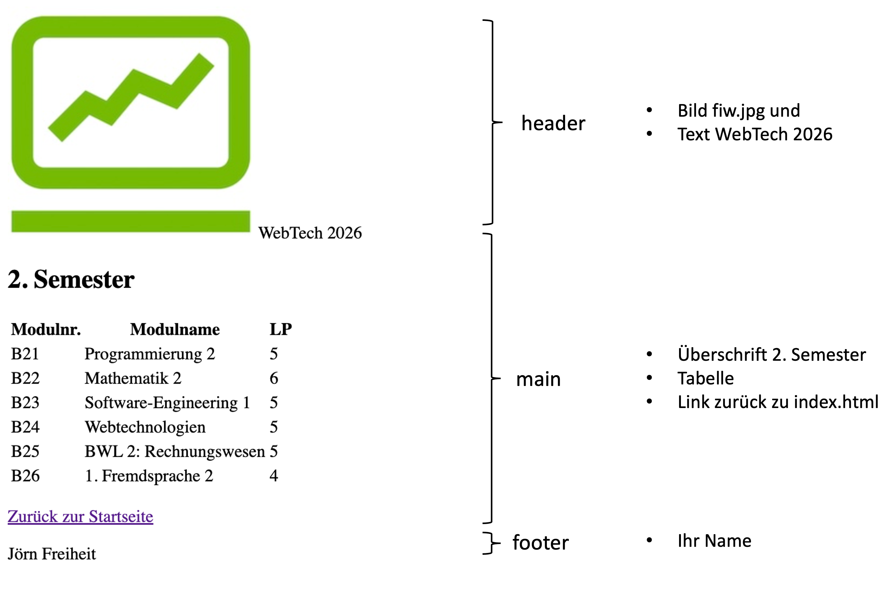

        Für die Tabelle können Sie folgende Einträge verwenden:

        ```html
        <tr>
          <td>B21</td>
          <td>Programmierung 2</td>
          <td>5</td>
        </tr>
        <tr>
          <td>B22</td>
          <td>Mathematik 2</td>
          <td>6</td>
        </tr>
        <tr>
          <td>B23</td>
          <td>Software-Engineering 1</td>
          <td>5</td>
        </tr>
        <tr>
          <td>B24</td>
          <td>Webtechnologien</td>
          <td>5</td>
        </tr>
        <tr>
          <td>B25</td>
          <td>BWL 2: Rechnungswesen</td>
          <td>5</td>
        </tr>
        <tr>
          <td>B26</td>
          <td>1. Fremdsprache 2</td>
          <td>4</td>
        </tr>
        ```

    - Sie können selbstverständlich beliebig kreativ werden und die Seite nach eigenen Bedürfnissen erweitern.

    - Committen und pushen Sie Ihre Lösung in Ihr Remote-Repo!


??? hint "eine mögliche Lösung für Übung 1 (HTML)"

    === "uebung1/index.html"
        ```html
        <!DOCTYPE html>
        <html lang="en">
        <head>
          <meta charset="UTF-8">
          <meta name="viewport" content="width=device-width, initial-scale=1.0">
          <title>Übung 1</title>
        </head>
        <body>
          <header>
            
            <span>WebTech2026</span>
          </header>
          <main>
            <h1>Willkommen in WebTech!</h1>
            
            <h3>Die ersten Schritte</h3>
            <ul>
              <li>
                <a href="https://developer.mozilla.org/de/docs/Web/HTML">
                  HTML lernen
                </a>
              </li>
              <li>
                <a href="https://freiheit.f4.htw-berlin.de/webtech/uebungen/#ubung-1">Übung 1 absolvieren</a>
              </li>
              <li>
                Lösung ins Git-Repository pushen
              </li>
            </ul>

            <p>Hier findest Du meinen <a href="./unterseiten/plan.html">aktuellen Semesterplan</a></p>
          
            <hr />

            <p>Externe Links: 
              <a target="_blank" href="https://www.stw.berlin/mensen/einrichtungen/hochschule-f%C3%BCr-technik-und-wirtschaft-berlin/mensa-htw-wilhelminenhof.html">
                Speiseplan
              </a> 
            </p>
          
          </main>
          <footer>
            <span>J. Freiheit</span>
          </footer>
        </body>
        </html>
        ```

    === "uebung1/unterseiten/plan.html"
        ```html
        <!DOCTYPE html>
        <html lang="en">
        <head>
          <meta charset="UTF-8">
          <meta name="viewport" content="width=device-width, initial-scale=1.0">
          <title>Document</title>
        </head>
        <body>
          <header>
            
            <span>WebTech2026</span>
          </header>
          <main>
          <h3>2. Semester</h3>
          <table>
            <thead>
              <tr>
                <th>Modulnr.</th>
                <th>Modulname</th>
                <th>LP</th>
              </tr>
            </thead>
            <tbody>
              <tr>
                  <td>B21</td>
                  <td>Programmierung 2</td>
                  <td>5</td>
                </tr>
                <tr>
                  <td>B22</td>
                  <td>Mathematik 2</td>
                  <td>6</td>
                </tr>
                <tr>
                  <td>B23</td>
                  <td>Software-Engineering 1</td>
                  <td>5</td>
                </tr>
                <tr>
                  <td>B24</td>
                  <td>Webtechnologien</td>
                  <td>5</td>
                </tr>
                <tr>
                  <td>B25</td>
                  <td>BWL 2: Rechnungswesen</td>
                  <td>5</td>
                </tr>
                <tr>
                  <td>B26</td>
                  <td>1. Fremdsprache 2</td>
                  <td>4</td>
                </tr>
            </tbody>
          </table>
          <p>
            <a href="../index.html">Zurück zur Startseite</a>
          </p>
          </main>
          <footer>
            <span>J. Freiheit</span>
          </footer>
        </body>
        </html>
        ```


#### Übung 2

??? question "Übungsaufgabe 2 (CSS)"
    - Erstellen Sie (falls noch nicht geschehen) eine `index.html`-Datei in Ihrem Repository-Ordner (also z.B. `WebTech26`) derart, dass diese direkte Links auf Ihre Lösungen der Übungen enthalten (z.B. in einer Tabelle oder einer Liste).
    - Kopieren Sie den Ordner `Uebung1` in den Ordner `Uebung2` (also inkl. Ordner `bilder` und `unterseiten`). 
    - Legen Sie sich im `Uebung2`-Ordner einen Ordner `styles` an. Erstellen Sie in dem `styles`-Ordner eine Datei `mystyles.css`.
    - Fügen Sie im `<head>`-Bereich der `index.html` eine logische Verknüpfung zur `mystyles.css`-Datei ein (`<link href="./styles/mystyles.css" rel="stylesheet">`). 
    - In `mystyles.css` definieren Sie (versuchen Sie so viel wie möglich der folgenden Punkte umzusetzen, probieren Sie auch ruhig selbst etwas aus):
        - Verdana als Schriftart für das ganze Dokument
        - der `<header>` soll im HTW-Grau als Hintergrundfarbe (siehe [HTW Corporate Design](http://corporatedesign.htw-berlin.de/schrift-farbe/markenfarben/)).
        - das Icon soll links und der Text rechts im Header sein (siehe [Flexbox](https://css-tricks.com/snippets/css/a-guide-to-flexbox/))
        - die Überschrift soll im HTW-Blau sein
        - die zweite Überschrift soll etwas eingerückt sein (wie die Liste - siehe [margin](https://developer.mozilla.org/de/docs/Web/CSS/Reference/Properties/margin))
        - die einzelnen List-Items sollen einen Rahmen haben (siehe [border](https://developer.mozilla.org/de/docs/Web/CSS/Reference/Properties/border))
        - die einzelnen Hyperlinks in der Liste sollen schwarz sein und keine Text-Dekoration mehr aufweisen (nicht unterstrichen - siehe [Styling a](https://developer.mozilla.org/en-US/docs/Learn_web_development/Core/Text_styling/Styling_links))
        - die Links zum Semesterplan und zur Mensa sollen rechts als Icons erscheinen. Die Icons sind hier: [plan.png](./files/plan.png) und [essen.png](./files/essen.png)
        - der `<footer>` soll in HTW-Orange sein, der Text zentriert und ganz unten in der Seite (siehe [sticky footer](https://css-tricks.com/couple-takes-sticky-footer/))
        - ungefähr so:
           
        - wenn Sie über die Liste *hovern*, soll die Schrift, im HTW-Grün und Rahmen und Hintergrundfarbe geändert werden, ungefähr so: 
           
        - in `plan.html` sollen die Tabelle gestaltet werden und der Link als Button, ungefähr so: 
          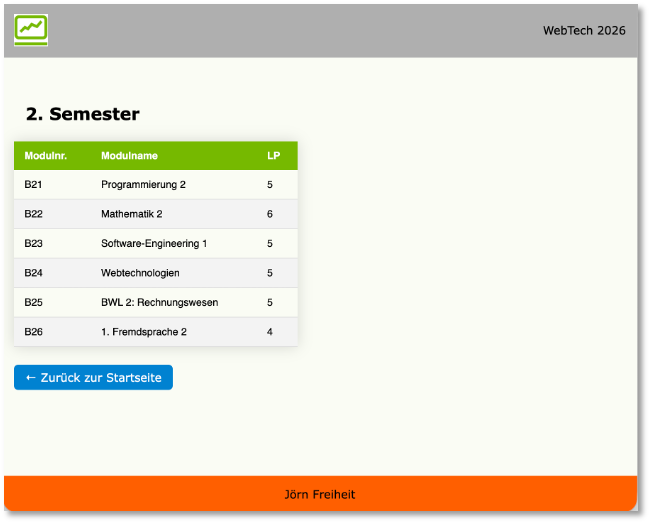 
        - wenn Sie über die Tabelle *hovern*, soll sich die Hintergrundfarbe der Tabellenzeile ändern (und villeicht auch noch `box-shadow`, ungefähr so: 
          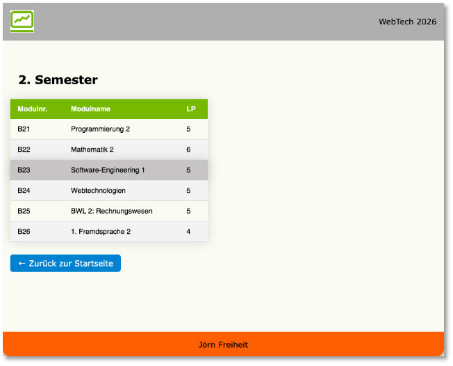 
    - Sie können auch alles ganz anders machen, Hauptsache, Sie probieren ein paar Selektoren aus und ein paar Eigenschaften!

    - Committen und pushen Sie Ihre Lösung in Ihr Remote-Repo!


??? hint "nach der Dienstagsübung 5.5.2026 (uebung_b)"

    === "uebung2/index.html"
        ```html
        <!DOCTYPE html>
        <html lang="en">
        <head>
          <meta charset="UTF-8">
          <meta name="viewport" content="width=device-width, initial-scale=1.0">
          <title>Übung 2</title>
          <link rel="stylesheet" href="./styles/mystyles.css">
        </head>
        <body>
          <header>
            
            <span>WebTech2026</span>
          </header>
          <main id="indexmain">
            <section>
              <h1>Willkommen in WebTech!</h1>
              
              <h3>Die ersten Schritte</h3>
              <ul>
                <li>
                  <a href="https://developer.mozilla.org/de/docs/Web/HTML">
                    HTML lernen
                  </a>
                </li>
                <li title="https://freiheit.f4.htw-berlin.de/webtech/uebungen/#ubung-1">
                  <a href="https://freiheit.f4.htw-berlin.de/webtech/uebungen/#ubung-1">
                    Übung 1 absolvieren
                  </a>
                </li>
                <li>
                  Lösung ins Git-Repository pushen
                </li>
              </ul>
          </section>
          <aside>
            <a href="./unterseiten/plan.html">
              
            </a>
          
            <a target="_blank" href="https://www.stw.berlin/mensen/einrichtungen/hochschule-f%C3%BCr-technik-und-wirtschaft-berlin/mensa-htw-wilhelminenhof.html">
                
            </a> 
            </p>
          </aside>
          </main>
          <footer>
            <span>J. Freiheit</span>
          </footer>
          </body>
        </html>
        ```

    === "uebung2/plan.html"
        ```html
        <!DOCTYPE html>
        <html lang="en">
        <head>
          <meta charset="UTF-8">
          <meta name="viewport" content="width=device-width, initial-scale=1.0">
          <title>Semesterplan</title>
          <link rel="stylesheet" href="../styles/mystyles.css">
        </head>
        <body>
          <header>
            
            <span>WebTech2026</span>
          </header>
          <main>
            <h3>2. Semester</h3>
            <!-- ein HTML-Kommentar -->
            <table>
              <thead>
                <tr>
                  <th>Modulnr.</th>
                  <th>Modulname</th>
                  <th>LP</th>
                </tr>
              </thead>
              <tbody>
                <tr>
                  <td>B21</td>
                  <td>Programmierung 2</td>
                  <td>5</td>
                </tr>
                <tr>
                  <td>B22</td>
                  <td>Mathematik 2</td>
                  <td>6</td>
                </tr>
                <tr>
                  <td>B23</td>
                  <td>Software-Engineering 1</td>
                  <td>5</td>
                </tr>
                <tr>
                  <td>B24</td>
                  <td>Webtechnologien</td>
                  <td>5</td>
                </tr>
                <tr>
                  <td>B25</td>
                  <td>BWL 2: Rechnungswesen</td>
                  <td>5</td>
                </tr>
                <tr>
                  <td>B26</td>
                  <td>1. Fremdsprache 2</td>
                  <td>4</td>
                </tr>
              </tbody>
            </table>

            <p><a href="../index.html">Zurück zur Startseite</a></p>
          </main>
          <footer>
            J. Freiheit
          </footer>
          
        </body>
        </html>
        ```

    === "uebung2/styles/mystyles.css"
        ```css
        :root {
          --htw-grau: #AFAFAF;
          --htw-blau: #0082D1;
          --htw-gruen:  #76B900;
        }

        body {
          font-family:Verdana, Geneva, Tahoma, sans-serif;
        }

        header {
          background-color: var(--htw-grau);
          color: white;
          /*
          display: grid;
          grid-template-columns: 1fr 1fr;
          */
          display: flex;
          justify-content: space-between;

          img {
            width: 2em;
            padding: 1%;
          }

          span {
            /*text-align: right;*/
            padding: 1%;
          }
        }

        h1 {
          color: var(--htw-blau);
        }

        h3 {
          margin-left: 4%;
        }

        ul {
          list-style: none;
        }

        ul>li {
          border: 2px solid black;
          border-radius: 1rem;
          margin: 1%;
          padding: 1%;
          width: 30%;

          a {
            color: black;
            text-decoration: none;
          }

          a:hover {
            font-weight: bold;
          }
        }

        ul>li:hover {
            background-color: rgb(201, 201, 219);
            box-shadow: rgba(0, 0, 0, 0.35) 0px 5px 15px;

            a {
              color: var(--htw-blau);
            }
        }

        #indexmain {
          background-color: rgb(226, 240, 226);
          display: grid;
          grid-template-columns: 4fr 1fr;
        }

        #indexmain>aside {
          background-color: rgb(196, 226, 196);
          text-align: center;
          display: grid;
          grid-template-rows: 1fr 1fr;

          a {
            margin: auto;
          }

          img {
            width: 50%;
          }
        }

        table {
             box-shadow: rgba(0, 0, 0, 0.35) 0px 5px 15px;
             border-collapse: collapse;
             width: 60%;

             thead tr {
              background-color: var(--htw-gruen);
             }

             tbody tr:nth-child(even) {
              background-color: rgb(230, 225, 225);
             } 

             tbody tr:nth-child(odd) {
              background-color: rgb(247, 215, 215);
             }

             tbody tr:hover {
              box-shadow: rgba(0, 0, 0, 0.35) 0px 5px 15px;
             }

             td,th {
              padding: 2%;
             }
        }

        ```


??? hint "nach der Mittwochsübung 6.5.2026 (uebung_a)"

    === "uebung2/index.html"
        ```html
        <!DOCTYPE html>
        <html lang="en">
        <head>
          <meta charset="UTF-8">
          <meta name="viewport" content="width=device-width, initial-scale=1.0">
          <title>Übung 2</title>
          <link rel="stylesheet" href="./styles/mystyles.css">
        </head>
        <body>
          <header>
            
            <span>WebTech2026</span>
          </header>
          <main id="indexmain">
            <section>
              <h1>Willkommen in WebTech!</h1>
              
              <h3>Die ersten Schritte</h3>
              <ul>
                <li>
                  <a href="https://developer.mozilla.org/de/docs/Web/HTML">
                    HTML lernen
                  </a>
                </li>
                <li>
                  <a href="https://freiheit.f4.htw-berlin.de/webtech/uebungen/#ubung-1">Übung 1 absolvieren</a>
                </li>
                <li>
                  Lösung ins Git-Repository pushen
                </li>
              </ul>
            </section>

            <aside>
              <a href="./unterseiten/plan.html">
                
              </a>

              <a target="_blank" href="https://www.stw.berlin/mensen/einrichtungen/hochschule-f%C3%BCr-technik-und-wirtschaft-berlin/mensa-htw-wilhelminenhof.html">
                
              </a> 
            </aside>

          </main>
          <footer>
            <span>J. Freiheit</span>
          </footer>
        </body>
        </html>
        ```

    === "uebung2/plan.html"
        ```html
        <!DOCTYPE html>
        <html lang="en">
        <head>
          <meta charset="UTF-8">
          <meta name="viewport" content="width=device-width, initial-scale=1.0">
          <title>Semesterplan</title>
          <link rel="stylesheet" href="../styles/mystyles.css">
        </head>
        <body>
          <header>
            
            <span>WebTech2026</span>
          </header>
          <main>
          <h3>2. Semester</h3>
          <table>
            <thead>
              <tr>
                <th>Modulnr.</th>
                <th>Modulname</th>
                <th>LP</th>
              </tr>
            </thead>
            <tbody>
              <tr>
                  <td>B21</td>
                  <td>Programmierung 2</td>
                  <td>5</td>
                </tr>
                <tr>
                  <td>B22</td>
                  <td>Mathematik 2</td>
                  <td>6</td>
                </tr>
                <tr>
                  <td>B23</td>
                  <td>Software-Engineering 1</td>
                  <td>5</td>
                </tr>
                <tr>
                  <td>B24</td>
                  <td>Webtechnologien</td>
                  <td>5</td>
                </tr>
                <tr>
                  <td>B25</td>
                  <td>BWL 2: Rechnungswesen</td>
                  <td>5</td>
                </tr>
                <tr>
                  <td>B26</td>
                  <td>1. Fremdsprache 2</td>
                  <td>4</td>
                </tr>
            </tbody>
          </table>
          <p>
            <a href="../index.html">Zurück zur Startseite</a>
          </p>
          </main>
          <footer>
            <span>J. Freiheit</span>
          </footer>
        </body>
        </html>
        ```

    === "uebung2/styles/mystyles.css"
        ```css
        :root {
          --htw-gruen: #76B900;
          --htw-gruen-hell: #f9fcf4;
          --htw-gruen-mittel: #edf5df;
          --htw-blau: #0082D1;
          --htw-grau: #AFAFAF;
        }

        body {
          font-family: Verdana, Geneva, Tahoma, sans-serif;
        }

        header {
          background-color: var(--htw-grau);
          display: grid;
          grid-template-columns: 1fr 1fr;

          img {
            width: 3rem;
            margin: 0.5rem;
          }

          span {
            text-align: right;
            margin: .5rem;
            padding: .5rem;
          }
        }

        main h1 {
          color: var(--htw-blau);
        }

        main h3 {
          margin-left: 2rem;
        }

        ul {
          list-style-type: none;

          li {
            border: 2px solid black;
            box-shadow: rgba(0, 0, 0, 0.35) 0px 5px 15px;
            border-radius: .5rem;
            margin-top: .4rem;
            margin-bottom: .4rem;
            margin-left: -.4rem;
            padding: .4rem;
            width: 30vw;

            a {
              text-decoration: none;
            }

            a:visited {
              text-decoration: none;
              color: var(--htw-blau);
            }

            a:link {
              text-decoration: none;
              color: red;
            }
          }

          li:hover {
              background-color: rgb(191, 206, 191);
              border-color: green;
              color: green;
              font-weight: bold;

              a:visited {
                color: green;
              }

              a:link {
                color: green;
              }
            }
        }

        #indexmain {
          display: grid;
          grid-template-columns: 4fr 1fr;
          background-color: var(--htw-gruen-hell);

          aside {
            display: grid;
            grid-template-rows: 1fr 1fr;
            justify-items: center;
            align-items: center;
            background-color: var(--htw-gruen-mittel);
            text-align: center;
          }

          img {
            width: 40%;
          }
        }

        table {
          border-collapse: collapse;

          thead {
            background-color: var(--htw-gruen);

            tr th {
              padding: .5rem;
            }
          }

          tbody {

            tr:nth-child(even) {
              background-color: rgb(187, 185, 185);
            }

            tr:nth-child(odd) {
              background-color: rgb(237, 230, 230);
            }
          }
        }
        ```


#### Übung 3

??? question "Übungsaufgabe 3 (Grid und Einheiten)"
    - Erstellen Sie einen `Uebung3`-Ordner und darin eine Datei `uebung3.html`. Kopieren Sie [diesen Inhalt](./files/uebung3.html) in `uebung3.html` (Rechtsklick auf die Seite und `Seitenquelltext anzeigen` - falls ein `<script>`-Element unten ist, können Sie es löschen; **Sie können es auch unten kopieren**).
    - Laden Sie sich [hier die Datei images.zip](./files/images.zip) herunter, entpacken Sie sie und schieben Sie den `images`-Ordner samt Inhalt in den `Uebung3`-Ordner.
    - Implementieren Sie die `uebung3.html` so, dass *ungefähr* folgendes Aussehen entsteht:
      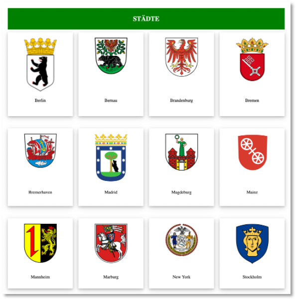 
    - Sie können die CSS-Eigenschaften innerhalb der `uebung3.html` im `<style>`-Element definieren oder wieder in einer externen Datei. 
    - Ziele der Übung sind die Anwendung von *CSS-Grid* (siehe z.B. [hier](https://css-tricks.com/snippets/css/complete-guide-grid/)) sowie die Verwendung von Größen und Einheiten (siehe z.B. [hier](https://developer.mozilla.org/en-US/docs/Learn/CSS/Building_blocks/Values_and_units)). Lassen Sie Ihrer Kreativität freien Lauf!


??? abstract "Vorlage uebung3.html"
    ```html
    <!DOCTYPE html>
    <html lang="en">

    <head>
        <meta charset="UTF-8">
        <meta http-equiv="X-UA-Compatible" content="IE=edge">
        <meta name="viewport" content="width=device-width, initial-scale=1.0">
        <title>Uebung 3</title>
    </head>

    <body>
        <header>
            <h2>STÄDTE</h2>
        </header>
        <main>


            <section class="wrapper">
                <div class="citycard">

                    <div class="cityimage">
                        
                    </div>
                    <div class="cityname">
                        <p>Berlin</p>
                    </div>
                </div>

                <div class="citycard">
                    <div class="cityimage">
                        
                    </div>
                    <div class="cityname">
                        <p>Bernau</p>
                    </div>
                </div>

                <div class="citycard">
                    <div class="cityimage">
                        
                    </div>
                    <div class="cityname">
                        <p>Brandenburg</p>
                    </div>
                </div>

                <div class="citycard">
                    <div class="cityimage">
                        
                    </div>
                    <div class="cityname">
                        <p>Bremen</p>
                    </div>
                </div>

                <div class="citycard">
                    <div class="cityimage">
                        
                    </div>
                    <div class="cityname">
                        <p>Bremerhaven</p>
                    </div>
                </div>

                <div class="citycard">
                    <div class="cityimage">
                        
                    </div>
                    <div class="cityname">
                        <p>Madrid</p>
                    </div>
                </div>

                <div class="citycard">
                    <div class="cityimage">
                        
                    </div>
                    <div class="cityname">
                        <p>Magdeburg</p>
                    </div>
                </div>

                <div class="citycard">
                    <div class="cityimage">
                        
                    </div>
                    <div class="cityname">
                        <p>Mainz</p>
                    </div>
                </div>

                <div class="citycard">
                    <div class="cityimage">
                        
                    </div>
                    <div class="cityname">
                        <p>Mannheim</p>
                    </div>
                </div>

                <div class="citycard">
                    <div class="cityimage">
                        
                    </div>
                    <div class="cityname">
                        <p>Marburg</p>
                    </div>
                </div>

                <div class="citycard">
                    <div class="cityimage">
                        
                    </div>
                    <div class="cityname">
                        <p>New York</p>
                    </div>
                </div>

                <div class="citycard">
                    <div class="cityimage">
                        
                    </div>
                    <div class="cityname">
                        <p>Stockholm</p>
                    </div>
                </div>

            </section>
        </main>
        <footer>

        </footer>
    </body>

    </html>
    ```


#### Übung 4

??? question "Übungsaufgabe 4 (Bootstrap)"
    - Erstellen Sie einen `Uebung4`-Ordner und darin eine Datei `uebung4.html`. 
    - Implementieren Sie die `uebung4.html` mithilfe von Bootstrap so, dass *ungefähr* folgendes Aussehen entsteht:
      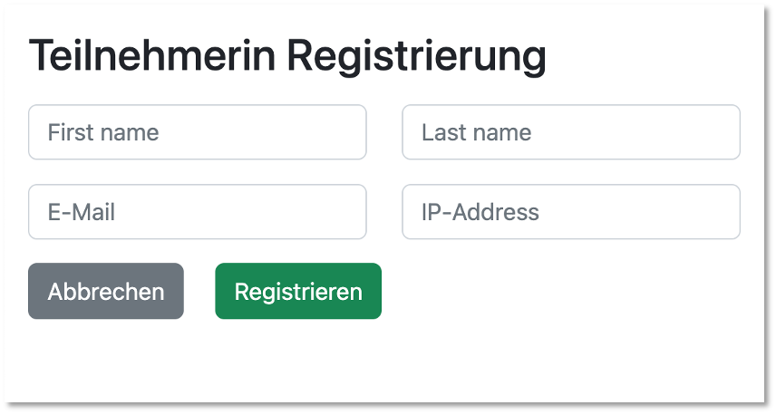{ width="300" } 
    - Ziel der Übung ist die Anwendung von *CSS-Bootstrap* und das Erstellen von Formularen.


??? hint "eine mögliche Lösung für Übung 4"

    ```html
    <!DOCTYPE html>
    <html lang="en">
    <head>
      <meta charset="UTF-8">
      <meta name="viewport" content="width=device-width, initial-scale=1.0">
      <title>Übung 4</title>
      <link href="https://cdn.jsdelivr.net/npm/bootstrap@5.3.8/dist/css/bootstrap.min.css" rel="stylesheet" integrity="sha384-sRIl4kxILFvY47J16cr9ZwB07vP4J8+LH7qKQnuqkuIAvNWLzeN8tE5YBujZqJLB" crossorigin="anonymous">
     
    </head>
    <body class="container">
      <h1 class="my-5">Teilnehmerin Registrierung</h1>

      <div class="row">

        <div class="col-12 col-md-6 col-xl-3">
          <div class="form-floating mb-3">
            <input type="text" class="form-control" id="firstName" placeholder="First name">
            <label for="firstName">First name</label>
          </div>
        </div>

        <div class="col-12 col-md-6 col-xl-3">
          <div class="form-floating mb-3">
            <input type="text" class="form-control" id="lastName" placeholder="Last name">
            <label for="lastName">Last name</label>
          </div>
        </div>

        <div class="col-12 col-md-6 col-xl-3">
          <div class="form-floating mb-3">
            <input type="email" class="form-control" id="emailID" placeholder="E-Mail">
            <label for="emailID">E-Mail</label>
          </div>
        </div>

        <div class="col-12 col-md-6 col-xl-3">
          <div class="form-floating mb-3 col">
            <input type="text" class="form-control" id="lastName" placeholder="IP address">
            <label for="lastName">IP address</label>
          </div>
        </div>
      </div>

      <div class="row">
        <div class="col d-grid gap-2">
          <button type="button" class="btn btn-secondary">Abbrechen</button>
        </div>
        <div class="col d-grid gap-2">
          <button type="button" class="btn btn-success">Registrieren</button>
        </div>
      </div>

      <h2>Eingebene Werte</h2>

      <ul id="inputList">

      </ul>
    </body>
    </html>
    ```


#### Übung 4a

??? question "Übungsaufgabe 4a (JavaScript)"
    - Erweitern Sie einen die Datei `uebung4.html` aus dem `Uebung4`-Ordner. 
    - Sind in das Formular Daten eingegeben und wird der `Registrieren`-Button gedrückt, dann erscheint mithilfe einer JavaScript-Funktion: <br/><br/>
        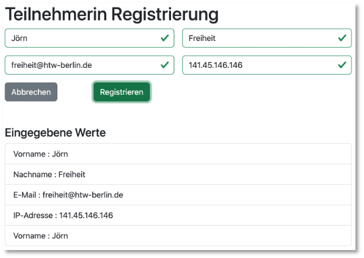{ width="300" } 
    - Wird der `Abbrechen`-Button gedrückt, werden alle bereits eingegebenen Daten wieder aus den Textfeldern entfernt.   
    - Prüfen Sie außerdem die Eingaben (siehe [Validation](https://getbootstrap.com/docs/5.3/forms/validation/)): <br/><br/>
        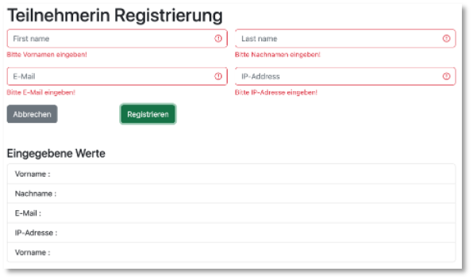{ width="300" } 
        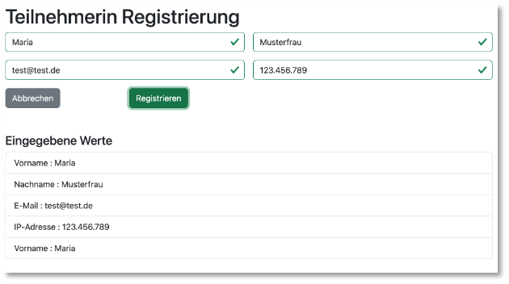{ width="300" } 
    - **Achtung!** Sollten Ihre Eingabefelder in ein `<form> ... </form>`-Element eingebettet sein und sollte dann noch Ihr `Registrieren`-Button vm `type="submit"` sein, dann sollte als erste Anweisung in Ihrer Funktion `event.preventDefault()` stehen, um die Behandlung des `submit`-Ereignisses zu unterdrücken. (Die Anweisung schadet in keinem Fall - können Sie also sicherheitshalber hinzufügen).


#### Übung 5
    
??? question "Übungsaufgabe 5 (JavaScript, DOM)"
    - Laden Sie [aus Moodle](https://moodle.htw-berlin.de/course/view.php?id=54061) die Datei `uebung5.zip` herunter, entpacken Sie sie und schieben den Ordner `uebung5` in Ihren Projektordner.
    - In der Datei `uebung5.html` sind einige Dinge vorbereitet:
        - eine Tabelle mit leerem `<tbody>`. Der `<tbody>` hat die `id='tbody'`,
        - wird die Seite geladen, wird die `init()`-Funktion aufgerufen (`onload='init()'`),
        - eine JavaScript-Funktion `getStaedte()`. Diese Funktion "holt" die Datei `staedte.json` (liegt im `Uebung5`-Ordner) und gibt sie zurück,
        - eine Variable `staedtearr`, in der das Array geladen werden soll, das die `staedte.json` enthält. **Achtung!** das Array selbst ist der Wert, der im JSON unter dem Schlüssel `staedte` steht (schauen Sie sich die Datei `staedte.json` an),
        - eine JavaScript-Funktion `createTable()`, die Sie verwenden sollen, um die Tabelle mit Werten zu befüllen. Schauen Sie sich auch die Kommentare in `uebung5.html` an.  
    - Befüllen Sie die Tabelle unter Verwendung der Daten aus `staedte.json`
        - für jede neu entstehende Tabellenzeile müssen Sie fünf neue `td`-Objekte kreieren und diese an ein neu kreiertes `tr`-Objekt anhängen. Das `tr`-Obejkt hängen Sie wiederum an den `tbody`.
        - die Nummer in der ersten Spalte erstellen Sie einfach fortlaufend mit dem Wert von `nr`, den Sie für jede Zeile erhöhen.
        - der `Info`-Button ist ein Hyperlink mit der Bootstrap-Klasse `btn`; also `<a class="btn btn-success btn-sm" href="">Info</a>`. Der Wert für `href` findet sich jeweils unter dem `link`-Eintrag für jede Stadt in `staedte.json`.
        - für das Bild verwenden Sie den `bild`-Link aus `staedte.json` als `src`. Geben Sie auch dem Attribut `alt` einen Wert (die `stadt` aus `staedte.json`).
        - die Tabelle sieht dann so aus:
            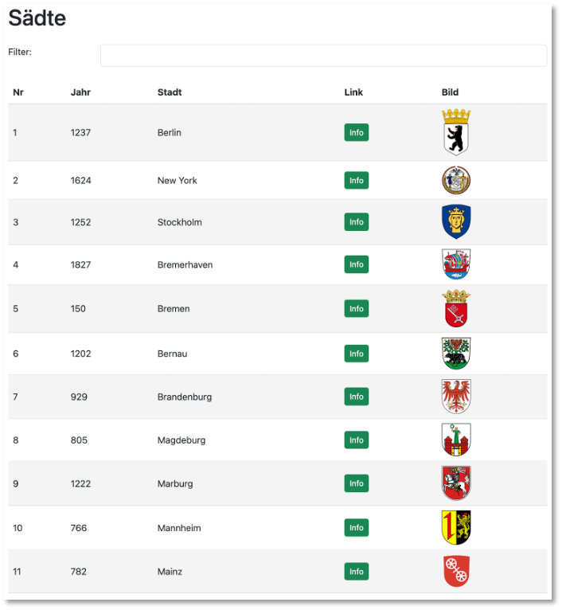
    - Bei Eingabe in das Textfeld von `Filter` wird bei jedem Zeichen, das eingegeben wird, die Funktion `createTable()` aufgerufen (siehe `oninput="createTable()"`). Es sollen nun nur noch die Städte angezeigt werden, deren Stadtnamen oder deren Gründungsjahr zur Eingabe passt. <br/>
        - Wird also z.B. `br` eingegeben, dann erscheinen nur die Städte, die mit `Br` beginnen (Groß- und Kleinschreibung egal, siehe `toLowerCase()`):<br/>
            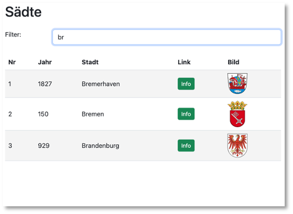 <br/>
        - Wird also z.B. `12` eingegeben, dann erscheinen nur die Städte, deren Gründungsjahr mit `12` beginnt:  <br/>
            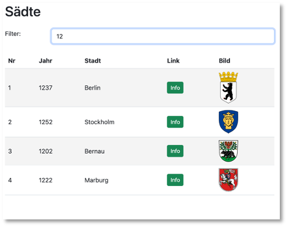 <br/>
        - **Tipp:** Sie laufen in einer Schleife durch das Array, um alle Städte auszulesen. Fügen Sie darin eine Bedingung ein, dass Sie nur die Städte der Tabelle hinzufügen, die der Filter-Eingabe entsprechen.


#### Übung 6
    
??? question "Übungsaufgabe 6 (Angular - Komponenten)"
    - Erstellen Sie ein neues Angular-Projekt `Uebung6` (siehe  [hier](angular.md#erstes-projekt-erstellen)). 
    - Erstellen Sie mindestens folgende Komponenten: `header`, `nav`, `footer`, `table` und `form`. 
    - Gestalten Sie `header`, `nav` und `footer` so, dass es ungefähr so aussieht:

        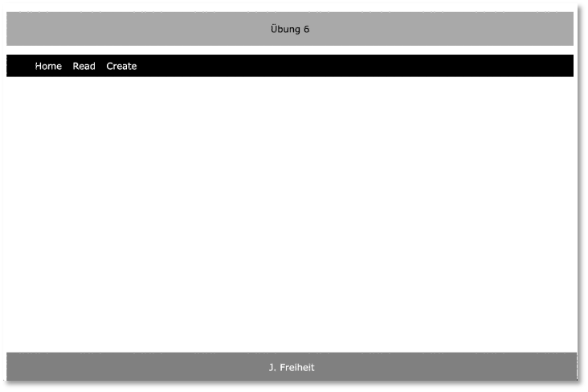{ width=50% }

        Diese drei Komponenten sollen mittels Komponentenselektoren in die `AppComponent` eingebunden werden.

    - Erstellen Sie für die `TableComponent` die Route `read` und für die `FormComponent` die Route `create`, so dass für `localhost:4200/create` ungefähr folgende Ansicht erscheint:

        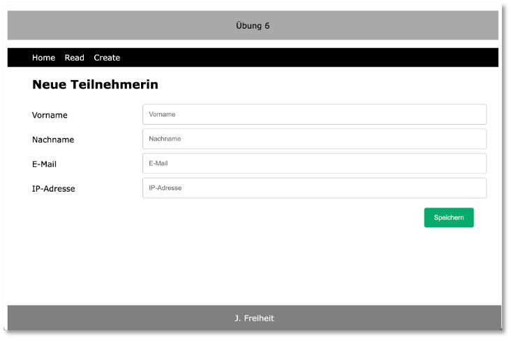{ width=50% }

        Diese Komponente enthält ein Formular. Für `localhost:4200/read` erscheint ungefähr folgende Ansicht:

        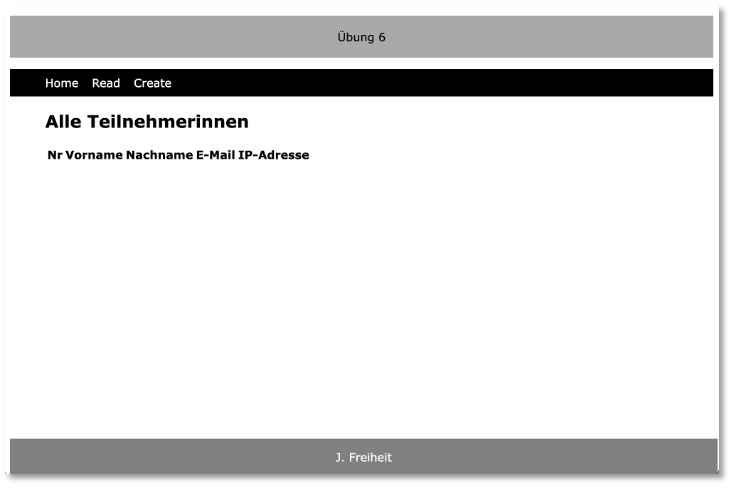{ width=50% }

        Diese Komponente enthält eine Tabelle. Es ist nur der Tabellenkopf mit den Spaltenüberschriften zu sehen. 

    - In der nächsten Übung befüllen wir die Tabelle mithilfe eines Services. 


#### Übung 7
    
??? question "Übungsaufgabe 7 (JSON, Templates, Service)"
    - Nutzen Sie Ihre Implementierung aus `Uebung6`  - wenn nicht, erstellen Sie ein neues Angular-Projekt `Uebung7` (siehe  [hier](angular.md#erstes-projekt-erstellen)). 
    - Erstellen Sie im `public`-Ordner eine Datei `members.json` mit folgendem Inhalt:

        ??? "assets/members.json"

            ```json
            [{
                "forename": "Catherine",
                "surname": "Williams",
                "email": "cwilliamsl@360.cn"
            },
            {
                "forename": "Adam",
                "surname": "Anderson",
                "email": "aanderson8@google.fr"
            },
            {
                "forename": "Susan",
                "surname": "Andrews",
                "email": "sandrewsn@google.co.jp"
            },
            {
                "forename": "Catherine",
                "surname": "Andrews",
                "email": "candrewsp@noaa.gov"
            },
            {
                "forename": "Alan",
                "surname": "Bradley",
                "email": "abradley1c@globo.com"
            },
            {
                "forename": "Anne",
                "surname": "Brooks",
                "email": "abrooks16@bravesites.com"
            },
            {
                "forename": "Russell",
                "surname": "Brown",
                "email": "rbrownq@nifty.com"
            },
            {
                "forename": "Ryan",
                "surname": "Burton",
                "email": "rburton18@foxnews.com"
            },
            {
                "forename": "Roy",
                "surname": "Campbell",
                "email": "rcampbell1@geocities.com"
            },
            {
                "forename": "Russell",
                "surname": "Campbell",
                "email": "rcampbell17@eventbrite.com"
            },
            {
                "forename": "Bonnie",
                "surname": "Coleman",
                "email": "bcoleman11@fc2.com"
            },
            {
                "forename": "Ernest",
                "surname": "Coleman",
                "email": "ecoleman15@businessweek.com"
            },
            {
                "forename": "Richard",
                "surname": "Cruz",
                "email": "rcruz7@unc.edu"
            },
            {
                "forename": "Sean",
                "surname": "Cruz",
                "email": "scruz10@answers.com"
            },
            {
                "forename": "Rebecca",
                "surname": "Cunningham",
                "email": "rcunninghamd@mac.com"
            },
            {
                "forename": "Margaret",
                "surname": "Evans",
                "email": "mevansh@pcworld.com"
            },
            {
                "forename": "Jeffrey",
                "surname": "Ford",
                "email": "jford14@cnet.com"
            },
            {
                "forename": "Andrea",
                "surname": "Gardner",
                "email": "agardnerv@woothemes.com"
            },
            {
                "forename": "Deborah",
                "surname": "George",
                "email": "dgeorge6@furl.net"
            },
            {
                "forename": "Sean",
                "surname": "Gibson",
                "email": "sgibsony@alexa.com"
            },
            {
                "forename": "Virginia",
                "surname": "Graham",
                "email": "vgrahamk@aol.com"
            },
            {
                "forename": "Steven",
                "surname": "Hamilton",
                "email": "shamiltonu@state.tx.us"
            },
            {
                "forename": "Virginia",
                "surname": "Hawkins",
                "email": "vhawkinsf@ehow.com"
            },
            {
                "forename": "Edward",
                "surname": "Hicks",
                "email": "ehicksc@pcworld.com"
            },
            {
                "forename": "Mark",
                "surname": "Johnson",
                "email": "mjohnsonj@hostgator.com"
            },
            {
                "forename": "Ruth",
                "surname": "Jordan",
                "email": "rjordan1a@smugmug.com"
            },
            {
                "forename": "Antonio",
                "surname": "Kim",
                "email": "akim4@odnoklassniki.ru"
            },
            {
                "forename": "Jennifer",
                "surname": "Marshall",
                "email": "jmarshallt@gnu.org"
            },
            {
                "forename": "Eric",
                "surname": "Matthews",
                "email": "ematthews5@independent.co.uk"
            },
            {
                "forename": "Raymond",
                "surname": "Mcdonald",
                "email": "rmcdonald2@ihg.com"
            },
            {
                "forename": "Eric",
                "surname": "Miller",
                "email": "emillere@creativecommons.org"
            },
            {
                "forename": "Jonathan",
                "surname": "Morales",
                "email": "jmoralesa@ovh.net"
            },
            {
                "forename": "Marie",
                "surname": "Morgan",
                "email": "mmorganb@cloudflare.com"
            },
            {
                "forename": "Amanda",
                "surname": "Nelson",
                "email": "anelson13@indiatimes.com"
            },
            {
                "forename": "Lisa",
                "surname": "Olson",
                "email": "lolsonr@telegraph.co.uk"
            },
            {
                "forename": "Alice",
                "surname": "Ortiz",
                "email": "aortizw@histats.com"
            },
            {
                "forename": "Peter",
                "surname": "Phillips",
                "email": "pphillipss@1688.com"
            },
            {
                "forename": "Matthew",
                "surname": "Porter",
                "email": "mporter9@europa.eu"
            },
            {
                "forename": "Tammy",
                "surname": "Ray",
                "email": "trayx@weather.com"
            },
            {
                "forename": "Mark",
                "surname": "Richardson",
                "email": "mrichardson1d@ihg.com"
            },
            {
                "forename": "Joan",
                "surname": "Roberts",
                "email": "jroberts12@alibaba.com"
            },
            {
                "forename": "Kathleen",
                "surname": "Rose",
                "email": "kroseg@pinterest.com"
            },
            {
                "forename": "Steve",
                "surname": "Sanders",
                "email": "ssanders1b@wikispaces.com"
            },
            {
                "forename": "Shirley",
                "surname": "Scott",
                "email": "sscottm@macromedia.com"
            },
            {
                "forename": "Lillian",
                "surname": "Stephens",
                "email": "lstephens19@hugedomains.com"
            },
            {
                "forename": "Nicole",
                "surname": "Thompson",
                "email": "nthompson3@admin.ch"
            },
            {
                "forename": "Marie",
                "surname": "Thompson",
                "email": "mthompsonz@yelp.com"
            },
            {
                "forename": "Alan",
                "surname": "Vasquez",
                "email": "avasquezo@miibeian.gov.cn"
            },
            {
                "forename": "Mildred",
                "surname": "Watkins",
                "email": "mwatkins0@miibeian.gov.cn"
            },
            {
                "forename": "Eugene",
                "surname": "Williams",
                "email": "ewilliamsi@deliciousdays.com"
            }
            ]
            ```

    - Erstellen Sie einen Service `members.service.ts`, in dem die `members.json` per `fetch()` eingelesen wird und der eine Funktion zur Verfügung stellt, die alle `members` als Array zurückgibt. Erstellen Sie ein passendes `Members`-Interface, um die Typsicherheit zu verbessern.

    - Befüllen Sie mit den Daten aus `members.json` eine Tabelle:

        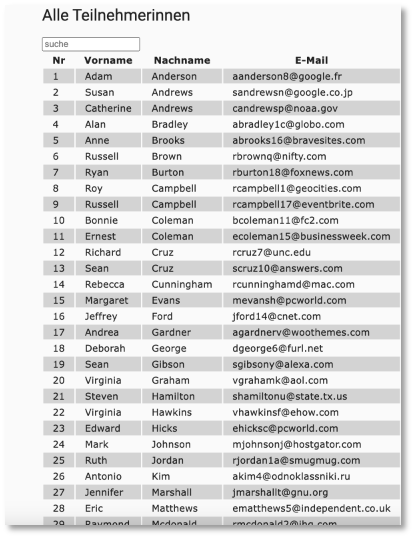

    - Implementieren Sie für das Suchfeld die Behandlung des `input`-Ereignisses so, dass nur die Teilnehmerinnen in der Tabelle erscheinen, deren Vor- oder Nachnamen den Suchstring enthalten:

        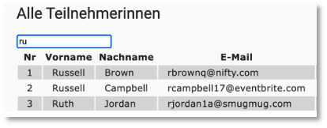

    - Alle Bilder sind nur Anregungen, kann gerne ganz anders aussehen. Gerne können Sie auch Bootstrap einbinden und verwenden (siehe z.B. [hier](https://medium.com/@interviewpro/adding-bootstrap-to-your-angular-project-2e543ef52bef)).


#### Übung 8
    
??? question "Übungsaufgabe 8 (REST-API mit MongoDB)"

    <ul>
    <li>Erstellen Sie eine [REST-API](backend.md#rest-api) mit folgenden Endpunkten:</li>

    <table>
        <thead>
        <tr>
        <th>Endpunkt</th>
        <th>Erläuterung </th>
        </tr>
        </thead>
        <tbody>
         <tr>
         <td>`GET /users`  </td>        
         <td>gebe alle `user`-Einträge zurück</td>
         </tr>
         <tr>
         <td>`POST /users`  </td>        
         <td>erstelle einen neuen `user` </td>
         </tr>
         <tr>
         <td>`GET /users/:name`  </td>        
         <td>gibt den `user` mit `username == name` zurück </td>
         </tr>
         <tr>
         <td>`DELETE /users/:id`  </td>        
         <td>löscht den `user` mit `_id == id` </td>
         </tr>
         <tr>
         <td>`PUT /users/:id`  </td>        
         <td>ändert Daten von `user` mit `_id == id` </td>
         </tr>
        </tbody>
    </table>

    <li>Geben Sie am Anfang Folgendes im Terminal innerhalb Ihres Projekteordners ein (ohne die Kommentare):</li>

    <table>
        <thead>
        <tr>
        <th>Anweisung</th>
        <th>Webseite</th>
        </tr>
        </thead>
        <tbody>
         <tr>
         <td>`mkdir Uebung8`  </td>        
         <td>Ordner `Uebung8`erstellen</td>
         </tr>
         <tr>
         <td>`npm init`  </td>        
         <td>Erstellt das [Node.js](https://nodejs.dev/en/download/)-Projekt  </td>
         </tr>
         <tr>
         <td>`npm i express`  </td>        
         <td>[express.js](https://expressjs.com/de/)</td>
         </tr>
         <tr>
         <td>`npm i dotenv`  </td>        
         <td>[dotenv](https://www.npmjs.com/package/dotenv) </td>
         </tr>
         <tr>
         <td>`npm i mongoose`  </td>        
         <td>[mongoose](https://www.npmjs.com/package/mongoose) </td>
         </tr>
        </tbody>
    </table>

    <li>Vewenden Sie [MongoDB](https://www.mongodb.com/) als Datenbankmanagementsystem. Sie können sich entweder eine lokale Instanz [installieren](https://www.mongodb.com/de-de/products/self-managed/community-edition) oder die Cloud-Lösung [Atlas](https://www.mongodb.com/de-de/atlas) nutzen. </li>

    <li>Implementieren Sie obige CRUD-Funktionalitäten. </li>

    <li>Beachten Sie!: Es soll **kein** neuer `User` angelegt werden, wenn der `username` bereits verwendet wird und/oder wenn die `email` bereits verwendet wird:
        <ul>
        <li>Weder `username` noch `email` exitieren bereits:</li>
            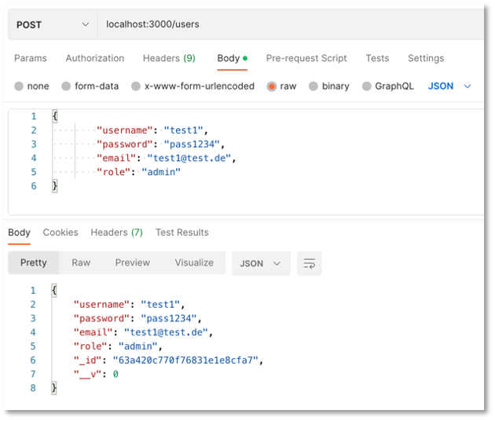{ width=50% }
        <li>`username` existiert bereits:</li>
            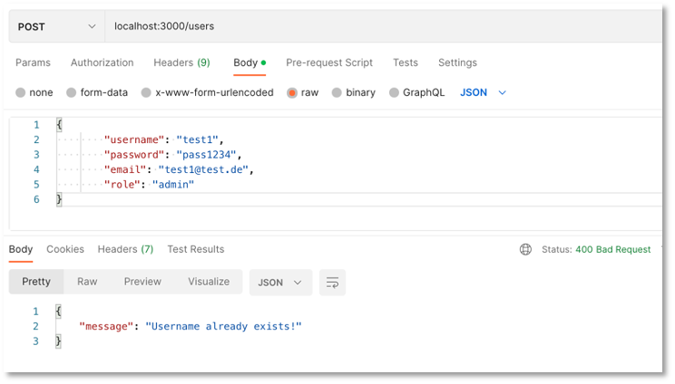{ width=50% }
        <li>`email` existiert bereits:</li>
            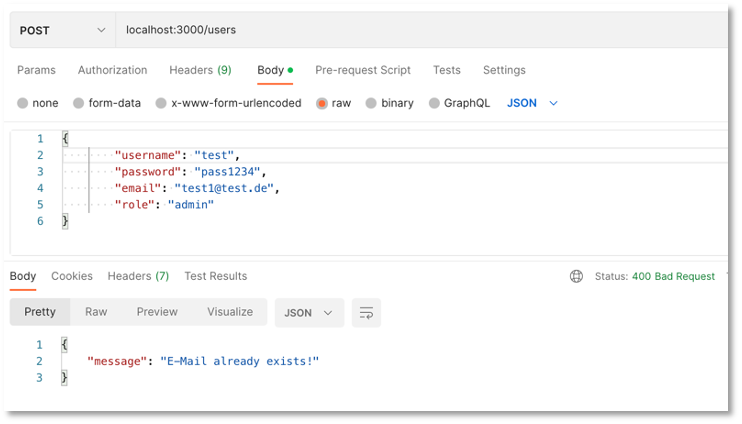{ width=50% }
        </ul></li>
    <li>`GET /user/:name` sucht nach dem `username`:</li>        
            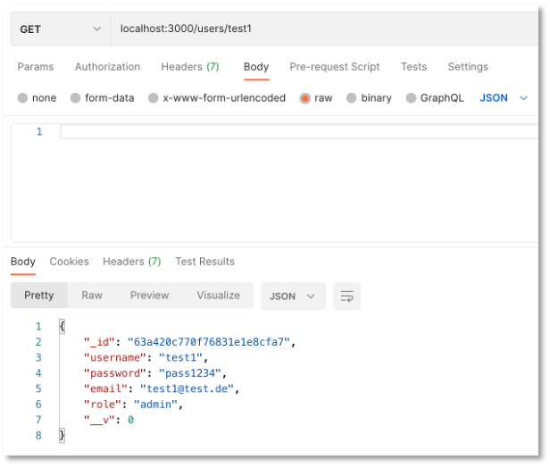{ width=50% } 

    <li>Das `Schema` für `Users` kann z.B. so aussehen: </li>

    ```js
    const mongoose = require('mongoose');

    const schema = new mongoose.Schema({
        username: String,
        password: String,
        email: String,
        role: String
    });

    module.exports = mongoose.model('User', schema);
    ```

    </ul>


#### Übung 9
    
??? question "Übungsaufgabe 9 (Angular, Material Design und Formulare)"

    - Erstellen Sie ein neues Angular-Projekt `Uebung9`.

    - Wechseln Sie in den `Uebung9`-Ordner und fügen Sie dem Projekt mithilfe von `ng add @angular/material` [Material Design](https://material.angular.io/guide/getting-started) hinzu. Sie werden gefragt, ob Sie `material` installieren wollen (`Enter`). Die anschließenden Fragen können Sie mit `Enter` (Theme), `Y` (Typography) und `Enter` (Animations) beantworten.  

    - Testen Sie, ob [Material Design](https://material.angular.io/guide/getting-started) funktioniert, indem Sie in der `app.component.html` alles löschen und stattdessen `<mat-slide-toggle>Toggle me!</mat-slide-toggle>` hinzufügen. In der `app.component.ts` muss das `MatSlideToggleModule` importiert werden:

        === "app.component.ts"
            ```js
            import { Component } from '@angular/core';
            import { RouterOutlet } from '@angular/router';
            import { MatSlideToggleModule } from '@angular/material/slide-toggle';

            @Component({
              selector: 'app-root',
              standalone: true,
              imports: [RouterOutlet, MatSlideToggleModule],
              templateUrl: './app.component.html',
              styleUrl: './app.component.css'
            })
            export class AppComponent {
              title = 'uebung9';
            }
            ```

    - Erzeugen Sie sich wie folgt die drei Komponenten `nav`, `form` und `table` (siehe [Schematics](https://material.angular.dev/guide/schematics)):

        ```bash
        ng generate @angular/material:navigation nav
        ng generate @angular/material:address-form form  
        ng generate @angular/material:table table          
        ```

    - Erzeugen Sie sich auch eine einfache `home`-Komponente (oder Sie probieren dafür das [`Dashboard`-Schema](https://material.angular.dev/guide/schematics#dashboard-schematic) aus). 

    - Fügen Sie in die `app.component.html` den Aufruf der `NavComponent` ein:

        === "app.component.html"
            ```html
            <app-nav />
            ```

    - Vergessen Sie nicht, die `NavComponent` in der `app.component.ts` zu importieren:

        === "app.component.ts"
            ```js
            import { Component } from '@angular/core';
            import { RouterOutlet } from '@angular/router';
            import { NavComponent } from './nav/nav.component';

            @Component({
              selector: 'app-root',
              standalone: true,
              imports: [RouterOutlet, NavComponent],
              templateUrl: './app.component.html',
              styleUrl: './app.component.css'
            })
            export class AppComponent {
              title = 'uebung9';
            }
            ```

    - Starten Sie das Projekt mit `ng serve`. Je nachdem, welches Farbschema Sie gewählt haben, sieht die Seite nun ungefähr so aus: 

        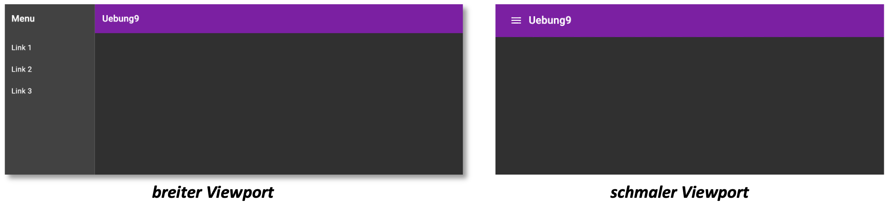

        Sie können Ihr Farbschema in der `angular.json` im `styles`-Array ändern (siehe [hier](https://material.angular.io/guide/theming#using-a-pre-built-theme))

    - Erzeugen Sie für die drei Komponenten `home`, `table` und `form` die Routen `''`, `read` und `create` dynamisch ein. Suchen Sie in der `nav.component.html` nach den Menüeinträgen und passen Sie das Menü so an, dass die drei Komponenten darüber aufgerufen werden können.

    - Schauen Sie sich die `FormComponent` und die `TableComponent` genauer an und versuchen Sie, die Komponenten an Ihre Bedürfnisse anzupassen.

    ---- 

    ***folgende Erläuterungen, falls `FormComponent` nicht mit Schematics erzeugt wurde***

    ---

    - In der `FormComponent` erzeugen wir uns ein Formular. Schauen Sie sich dazu den Abschnitt [Reactive Forms](https://angular.dev/guide/forms/reactive-forms) unter [Angular.dev](https://angular.dev/overview) sowie die Abschnitte [Form fields](https://material.angular.io/components/form-field/overview) und [Input](https://material.angular.io/components/input/overview) unter [Angular Material](https://material.angular.io/) an. 

        - Die `FormComponent` muss `ReactiveFormsModule` im `imports`-Array enthalten!

        - Eingabefelder (`input`) werden in Angular als `FormControl`-Objekte defininiert, z.B.:

            ```js
            export class FormComponent {

                username = new FormControl('');
                password = new FormControl('');
                email = new FormControl('');
                role = new FormControl('');

            }
            ```

            `FormControl` muss aus `@angular/forms` importiert werden. 

        - Die Verbindung zwischen View (`html`) und Controller (`ts`) wird per `[formControl]="username"` hergestellt, z.B.:

            ```html
            <label for="user-name">username</label>
            <input id="user-name" type="text" [formControl]="username" />

            <label for="pwd">password</label>
            <input id="pwd" type="password" [formControl]="password" />

            <label for="e-mail">email</label>
            <input id="e-mail" type="email" [formControl]="email" />

            <label for="role">role</label>
            <select id="role" [formControl]="role">
              <option value="">--Rolle auswählen--</option>
              <option value="user">user</option>
              <option value="admin">admin</option>
            </select>
            ```

        - Unter Verwendung von *Material Design* werden die Elemente `<mat-form-field>`, `<mat-label>` und die Eigenschaft `matInput` verwendet:

            ```html
            <mat-form-field>
              <mat-label for="user-name">username</mat-label>
              <input matInput id="user-name" type="text" [formControl]="username" />
            </mat-form-field>
            <br/>
            <mat-form-field>
              <mat-label for="pwd">password</mat-label>
              <input matInput id="pwd" type="password" [formControl]="password" />
            </mat-form-field>
            <br />
            <mat-form-field>
              <mat-label for="e-mail">email</mat-label>
              <input matInput id="e-mail" type="email" [formControl]="email" />
            </mat-form-field>
            <br />
            <mat-form-field>
              <mat-label for="role">role</mat-label>
              <select matNativeControl id="role" [formControl]="role">
                <option value="">--Rolle auswählen--</option>
                <option value="user">user</option>
                <option value="admin">admin</option>
              </select>
            </mat-form-field>
            ```

            In der `form.component.ts` muss dazu das `imports`-Array entsprechend befüllt werden: 

            ```js
            imports: [FormsModule, MatFormFieldModule, MatInputModule, ReactiveFormsModule],
            ```

        - Den einzelnen `input`-Elementen können *Validatoren* hinzugefügt werden, mit denen überprüft werden kann, ob die Eingabe den Anforderungen genügt. Dazu wird die Klasse `Validators` aus `@angular/forms` verwendet (siehe [hier](https://angular.io/guide/form-validation#validating-input-in-reactive-forms) und [hier](https://angular.io/api/forms/Validators)), z.B.:

            ```js
                username = new FormControl('', [Validators.required]);
                password = new FormControl('', [Validators.required, Validators.minLength(8)]);
                email = new FormControl('', [Validators.required, Validators.email]);
                role = new FormControl('', [Validators.required]);

                getErrorMessageUsername(){
                  if(this.username.hasError('required')) return 'Bitte ausfüllen';
                  else return '';
                }

                getErrorMessagePassword(){
                  if(this.password.hasError('required')) return 'Bitte ausfüllen';
                  else if(this.password.hasError('minlength')) return 'Mindestens 8 Zeichen';
                  else return '';
                }

                getErrorMessageEmail(){
                  if(this.email.hasError('required')) return 'Bitte ausfüllen';
                  else if(this.email.hasError('email')) return 'Keine gültige E-Mail-Adresse';
                  else return '';
                }

                getErrorMessageRole(){
                  if(this.role.hasError('required')) return 'Bitte ausfüllen';
                  else return '';
                }
            ```

            Die `getErrorMessage`-Funktionen können dann z.B. so im HTML-Code verwendet werden:

            ```html
            <mat-form-field class="wide-width">
              <mat-label for="user-name">username</mat-label>
              <input matInput id="user-name" type="text" [formControl]="username" />
              @if (username.invalid) {
              <mat-error>{{getErrorMessageUsername()}}</mat-error>
              }
            </mat-form-field>
            <br/>
            <mat-form-field class="wide-width">
              <mat-label for="pwd">password</mat-label>
              <input matInput id="pwd" type="password" [formControl]="password" />
              @if (password.invalid) {
              <mat-error>{{getErrorMessagePassword()}}</mat-error>
              }
            </mat-form-field>
            <br />
            <mat-form-field class="wide-width">
              <mat-label for="e-mail">email</mat-label>
              <input matInput id="e-mail" type="email" [formControl]="email" />
              @if (email.invalid) {
              <mat-error>{{getErrorMessageEmail()}}</mat-error>
              }
            </mat-form-field>
            <br />
            <mat-form-field class="wide-width">
              <mat-label for="role">role</mat-label>
              <select matNativeControl id="role" [formControl]="role" placeholder="role">
                <option value="user">user</option>
                <option value="admin">admin</option>
              </select>
              @if (role.invalid) {
              <mat-error>{{getErrorMessageRole()}}</mat-error>
              }
            </mat-form-field>
            ```

        - Button hinzufügen: Für Matrial Design Buttons siehe [hier](https://material.angular.io/components/button/overview), z.B.:

            ```html
            <button mat-raised-button [disabled]="formInvalid()" (click)="register()">Registrieren</button>
            ```

            Dazu muss `MatButtonModule` in das `imports`-Array von `form.component.ts` eingefügt werden. 

        - Der Button ist so lange `disabled`, so lange das Formular nicht korrekt ausgefüllt ist, d.h. `formInvalid()` liefert so lange ein `true` zurück, so lange (mindestens) einer der Fehler auftritt, der eine Error-Message erzeugt (siehe oben). Schreiben Sie die Funktion `formInvalid()` entsprechend. 

        - Bei Klick auf den Button (wenn er `enabled` ist), wird die Funktion `register()` aufgerufen. Implementieren Sie diese Funktion so, dass ein Objekt der Art 

            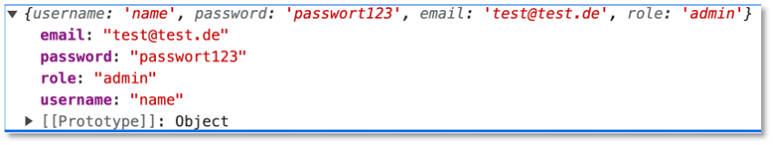

            auf die Konsole ausgegeben wird.

        - In Übung 10 werden wir die so erzeugten Objekte an das Backend senden und in die Datenbank speichern. Außerdem befüllen wir dann die `TableComponent` mit Objekten aus der Datenbank.


#### Übung 10
    
??? question "Übungsaufgabe 10 (Frontend-Backend-Anbindung)"

    - Starten Sie das Backend aus [Übung 8](#ubung-8).

    - Nutzen Sie das Frontend aus [Übung 9](#ubung-9) und erweitern es wie folgt:

        - Binden Sie in die `app.config.ts` das [HttpClientModule](https://angular.io/api/common/http/HttpClientModule) ein:
            ```js
            import { ApplicationConfig, importProvidersFrom } from '@angular/core';
            import { provideRouter } from '@angular/router';

            import { routes } from './app.routes';
            import { HttpClientModule } from '@angular/common/http';

            export const appConfig: ApplicationConfig = {
              providers: [provideRouter(routes), importProvidersFrom(HttpClientModule)]
            };
            ```

        - Erstellen Sie sich einen `Backend`-Service und ein `User`-Interface mithilfe der Angular CLI: 
            ```bash
            ng g s shared/backend
            ng g i shared/user
            ```

        - Definieren Sie im `User`-Interface die Eigenschaften `username, password, email, role` (alles `string`s).

        - Definieren Sie sich im `Backend`-Service Funktionen für die Anbindung der Backend-Endpunkte (`GET /users`, `POST /users`, `GET /users/:name`, `DELETE /users/:id` und `PUT / users/:id`). Beachten Sie, dass jeweils ein [Observable](https://rxjs.dev/guide/observable) zurückgegeben wird, z.B.:

            ```js
            import { HttpClient } from '@angular/common/http';
            import { Injectable } from '@angular/core';
            import { User } from './user';
            import { Observable } from 'rxjs';

            @Injectable({
              providedIn: 'root'
            })
            export class BackendService {
              backendUrl = 'http://localhost:4000';

              constructor(private http: HttpClient) { }

              getAllUsers(): Observable<User[]> {
                let endpoint = '/users';
                return this.http.get<User[]>(this.backendUrl + endpoint);
              }

              deleteOneMember(id: string): Observable<any> {
                let endpoint = '/users';
                return this.http.delete<any>(this.backendUrl + endpoint + "/" + id);
              }

              createNewUser(user: User): Observable<User> {
                let endpoint = '/users';
                return this.http.post<User>(this.backendUrl + endpoint, user);
              }
            }
            ```

        - Binden Sie in die `Register`-Komponente den `Backend`-Service ein, z.B. `private bs = inject(BackendService);`. Lesen Sie alle Werte aus dem Registrierungsformular aus und erzeugen sich damit ein neues `user`-Objekt. Rufen Sie die Funktion `createNewUser(user)` aus dem `Backend`-Service auf, z.B.:
            ```js
            this.bs.createNewUser(user).subscribe({
              next: (response) => console.log('response', response),
              error: (err) => console.log(err),
              complete: () => console.log('register completed')
            });
            ```

            Prüfen Sie, ob die Daten in die Datenbank gespeichert werden. 

        - Binden Sie in die `Table`-Komponente den `Backend`-Service ein und erstellen sich dort eine `readAll()`-Funktion, in der die `getAllUsers()`-Funktion des `Backend`-Services aufgerufen wird. 
            - Befüllen Sie mit der Response ein `users`-Array. 
            - Rufen Sie in der `ngOnInit()`-Funktion der Komponente die `readAll()`-Funktion auf (die Komponente muss dazu `OnInit` implementieren).
            - Lesen Sie in einer Tabelle in der `table.component.html` alle User aus dem `users`-Array aus.
            - Richten Sie in der Tabelle eine Spalte `Delete` ein, deren Einträge aus Buttons bestehen. Für das Klick-Ereignis soll eine `delete(id)`-Funktion aufgerufen werden, die den Eintrag aus der Datenbank löscht. Rufen Sie in der `delete(id)`-Funktion auch die `readAll()`-Funktion erneut auf, damit das `users`-Array aktualisiert wird. 


